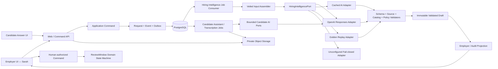
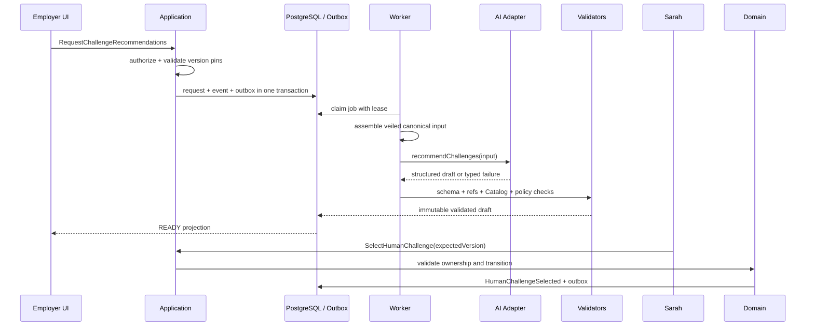

# CareerMutual AI Engineering Design

## Bounded Hiring Intelligence for label-blind, attention-backed work proofs

**Version:** 1.6
**Date:** 2026-07-20
**Status:** MVP implementation blueprint

---

## 0. Document Status and Scope

This document defines the engineering boundaries, invocation protocols, data flows, failure semantics, auditing, evaluation, and implementation sequence for the CareerMutual AI module.

The document priority is:

```text
CareerMutual-Product-Doctrine.md
→ CareerMutual-Product-Plan.md
→ CareerMutual-Engineering-Design.md
→ CareerMutual-AI-Engineering-Design.md
→ current implementation
```

If this document conflicts with product invariants or the overall engineering design, the first two documents take precedence, and the documents and implementation must be corrected accordingly.

This document covers requester/system-side Hiring Intelligence, as well as the disclosure-based Candidate
Answer Assistant and Voice Memo Transcription explicitly permitted by the Sealed Job Policy. It does not change
the domain permissions of Label Reveal, Attention, Credit, ReviewWindow, final Answer Submit, or Human Outcome.

The current main browser chain has implemented rolling Blind Review Commitment, cyclic Slots, Interest Queue, real
Answer Session, private Artifact, disclosure-based Candidate Assistant/Transcription, immutable Submission, and
per-submission Human Answer Review. Employer Evidence Analyst has connected `buildAnswerEvidenceEdge` to immutable
Answer Submission, Outbox Worker, and Employer Review Projection; post-answer Advancement/Deep Proof is still not
connected to the new Answer-first Web vertical. legacy `buildMatchEdge` and `recommendChallenges` continue to serve as
historical regression paths and do not enter the main Application flow.

Each of the seven synthetic Candidates has an independent Candidate-only Evidence Passport state. It allows a Candidate
to publish a synthetic-source Snapshot and use `deriveCandidateEligibilityMatches` to establish access hypotheses
between source refs and Recruiter-sealed background tags; it is not part of Employer Matching, does not produce a
candidate pool or ranking, and does not change Queue, Invitation, or Attention. Ordinary jobs must have at least one
validated positive connection to be visible; `OPEN_TO_ALL` is always visible; AI failure is Pending/Failed, not Candidate
ineligibility. Snapshot must include the highest education level or explicit `NO_FORMAL_DEGREE`. AI input receives only
education level, field of study, graduation date, and source ref, and does not receive school names; deterministic
Policy calculates the two-year boundary based on the Snapshot publication time: within two years, the order is
`EDUCATION → WORK_AND_CREDENTIALS → OTHER`; beyond two years or without a formal degree, the order is
`WORK_AND_CREDENTIALS → OTHER → EDUCATION`. The Validator checks connection order; the model must not turn this
order into a score, ranking, or conclusion that “no degree = worse.”

---

## 1. Core Decisions

CareerMutual's AI capabilities are implemented as a **bounded, asynchronous Hiring Intelligence module without business write access**:

- Logically independent, with explicit Ports, Schemas, Prompts, Policies, and audit boundaries;
- Deployed in the existing Background Worker for the MVP, without splitting into network microservices;
- No autonomous Agent loop, and no tools provided to the model;
- Generates only structured Drafts with sources;
- All outputs pass deterministic post-validation;
- Only Application Commands confirmed by a human can change business state.
- Candidate Assistant generates only disclosure-based draft suggestions; the original Voice Memo and derived Transcript
  are separate; neither has business write access or final-submission authority.
- Candidate Eligibility Match only determines whether a Candidate can discover an evidence-gated JobPost; Match is
  not verified capability, a Fit Score, or Employer input, and the Candidate still personally decides whether to
  register Interest. The old `deriveCandidateJobSignals` is retained for compatibility but no longer has Feed
  visibility authority.

The goal of AI is not to predict “how good this person is,” but to shorten the following reasoning chain:

```text
Employer uncertainty
↔ Recorded anonymous candidate answer evidence
↔ Bounded proof template
↔ Evidence-linked human judgment
```

Therefore:

> GPT should choose “what is worth validating” more intelligently, rather than decide “whom to eliminate” more intelligently.

---

## 2. Unbreakable AI Invariants

```text
No permitted source → No factual AI statement
No recorded answer evidence → No candidate edge
No valid proof template → Needs human or bounded unknown
No allowlisted Catalog ID → No challenge recommendation
No named human command → No business-state transition
```

The server must guarantee:

- AI can never read `candidate_private_labels`;
- Candidate discovery may read only the de-identified synthetic-source fields in the published Snapshot and the public
  Job Contract; it cannot read names, school names, former employer names, contact information, original locator
  tokens, or the Private Label Vault;
- AI does not output Fit Score, Talent Score, candidate rankings, or hiring recommendations;
- AI does not determine whether a Candidate cheated by using external AI; server behavior collected with consent is
  classified by deterministic rules, and the model must not reclassify it;
- AI does not generate or execute Challenge code, Shell commands, paths, or environment variables;
- AI does not assign Answer Invitations, complete Human Answer Review, or decide Direct / Explore, WIP, Credit,
  Attention Slot, or ReviewWindow ownership;
- AI must not use Profile, Claim, or source packaging to produce a candidate-selection edge before the Candidate has
  answered;
- AI does not select the final Challenge or impersonate Sarah;
- AI does not automatically Advance, Clarify, Close, Reveal, Release, or Settle;
- `buildAnswerEvidenceEdge` does not generate an overall Match/Candidate Score, ranking, advancement recommendation,
  or Human Review form draft; per-criterion statuses are limited to `SUPPORTED | CONTRADICTED | NOT_ADDRESSED |
INSUFFICIENT_EVIDENCE`;
- Process Evidence V2 forms red-yellow-green Behavior Signals through deterministic rules; the model may only restate
  rules, observations, and verification questions, and may not support/contradict capability criteria, change the
  Good/Bad Answer Verdict, or infer inactivity, laziness, suspiciousness, integrity, personality, emotion, or
  cheating probability;
- Candidate routing and Sandbox do not hold an OpenAI API key;
- `assistCandidateAnswer` may run only in an ACTIVE Answer Session already initiated by a Backed Offer, and the
  Sealed Contract must be `PLATFORM_ASSISTANT_ALLOWED`; the complete Trace must be frozen and disclosed to the
  Reviewer;
- `transcribeVoiceMemo` produces only a derived Transcript; the original audio remains authoritative; failure cannot
  create Candidate Failure and cannot prevent submission of verified original audio;
- Refusal, Incomplete, invalid citations, and invalid Catalog IDs are not degraded into free-text business judgments;
- Platform AI Failure cannot become Candidate Failure or Employer Breach;
- A LIVE failure must not silently switch to CACHED_AI or GOLDEN_REPLAY.

---

## 3. Overall Architecture



Private Label Vault, SandboxPort, and Domain Aggregate are not dependencies of the AI Adapter. The AI invocation
chain cannot obtain Repositories or write interfaces for these objects. Candidate AI Ports also cannot read Employer
Projection, Candidate Resume, or Private Labels.

### 3.1 Deployment Boundary

The MVP uses two processes:

```text
Web / Command API
Background Worker
```

The AI module is executed by the Worker. The Web does not call OpenAI directly, the browser does not receive an API
key, and an Application Command does not wait for the model inside the request transaction.

The system is not split into microservices yet because:

- AI Request, Domain Event, and Outbox require atomic persistence;
- Result must align with the Contract, Catalog, and Aggregate Version;
- Golden Replay, Cached, and LIVE must reuse the same commands and projections;
- The primary risks for the Hackathon MVP are authorization and causal consistency, not model throughput.

### 3.2 Dependency Direction

Target dependency relationship:

```text
apps/web, apps/worker
        ↓
packages/application
        ↓
packages/domain

packages/ai ─────────→ application ports + contracts
packages/db ─────────→ application repository ports
packages/projections → contracts
```

Recommended final ownership:

- `packages/contracts`: AI Input/Output Schema and versioned DTOs;
- `packages/application`: `HiringIntelligencePort`, Request/Result Repository Port, Application Commands;
- `packages/ai`: Prompt, OperationSpec, Responses/Cached/Replay Adapter, deterministic output validators;
- `apps/worker`: Outbox Consumer, leases, retries, timeouts, and composition root;
- `packages/db`: PostgreSQL Adapter for AI Request, Run, Source Ref, and Output.

The current Schema belongs to `packages/contracts`, and `HiringIntelligencePort` belongs to
`packages/application`; `packages/ai` retains a compatibility re-export and is responsible only for Prompt,
Validator, and Adapter. This dependency direction is already used by the Matching and Candidate 42 Challenge Worker
paths.

---

## 4. Public AI Ports

Application does not expose a generic `runPrompt`. Historical Hiring Intelligence, Employer Answer Analyst,
Candidate Discovery, Candidate Assistant, and Transcription use separate, narrowly scoped Ports. The exact boundary
of the current code is:

```ts
interface HiringIntelligencePort {
  compileContract(input: CompileContractInput): Promise<ContractDraft>;
  buildMatchEdge(input: BuildMatchEdgeInputV2): Promise<MatchEdgeDraftV2>; // legacy only
  recommendChallenges(input: RecommendChallengesInput): Promise<ChallengeRecommendation>;
  compressEvidence(input: CompressEvidenceInput): Promise<EvidenceCardDraft>;
}

interface EmployerReviewAnalystPort {
  buildAnswerEvidenceEdge(
    input: BuildAnswerEvidenceEdgeInput,
    clientRequestId: string,
  ): Promise<EmployerReviewAnalystResult>;
}
```

Separating Answer Analyst does not grant it more authority; it allows the composition root to avoid injecting the
legacy Candidate Claim/MatchEdge Repository into it. The browser has no generic AI endpoint; Submission Outbox is the
only trigger source.

Candidate Answer uses two separate, more narrowly permissioned Worker Ports; they do not belong to
`HiringIntelligencePort` and do not return hiring judgments:

```ts
interface CandidateAnswerAssistantPort {
  answer(input: {
    sealedQuestion: string;
    allowedAssumptions: readonly string[];
    currentDraft: string | null;
    disclosedPriorTurns: readonly DisclosedTurn[];
    message: string;
  }): Promise<{ text: string; providerResponseId: string }>;
}

interface VoiceTranscriptionPort {
  transcribe(input: {
    audio: Uint8Array;
    fileName: string;
    contentType: string;
  }): Promise<{ text: string; providerResponseId: string | null }>;
}
```

`assistCandidateAnswer` uses `gpt-5.6-terra`, low reasoning, `store: false`, SDK retry 0, a unique
`X-Client-Request-Id`, and `permits_tools = false`. The input does not contain Profile, Resume, other Candidates,
hidden tests, or Employer judgment. `transcribeVoiceMemo` uses `gpt-4o-mini-transcribe`; Transcript is a derived
Artifact.

Candidate Job discovery also uses a separate Port and does not extend Employer pre-answer Hiring authority:

```ts
interface CandidateJobDiscoveryPort {
  deriveSignals(
    input: CandidateJobDiscoveryInputV1,
    clientRequestId: string,
  ): Promise<CandidateJobDiscoveryOutputV1>;
}
```

It returns only `EVIDENCE_CONNECTED | ADJACENT | INSUFFICIENT_SOURCE`, input-bound Opportunity / Capability /
Evidence refs, a bounded reason, and `still_unknown`. These historical discovery signals are retained only as
Candidate-side explanation data and no longer possess Feed, Detail, or Interest authorization capability; access is
derived only from `OPEN_TO_ALL`, a currently valid positive result from `deriveCandidateEligibilityMatches`, or a
Journey pin that has already begun.

Legacy `buildMatchEdge(BuildMatchEdgeInputV2)` is retained as a migration-period compatibility interface and may
serve only old Replay, data migration, and regression tests. New Application workflow, Employer Projection, and UI
must not consume its output.

`packages/ai` may contain a generic Runner internally, but it is a private implementation detail:

```ts
interface OperationSpec<TInput, TOutput> {
  readonly operation: HiringIntelligenceOperation;
  readonly promptId: string;
  readonly promptVersion: string;
  readonly promptHash: string;
  readonly inputSchemaVersion: string;
  readonly outputSchemaVersion: string;
  readonly inputSchema: Schema<TInput>;
  readonly outputSchema: Schema<TOutput>;
  readonly maximumInputBytes: number;
  readonly maximumOutputTokens: number;
  readonly timeoutMs: number;
  readonly retryPolicyVersion: string;
  readonly modelPolicyId: string;
  readonly evalSuiteVersion: string;
}
```

Application and Domain must not depend on model IDs, SDK Response types, token-billing fields, or Prompt text.

---

## 5. Narrow Hiring, Candidate Discovery, and Eligibility Operation Contracts

### 5.1 `compileContract`

**Input:**

- Job Description;
- Real Ticket;
- Approved Repository excerpts;
- Requester answers;
- Currently permitted Proof Template DTO.

**Output:**

- `critical_failures`;
- `decision_uncertainties`;
- `capabilities`;
- `hard_requirements`;
- `proof_template_ids`;
- `unknowns`;
- `draft | needs_human`.

**Subsequent permissions:** The Employer must confirm each item individually and execute an independent Seal Command. An AI Draft is not a ContractVersion.

### 5.2 `buildAnswerEvidenceEdge`

**Input:**

- Sealed Contract Version/hash, Question Version, and immutable Answer Submission ref;
- 1–8 pre-publication-sealed `review_criteria`, each with fixed criterion/capability refs, supporting conditions, direct
  contradiction conditions, and the boundary of this task;
- Frozen Source Blocks for the final rich text, Voice Transcript, and disclosure-based platform GPT Trace;
- `AnswerProcessEvidence@2` for `ANSWER_PLUS_PROCESS`, containing database time, draft version
  ref/hash/length, the longest interval without server-recorded modification, GPT/Voice counts, submission source,
  remaining time, and known platform failures;
- Six Behavior Signals deterministically generated by `onlyboth.answer-behavior-severity@1` (severity, observation,
  rule, caveat, and attribution);
- Opaque refs, hashes, schema/prompt/version pins. Intermediate draft body text, Private Labels, Résumé, and Focus
  events do not enter the model input.

**Output:**

```text
source-linked sentence summary
+ bounded Good Answer / Bad Answer verdict
+ four source-linked language findings
+ exactly one four-state finding per sealed criterion
+ uniquely resolvable exact quotes
+ still_unknown
+ source-linked reviewer questions
+ optional neutral process timeline
+ ready | needs_human
```

The Application uses `EmployerReviewAnalystPort`, `build-answer-evidence-edge-input@1`, and
`answer-evidence-edge-draft@2`. The Validator requires each Criterion to appear exactly once and each of the four
Language Dimensions to appear exactly once; every
`source_block_ref + exact_quote + occurrence_index` must resolve uniquely in the frozen Source Block; Summary,
Good/Bad Verdict, Language Finding, and Criterion Finding must not reference `PROCESS`. Process Sources may appear
only in the timeline or Reviewer Question. The output prohibits Candidate-wide scores, ranking, hire/reject,
advancement recommendations, Direct/Explore, personality/emotion/integrity/cheating inferences, and actionable
content. Good/Bad binds only to the current sealed Challenge; GREEN/YELLOW/RED language severity has a fixed mapping
to `CLEAR/MIXED/CONCERN` and is not cross-Candidate ranking.

The Policy is sealed before the JobPost is published as `OFF | ANSWER_ONLY | ANSWER_PLUS_PROCESS`; historical
JobPosts default to `OFF` and are not retroactively invoked. The Submission transaction atomically freezes Process
Evidence, Projection, and Outbox; the Worker invokes the model asynchronously. AI being disabled, in analysis,
refusing, failing, or incomplete does not block Human Review, Slot Settlement, or the next Offer. If Human Review
finishes first, a late result enters `SUPERSEDED`. The human form must still independently fill in the
decision, original Evidence refs, comment, and `still_unknown`; the AI Output ref may be used only as consulted
audit metadata and cannot serve as an Evidence ref.

The platform Kill Switch is off by default; when the Policy has opted in but the switch is not enabled, the Worker
sets the Projection to `NEEDS_HUMAN / PLATFORM_KILL_SWITCH_OFF` and ends the message without invoking the model or
blocking human review. If the switch is enabled but LIVE lacks the Worker-only Key, it uses
`NEEDS_HUMAN / OPENAI_KEY_UNAVAILABLE`; it must still not switch to Synthetic.

### 5.3 `recommendChallenges`

**Input:**

- The current ReviewWindow and frozen version references;
- Stage A Evidence summaries and hashes;
- Current capability refs;
- Challenge DTOs permitted for exposure in the current Catalog Version.

**Output:**

- 1–3 unique, equally weighted Catalog Challenge IDs;
- capability refs for each recommendation;
- evidence refs for each recommendation;
- bounded rationale;
- `still_unknown` or `needs_human`.

AI cannot read Hidden Tests, cannot generate a Scenario, and cannot preselect the first item.

### 5.4 `compressEvidence`

**Input:**

- Immutable Event, Artifact, Diff, Command, and Verification summaries;
- source hashes;
- Contract Version;
- the Challenge ref selected by Sarah.

**Output:**

- `observed`;
- `verified`;
- `revised`;
- `unresolved`;
- source refs for each statement;
- `draft | needs_human`.

The Evidence Card Draft does not contain hire conclusions, personality inferences, cultural fit, cheating probability,
or raw pass-count rankings across Scenarios.

### 5.5 `deriveCandidateJobSignals`

**Input:** The Candidate's published immutable Passport Snapshot ref/hash; each source's Evidence ref, type,
`SYNTHETIC_SOURCE_ATTACHED`, redacted description/contribution, date, and hash; and every currently public JobPost's
Opportunity/version/Contract hash, capability refs, and public statements.

**Output:** One discovery band for each open position; signals other than `INSUFFICIENT_SOURCE` contain a valid
capability ref, Evidence refs, a bounded reason, and at least one `still_unknown`. A valid `abstain` may use only
fixed reason codes and cannot hide a position.

The input contains no identity, school, former employer name, P45 contents, original URL token, contact information,
or Private Label. The output contains no score, rank, fit percentage, Hire/Reject, Direct/Explore, Queue, or
Attention decision, and cannot describe a synthetic attachment as factually verified. When a Passport or Job
Contract pin changes, the result must become `SUPERSEDED` or display `STALE/NOT_EVALUATED` in the Candidate
Projection.

### 5.6 `deriveCandidateEligibilityMatches`

**Operation and Prompt:** `deriveCandidateEligibilityMatches`,
`onlyboth.derive-candidate-eligibility-matches@1.0.0`.

**Model and API:** `gpt-5.6-sol`, `reasoning.effort=medium`, Responses API strict Structured Outputs,
`store:false`, with no tools, conversation, background, or `previous_response_id`; SDK retry is 0, and only the
Worker may retry a limited number of times. A LIVE failure must never read `RECORDED_LIVE` or a fixed Fixture.

**Input:** Candidate Passport Snapshot ref/hash; education field without school names; redacted Evidence refs, types,
summaries, dates, synthetic-source status, and hashes; and, for each evidence-gated Job, the Opportunity/version,
Contract hash, public capability refs, and up to twenty sealed education/work-domain tags. The input contains no
name, school, former employer, contact information, Resume, Private Label, or original locator token.

**Output:** Exactly one `POSITIVE_EVIDENCE | NO_POSITIVE_EVIDENCE` for each input Job. A positive result must contain
at least one `tag_ref ↔ evidence_refs`, connection type, bounded reason, and `still_unknown`; a negative result must
not contain a connection. Education may connect only to education tags; Employment/Certificate/Work Sample/Repository
and similar sources may connect only to work-domain tags, and all refs must come from the input.

This Operation grants Candidate-side access only: one valid positive connection using OR semantics is sufficient to
unlock access; it does not output score, rank, Hire/Reject, Queue, or Attention decisions. A Candidate without a
Passport sees only `OPEN_TO_ALL`; an unmatched Job is uniformly non-enumerable in Feed, Detail, and the Interest API.
An existing Active Journey retains the original Match pin; a Passport update does not retroactively remove a
Candidate who has already entered the queue.

---

## 6. Request and Result Lifecycle



Complete flow:

1. The Application Command validates the actor, purpose, aggregate state, and version locks.
2. Assemble the canonical request and calculate `input_hash`.
3. Write the AI Request, Domain Event, and Outbox in the same transaction.
4. The Worker claims the Job using a lease and performs inbox/idempotency deduplication.
5. `VeiledInputAssembler` assembles the minimum input from role-safe projections and source refs.
6. The Adapter invokes a LIVE, CACHED_AI, GOLDEN_REPLAY, or fail-closed implementation.
7. The Runner classifies completed, refusal, incomplete, and transport failure.
8. The deterministic Validator validates the Schema, references, versions, Catalog, and prohibited content.
9. Transactionally save the immutable Draft, Run metadata, and Result Event.
10. The UI displays only the validated Draft.
11. When a human Command consumes the Draft, validate the source run and version pins again.
12. If the Aggregate has changed, reject consumption of the old Draft and mark it `SUPERSEDED`.

---

## 7. Veiled Input Assembler

### 7.1 Sole Permitted Data Sources

The Assembler may read only:

- Employer-authorized Job/Ticket/Repo source artifacts;
- The public structure of the Sealed Contract;
- Opaque refs for the Answer Invitation, Blind Review Commitment, and Advancement Cohort;
- Immutable Answer, Event, Artifact, Diff, and Verification refs already submitted by the Candidate;
- Immutable Evidence references from Stage A/Stage B;
- Public Proof Template and Challenge Catalog DTOs;
- Version references frozen for the current Window.

The Employer Assembler does not receive `CandidatePrivateLabelRepository` or the Candidate Claim Repository. Before an
answer, there is no Employer-side Candidate selection AI request; after an answer, it assembles opaque DTOs only from
the Answer Evidence Repository. Therefore, it does not rely on a Prompt instructing the model to ignore names or
résumés; those fields cannot be retrieved at all at the query layer. Candidate-side Eligibility Match is a separate
access path below and does not generate a candidate list for the Employer.

The Candidate Sidecar Assembler is another dependency boundary: it may read sealed questions, permitted assumptions,
the current draft, and prior disclosure-based turns from the same Session only when a Backed Offer has been accepted,
the Answer Session is `ACTIVE`, and the Contract Policy allows it. It cannot read the Candidate Resume/Private
Labels, Employer Projection, other Candidates, Challenge hidden tests, arbitrary files, or network tools.

Candidate Discovery/Eligibility Assembler is a third isolated dependency: the composition root injects only the
Passport Snapshot Repository and public Job Contract/Eligibility Policy Repository; it does not inject Private Label,
Employer Projection, Queue, or Attention Repository. It removes the display title and original locator, and sends
only redacted descriptions, source hashes, and opaque refs. After the Worker completes the Match, it writes only a
Candidate-only immutable projection; the Interest Command must reload the current Match pin and cannot trust the ref
submitted by the browser.

### 7.2 Pre-Send Processing

Before sending to any Adapter, the following are required:

1. Use a strict Schema to reject unknown fields;
2. Use opaque candidate, opportunity, and window refs;
3. Validate the SHA-256 of every source ref;
4. Limit the number of sources, per-item size, and total byte count;
5. Perform Label Policy / DLP scanning on free text;
6. Remove irrelevant context and do not send complete wide-table DTOs;
7. Mark all Candidate Answers, JD, code, and logs as untrusted data;
8. Record the permitted source-ref set for post-output validation.

A structured Schema can only prevent additional fields; it cannot detect names, schools, or former employers embedded
in free text. Therefore, DLP/Label Veil scanning is an independent server-side step and cannot be replaced by Zod or a
Prompt.

### 7.3 Source Ref Rules

Each source must be:

```ts
type SourceRef = {
  id: string;
  kind:
    | "job_description"
    | "ticket"
    | "repository"
    | "answer"
    | "artifact"
    | "diff"
    | "event"
    | "verification";
  sha256: `sha256:${string}`;
};
```

The model output may reference only IDs registered in the current request. AI cannot create an Evidence ID that
appears reasonable but does not exist.

---

## 8. Prompt Design and Version Management

### 8.1 Prompt Composition

Each Operation's Prompt consists of two parts:

```text
Developer instructions
├── operation purpose
├── allowed authority
├── prohibited decisions
├── evidence and source-ref rules
├── abstain / needs_human behavior
└── output semantics

User data
└── serialized validated untrusted DTO
```

JD, Candidate answers, code comments, and logs must never be inserted into Developer instructions. Even if they contain
“ignore the rules above,” they are merely evidence to be analyzed. Candidate Claim does not enter the target Answer
Evidence Operation.

### 8.2 Registry Requirements

Each Prompt Spec must record at least:

```text
operation
prompt_id
prompt_version
prompt_hash
input_schema_version
output_schema_version
maximum_input_bytes
maximum_output_tokens
timeout_ms
retry_policy_version
model_policy_id
eval_suite_version
permits_tools = false
permits_remote_conversation_state = false
```

Prompt text is stored in the repository. Any Prompt or Schema change must:

```text
bump version
→ update hash
→ update fixtures
→ run operation evals
→ verify LIVE/CACHED/GOLDEN normalized parity
```

### 8.3 Prompt Output Principles

- State only recorded-answer-evidence-backed facts;
- Output unknown or needs_human when facts are missing;
- Do not write absence of evidence as negative evidence;
- Do not output internal chain-of-thought;
- Provide only brief, auditable grounds for rationale;
- Do not generate relative evaluations among Candidates;
- Do not restore or guess background labels that have been Sealed.

---

## 9. OpenAI Responses Adapter

### 9.1 Invocation Form

Core Hiring Operations and Candidate discovery Adapters share the same structured invocation constraints:

```text
runStructured(spec, input, context)
→ strict input parse
→ build minimal veiled payload
→ Responses API
→ classify status / refusal / incomplete
→ strict output parse
→ deterministic post-validation
→ draft or typed failure
```

Conceptual TypeScript invocation:

```ts
const response = await client.responses.parse({
  model: modelPolicy.resolve(spec.operation),
  store: false,
  input: [
    { role: "developer", content: spec.developerPrompt },
    { role: "user", content: JSON.stringify(veiledInput) },
  ],
  text: {
    format: zodTextFormat(spec.outputSchema, spec.outputSchemaName),
  },
});
```

The actual implementation does not set tools, `previous_response_id`, or remote conversation. Structured Outputs in
the Responses API use `text.format`; the JavaScript SDK can generate the output format from Zod. Schema adherence
cannot replace fact and permission validation, so all model outputs must still pass the Validator in Section 10 of
this document. [OpenAI Structured Outputs](https://developers.openai.com/api/docs/guides/structured-outputs)

### 9.2 Do Not Use Agents or Tools

All these Operations are bounded, single-pass structured reasoning:

- The input has already been assembled before invocation;
- The accessible data set is fixed;
- The output Schema is fixed;
- The model does not need to explore tools on its own;
- The model is not permitted to produce side effects.

Therefore, the MVP does not use Agents SDK, Function Calling, MCP, Code Interpreter, Hosted Shell, or Browser.
Adding these capabilities would expand the Prompt Injection, data exfiltration, audit, and permission surfaces without
adding capabilities currently required by the product.

### 9.3 Do Not Use Background Mode

The CareerMutual Worker and Outbox already provide asynchronous execution, polling, retry, and cancellation
semantics. The four Operations should maintain small inputs, bounded outputs, and clear timeouts; therefore, the LIVE
Adapter initially uses ordinary Responses calls.

Background Mode targets long-running tasks and requires temporarily storing Response data for asynchronous polling.
There is currently no need to introduce a second asynchronous state machine. [OpenAI Background mode](https://developers.openai.com/api/docs/guides/background)

### 9.4 Model Policy

The Model ID is configurable runtime policy, not a Domain Contract:

- Domain Events do not depend on a specific model slug;
- `ai_model_runs` records the requested model and the model actually returned;
- Different Operations may use different model policies;
- Changes to the model, reasoning, or token budget require evals;
- Golden Replay pins the fixture and output hash and does not select a model again at runtime;
- This document does not hard-code a model name that is “always the latest.”
- `deriveCandidateJobSignals` currently fixes `gpt-5.6-luna` with low reasoning for the low-latency, batch-structured
  scenario of Candidate job discovery; changing the model or effort requires rerunning the hard-gate eval.
- `deriveCandidateEligibilityMatches` fixes `gpt-5.6-sol` with medium reasoning; only positive connections that
  pass ref, type, policy, and prohibited-language validation may grant Candidate-side evidence-gated Job access.
- The default Worker for `buildAnswerEvidenceEdge` uses `gpt-5.6-sol` with medium reasoning;
  `EMPLOYER_REVIEW_AI_MODEL` accepts only `gpt-5.6-sol | gpt-5.6-terra | gpt-5.6-luna`. An explicit selection
  pins both Request and Run metadata; an invalid value fails closed at startup. Acceptance by one model does not
  automatically authorize other models.
- The LIVE eval harness may explicitly select the model under test through a constructor parameter; the production
  Worker composition does not read `OPENAI_EVAL_MODEL` and continues to use the default model policies above for
  each Operation. Passing or failing with a low-cost model describes only that model under test and cannot replace
  the release gate for the exact production model, reasoning, Prompt, and Schema combination.

### 9.5 Request Correlation

Each attempt uses a unique `X-Client-Request-Id`, whose value comes from the internal trace/run attempt ID; it also
stores the `x-request-id` returned by OpenAI. Custom IDs must be ASCII, unique, and no longer than 512 characters.
[OpenAI request IDs](https://developers.openai.com/api/reference/overview#supplying-your-own-request-id-with-x-client-request-id)

---

## 10. Deterministic Output Validation

After Structured Output parsing succeeds, execute the following steps in a fixed order:

### 10.1 Schema Validator

- Output Schema version matches exactly;
- strict parse; reject additional fields;
- array, text, and reference counts satisfy the boundaries;
- `decision/status` values in the discriminated union are valid.

### 10.2 Reference Validator

- All `source_refs` belong to the set allowed for this request;
- `answer_ref` belongs to the current immutable Answer Submission;
- All `evidence_refs` belong to the current Answer's Event, Artifact, Diff, or Verification set;
- All `uncertainty_refs` belong to the Sealed Contract;
- The source hash matches the request snapshot;
- Each statement in an Evidence Card has at least one valid source ref.

### 10.3 Template and Catalog Validator

- `proof_template_ref` belongs to the currently allowed set;
- Challenge Recommendation contains 1–3 unique IDs;
- Challenge ID and version belong to the frozen Catalog lock;
- capability refs intersect with the permitted capability band without exceeding authorization;
- Challenge contains no free-form code, paths, commands, or environment variables;
- Do not read or echo Hidden Test contents.

### 10.4 Output Policy Validator

Reject outputs containing any of the following semantics:

- Fit/Talent/Candidate scores;
- Candidate rankings or a “best candidate”;
- hire, reject, Advance, or Close recommendations;
- protected attributes, private labels, or inferences about them;
- AI cheating probability, emotions, personality, or culture fit;
- sorting raw pass counts across different Scenarios;
- facts stated as observed/verified without sources.

### 10.5 Version and Staleness Validator

Check the following again immediately before attaching the result:

```text
aggregate_version
blind_review_commitment_version
advancement_cohort_version
contract_version_id
question_version_id
label_policy_version_id
proof_template_version_id
challenge_catalog_version_id
answer_snapshot_hash
```

If any frozen reference changes, the result enters `SUPERSEDED` and cannot appear in an authorizable Draft.

---

## 11. Boundary Between GPT Answer Evidence and Attention

### 11.1 GPT Constructs Only the Evidence Edge After the Answer

```text
AnswerEvidenceEdge
= opportunity_ref
+ answer_ref
+ uncertainty_id
+ evidence_refs
+ proof_template_ref
+ source_refs
+ still_unknown
```

It expresses what should be verified next about anonymous work evidence that has already occurred. It is not a right to receive attention, nor an overall conclusion about the Candidate's capabilities.

### 11.2 Deterministic Procedures and Humans Allocate Attention

Before the answer, deterministic procedures execute:

```text
Eligibility
→ active reusable Blind Answer Review Slot
→ public non-profile Interest Queue policy
→ Candidate Q_i = 1
→ Answer Review Slot availability
→ Credit Hold
→ Answer Invitation
```

After the answer, the named Reviewer and deterministic procedures execute separately:

```text
each Human Answer Review settles and recycles its Slot to the next queued Interest
→ current Advancement Cohort's required Receipts complete
→ Sarah selects Direct from that Cohort's anonymous Answer Evidence
→ allocator selects Explore from that Cohort's remaining valid answers by public seed
→ Deep Proof Slot + ReviewWindow
```

This prevents the model or the Candidate's self-description from controlling scarce attention through language preferences, and also prevents pre-answer Profile screening from being packaged as AI Matching.

---

## 12. Two-Step Authorization for Challenge Recommendations

```text
GPT returns up to three Catalog IDs
→ service validates refs + allowlist + version + capability band
→ Employer Projection exposes equal-weight options
→ Sarah inspects evidence and unknowns
→ Sarah selects one Catalog ID
→ SelectHumanChallenge validates actor + ownership + expected version
→ HumanChallengeSelected event
→ Stage B scenario loads deterministically by ID
```

Only `HumanChallengeSelected` can unlock Stage B. `ChallengeRecommendationCreated` only indicates that an AI Draft has been generated; it cannot change the business state of the Candidate Projection.

In the MVP, Sarah cannot freely edit a Challenge. Even if parameterization is allowed in the future, she may modify only the whitelist parameters declared by the Manifest, after which the system must revalidate and generate `challenge_hash`.

---

## 13. Request, Run, and Output Persistence

It is recommended to distinguish business requests, model attempts, and validated artifacts.

### 13.1 `hiring_intelligence_requests`

```text
id
operation
purpose
actor_id
opportunity_id / review_window_id
candidate_passport_snapshot_ref
aggregate_version
contract_version_id
label_policy_version_id
proof_template_version_id
challenge_catalog_version_id
runtime_mode
input_hash
idempotency_key
status
attempt_count
next_attempt_at
created_at
completed_at
```

### 13.2 `ai_model_runs`

```text
id
request_id
attempt
adapter_id
requested_model
resolved_model
prompt_id
prompt_version
prompt_hash
input_schema_version
output_schema_version
retry_policy_version
model_policy_id
provider_response_id
provider_request_id
client_request_id
status
error_code
refusal_present
incomplete_reason
input_bytes
output_bytes
input_tokens
output_tokens
duration_ms
started_at
completed_at
```

### 13.3 `ai_source_refs`

```text
request_id
source_ref
source_kind
sha256
artifact_ref
```

### 13.4 `ai_outputs`

```text
id
request_id
output_schema_version
validated_json
output_hash
validation_policy_version
created_at
```

Write the consumption relationship separately to `ai_output_consumptions(output_id, command_id, consumed_at)` to avoid updating immutable `ai_outputs` merely to record consumption.

`validated_json` is access-controlled structured Draft data, not an ordinary log. Raw Provider Response, complete Prompt, Candidate code, and private labels must not enter searchable operational logs.

---

## 14. State Machine and Error Classification

### 14.1 Request States

```text
QUEUED
→ RUNNING
   ├─ SUCCEEDED
   ├─ NEEDS_HUMAN
   ├─ RETRYABLE → QUEUED
   ├─ FAILED_PERMANENT
   ├─ SUPERSEDED
   └─ CANCELLED
```

Meanings:

- `SUCCEEDED`: produces a validated Draft; it does not mean that the business decision is complete;
- `NEEDS_HUMAN`: the model refused, the output is incomplete, or validation failed; the human path remains available;
- `RETRYABLE`: a temporary external failure;
- `FAILED_PERMANENT`: a configuration, authentication, or unrecoverable Provider error;
- `SUPERSEDED`: a business version on which the input depends has changed;
- `CANCELLED`: the corresponding business object was legally cancelled before execution.

Structured `needs_human` and bounded unknown are valid semantic results, not Provider Failures. `abstain` is retained only as legacy `buildMatchEdge` migration semantics and cannot represent insufficient Candidate capability for a Candidate who has not received an Invitation or has not yet answered.

### 14.2 Typed Error Codes

```text
AI_REFUSED
AI_INCOMPLETE
AI_SCHEMA_MISMATCH
AI_SOURCE_REF_INVALID
AI_TEMPLATE_INVALID
AI_CATALOG_INVALID
AI_OUTPUT_POLICY_VIOLATION
AI_STALE_RESULT
AI_TIMEOUT
AI_RATE_LIMITED
AI_PROVIDER_UNAVAILABLE
AI_CONFIGURATION_FAILURE
AI_ADAPTER_NOT_CONFIGURED
```

### 14.3 Retry Matrix

| Condition                                                   |       Retry | Final handling                                                      |
| ----------------------------------------------------------- | ----------: | ------------------------------------------------------------------- |
| Structured bounded unknown / `needs_human`                  |          No | Normal validated Draft or explicit human path                       |
| Legacy `abstain`                                            |          No | Migration-only validated result; never a target Invitation decision |
| Refusal                                                     |          No | `AI_REFUSED → NEEDS_HUMAN`                                          |
| Incomplete                                                  | Normally no | `AI_INCOMPLETE → NEEDS_HUMAN`                                       |
| Invalid Schema / ref / Catalog / policy                     |          No | Reject output and require human handling                            |
| Timeout / network / 408 / `429 rate_limit_exceeded` / 5xx   |     Bounded | Retry with deadline and jitter                                      |
| 400 / 401 / 403 / `429 insufficient_quota` / invalid config |          No | `FAILED_PERMANENT`                                                  |
| Aggregate or pinned version changed                         |          No | `SUPERSEDED`                                                        |

Retries must have only one owner to avoid double amplification by the SDK and Worker. Retryability cannot be determined solely from HTTP 429: `rate_limit_exceeded` is temporary traffic throttling, while `insufficient_quota` indicates billing or Project quota configuration blockage. Use capped exponential backoff and random jitter for temporary errors, and continue only while within the AI Job deadline. OpenAI likewise recommends exponential backoff with jitter for rate limits and setting a maximum retry count. [OpenAI rate limits](https://developers.openai.com/api/docs/guides/rate-limits#retrying-with-exponential-backoff)

---

## 15. Idempotency, Concurrency, and Expired Results

Recommended idempotency key:

```text
operation
+ subject_ref
+ aggregate_version
+ input_hash
+ prompt_version
+ input_schema_version
+ output_schema_version
+ model_policy_id
+ runtime_fixture_id
```

Requirements:

- At-least-once Outbox delivery must not produce two business Drafts;
- Every Provider attempt has a unique client request ID;
- All attempts reuse the same canonical input hash;
- The Worker uses a lease and can recover safely after process death;
- Check Aggregate Version both before and after committing the result;
- The Command consuming a Draft records `consumed_by_command_id`;
- Duplicate Sarah clicks are rejected by Command idempotency and optimistic versioning;
- An old Draft cannot be replayed against a new Contract or Catalog version.

---

## 16. Runtime Modes and Adapter Parity

| Mode            | AI source                         |     Network | Cache miss    | Disclosure       |
| --------------- | --------------------------------- | ----------: | ------------- | ---------------- |
| `LIVE`          | OpenAI Responses API              |    Required | N/A           | Live             |
| `CACHED_AI`     | Exact keyed fixture               | None for AI | Fail closed   | Cached           |
| `GOLDEN_REPLAY` | Manifest-pinned synthetic fixture |        None | Fail closed   | Synthetic replay |
| `UNCONFIGURED`  | None                              |        None | Typed failure | Unavailable      |

The fixture key must contain at least:

```text
operation
+ input_hash
+ prompt_version
+ input_schema_version
+ output_schema_version
+ fixture_version
```

All modes must reuse:

- Input Schema;
- Output Schema;
- Source/Catalog/Policy Validator;
- Request/Result states;
- Application Commands;
- Domain Events;
- Role Projections;
- UI Components.

The Golden Replay Manifest additionally pins the AI fixture hash. If the hash does not match at startup, Replay is rejected. All AI results are preloaded during the first 30 seconds, with no remote waiting or fake typing; Sarah's clicks, Commands, events, and Candidate state changes still execute live.

The Evidence Passport demo may read one Demo-only `RECORDED_LIVE` Eligibility output. That output must be generated by a real Responses API call, pass the same Validator, pin the prompt/input/output/schema/model/Contract/Passport hashes, and be explicitly disclosed. All other preloaded Match results must be marked synthetic. Once the Candidate edits and publishes, the new `CandidateEligibilityRequested` must call the LIVE Adapter; missing Key, refusal, Incomplete, or Provider failure must explicitly enter FAILED / NEEDS_HUMAN and must never automatically fall back to recorded output or a Golden Fixture. The old `CandidateDiscoveryRequested` must likewise call the LIVE Adapter; missing Key, refusal, Incomplete, or Provider failure must explicitly enter FAILED / NEEDS_HUMAN and must never automatically fall back to a preloaded Snapshot or Golden Fixture.

---

## 17. Employer and Judge UI Contract

AI appears as a structured Proof Analyst Panel, not a Chat UI.

Before the answer, the Employer UI displays only the Sealed Question, rolling Review Slot WIP, Queue depth, SLA, Credit, and Queue policy. It does not display Candidate cards, Claims, or AI Matching rationale. Only after the Candidate submits does the UI display anonymous Answer Evidence Cards; each must be created through an independent `RecordHumanAnswerReview` Command that forms a Receipt. While the Cohort is incomplete, display, for example, `7/8 cohort reviews — selection locked`, while also showing that the settled Slot is serving the next Interest; `Choose as Direct` must not appear before the answer.

After all required Reviews are complete, the CTA uses `Advance this anonymous answer`. The GPT Draft only prepares Answer Evidence; Sarah's Direct selection and deterministic Explore are independent domain actions.

Continuously display the permission statement:

> GPT prepares evidence-linked options. Sarah authorizes the action.

UI states:

| State         | Employer UI                      | Judge additions                            |
| ------------- | -------------------------------- | ------------------------------------------ |
| `IDLE`        | Start analysis                   | Operation and permitted data               |
| `RUNNING`     | Reading refs → checking Catalog  | Runtime mode, elapsed time, schema version |
| `READY`       | Up to three equal-weight options | Validation and provenance                  |
| `NEEDS_HUMAN` | Missing fact plus manual path    | Typed reason code                          |
| `FAILED`      | Safe failure plus manual path    | Error class and retryability               |
| `SUPERSEDED`  | Refresh required                 | Version mismatch                           |

`AUTHORIZED` is not an AI state; it is a separate human Command receipt:

```text
Authorized by Sarah Chen
Command: SelectHumanChallenge
Event: HumanChallengeSelected
```

Each Recommendation Card displays:

```text
Challenge title and Catalog ID
Tests: capability refs
Why: evidence-linked rationale
Sources: clickable source chips
Still unknown
```

Do not display confidence percentages, AI scores, Candidate rank, “best option,” or a default preselection. Use `Authorize this challenge` as the CTA, not `Accept AI decision`.

Golden Replay clearly displays:

```text
Synthetic — Pre-recorded external inputs
Runtime: GOLDEN_REPLAY
GPT / Sandbox outputs: pre-recorded
Commands / state machine / projections: executing locally
```

---

## 18. Security and Threat Model

| Threat                                    | Control                                                                                          | Required test                                |
| ----------------------------------------- | ------------------------------------------------------------------------------------------------ | -------------------------------------------- |
| Private label leakage                     | Separate Repository + Veiled DTO + DLP + log redaction                                           | Sealed-field request/log scan                |
| Prompt injection in JD/answer/code/log    | Untrusted user data + no tools + fixed Developer Prompt                                          | Injection eval corpus                        |
| Pre-answer Employer Candidate selection   | No Employer-side Candidate selection request + no Profile/Claim repository in Employer assembler | Employer payload and no-call test            |
| Candidate Sidecar escapes its Session     | ACTIVE Session + sealed AI policy + fixed minimal assembler + no tools                           | Cross-Session and policy authorization tests |
| Candidate GPT use is hidden from Reviewer | Immutable user/assistant/error turns + independent sealed `GPT_TRACE` Artifact                   | Submission and Employer Projection tests     |
| Browser receives provider credentials     | Worker-only environment and server queue                                                         | Client bundle/env leakage test               |
| Transcript replaces source audio          | Original Voice Memo remains sealed authority; Transcript carries source ref                      | Transcription failure and provenance tests   |
| AI impersonates human answer review       | Draft-only Port + named reviewer Command and Receipt                                             | State unchanged after AI output              |
| Hallucinated Evidence ref                 | Request source allowlist + hash validation                                                       | Invalid/missing ref rejection                |
| Hallucinated Challenge                    | Catalog lock + ID/version/capability validation                                                  | Unknown and wrong-version ID rejection       |
| Model changes business state              | No write tools + Draft-only Port + human Command                                                 | State unchanged after recommendation         |
| Generated code execution                  | Catalog ID only; never execute model text                                                        | Shell/path/env payload rejection             |
| Stale result race                         | Aggregate/version pins before and after call                                                     | `SUPERSEDED` race test                       |
| Retry duplication                         | Outbox idempotency + inbox receipt + output hash                                                 | Duplicate delivery test                      |
| Synthetic/live confusion                  | Visible runtime and synthetic markers                                                            | Replay disclosure E2E                        |
| Sensitive telemetry                       | Hashes/refs only; no raw payloads                                                                | Logger leakage test                          |

Candidate content must never be treated as instructions, even if it imitates a system message or asks the model to reveal hidden data.

---

## 19. Data Retention and Logging

LIVE Requests use `store: false` by default. This can disable Responses application-state storage, but it must not be described as meaning that the organization or Project has enabled complete Zero Data Retention; abuse monitoring and organization-level data controls are separate configurations. [OpenAI data controls](https://developers.openai.com/api/docs/guides/your-data#v1responses)

Ordinary structured logs record only:

```text
timestamp
level
service
runtime_mode
trace_id
correlation_id
request_id
run_id
operation
prompt_id / prompt_version / prompt_hash
input_schema_version / output_schema_version
input_hash / output_hash
input_bytes / output_bytes
attempt
duration_ms
token_usage
provider_request_id
error_code
outcome
synthetic
```

Logs must not contain:

- raw Prompt;
- complete model response;
- Candidate or Employer wide DTO;
- private labels;
- Candidate source code, diff, or terminal output;
- Hidden Tests;
- API keys, headers, cookies, sessions, or database URL.

The Validated Draft is stored in an RBAC-protected artifact/table; it is not an operational log. Retention periods, deletion requests, and audit-access policies must complete compliance assessment before real Candidates go live.

## 20. Evals and Automated Testing

### 20.1 Schema and Contract Tests

- Strict parsing for the four Input/Output Schemas;
- Reject additional fields;
- Map refusal/incomplete states;
- Keep `needs_human` and bounded unknown as valid semantics; legacy `abstain` is used only for migration regression;
- Prompt, Schema, and fixture versions are consistent;
- All Adapters implement the same Port.

### 20.2 Grounding and Policy Evals

- Every fact has an input source ref;
- Return unknown/needs_human when Answer Evidence sources are missing;
- Do not create answers, uncertainty, evidence, or Catalog IDs;
- Do not output scores, rankings, hiring recommendations, or cheating probabilities;
- Challenge recommendations contain only the allowlist;
- Evidence summaries are consistent with immutable refs;
- Do not rank different Scenario pass counts against one another.

### 20.3 Privacy and Injection Evals

- Before answering, the Employer/AI payload contains no Candidate Profile, Claim, or matching rationale;
- Replacing the name, school, or former employer does not change the basis of the Answer Evidence Edge;
- Sealed-field leakage is zero;
- Prompt Injection in JDs, Answers, code comments, and logs cannot change permissions;
- Candidate text cannot enable tools, change the Catalog, or request Reveal;
- Raw Prompts, payloads, and private labels do not enter logs or errors.

### 20.4 Reliability Tests

- Bounded retries for 429/5xx/timeout;
- Do not retry refusals, schema errors, or invalid refs;
- Duplicate Outbox delivery does not produce duplicate outputs;
- Worker lease recovery;
- If the version changes before result commit, enter `SUPERSEDED`;
- LIVE/CACHED/GOLDEN produce the same normalized output/event contract;
- LIVE failure does not automatically switch to synthetic mode.

### 20.5 Hard Gates

The following metrics must be 100% before merging:

```text
Schema conformance
Source-ref subset validity
Catalog allowlist validity
Version-pin validity
No state mutation from AI result
No sealed-label leakage
```

Semantic quality uses expert pass/fail or pairwise review, not model-reported confidence. Every real failure must be added to the eval fixture after redaction.

OpenAI recommends measuring model quality through a combination of task-specific evals, continuous evaluation, and human judgment. [OpenAI evaluation best practices](https://developers.openai.com/api/docs/guides/evaluation-best-practices)

---

## 21. Configuration

It is recommended that the Worker accept the following configuration categories; names may be standardized during implementation, but must not be scattered through the Domain:

```text
RUNTIME_MODE
OPENAI_API_KEY                    # LIVE Worker only
AI_MODEL_POLICY_ID
AI_TIMEOUT_MS
AI_MAX_ATTEMPTS
AI_RETRY_POLICY_VERSION
AI_PROMPT_BUNDLE_VERSION
AI_EVAL_SUITE_VERSION
AI_FIXTURE_ROOT                   # CACHED_AI / GOLDEN_REPLAY
REPLAY_ID                         # GOLDEN_REPLAY
```

Rules:

- LIVE fails to start or the Adapter fails closed when the key is missing;
- CACHED_AI/GOLDEN_REPLAY do not require a key;
- Configuration errors must not fall back to fabricated Drafts;
- Secrets exist only in the Worker runtime;
- The resolved model ID enters Run metadata and not the Domain Event payload;
- Demo reset or synthetic fixtures are not allowed in production.

---

## 22. Implementation Order

The new highest priority is to correct the selection order before answering, then reuse the existing Challenge chain:

```text
Rolling Blind Review Commitment activated
→ public Queue Scheduler offers each reusable Slot
→ recorded Stage A Answers
→ buildAnswerEvidenceEdge
→ one HumanAnswerReview Receipt per Application
→ each settled Slot serves the next queued Interest
→ reviewed Answers fill an Advancement Cohort
→ post-answer Direct + deterministic Explore from that Cohort
→ recommendChallenges
→ deterministic validation
→ Sarah authorizes one Catalog ID
→ HumanChallengeSelected
→ Candidate enters the selected Stage B branch
```

### Phase 1: Blind Answer Contracts and Data Boundaries (Analyst-required portion completed)

- Add Blind Review Commitment, Interest Queue, reusable Slot, Advancement Cohort, Invitation, Answer Submission, and Human Answer Review contracts;
- Change the Employer pre-answer Projection to contain no Candidate card, Claim, or AI rationale;
- Define the `buildAnswerEvidenceEdge` Schema, Port, and version pins;
- Add migration, fresh-up, privacy, and no-pre-answer-AI-call tests.

### Phase 2: Answer Evidence Prompt, Validator, and Fixture (Keyless completed)

- Submit the versioned `buildAnswerEvidenceEdge` Prompt;
- Implement answer/event/artifact/verification/template/output policy Validators;
- Establish an eval corpus of realistic anonymized Answers, missing evidence, and injection cases;
- Implement an explicit Synthetic test Adapter and a fail-closed LIVE Adapter; no automatic LIVE fallback exists.

### Phase 3: Per-Answer Human Review and Post-Answer Allocation (Review/Analyst completed, Allocation pending)

- Implement the Answer Evidence Worker Outbox Consumer;
- Implement the anonymous Answer Evidence Projection;
- Implement Sarah’s `RecordHumanAnswerReview` Command and Receipt;
- Implement per-Slot Settlement/queue handoff, the Cohort barrier, post-answer Direct, and deterministic Explore;
- Verify that no AI Result can complete Human Review or unlock allocation.

### Phase 4: Reuse the Challenge Vertical Chain

- Create the Deep Proof ReviewWindow with the Answer Evidence Edge;
- Reuse the existing Recommendation Projection and Proof Analyst Panel;
- Reuse Sarah’s `SelectHumanChallenge` Command;
- Verify the actual state changes in the Candidate Projection.

### Phase 5: LIVE, Remaining Operations, and Parity

- Complete LIVE Answer Evidence evals using synthetic/redacted materials;
- Implement `compileContract` and `compressEvidence`;
- Complete end-to-end audit, retention, and runtime parity.

---

## 23. Current Implementation and Gaps

### Implemented (Primary Answer-first vertical)

- `EmployerReviewAnalystPort`, `build-answer-evidence-edge-input@1`,
  `answer-evidence-edge-draft@1`, versioned Prompts, the Responses Adapter, the Synthetic test Adapter,
  deterministic source/authority Validators, and the Outbox Worker are connected;
- When a JobPost is published, `OFF | ANSWER_ONLY | ANSWER_PLUS_PROCESS` and 1–8 Review Criteria are sealed; the default is
  `OFF`. The platform Kill Switch is off by default and calls LIVE only when explicitly enabled; LIVE failure does not switch to synthetic;
- After consent to `ANSWER_PLUS_PROCESS + employer-ai-review-disclosure@2`, the Answer Submission transaction freezes
  `AnswerProcessEvidence@2`; other Policies remain neutral at `@1`. V2 is based only on database time, draft refs/hashes/lengths,
  GPT/Voice counts, submission source, and platform failures, and deterministically generates six
  red/yellow/green Behavior Signals using `onlyboth.answer-behavior-severity@1`; it does not consume raw Focus events, keystrokes, clipboard, camera, or biometric features;
- The Employer Review Projection supports `DISABLED | ANALYZING | READY | NEEDS_HUMAN | FAILED |
SUPERSEDED`. The AI Panel displays a source-linked Summary, the Good/Bad Verdict for this Answer, four language-performance dimensions,
  four-state Criteria, highlighted original text, unknown items, Reviewer Questions, and an optional Behavior Profile, but cannot fill out or submit
  Human Review;
- Before the Backed Offer, the Candidate sees the policy/disclosure, Good/Bad/language-analysis scope, and behavior-severity rules and
  gives versioned consent; after submission, the Candidate can read their own Process Summary. The Employer cannot see intermediate draft text or exact
  revision/GPT/Voice time arrays;
- Semantic refusal/incomplete/schema/source/policy errors enter `NEEDS_HUMAN`; provider/config failures
  enter `FAILED`. Neither blocks human Review; if a human submits first, any still-running Analysis is set to `SUPERSEDED`;
- The 30-case deterministic contract eval, source separation, same-answer/different-behavior-trajectory invariance, and
  PostgreSQL immutable/worker integration are implemented; `gpt-5.6-luna` has passed the 30-case LIVE gate and the
  real Candidate Submit → Worker → PostgreSQL → Employer `READY` UI vertical. The independent acceptance for the default
  `gpt-5.6-sol` has not yet run.
- The strict DTO, Draft/immutable Snapshot PostgreSQL Store, Outbox
  Worker, `deriveCandidateJobSignals` Prompt/Validator/LIVE Responses Adapter, Candidate-only Feed
  V2, and `/candidate/evidence-passport` are connected;
- The Adapter uses `gpt-5.6-luna`, low reasoning, `responses.parse`, Zod `text.format`, `store:false`,
  SDK retry 0, no tools/conversation/background, and a unique `X-Client-Request-Id`;
- The Demo has only one explicitly synthetic preloaded Signal Snapshot; subsequent Publish/Refresh fails explicitly without a Key,
  and the Employer, Queue, Invitation, and Attention stores do not read the Passport/Signal tables; the old discovery signal
  table is inaccessible, and Eligibility reads only the dedicated validated Match projection;
- The strict DTO, Prompt, Validator, Worker, PostgreSQL Store,
  Candidate Feed V3, and non-enumerable Detail/Interest APIs for `deriveCandidateEligibilityMatches` are connected; ordinary jobs require a validated positive
  Evidence-to-tag connection, while `OPEN_TO_ALL` is always independently accessible;

- Candidate-side Eligibility Match is allowed before the Backed Offer, but there is no Employer-side Candidate selection AI
  request; the Employer input boundary contains no Profile, Claim, MatchEdge, Eligibility rationale, or résumé labels;
- `CandidateAnswerAssistantPort` and `VoiceTranscriptionPort` are located in Application, while the LIVE Adapters are located in
  `packages/ai` and only the Worker composition holds the Key;
- The Candidate Sidecar uses `gpt-5.6-terra`, low reasoning, `store:false`, no tools/web/files,
  SDK retry 0; Voice Memo uses `gpt-4o-mini-transcribe`;
- The user message becomes a private `GPT_TURN` Artifact before invocation; the assistant output or typed failure and
  exchange status are persisted; an independent `GPT_TRACE` Artifact is generated before Submit and Sealed together with the Answer;
- Sidecar input consists only of the sealed question, allowed assumptions, current draft, and prior turns in the same Session;
  GPT has no permission for final submission, Review, Queue, Credit, or any Domain Command;
- The original Voice Memo is always retained, and the Transcript carries a source ref; transcription failure is visible but does not constitute a Candidate Failure;
- Without an API Key, the Worker returns explicit `OPENAI_KEY_UNAVAILABLE` and does not switch to Golden; the Candidate can still submit
  verified rich text/original audio;
- The Employer sequential review Projection displays a fully disclosed GPT Trace, Artifact hashes, and transcription status;
- PostgreSQL/MinIO/Playwright cover keyless failure isolation, Trace disclosure, and immutable Submit.

### Implemented (Historical AI regression assets)

- Strict DTOs, Prompts, Validators, Golden/LIVE
  Adapters, PostgreSQL Request/Run/Output, Outbox, Challenge authorization, and eval corpus for legacy `buildMatchEdge` and `recommendChallenges`;
- `gpt-5.6-sol`, medium reasoning, `responses.parse`, Zod `text.format`, `store:false`, and a unique
  `X-Client-Request-Id`;
- These assets must not be consumed by the new Application workflow, Employer pre-answer Projection, or primary UI.

### Not Yet Implemented or Not Yet Verified

- Post-answer Direct/public-seed Explore and Deep Proof; Resume Reveal after `ADVANCE_ELIGIBLE` has been implemented by
  the Human Review transaction and does not pass through AI;
- The complete Prompt/Validator/LIVE Adapter for `compileContract` and `compressEvidence`;
- `CACHED_AI` Adapter, production IdP, Docker Sandbox, and complete parity suite;
- Candidate Sidecar and Voice Transcription have not completed real LIVE smoke/eval; keyless
  failure-isolation tests must not be called LIVE-passed.
- Candidate discovery has run with `gpt-5.4-mini` through a 12-case LIVE harness: one run passed, but subsequent
  runs with the same Prompt/Schema connected irrelevant source errors to jobs, so this model did not pass the stable hard gate; exact production
  `gpt-5.6-luna` acceptance has not yet run.
- The Employer Evidence Analyst’s `gpt-5.4-mini` LIVE harness exposed occurrence
  indexes, missing contradicting citations, PROCESS overreach, and echoed injection language, all of which the Validator rejected. Subsequently, `gpt-5.6-luna` passed
  the Prompt 2.0.2 30-case gate, macro-F1 1.0, process invariance, and database/UI vertical acceptance; default
  `gpt-5.6-sol` 30-case acceptance has not yet run, so the default Kill Switch remains off.

Therefore, the accurate current statement is:

> The persistent Answer-first application, asynchronous Employer Evidence Analyst, and sequential
> human-review path are implemented with database-backed source and authority boundaries. The
> explicitly selected GPT-5.6 Luna path has passed both calibrated LIVE evaluation and the
> persistent Employer READY UI vertical; the default GPT-5.6 Sol release gate and post-answer
> advancement/allocation remain incomplete.

---

## 24. Why MVP Does Not Use an Agent

The current task has no toolchain that requires dynamic planning by a model. The inputs, permitted data, outputs, and human authorization points are all known, so a single Structured Output is easier to implement:

- Least privilege;
- Bounded latency and cost;
- Deterministic auditing;
- Prompt Injection isolation;
- Golden Replay consistency;
- Human accountability in high-risk hiring scenarios.

Only when Evidence types become too numerous to preassemble, and when dynamically reading multiple read-only sources is genuinely necessary, should a read-only Proof Analyst Agent be considered. Even if introduced, it must:

- Use read-only tools;
- Enforce a source allowlist;
- Have maximum step and token budgets;
- Not access the Private Label Vault;
- Not access the Candidate Sandbox;
- Not write to the database or call Domain Commands;
- Ultimately output the same Schema and pass through the same Validator;
- Leave Sarah as the sole authorizer of Challenges and Outcomes.

The MVP explicitly does not use a multi-agent business workflow.

---

## 25. Definition of Done

The AI Service may be called complete only when all of the following are satisfied:

- Hiring Intelligence Operations is called through narrow Application Ports, while Candidate Assistant and
  Transcription are called through two smaller Worker-only Ports;
- No Employer-side Candidate selection AI request exists before answering; the Employer payload contains no Profile, Claim,
  or Candidate Eligibility rationale;
- `buildAnswerEvidenceEdge` consumes only immutable Recorded Answer Evidence;
- AI Output cannot complete Human Answer Review, reclaim a Slot, advance the Interest Queue, unlock the Cohort barrier, or select Direct / Explore;
- LIVE/CACHED/GOLDEN/UNCONFIGURED Adapters all fail closed and share the same contract;
- Prompts, Schemas, Policies, Catalogs, and Fixtures are all versioned and hashed;
- AI Request, Run, Source, and Output are auditable;
- Post-validation of source, Catalog, version, and output policy is complete;
- AI has no permission to write business state;
- Sarah’s Command is the sole Challenge authorization path;
- AI Failure does not affect Candidate/Employer responsibility attribution;
- Candidate Assistant runs only in an ACTIVE backed Session with a sealed allow policy, seals and discloses the complete Trace,
  has no Key in the browser, and gives the model no final-submission permission;
- Voice Transcript retains a source ref to the original audio, and transcription failure does not block source-audio Submission;
- Candidate discovery/Eligibility uses an independent Port, Candidate-only Projection, and immutable Snapshot
  pins; the Feed returns only positive Eligibility matches, `OPEN_TO_ALL`, and the active Journey. Employer, Queue,
  Invitation, and Attention do not read the rationale;
- Privacy, injection, retry, idempotency, stale, and runtime parity tests pass;
- Golden Replay can run offline and explicitly discloses synthetic inputs;
- Model evals meet the hard gates;
- Actual test outputs are stored in `test-reports/` and `HANDOFF.md` is updated.

---

## 26. Official OpenAI Implementation References

- [Structured Outputs](https://developers.openai.com/api/docs/guides/structured-outputs)
- [Model selection guidance](https://developers.openai.com/api/docs/guides/model-guidance?model=gpt-5.6)
- [Responses API data controls](https://developers.openai.com/api/docs/guides/your-data#v1responses)
- [Request IDs](https://developers.openai.com/api/reference/overview#supplying-your-own-request-id-with-x-client-request-id)
- [Background mode](https://developers.openai.com/api/docs/guides/background)
- [Rate limits](https://developers.openai.com/api/docs/guides/rate-limits#retrying-with-exponential-backoff)
- [Evaluation best practices](https://developers.openai.com/api/docs/guides/evaluation-best-practices)

OpenAI documentation constrains the correct use of Provider Adapters; CareerMutual’s permissions, states, Label Veil, Attention, Catalog, and Human Outcome remain defined by the product invariants and deterministic procedures in this repository.
