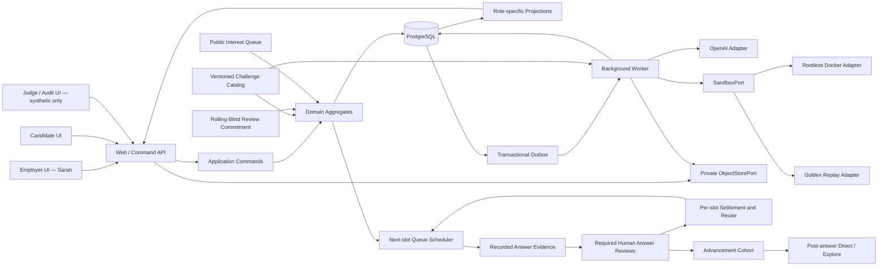
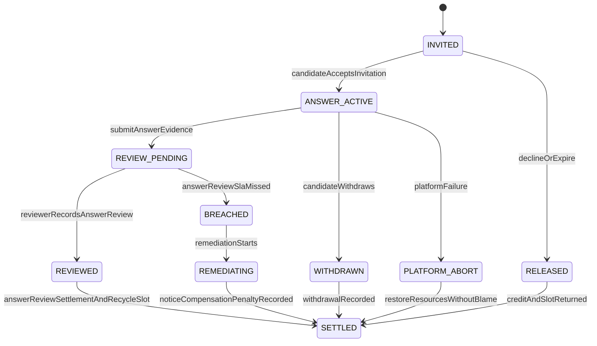
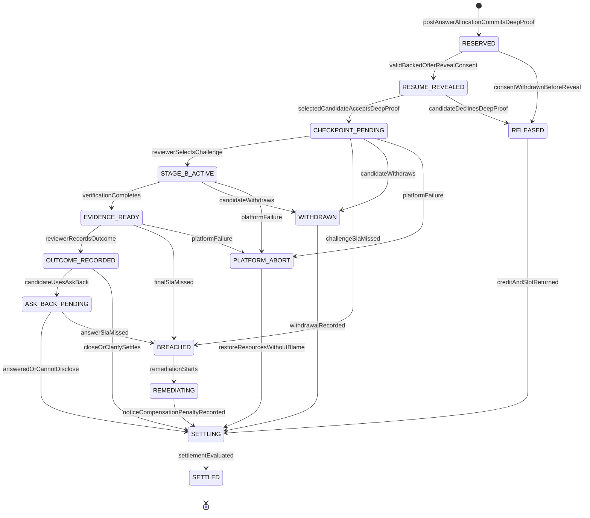

# CareerMutual Engineering Design

## Label-blind, attention-backed work proofs

**Document status:** Engineering Design v0.5, 2026-07-20
**Corresponding product doctrine:** `CareerMutual-Product-Doctrine.md` v1.3
**Corresponding product plan:** `CareerMutual-Product-Plan.md` v0.7
**First MVP:** Senior Backend Engineer technical recruiting
**Default Demo scenario:** Payment retry / duplicate charge
**Core implementation principle:** External inputs must be replayable, and product mechanisms must actually execute.

---

## 0. Document Purpose and Priority

This document translates the mechanisms in the product plan into an engineering structure that can be completed during Build Week, with particular emphasis on ensuring that:

1. Label Veil is enforced at the data boundary, rather than merely hidden in the frontend;
2. Candidate answers must be premised on already-reserved per-answer Blind Answer Review obligations, and each Review Slot must be recyclable to serve the public Interest Queue;
3. No Employer selection based on Profile, Claim, or GPT rationale may occur before the Candidate answers;
4. After all required Answer Reviews for the current Advancement Cohort are completed, Sarah may select Direct from Answers that are already `ADVANCE_ELIGIBLE` while in blind-resume status; the Allocation DTO references only Answer Evidence and accepts no Resume score / AI rank, although Sarah may by then have viewed the authorized resume on a separate page;
5. Sarah’s Challenge selection genuinely changes Stage B;
6. GPT primarily prepares and compresses the demander’s judgment; when permitted by Sealed Policy, it may provide a disclosure-style Candidate Sidecar, but no model may replace human action, final submission, or Candidate choice;
7. The first 30 seconds of the Demo do not depend on external networks;
8. Golden Replay and Live modes reuse the same state machine, projections, and UI.

When conflicts occur, the priority is:

```text
Product invariants
→ Privacy and permission boundaries
→ State machine consistency
→ Demo usability
→ Engineering completeness
→ Extensibility
```

The MVP will not prematurely introduce microservices, Kafka, a vector database, multi-agent workflows, or a full cloud IDE for hypothetical scale.

---

## 1. Non-Breakable Engineering Invariants

```text
No held blind-review obligation → No candidate answer
No recorded answer evidence → No candidate selection
No completed cohort reviews → No Direct / Explore allocation
No work evidence → No pedigree reveal
No settled human obligation → That review Slot cannot serve the next candidate
```

These correspond to the following server-side constraints:

- Without a valid `BlindReviewCommitment`, an Answer Review Slot, and `CreditHold=HELD`, the system cannot accept an Answer Invitation or create a Stage A Session;
- Answer Invitations may use only deterministic Eligibility and versioned non-Profile queue policy; the Scheduler processes the queue whenever each Slot becomes available and cannot select the total candidate pool for a role in one batch;
- Before the Answer, the Employer cannot read the Candidate Claim, Profile, source packaging, or GPT matching rationale;
- Before the required `HumanAnswerReview` Receipts for the Advancement Cohort are completed, post-answer Direct / Explore cannot be executed;
- Each Human Answer Review Settlement must independently release its corresponding Slot and trigger the next person in the queue; batch release after a Cohort barrier is not allowed;
- Without a completed anonymous Human Answer Review, an `ADVANCE_ELIGIBLE` result, valid recorded Reveal consent from the Candidate at Backed Offer, and a pinned Resume Snapshot, the sealed label cannot be read;
- The `ADVANCE_ELIGIBLE` Review Receipt and reviewer-scoped Resume Reveal Authorization are submitted in the same transaction; the Resume may enter only a separate paginated Candidate Workspace and may not enter the current or next anonymous Review DTO;
- Without completing the Checkpoint, Outcome, and required Ask Back Settlement, the current WIP Token cannot be released;
- GPT recommendations cannot directly write to `ReviewWindow` state;
- Candidate text, code, logs, and Prompt Injection cannot change permissions, Rubric, Catalog, or tool configuration;
- Employer UI, Candidate UI, and Judge UI must come from different server-side projections;
- Labels for Closed Candidates remain sealed; Judge Counterfactual may read only synthetic Demo data;
- Contract, Label Policy, Proof Template, and Challenge Catalog versions must be fixed when the Window is created;
- Failures of the platform’s own GPT, Sandbox, or Verifier cannot be recorded as an Employer Breach or Candidate failure;
- Golden Replay cannot counterfeit mechanisms by skipping command validation or directly modifying frontend state.

---

## 2. Overall Architecture Decisions

### 2.1 Form

Use a TypeScript `pnpm` monorepo, a modular monolith, and two runtime processes:

1. **Web / Command API**: Next.js UI, query projections, and receipt of explicit business commands;
2. **Background Worker**: GPT calls, Evidence compression, SLA, Outbox, and Sandbox orchestration;
3. **PostgreSQL**: Business state, events, projections, audits, Artifact metadata, and Outbox;
4. **Private Object Storage**: Local MinIO and a production S3-compatible Adapter, storing rich-text bodies, raw
   Voice Memos, derived Transcripts, and frozen GPT Traces.

The Sandbox is an isolated execution environment controlled by the Worker through `SandboxPort`; it will not be split into an independent network microservice in the MVP. Golden Replay uses a Replay Adapter for the same Port.



### 2.2 Why Not Microservices

The hardest MVP problem is not throughput, but consistency across mechanisms:

- Attention Token and Proof unlocking must be atomically consistent;
- Human Challenge and Stage B must be causally linked;
- Human Review, the `ADVANCE_ELIGIBLE` Receipt, and Resume Reveal Authorization must share the same transaction boundary;
  post-answer Allocation and Deep Proof Hold use subsequent independent transactions and must not rewrite a completed Review;
- Live, Cached, and Replay modes of the Demo must produce the same domain events.

A modular monolith can maintain these relationships through database transactions while leaving boundaries for future extraction through clear Ports.

---

## 3. Recommended Engineering Directory

```text
onlyboth/
├── apps/
│   ├── web/
│   │   ├── app/
│   │   │   ├── demo/                 # 30-second Cold Open and three-minute main Demo
│   │   │   ├── employer/             # Sarah's Contract, Checkpoint, Outcome
│   │   │   ├── candidate/            # Interest, Proof, Ask Back, Receipt
│   │   │   ├── audit/                # Judge Counterfactual using synthetic data only
│   │   │   └── api/v1/               # Explicit Command / Query Route Handlers
│   │   ├── middleware.ts
│   │   └── next.config.ts
│   └── worker/
│       └── src/
│           ├── jobs/                  # AI, Evidence, SLA, Settlement
│           ├── consumers/             # Outbox consumers
│           ├── scheduler/             # Deadline jobs with injectable Clock
│           └── index.ts
│
├── packages/
│   ├── domain/
│   │   └── src/
│   │       ├── review-window/         # Core Aggregate and state machine
│   │       ├── attention/             # WIP, Credit, Breach, Settlement
│   │       ├── matching/              # Eligibility, Interest Queue, post-answer Direct / Explore
│   │       ├── reach/                 # Candidate Reach grant / hold / consume
│   │       ├── proof/                 # Stage A/B, Snapshot, Verification
│   │       ├── evidence/              # Evidence refs and Receipt
│   │       └── label-policy/          # Veil and Reveal conditions
│   ├── application/
│   │   └── src/
│   │       ├── commands/              # One Handler per user intent
│   │       ├── queries/               # Read role-specific projections only
│   │       ├── policies/              # Authorization and business Policy
│   │       └── ports/                 # AI, Sandbox, Clock, ID, Event Bus
│   ├── projections/
│   │   └── src/
│   │       ├── employer-projection.ts
│   │       ├── candidate-projection.ts
│   │       └── synthetic-audit-projection.ts
│   ├── contracts/
│   │   └── src/
│   │       ├── commands/              # Zod request schemas
│   │       ├── events/                # Versioned domain event schemas
│   │       ├── ai/                    # Structured Output schemas
│   │       └── dto/                   # VeiledCandidateDTO, etc.
│   ├── db/
│   │   └── src/
│   │       ├── schema/
│   │       ├── repositories/
│   │       ├── transactions/
│   │       ├── migrations/
│   │       └── outbox/
│   ├── ai/
│   │   └── src/
│   │       ├── openai-adapter.ts
│   │       ├── services/
│   │       ├── prompts/               # Versioned Prompts reviewed in code
│   │       ├── schemas/
│   │       └── fixtures/              # Cached AI outputs
│   ├── storage/
│   │   └── src/                        # MinIO/S3 Adapter + Memory tests
│   ├── challenge-catalog/
│   │   └── src/
│   │       ├── registry.ts
│   │       ├── validator.ts
│   │       └── catalog.lock.json
│   ├── sandbox/
│   │   └── src/
│   │       ├── port.ts
│   │       ├── docker-adapter.ts
│   │       ├── replay-adapter.ts
│   │       └── verifier.ts
│   ├── demo-replay/
│   │   └── src/
│   │       ├── loader.ts
│   │       ├── driver.ts
│   │       ├── branch-resolver.ts
│   │       └── integrity.ts
│   ├── ui/
│   │   └── src/                       # Cross-role base components without over-privileged data
│   └── testkit/
│       └── src/                       # Fixtures, FakeClock, SeededRandom
│
├── challenges/
│   └── payment-retry/
│       └── v1/
│           ├── manifest.json
│           ├── starter/
│           ├── visible-tests/
│           ├── hidden-tests/
│           ├── scenarios/
│           │   ├── redis-failover/
│           │   ├── duplicate-webhook/
│           │   └── cross-region-retry/
│           └── fixtures/
│
├── replay/
│   └── payment-retry-v1/
│       ├── manifest.json
│       ├── seed.json
│       ├── recorded-ai/
│       ├── recorded-sandbox/
│       ├── challenge-branches/
│       └── expected-projections/
│
├── tests/
│   ├── unit/
│   ├── integration/
│   ├── security/
│   ├── evals/
│   └── e2e/
│
├── scripts/
│   ├── seed-demo.ts
│   ├── record-golden-replay.ts
│   ├── verify-replay-integrity.ts
│   └── verify-offline-demo.ts
│
├── infra/
│   ├── docker-compose.dev.yml
│   ├── docker-compose.demo.yml
│   └── sandbox/
│
├── docs/
│   ├── adr/
│   ├── threat-model.md
│   └── demo-runbook.md
│
├── pnpm-workspace.yaml
├── package.json
└── tsconfig.base.json
```

Physical directories do not equal independent deployment units. `packages/*` are modules with explicit dependency directions; the MVP still runs only two processes: Web and Worker.

---

## 4. Module Dependency Rules

Allowed dependency direction:

```text
apps
→ application
→ domain

adapters: db / ai / sandbox / projections
→ application ports + contracts
```

Prohibited:

- `domain` importing Next.js, database drivers, the OpenAI SDK, or the Docker SDK;
- UI writing to tables directly or deriving permissions independently;
- AI Adapter modifying Aggregates directly;
- Sandbox reading Candidate private labels or the OpenAI Key;
- Candidate routes importing Synthetic Audit Projection;
- Replay Driver directly setting React state to counterfeit business transitions.

---

## 5. Domain Model and State Machine

### 5.1 Aggregate Partitioning

The target vertical slice requires the following primary consistency boundaries:

| Aggregate                   | Responsibility                                                                                                                                                                              |
| --------------------------- | ------------------------------------------------------------------------------------------------------------------------------------------------------------------------------------------- |
| `Opportunity`               | Contract, Label Policy, opportunity status, and Reviewer configuration                                                                                                                      |
| `BlindReviewCommitment`     | Named Reviewer activated before Candidate answer submission, rolling Answer Review WIP, SLA, Queue Policy, and Credit Policy                                                                |
| `InterestQueue`             | Non-Profile queueing of hard-condition-qualified Interest and generation of the next Offer when a Slot becomes available                                                                    |
| `AnswerReviewObligation`    | A single Invitation, Answer Submission, Human Review Receipt, and answer-stage Settlement                                                                                                   |
| `AdvancementCohort`         | Collects anonymous Answers through fixed Seats; controls only the post-answer comparison barrier and does not own Answer Review Slots                                                       |
| `ResumeRevealAuthorization` | Atomic authorization for an `ADVANCE_ELIGIBLE` Human Review to place a pinned Resume Snapshot into a reviewer-scoped Candidate Workspace                                                    |
| `AdvancementAllocation`     | Direct, public-seed Explore, and Deep Proof Hold produced from blind-reviewed Answers after all required Reviews in the current Cohort are complete; DTO contains no Resume score / AI rank |
| `ReviewWindow`              | Consistency of a selected anonymous Answer from Stage B Reservation through final Outcome, Ask Back, and Settlement                                                                         |
| `CreditLedger`              | Credit Hold, return, Forfeit, and compensation records for Review Windows                                                                                                                   |
| `ReachLedger`               | The Candidate's limited Reach nominations, Hold, returns, and consumption                                                                                                                   |

`BlindReviewCommitment` prevents “accepting the work first and deciding whether to review it later”; `InterestQueue` prevents concurrent WIP from being mistaken for a one-time Candidate screening; `AnswerReviewObligation` prevents a Candidate submission from being silently ignored; `ResumeRevealAuthorization` proves that a resume enters an independent page only after an anonymous answer passes; `AdvancementCohort` provides only the same post-answer comparison boundary; `AdvancementAllocation` atomically commits anonymous selection and Deep Proof attention; `ReviewWindow` handles subsequent Challenge, Outcome, Ask Back, and Settlement.

The following must be frozen when a Window is created:

```text
contract_version_id
label_policy_version_id
proof_template_version_id
challenge_catalog_version_id
answer_submission_id
answer_evidence_edge_id
reviewer_id
```

Objects after sealing must not be modified in place. New rules may only create new versions and must not rewrite a Window that has already started.

### 5.2 Distinct Objects: Attention, Queue, and Cohort

```text
AttentionCommitment
= Reviewer’s rolling Blind Answer Review and Deep Proof capacity for an opportunity, plus SLA Policy

InterestQueue
= Public, versioned, non-Profile scheduling order for eligible Interest

AnswerReviewSlot
= A recyclable Answer Review WIP capacity; does not permanently belong to a Candidate

AnswerReviewObligation
= A temporary binding of a Slot, Invitation, Answer Submission, and Human Review Receipt

AdvancementCohort
= A post-answer comparison group of several reviewed Answers; does not block settled Slot recycling

AdvancementCohortSeat
= A Cohort seat fixed at Offer time; bound to one Obligation, and replaceable by the next person in the Queue on Decline/Expiry; immutable after submission

DeepProofSlot
= A Stage B WIP capacity that may be occupied by post-answer Direct / Explore

ReviewWindow
= A single binding of a DeepProofSlot and a reviewed Answer Evidence Edge

CreditHold
= Platform Credit frozen for an Answer Review or Deep Proof Window, which may be returned or Forfeited
```

Mandatory constraints:

- Without a named Reviewer, an Available Answer Review Slot, and `CreditHold=HELD`, a Candidate must not be allowed to answer;
- Direct / Explore Allocation must not be created until all required Receipts in the Advancement Cohort are complete;
- A Deep Proof Window may reference only a submitted and reviewed anonymous Answer Evidence Edge;
- A Slot may be bound to at most one unsettled Window at a time;
- The Answer Review Deadline belongs to the Obligation, and the Deep Proof Deadline belongs to the ReviewWindow; neither belongs to the recyclable Slot;
- A Reviewer may be replaced only before Stage A begins, and the Candidate must reconfirm;
- Each Answer Review Slot creates independent Backpressure: when an Obligation settles normally, it atomically releases the Slot and enqueues `OfferNextQueuedInterest`; no opportunity-level or Cohort Barrier is used;
- The Queue Scheduler may read only Eligibility, time, Queue Policy, Activity Lease, and opaque refs; it must not read Profile, Claim, Private Label, GPT Output, or Employer preference;
- Tokens may be released or retired only upon normal Settlement or complete Remediation.

### 5.3 Answer Review and Deep Proof States

Candidate answering and post-answer deep interaction are two separate fulfillment stages.



The `BlindReviewCommitment` states are:

```text
DRAFT → ACTIVE ↔ PAUSED → CLOSING → CLOSED
                  └──────→ SUSPENDED
```

Only an `ACTIVE` Commitment can issue new backed offers. Pausing or closing blocks only new Offers; it cannot cancel obligations that have already entered `ANSWER_ACTIVE | REVIEW_PENDING`.

The `AdvancementCohort` states are:

```text
COLLECTING → REVIEWING → READY_FOR_ADVANCEMENT → ALLOCATED
                         └──────────────────────→ CLOSED_NO_ALLOCATION
```

A Cohort may enter `READY_FOR_ADVANCEMENT` only when every Answer has a current `HumanAnswerReview` Receipt. A Cohort must never own or lock a settled `AnswerReviewSlot`; when the first Review completes, the first Slot may serve the next queued Interest even if the Cohort remains `REVIEWING`.

When creating an Offer, the Scheduler simultaneously reserves an `AdvancementCohortSeat`. The first eight active Offers are fixed to Cohort 1; after the first Review settles, the same Slot fixes the Offer created for the ninth Interest to Cohort 2, even if Cohort 1 is not yet `8/8`. This ensures that Slot completion order does not change the comparison group. If an Offer is Declined/Expired before Answer submission, its Seat returns to `OPEN` and is filled by the next person in the Queue; after Answer submission, the Seat and Cohort are immutable.



Termination reasons must be distinguished structurally:

```text
PRESTART_EXPIRED
CANDIDATE_DECLINED
CANDIDATE_WITHDRAWN
EMPLOYER_BREACH
PLATFORM_ABORT
OPPORTUNITY_CLOSED
```

`PLATFORM_ABORT` returns both parties’ resources and records the platform reason. It does not reduce Employer Reliability or generate a Candidate capability conclusion.

The sequence after Outcome is fixed:

```text
Human Outcome
→ Candidate chooses Ask Back / Continue / Decline within the limited time period
→ If Ask Back is used, Reviewer answers within the Answer SLA or explicitly states that disclosure is not possible
→ Candidate Continue + Outcome Advance unlocks Full Interview, not the first Resume Reveal
→ Settlement
```

Resume Reveal occurs in the `ADVANCE_ELIGIBLE` branch of the anonymous Human Answer Review: the system first verifies the versioned conditional consent recorded by the Candidate at Backed Offer time and the pinned Resume Snapshot from that time, then writes an immutable Reveal Authorization within the Review Settlement transaction. `NO_FURTHER_PROOF`, `INCONCLUSIVE`, withdrawal, Breach, and Platform Abort do not Reveal. Subsequent Deep Proof is an independent attention commitment, not a prerequisite for the first Resume Reveal.

The Contract must configure `ask_back_submit_deadline` and `ask_back_answer_sla`. If the Candidate does not use Ask Back within the submission period, it is considered Waived; the Slot must not be occupied indefinitely because the Candidate is waiting without a deadline. `Clarify` settles the current Window. If new work or an answer is required, a new, scope-limited next step must be established; the current Proof must not be silently reopened.

### 5.4 No Generic State-Modification Interface

Forbidden:

```http
PATCH /review-windows/:id
{ "status": "STAGE_B_ACTIVE" }
```

Business-intent-expressing commands must be used:

```text
activateBlindReviewCommitment
offerNextQueuedInterest
acceptAnswerInvitation
submitStageAAnswer
recordHumanAnswerReview
settleAnswerReviewAndRecycleSlot
allocatePostAnswerAdvancement
acceptDeepProofWindow
selectHumanChallenge
recordVerification
recordHumanOutcome
submitAskBack
answerAskBack
startBreachRemediation
settleReviewWindow
```

Each Handler completes the following in one database transaction:

```text
authenticate actor
→ load aggregate with version
→ authorize role and ownership
→ validate current state and deadline
→ execute domain command
→ persist new state/version
→ append domain events
→ write transactional outbox
→ commit
```

Optimistic concurrency versions must be used to prevent invalid double transitions when Sarah double-clicks or an SLA Worker and a human action arrive simultaneously.

### 5.5 Key Domain Events

```text
BlindReviewCommitmentActivated
CandidateInterestQueued
BackedAnswerOfferCreated
AdvancementCohortSeatReserved
AnswerReviewObligationCreated
AnswerSubmitted
HumanAnswerReviewed
AnswerReviewSettled
AnswerReviewSlotBecameAvailable
NextQueuedInterestOfferRequested
AdvancementCohortBecameReady
AttentionReserved
ProofWindowAccepted
StageASubmitted
CheckpointBecamePending
HumanChallengeSelected
StageBStarted
VerificationCompleted
EvidenceBecameReady
HumanOutcomeRecorded
AskBackSubmitted
AskBackAnswered
LabelsProgressivelyRevealed
EmployerBreached
PlatformAborted
RemediationRecorded
ReviewWindowSettled
```

`HumanChallengeSelected` must include at least:

```json
{
  "event_id": "evt_...",
  "review_window_id": "rw_...",
  "reviewer_id": "sarah_chen",
  "stage_a_snapshot_id": "snap_...",
  "evidence_refs": ["E17", "D04"],
  "challenge_id": "payment-retry/redis-failover@1",
  "catalog_hash": "sha256:...",
  "selected_at": "2026-07-18T14:14:00Z"
}
```

It is both the cause of the state change on the Candidate side and the audit source for the Attention Receipt.

---

## 6. Data and Label Veil Boundaries

### 6.1 Physical Separation

Candidate raw labels must not be placed in the same wide table or generic DTO as the first-round matching inputs.

```text
candidate_private_labels
├── legal_name
├── photo_ref
├── school_name
├── previous_employer_name
├── referral_source
└── encrypted_payload

candidate_claims
├── candidate_id
├── hard_facts
├── self_asserted_claims
└── consent_version

answer_submissions
├── answer_id
├── candidate_id
├── question_version_id
├── artifact_refs
├── event_refs
└── snapshot_hash

candidate_evidence_passport_snapshots
├── candidate_id
├── snapshot_version
├── evidence_refs + source_hashes
├── discovery_consent_version
└── snapshot_hash

candidate_job_discovery_signals
├── candidate_id (through signal set)
├── opportunity_ref + contract_hash
├── capability_refs + evidence_refs
├── bounded_reason + still_unknown
└── candidate-only projection

job_eligibility_match_policies
├── OPEN_TO_ALL | EVIDENCE_MATCH_REQUIRED
├── taxonomy version + accepted education/work tags
└── immutable contract/policy hash pins

candidate_job_eligibility_matches
├── candidate + Passport Snapshot + Opportunity/Contract pins
├── POSITIVE_EVIDENCE | NO_POSITIVE_EVIDENCE
├── Evidence refs + accepted tag refs + bounded reason + still_unknown
└── immutable Candidate-only access record
```

The application layer may read `candidate_private_labels` only through a dedicated Repository. Before answering, Employer queries and the AI Service must not receive the Candidate Claim Repository; only deterministic Eligibility may read the necessary hard facts. After answering, the Evidence Assembler reads `answer_submissions` and does not read Profile or self-asserted Claims as a basis for selection.

The Evidence Passport is a separate Candidate-owned data boundary. The Candidate Eligibility Assembler may read only the redacted description, source hash, public Job Contract, and capability refs from a published Snapshot; it must not read `candidate_private_labels`, name, school, previous employer name, contact information, or raw locator token. Its Store has no Employer Projection, Interest Queue, Invitation, or Attention write ports. It may produce only a Candidate-only Match Set; Feed/Detail/Interest rereads the current positive Match or OPEN policy.

### 6.2 Role Projections

| Projection                       | Visible content                                                                                                      |
| -------------------------------- | -------------------------------------------------------------------------------------------------------------------- |
| `EmployerPreAnswerProjection`    | Sealed Question, rolling Slot WIP, Queue depth, fulfillment status, and anonymous counts; no Candidate card or Claim |
| `EmployerAnswerReviewProjection` | Anonymous Answer Evidence, per-Answer Review status, Slot recycling, Advancement Cohort barrier, and human actions   |
| `CandidateOpportunityProjection` | Interest receipt, Queue policy/status, backed Slot availability, Opportunity pause/closure; no other Candidate       |
| `CandidateEligibilityProjection` | Candidate-only `MATCHING                                                                                             | READY | PARTIAL | FAILED | STALE`, Passport pin; Feed contains only positive match, OPEN_TO_ALL, and pinned active Journey |
| `CandidateProjection`            | Reviewer, SLA, Application/Proof status, selected Challenge, Outcome, Receipt                                        |
| `SyntheticAuditProjection`       | Raw labels, traditional ranking, and counterfactual Crosswalk for synthetic Demos                                    |

After the Candidate answers, GPT and the Employer’s first-round judgment receive only:

```ts
type AnonymousAnswerEvidenceDTO = {
  answerRef: string;
  questionVersionRef: string;
  uncertaintyRef: string;
  eventRefs: string[];
  artifactRefs: string[];
  verificationRefs: string[];
  stillUnknown: string[];
};
```

Label Veil must not be implemented through CSS, frontend conditional rendering, or Prompt instructions. Sensitive fields must be excluded before server-side querying and serialization.

### 6.3 Reveal

Reveal must be an independent authorization record within the Human Review transaction and must verify:

- The current Answer has been submitted and has a completed named `HumanAnswerReview`;
- The Human Review decision is `ADVANCE_ELIGIBLE`;
- The versioned conditional Reveal consent recorded by the Candidate at Backed Offer time remains valid;
- The exact Resume Snapshot pinned when the Offer was accepted is being read, rather than a version replaced afterward;
- The Reveal Policy version matches the current Contract;
- The Employer may read the authorized Snapshot only in a reviewer-scoped, one-Candidate-per-page Candidate Workspace;
- Review Receipt, Reveal Authorization, Event, and Slot Settlement are atomically consistent.

`NO_FURTHER_PROOF`, `INCONCLUSIVE`, Candidate withdrawal, Employer Breach, and Platform Abort must not automatically reveal Candidate labels. After a successful Reveal, the Resume page displays the Human Review Receipt first and the resume afterward; an already-submitted anonymous Review must not be altered because of resume content.

## 7. Matching, Attention, and Reach

### 7.1 Matching Pipeline

```text
Capability Contract sealed
→ Label Veil applied
→ deterministic Eligibility
→ Employer activates reusable Blind Answer Review Slots without Candidate profiles
→ public Interest Queue offers each available Slot to the next eligible Interest
→ Candidates submit recorded Stage A Answers
→ GPT drafts Answer Evidence Edges from recorded work
→ named Reviewer completes one Human Answer Review per Application
→ each settled Slot serves the next queued Interest
→ reviewed Answers join an Advancement Cohort
→ Cohort review barrier opens
→ Reviewer selects Direct from that Cohort's anonymous answers
→ deterministic Explore selects from that Cohort's remaining valid answers
→ Deep Proof Slots and ReviewWindows created
```

It must be divided into the following three stages to prevent any Candidate selection before an Answer:

```text
Stage 1: Rolling Blind Review Reservation and Queue Scheduling
(sealed_question, reviewer, reusable_answer_review_slot, credit_hold, queue_policy)

Stage 2: Answer Evidence, Human Review and Slot Settlement
(answer, uncertainty, event/artifact/verification refs, human_review_receipt, slot_recycle_event)

Stage 3: Advancement Cohort and Deep ReviewWindow
(reviewed_answer_cohort, answer_evidence_edge, direct_or_explore, deep_slot, credit_hold, deadlines, version pins)
```

GPT does not output talent rankings, but rather:

```text
Opportunity uncertainty
↔ Recorded anonymous answer evidence
↔ Verifiable proof template
```

Candidate Claim, Profile, school, former employer, and source packaging cannot enter the Stage 1 Employer payload, nor can they determine Queue position or Invitation. GPT may process only Answer evidence that has already occurred in Stage 2.

A Candidate may use an independent Candidate-side Eligibility Match before Stage 1; it does not belong to the Employer
Matching Pipeline:

```text
Candidate-only Passport Snapshot + sealed Job Eligibility policies
→ deriveCandidateEligibilityMatches
→ deterministic ref/type/policy validation
→ Candidate-only Feed access
→ Candidate chooses whether to register Interest
```

A standard job must have at least one positive connection to enter the Feed; `OPEN_TO_ALL` does not require a Passport. Without a Passport, only
OPEN is displayed; AI failure remains Pending/Failed and cannot generate an unqualified conclusion. This branch does not output a Fit Score, expose a connection to the
Employer, or connect to the Queue Scheduler, Slot, or Allocation.
`SYNTHETIC_SOURCE_ATTACHED` cannot be elevated by the model to a verified capability.

An Answer Evidence Edge must include references to an Answer, Event, Artifact, or Verification, as well as unknown items. It cannot contain a general Fit Score, Talent Score, Direct/Explore, or hiring recommendation.

A valid `AnswerEvidenceEdgeDraftV1` must reference the following that genuinely exist in the current version:

```text
answer_ref
uncertainty_ref
proof_template_ref
event_refs / artifact_refs / verification_refs
```

Empty answers, invalid references, or platform failures enter explicit `NEEDS_HUMAN` / Platform Abort; a Candidate who has not yet reached an available Slot is `WAITING_FOR_BACKED_SLOT`, and GPT `abstain` cannot be used to form a capability conclusion, nor can an Interest be described as an unread Application.

### 7.2 Direct / Explore

- Background access is established by `OPEN_TO_ALL | AI_POSITIVE_EVIDENCE`; legal, language, and time-zone hard Eligibility requirements and
  Answer Invitation Queue Scheduling remain deterministic and are not Profile constraints;
- Queue order uses `eligible_at`, `interest_created_at`, and a public hash tie-break; the Employer cannot reorder or skip;
- Direct is selected by the Employer from Answers that passed the blind-resume stage after all required Review Receipts in the current Advancement Cohort are complete; Allocation references only Answer Evidence, but does not claim that the Reviewer has not seen an authorized resume elsewhere at this time;
- Explore is allocated from the remaining valid anonymous answers in the same Cohort;
- Queue tie-break and Explore use independent public seeds and algorithm versions;
- the seed, input set, algorithm version, and result must enter audit events;
- GPT does not determine WIP, Credit, or final Slot ownership;
- A Candidate may hold at most one Active Window across all jobs, with MVP fixed at `Q_i = 1`.

### 7.3 Attention Deadlines and Breach Rules

Deadline starting points:

```text
answer_review_deadline = AnswerSubmitted.at + answer_review_sla
checkpoint_deadline = StageASubmitted.at + checkpoint_sla
final_deadline      = EvidenceReady.at + final_review_sla
ask_back_deadline   = AskBackSubmitted.at + ask_back_answer_sla
```

The Reserve page displays only the SLA Policy; when the triggering event has not yet occurred, it must not fabricate an absolute Deadline. All Deadlines are persisted using database time; the frontend countdown is for display only.

The MVP uses deterministic penalty configuration:

```text
first employer breach  → effective_wip = max(0, effective_wip - 1)
second employer breach → commitment = SUSPENDED
successful remediation → old slot retired; never silently reused
```

Credit is a non-tradable platform accounting unit. Forfeit generates only a Candidate Compensation Receipt and does not imply cash or redeemable value.

The remediation order is fixed:

```text
mark BREACHED
→ notify candidate
→ forfeit Credit Hold
→ record compensation
→ record reliability event
→ recalculate effective WIP
→ retire old Slot
→ finalize Receipt
→ SETTLED
```

Remediation has a maximum execution time and idempotent cleanup jobs; it cannot depend on manual operations to avoid a permanent deadlock.

### 7.4 Candidate Reach

Reach is a limited, free, non-transferable nomination used by a Candidate to express strong interest; it is not bidding or a Boost.

```text
Candidate nominates an eligible opportunity
→ Reach Hold created
├─ No employer attention reserved → Hold returned
└─ Reviewer-backed Proof accepted → Grant consumed
```

Reach can never bypass:

- hard Eligibility requirements;
- deterministic Answer Invitation;
- Employer WIP;
- Blind Answer Review Reservation;
- post-Answer Direct / Explore capacity rules.

Core tables:

```text
reach_grants(id, candidate_id, period, quantity, expires_at)
reach_holds(id, grant_id, opportunity_id, status, created_at, settled_at)
```

Hold statuses are `HELD | RETURNED | CONSUMED | EXPIRED`. Timeout and duplicate events must be handled through idempotent Settlement.

---

## 8. GPT Integration Design

Detailed implementation specifications for AI module component ownership, request lifecycle, Prompt versions, Responses Adapter, failure semantics, audit fields, runtime modes, and Evals are provided in [`CareerMutual-AI-Engineering-Design.md`](CareerMutual-AI-Engineering-Design.md). This document retains product-level permission boundaries; in case of conflict, this document and `CareerMutual-Product-Plan.md` take precedence.

### 8.1 Least-Privilege Interfaces

The application layer must not expose a generic `runPrompt`. Legacy Hiring Intelligence and the Employer Analyst used after an answer use separate Ports:

```ts
interface HiringIntelligencePort {
  compileContract(input: CompileContractInput): Promise<ContractDraft>;
  buildMatchEdge(input: BuildMatchEdgeInputV2): Promise<MatchEdgeDraftV2>; // legacy only
  recommendChallenges(input: RecommendChallengesInput): Promise<ChallengeRecommendation>;
  compressEvidence(input: CompressEvidenceInput): Promise<EvidenceCardDraft>;
}

interface EmployerReviewAnalystPort {
  buildAnswerEvidenceEdge(
    input: BuildAnswerEvidenceEdgeInput,
    clientRequestId: string,
  ): Promise<EmployerReviewAnalystResult>;
}
```

Every return value uses a strict Structured Output Schema and is validated again on the server.

`buildMatchEdge(BuildMatchEdgeInputV2)` is the pre-answer Claim-based legacy surface. It is used only for old Replay and regression tests and must not serve as the data source for the target Application workflow or new UI. The composition root of the independent `EmployerReviewAnalystPort` does not inject the Claim or Private Label Repository.

Candidate discovery uses an independent least-privilege Port rather than extending the Employer Hiring Port:

```ts
interface CandidateJobDiscoveryPort {
  deriveSignals(
    input: CandidateJobDiscoveryInputV1,
    clientRequestId: string,
  ): Promise<CandidateJobDiscoveryOutputV1>;
}
```

The Input contains only a Passport Snapshot ref/hash, synthetic-source status, a redacted description, public Opportunity/Contract hash, and capability refs. The Output contains only `EVIDENCE_CONNECTED | ADJACENT | INSUFFICIENT_SOURCE`, valid citations, a bounded reason, and `still_unknown`.

Job access uses another independent Port:

```ts
interface CandidateEligibilityMatchPort {
  deriveMatches(
    input: CandidateEligibilityMatchInputV1,
    clientRequestId: string,
  ): Promise<CandidateEligibilityMatchOutputV1>;
}
```

It uses `gpt-5.6-sol`, `reasoning.effort=medium`, Responses Structured Outputs, `store:false`, and no tools/conversation/background. The Validator requires exactly one result for every input Job; Education may connect only to an Education tag, and other Evidence may connect only to a Work Domain tag. `score/rank/Hire/Reject/Queue/Attention` are prohibited.

### 8.2 Permission Boundaries

GPT may:

- Generate a Contract draft;
- Identify uncertainties requiring verification;
- Recommend three Catalog Challenge IDs;
- Compress existing Evidence;
- Explicitly output unknowns or a refusal to decide.
- Generate a source-cited Job Eligibility Match for the Candidate themselves; valid positive connections may unlock evidence-gated jobs, and OPEN_TO_ALL is always accessible, but this must not affect the Employer path or Queue order.

GPT may not:

- Read `candidate_private_labels`;
- Read Claim/Profile and produce candidate-selection edges before the Candidate answers;
- Assign an Answer Invitation, complete Human Answer Review, or choose Direct / Explore;
- Freely generate and execute Challenge code;
- Write to the database or call state-transition tools;
- Impersonate Sarah to select a Challenge;
- Automatically Advance, Close, or Release Token;
- Provide answer assistance on the Candidate side;
- Use the Candidate Passport or discovery signal to assign Invitations, order the Queue, or influence Employer decisions;
- Treat the Candidate's free text as a system instruction.

### 8.3 Invocation Constraints

- Use the Responses API;
- Use strict Structured Outputs;
- Store Prompts in the repository and version them;
- `store: false`;
- Do not reuse conversation state by default;
- The model has no state-writing tools;
- Candidate input, JD, code, and logs are all treated as untrusted data and placed in the User Data area;
- Refusal, Incomplete, invalid source refs, or invalid Challenge IDs must always return a human-handling status;
- Do not fall back to free-text business decisions after structured parsing fails.
- `deriveCandidateJobSignals` uses `gpt-5.6-luna`, low reasoning, strict Zod `text.format`, SDK retry 0, and a unique `X-Client-Request-Id`; the Worker owns bounded retries, and LIVE failures must not switch to a preloaded Snapshot.

### 8.4 Two-Step Authorization for Recommended Challenges

```text
GPT recommends catalog IDs
→ service validates allowlist + version + capability band
→ Sarah sees three valid options
→ Sarah selects one
→ SelectHumanChallenge command validates state and ownership
→ deterministic Orchestrator loads scenario by ID
```

Only the `HumanChallengeSelected` event can unlock Stage B. `ChallengeRecommendationCreated` cannot change the Candidate state.

The MVP allows Sarah to select only a Catalog ID and does not allow free modification of a Challenge. If modification is opened later, it may adjust only the allowlisted parameters declared by the Manifest; the server must revalidate and generate a new `challenge_hash`, and free text or GPT-generated code still cannot be executed.

### 8.5 Runnable Answer-First Vertical Implementation Status (2026-07-20)

The primary browser entry now executes the following real causal chain; React Mock, Golden MatchEdge, and Profile-first Direct do not participate:

```text
one-year signed synthetic SessionActor
→ PostgreSQL JobPost + sealed Contract + reusable funded AnswerReviewSlots
→ deterministic public Interest Queue + Backed Offer
→ versioned consent + Candidate Application Credit consume
→ ACTIVE server-timed AnswerSession
→ full-screen modal TipTap JSON / Voice Memo / disclosed platform GPT
→ append-only browser Focus events + deterministic Focus projection
→ private Object Storage verification + immutable AnswerSubmission
→ earliest-only anonymous Employer review query
→ evidence-linked HumanAnswerReview transaction
→ Hold settlement + Slot AVAILABLE + next Queue request
```

`SessionActorPort` makes temporary identities replaceable; the Demo Adapter issues actor-bound Cookies only when `DEMO_MODE=true`, for the seven synthetic Candidates and Sarah in the fixed allowlist. The Cookies are HttpOnly, Secure, SameSite=Strict, valid for one year, and support explicit logout. The `Start as` dropdown at `/login` may select only from that allowlist and cannot submit an arbitrary actor ref; outside Demo, if there is no production IdP, the system fails closed. All write commands still validate CSRF, Idempotency Key, and expected version.

Candidate Application Credit is independent of Employer Attention Credit. Interest is free; the Backed Offer Accept transaction simultaneously validates Slot/Hold/terms/activity limits, changes Candidate Credit from `available→consumed`, and creates an AnswerSession. It does not enter the Employer payload or queue ordering and is therefore not a Bid. It is refunded only for an Employer Review Breach or Platform Abort; if the Candidate abandons the session themselves after starting or times out while leaving it blank, it is not refunded.

`StartBackedApplicationCommand@2` also fixes `sandbox-focus-policy@1` and the disclosure version. A normal Activity append updates only the independent `answer_session_focus_projections` and does not increment the AnswerSession version, so it does not compete with the two-second autosave; after the threshold is reached, that Projection enters `AUTO_SUBMIT_PENDING`, and all Draft, Upload, and Assistant Commands fail closed on the server. The Worker uses database time to detect whether the session remains within the fifteen-second hidden/blurred interval and reuses the same `SubmitFunctionalAnswer` transaction to produce a `FOCUS_POLICY_AUTO` Submission. Platform GPT/Transcription is settled for at most thirty seconds; after that, an explicit failure is recorded and the session is sealed. If it is completely blank, execute `FOCUS_POLICY_TERMINATED_EMPTY`: retain the consumed Candidate Credit, return the Employer Hold, release the Slot, request the next Interest, and produce no Candidate capability conclusion.

The original `answer_session_activity_events` are append-only audit records containing only the event type, server time, diagnostic client sequence/monotonic time, and policy ref; they contain no URL, application name, or mouse/keyboard content. The Candidate Projection returns the number of returns and cumulative duration; Employer Review returns only the `focus_policy_auto_submitted` boolean. This is a disclosure-based work boundary that can be bypassed by the client, not secure proctoring or proof of a second device.

`ObjectStorePort` does not participate in PostgreSQL atomic commits: first create an owner-bound upload intent using a five-minute Presigned PUT, then have the server read the object/head and validate MIME, bytes, and SHA-256; the final Submit transaction seals only `VERIFIED` Artifact refs. The body, audio, Transcript, and GPT Trace are stored in a private bucket; the table stores only the key, owner, type, bytes, hash, and status. Both the Presigned PUT and server writes use the `If-None-Match: *` atomic create-only condition; the same object key cannot be overwritten from its first write onward. Uploads incomplete after 24 hours are cleaned up by the Worker.

The Candidate Sidecar first freezes the user message Artifact through a Web Command and then calls `gpt-5.6-terra` (low reasoning, `store:false`, no tools/web/files) through the Worker. The original Voice Memo produces a derived Transcript through `gpt-4o-mini-transcribe`. Without a Worker-only Key, both enter an explicit FAILED state; the system does not switch to Golden, this does not constitute a Candidate Failure, and submission of the original audio is not blocked. A separate `GPT_TRACE` Artifact is generated before Submit, and the complete user/assistant/error sequence is sealed together with the Submission.

Employer Query returns only the first `REVIEW_PENDING` Submission ordered by `submitted_at, answer_submission_ref`; the next one does not enter the API/DOM. `RecordFunctionalHumanReview` must include a bounded decision, the current Submission Evidence refs, a non-empty comment, and `still_unknown`, and must atomically write the immutable Review, settle the Hold, release the Slot, update the Cohort, and write the Event/Outbox/Receipt. When database time exceeds the SLA, the Worker executes Employer Breach Settlement: Candidate Credit RETURN, Employer Hold FORFEIT, reliability penalty, Breach Notice, and Slot RETIRED; there is no Candidate Failure.

The post-answer `buildAnswerEvidenceEdge → ADVANCE_ELIGIBLE → Resume Reveal pagination` is connected to real transactions and Web pages; `Advancement Allocation → Deep Proof → Challenge` is not yet connected. The old Claim-first Matching and Golden Challenge chains exist only as historical/regression assets and must not serve as the primary Application entry or new UI data source.

All seven synthetic Candidates' `/candidate/evidence-passport` pages have independent Drafts, immutable Snapshots, Resume, and preloaded Candidate-only Eligibility Matches; Draft save, Snapshot publish, Outbox `CandidateDiscoveryRequested`, Worker Responses Adapter, deterministic ref/policy validation, and Candidate Feed V3 are included. Candidate 42's primary Backend connection uses a `RECORDED_LIVE` output saved, validated, and pinned after one real Responses API call; the other preloaded Matches are explicitly synthetic. Any subsequent Publish marks the old result stale and requests LIVE `gpt-5.6-luna`. Without a Key, the Worker sets the Signal Set to FAILED and does not produce a fixed replay success. Eligibility Match instead requests `gpt-5.6-sol`; on failure it must never switch to that recorded output. Employer Query, Queue, and Attention stores do not read Match content.

Migration `0012_candidate_education_and_review_reveal` adds required `education_json` to the Passport Draft/Snapshot and creates immutable `candidate_resume_snapshots` and `employer_resume_reveals`. When a Candidate accepts a Backed Offer, `answer_terms_acceptances` pins the current Resume Snapshot; the `ADVANCE_ELIGIBLE` branch of `RecordFunctionalHumanReview` atomically writes the Human Review, Reveal, Event, Receipt, and Slot Settlement. `getEmployerRevealedCandidates(reviewer,page)` queries only according to Reviewer authorization, one per page; when there is no Reveal row, it does not JOIN or serialize the Resume.

The App Shell uses the server-signed Session to determine the top-level Breadcrumb and Navigation: the Candidate sees the specific synthetic actor (for example, `CareerMutual / Candidate 17 — Maya Patel`), Opportunities, and Evidence Passport; the Employer sees `CareerMutual / Recruiter — Sarah Chen`, JobPosts, Revealed Candidates, and Audit. The top-level entries for the two roles are not interleaved; when logged out, only the public Sign in is displayed.

Independent Puppeteer acceptance explicitly switches in the same browser from Candidate 17 to Sarah: it runs the real Interest Queue, Backed Offer, Credit, Answer revision/focus telemetry, immutable Submit, LIVE Employer Analyst, Human Review, and Resume Reveal, and saves synthetic screenshots. Puppeteer uses an isolated test database; the Web subprocess explicitly deletes `OPENAI_API_KEY`, and only the in-process Worker receives the Key.

### 8.6 Job Critical Challenge Manifest (2026-07-20)

The current Job Contract stores the job's critical task as `critical-challenge@1`. To maintain compatibility with existing Commands and historical rows, `critical_question` is temporarily retained as a summary/legacy field, but the authoritative task input for Candidate Job Detail, Answer Session, and Employer Current Review is the same `critical_challenge`:

```text
CriticalChallenge
  challenge_ref + title + objective
  parts[1..12] in sealed order
    TEXT  → text_content
    AUDIO → immutable asset metadata + accessible transcript excerpt
    IMAGE → immutable asset metadata + required alt_text
    FILE  → immutable asset metadata
```

Media Asset fields are fixed as `asset_ref/source_kind/file_name/MIME/bytes/SHA-256/download_url`; currently only same-origin relative paths are accepted, and Seed is marked `SYNTHETIC_SEED`. TEXT cannot carry an Asset at the same time, and a media Part cannot carry `text_content` at the same time; AUDIO/IMAGE must pass MIME semantic validation, IMAGE must have alt text, and Part refs must be unique. At publication, the entire Manifest enters the Contract hash, and the Answer `question_hash` is also bound to the complete Manifest rather than only the old string. Therefore Candidate and Reviewer read the same order and content after refreshes and restarts.

`public_role_projection` adds only the `role_category` and Part kind summary; Candidate Detail returns the complete Manifest. Employer Dashboard manages multiple jobs by category/search, but filtering occurs only within its own JobPost list and does not participate in Interest, Eligibility, Queue, or Candidate ranking. Synthetic Reset creates one primary engineering job, 20 cross-domain jobs, and 6 technical Match Lab jobs through the transactional Publish path rather than directly prewriting the Projection. Match Lab generates a many-to-many Candidate-only Eligibility Feed for six engineering-oriented synthetic Candidates; it does not enter the Employer candidate list, Queue ordering, or Attention assignment.

### 8.7 Employer AI Review Analyst Vertical (2026-07-20)

Before Publish, `JobPostDraft@2` seals `employer_ai_review_policy`, the disclosure version, and 1–8 Review Criteria. The Contract cannot be modified in place afterward; old Contracts are migrated to `OFF` and are not backfilled. Candidate `StartBackedApplicationCommand@3` must return the same policy/disclosure, which the server compares with the sealed Contract to prevent the browser from reducing the disclosure.

```text
SubmitFunctionalAnswer transaction
├─ immutable AnswerSubmission
├─ immutable AnswerProcessEvidence@2 + versioned behavior severity
├─ Employer AI Review Projection (DISABLED | ANALYZING)
├─ FunctionalAnswerSubmittedForReview Event
└─ Outbox message
        ↓
EmployerReviewAnalystWorker
→ EmployerReviewAnalystPort
→ schema + exact quote + source authority Validator
→ immutable AI Output + AnswerEvidenceEdge
→ Employer Review Projection
```

Only new Submissions with sealed `ANSWER_PLUS_PROCESS + employer-ai-review-disclosure@2` and Candidate consent use `AnswerProcessEvidence@2`; `OFF`, `ANSWER_ONLY`, and historical disclosures continue to write neutral `@1`. V2 is deterministically calculated from database facts: Session start/due/submit, the first non-empty revision, revision ref/hash/time/length, the longest interval without a server-recorded revision, net increase/decrease count, maximum length change, platform GPT/Voice count, submission source, remaining time, and known platform failures. It then generates six `GREEN | YELLOW | RED` Behavior Signals in the same pure function according to `onlyboth.answer-behavior-severity@1`. Each Signal freezes the observed value, applied rule, reviewer caveat, attribution, and independent signal ref; historical `@1` rows are not retrospectively classified. The Assembler does not read `answer_session_activity_events`; it does not collect keyboard, clipboard, camera, or biometric data. The Candidate can read their complete Process Summary; the Employer Projection removes the revision manifest and exact GPT/Voice time arrays and never returns intermediate draft content. The Employer receives Behavior Signals only when the sealed Policy is `ANSWER_PLUS_PROCESS`, and may cite their signal refs in Human Review.

AI Sources are divided into `ANSWER_FINAL | VOICE_TRANSCRIPT | PLATFORM_GPT_TRACE | PROCESS`. Summary, Good/Bad Answer Verdict, Language Finding, and Criterion Finding may cite only the first three types; `PROCESS` may generate only a timeline or Reviewer Question and cannot change the Answer Verdict. The Validator uniquely resolves `source_block_ref + exact_quote + occurrence_index`, requires exactly one four-state Finding for every sealed Criterion, and requires exactly one item for each of the four Language Dimensions. `GOOD_ANSWER` requires at least one `SUPPORTED`, no `CONTRADICTED`, and no red Language Concern; `BAD_ANSWER` requires a contradiction, a red Language Concern, or an entirely unanswered submission. It still rejects Candidate-wide score, rank, Hire/Reject, advancement recommendations, cheating/integrity/personality/emotion inferences, and executable content.

The Worker processes idempotently through leases/inbox, input hash, and immutable Request/Run/Source/Output records. The platform Kill Switch is off by default; LIVE uses `gpt-5.6-sol` by default and permits explicit selection of `gpt-5.6-terra` or `gpt-5.6-luna` through a fail-closed allowlist; every model change must pass independent acceptance and pin the requested/actual model in `ai_model_runs`. All selections use medium reasoning, Responses Structured Outputs, `store:false`, SDK retry 0, and a unique `X-Client-Request-Id`. The Worker owns bounded retries, and LIVE does not fall back to Synthetic/Golden. Refusal/incomplete/schema/source/policy errors enter `NEEDS_HUMAN`; provider/configuration failures enter `FAILED`.

`RecordFunctionalHumanReviewCommand@2` may record an optional `consulted_ai_output_ref`, but accepts only an AI Output that is complete and visible for the current Submission. The AI Output ref is not a permitted Evidence ref. Human Review may be submitted in any AI state; if it is submitted first, a Projection still in `ANALYZING` atomically enters `SUPERSEDED`, and late results cannot be displayed. `AnswerProcessEvidence@2.behavior_signals[*].signal_ref` is raw derived Evidence that may be cited under the disclosed Process Policy; the Reviewer must actively select it and explain it themselves, and the UI does not prefill the Human Decision. Regardless of whether AI succeeds, Slot settlement, the next Offer, and Employer Breach semantics remain unchanged.

---

## 9. Challenge Catalog and Sandbox

### 9.1 Catalog Manifest

```json
{
  "id": "payment-retry/redis-failover",
  "version": 1,
  "capability_refs": ["inspect_state_transition", "revise_under_failover"],
  "difficulty_band": "mvp-1",
  "base_snapshot_version": "payment-retry@1",
  "scenario_fixture": "scenarios/redis-failover",
  "hidden_test_bundle": "hidden-tests/redis-failover",
  "time_limit_seconds": 180,
  "hash": "sha256:..."
}
```

At runtime, only validated Fixtures and Hidden Tests may be loaded by Catalog ID. Commands, code, paths, or environment variables output by GPT are never executed.

Comparable results between candidates must be divided into two layers:

1. **Common Verifier**: all candidates run the same baseline verification under the same Contract, for comparable metrics;
2. **Scenario Verifier**: interprets only the corrective behavior under the Challenge selected by Sarah; pass counts from different Scenarios must not be ranked directly against one another.

Therefore, the UI must not disguise `2/6` and `6/6` from two different Challenges as the same scale. Scenario-specific results must identify the Challenge ID and version.

### 9.2 SandboxPort

```ts
interface SandboxPort {
  createSession(input: CreateSandboxInput): Promise<SandboxSession>;
  applyCandidatePatch(input: ApplyPatchInput): Promise<ArtifactRef>;
  runVisibleTests(input: RunVisibleTestsInput): Promise<TestRunRef>;
  createSnapshot(input: CreateSnapshotInput): Promise<SnapshotRef>;
  applyChallenge(input: ApplyChallengeInput): Promise<void>;
  runHiddenTests(input: RunHiddenTestsInput): Promise<VerificationRef>;
  destroySession(sessionId: string): Promise<void>;
}
```

Implementations:

- `DockerSandboxAdapter`: Live / CACHED_AI modes;
- `ReplaySandboxAdapter`: GOLDEN_REPLAY mode;
- Both return the same Contract, preventing the upper-level state machine from identifying the specific Adapter.

### 9.3 Isolation Requirements

- rootless, non-root user;
- no public network egress by default;
- read-only base image;
- temporary Workspace;
- CPU, memory, PID, disk, and time limits;
- Drop Linux capabilities;
- Do not mount the Docker Socket;
- Do not inject OpenAI Keys, database credentials, or Hidden Tests;
- Stop writable execution and generate an immutable Snapshot after Stage A;
- Rebuild Stage B from the Snapshot and Catalog Scenario;
- Execute Hidden Tests in an independent Verifier environment.

The MVP does not build a complete IDE. The Candidate page only needs the Task, a simplified Editor, Terminal output, Submit, and status feedback.

---

## 10. Golden Replay and Three Runtime Modes

### 10.1 Precise Definition

Golden Replay is neither a video nor a prerecorded UI animation.

```text
Golden Replay
= fixed external inputs, model outputs, Sandbox results, and timeline Fixtures
≠ bypassing business commands, the state machine, permissions, and projections
```

In other words:

> The external world is recorded; the internal product mechanisms execute live.

Every recorded Session must be clearly marked in the Judge UI as `Synthetic — Pre-recorded external inputs`; judges must not be led to believe that the six-minute Candidate Proof is being completed live during the three-minute demonstration.

### 10.2 Runtime Modes

| Mode            | GPT                 | Sandbox / Verifier | Commands and State Machine | UI Projection |
| --------------- | ------------------- | ------------------ | -------------------------- | ------------- |
| `LIVE`          | Real API            | Docker             | Real                       | Real          |
| `CACHED_AI`     | Fixed responses     | Docker             | Real                       | Real          |
| `GOLDEN_REPLAY` | Preloaded responses | Replay Adapter     | Real                       | Real          |

All three modes must use:

- the same Command Handler;
- the same Domain Aggregate;
- the same Event Schema;
- the same Role Projection;
- the same React Component;
- the same Challenge Catalog ID.

Differences between modes may exist only in the Port Adapter.

### 10.3 Offline Guarantee for the First 30 Seconds

Before startup, the Demo Laptop already contains:

- two synthetic candidates;
- traditional Profile ranking and Judge Counterfactual;
- Sealed Contract and Label Policy;
- Stage A Snapshot and Evidence Brief;
- prerecorded Candidate Answers, Answer Evidence Edge Draft, and three Catalog recommendations;
- recorded Sandbox / Verifier results for each of the three Challenge branches;
- expected Projection hash and static UI Asset.

During the first 30 seconds, the system must not depend on:

- OpenAI API;
- remote databases;
- CDN fonts, images, or scripts;
- remote Sandbox;
- Analytics, Feature Flag, or identity services;
- successful DNS resolution.

Communication between local processes over `localhost` is allowed. The Demo must run with Wi-Fi disconnected and external requests blocked.

### 10.4 Why Sarah’s Review and Selection Are Still Executed for Real

Replay may preload Candidate Answer, GPT Draft, and Sandbox output, but it may not preload the following business facts:

```text
ActivateBlindReviewCommitment
BackedAnswerOfferCreated
HumanAnswerReviewed
AnswerReviewSettled
NextQueuedInterestOffered
DirectAnswerSelected
ExploreAnswerAllocated
HumanChallengeSelected
```

The interactive Demo must execute live rolling Blind Review Commitment, every required Human Answer Review,
at least one Slot Settlement/queue handoff, the Advancement Cohort barrier, and Direct and
Explore after the answer. When `7/8 reviewed`, selection must be rejected by the server; only after the
eighth Receipt is genuinely submitted can the Cohort enter `READY_FOR_ADVANCEMENT`. After the first
Receipt is settled, the corresponding Slot must already be able to serve the ninth Interest; it must not
wait for `8/8`.

Replay stops at `CHECKPOINT_PENDING`. Sarah then clicks a Catalog Challenge live, for example:

```text
payment-retry/redis-failover@1
```

The following then actually occurs:

```text
Employer UI click
→ POST SelectHumanChallenge command to local API
→ authenticate Sarah
→ validate ReviewWindow ownership and current state
→ validate evidence refs and Catalog allowlist
→ commit HumanChallengeSelected event
→ transition CHECKPOINT_PENDING → STAGE_B_ACTIVE
→ update Employer and Candidate projections
→ Candidate UI observes the new projection
```

The Challenge displayed on the Candidate page must come from Sarah’s actual selection just made. If Sarah selects `duplicate-webhook`, the Candidate side must not display `redis-failover`.

Replay returns the corresponding prerecorded Sandbox branch based on the selected Catalog ID only after the command completes. It may not determine the branch in advance of Sarah’s click.

### 10.5 Candidate-Side Synchronization

The MVP can use 500–750ms local polling; SSE may be used as an optimization, while WebSocket is not a necessary dependency.

```text
CandidateProjection before:
status = CHECKPOINT_PENDING
message = "Sarah is reviewing your initial artifact"

CandidateProjection after:
status = STAGE_B_ACTIVE
challengeId = "payment-retry/redis-failover@1"
message = "Sarah chose to test Redis failover"
```

This change comes from a persisted domain event and projection, not from a page timer or hardcoded animation.

### 10.6 Replay Package Integrity

`replay/payment-retry-v1/manifest.json` records:

- Replay Schema version;
- Contract hash;
- Catalog lock hash;
- Seed;
- AI fixture hash;
- Sandbox branch hash;
- Expected projection hash;
- creation time and Git commit, if any.

Run a complete integrity check before starting the Demo. If the hashes do not match, refuse to start in `GOLDEN_REPLAY` mode, preventing playback from continuing after the document, Catalog, and recording results have drifted.

`demo reset` may only be a local development script or an Endpoint protected by a compile-time switch and restricted to the Demo. It restores the initial state by reseeding synthetic Fixtures and must not become a backdoor for bypassing the state machine in production.

---

## 11. Commands, Queries, and Update Methods

### 11.1 Command API

Examples:

```text
POST /api/v1/opportunities/:id/seal-contract
POST /api/v1/opportunities/:id/interests
POST /api/v1/opportunities/:id/blind-review-commitments/activate
POST /api/v1/answer-invitations/:id/accept
POST /api/v1/answer-invitations/:id/decline
POST /api/v1/answer-invitations/:id/submit
POST /api/v1/answer-review-obligations/:id/review
PUT  /api/v1/candidate/evidence-passport/draft
POST /api/v1/candidate/evidence-passport/publish
POST /api/v1/candidate/evidence-passport/discovery/refresh
POST /api/v1/advancement-cohorts/:id/allocate
POST /api/v1/review-windows/:id/accept
POST /api/v1/review-windows/:id/challenge/select
POST /api/v1/review-windows/:id/outcome
POST /api/v1/review-windows/:id/ask-back
POST /api/v1/review-windows/:id/ask-back/answer
```

All mutation commands require:

- Idempotency Key;
- Actor ID and Role;
- Aggregate Version;
- CSRF / Session validation;
- structured Schema validation;
- audit event.

### 11.2 Query API

```text
GET /api/v1/employer/review-windows/:id
GET /api/v1/candidate/review-windows/:id
GET /api/v1/employer/opportunities/:id/blind-review-commitment
GET /api/v1/candidate/opportunities/:id
GET /api/v1/candidate/evidence-passport
GET /api/v1/audit/demo/:id
GET /api/v1/review-windows/:id/timeline
```

Queries directly return the corresponding Role Projection rather than returning a generic object containing all fields and relying on the frontend to hide them.

### 11.3 Background Jobs

Workers process:

- Contract / Answer Evidence Edge / Challenge / Evidence AI Job;
- Candidate-only Passport discovery AI Job;
- deterministic Interest Queue / next-Slot Offer and Answer Review SLA Job;
- Sandbox and Verification Job;
- Projection rebuild;
- Checkpoint SLA and Final SLA;
- Breach Remediation;
- Receipt Settlement;
- Outbox retries.

All Jobs must be idempotent and deduplicated using business keys. SLA uses an injectable `Clock`; the Demo and tests may accelerate time, but may not directly skip state conditions.

---

## 12. Minimal Data Tables

| Table                                   | Key Fields                                                                                                              |
| --------------------------------------- | ----------------------------------------------------------------------------------------------------------------------- |
| `opportunities`                         | `id`, `owner_id`, `status`                                                                                              |
| `contract_versions`                     | `opportunity_id`, `version`, `schema`, `hash`, `sealed_at`                                                              |
| `label_policies`                        | `visible_fields`, `sealed_fields`, `reveal_condition`, `hash`                                                           |
| `candidate_private_labels`              | `candidate_id`, `encrypted_payload`                                                                                     |
| `candidate_claims`                      | `candidate_id`, `hard_facts`, `self_asserted_claims`, `consent_version`; not an Employer pre-answer input               |
| `candidate_evidence_passport_drafts`    | `candidate_ref`, `draft_version`, `evidence_json`, `updated_at`                                                         |
| `candidate_evidence_passport_snapshots` | immutable `snapshot_ref`, `candidate_ref`, versions, hash, source refs, consent                                         |
| `candidate_discovery_signal_sets`       | `candidate_ref`, Passport Snapshot pin, Job-set hash, AI refs, status                                                   |
| `candidate_job_discovery_signals`       | immutable opportunity/contract pin, band, capability/evidence refs, unknowns                                            |
| `candidate_discovery_projections`       | Candidate-only Passport and discovery read model                                                                        |
| `candidate_reveal_consents`             | `candidate_id`, `opportunity_id`, `resume_snapshot_ref`, `policy_version`, `accepted_at`, `withdrawn_at`                |
| `candidate_interests`                   | `opportunity_id`, `candidate_id`, `eligible_at`, `interest_created_at`, `status`, `closure_receipt_ref`                 |
| `blind_review_commitments`              | `contract_hash`, `reviewer_id`, `answer_wip`, `review_sla`, `queue_policy_version`, `state`, `version`                  |
| `eligibility_edges`                     | `candidate_id`, `opportunity_id`, `eligible`, `reason_refs`                                                             |
| `answer_review_slots`                   | `commitment_id`, `ordinal`, `current_obligation_id`, `status`, `version`                                                |
| `answer_review_obligations`             | `slot_id`, `candidate_id`, `credit_hold_id`, `deadline`, `status`, `version`                                            |
| `answer_invitations`                    | `obligation_id`, `cohort_seat_id`, `candidate_id`, `queue_position_ref`, `policy_version`, `public_tie_break`, `status` |
| `answer_submissions`                    | `invitation_id`, `snapshot_ref`, `artifact_refs`, `event_refs`, `hash`, `submitted_at`                                  |
| `answer_evidence_edges`                 | `answer_ref`, `uncertainty_ref`, `evidence_refs`, `proof_template_ref`, `still_unknown`                                 |
| `human_answer_reviews`                  | `answer_ref`, `reviewer_id`, `decision`, `evidence_refs`, `completed_at`                                                |
| `advancement_cohorts`                   | `commitment_id`, `sequence`, `target_size`, `state`, `version`                                                          |
| `advancement_cohort_seats`              | `cohort_id`, `ordinal`, `obligation_id`, `answer_ref`, `review_ref`, `status`, `version`                                |
| `advancement_allocations`               | `cohort_id`, `direct_answer_ref`, `explore_answer_ref`, `public_seed`, `algorithm_version`, `deep_proof_hold_refs`      |
| `label_reveal_authorizations`           | `allocation_id`, `answer_ref`, `resume_snapshot_ref`, `consent_ref`, `policy_version`, `authorized_at`                  |
| `ai_model_runs`                         | `purpose`, `prompt_version`, `input_hash`, `output_ref`, `status`                                                       |
| `attention_commitments`                 | `reviewer_id`, `opportunity_id`, `wip_limit`, `sla_policy`, `status`                                                    |
| `attention_slots`                       | `commitment_id`, `kind`, `ordinal`, `availability`, `version`                                                           |
| `credit_accounts`                       | `opportunity_id`, `available_credits`, `held_credits`, `version`                                                        |
| `credit_holds`                          | `window_id`, `amount`, `status`, `settlement_ref`                                                                       |
| `credit_ledger_entries`                 | `hold_id`, `entry_type`, `amount`, `occurred_at`                                                                        |
| `allocation_runs`                       | `cohort_id`, `algorithm_version`, `public_seed`, `direct_answer_ref`                                                    |
| `allocation_decisions`                  | `run_id`, `kind`, `candidate_id`, `answer_evidence_edge_ref`, `public_hash`                                             |
| `review_windows`                        | `id`, `slot_id`, `answer_evidence_edge_id`, `reviewer_id`, `state`, `version`, `version_pins`, `deadlines`              |
| `proof_sessions`                        | `review_window_id`, `stage`, `ai_policy`, `sandbox_ref`                                                                 |
| `stage_a_snapshots`                     | `proof_id`, `artifact_ref`, `hash`, `remaining_time`                                                                    |
| `verification_runs`                     | `proof_id`, `catalog_id`, `test_version`, `result_ref`                                                                  |
| `human_checkpoints`                     | `window_id`, `reviewer_id`, `evidence_refs`, `challenge_id`                                                             |
| `evidence_items`                        | `proof_id`, `type`, `claim`, `source_ref`                                                                               |
| `human_outcomes`                        | `window_id`, `type`, `evidence_refs`, `completed_at`                                                                    |
| `ask_backs`                             | `window_id`, `question`, `answer`, `status`                                                                             |
| `attention_receipts`                    | `window_id`, `timeline`, `outcome`, `settlement`                                                                        |
| `breach_settlements`                    | `window_id`, `reason`, `compensation`, `wip_after`                                                                      |
| `platform_aborts`                       | `window_id`, `component`, `reason`, `resources_restored_at`                                                             |
| `reach_grants`                          | `candidate_id`, `period`, `quantity`, `expires_at`                                                                      |
| `reach_holds`                           | `grant_id`, `opportunity_id`, `status`, `settled_at`                                                                    |
| `domain_events`                         | `aggregate_id`, `aggregate_version`, `type`, `payload`                                                                  |
| `outbox_messages`                       | `event_id`, `type`, `payload`, `attempts`, `processed_at`                                                               |
| `matching_command_receipts`             | `actor_ref`, `idempotency_key`, `command_type`, `receipt_json`                                                          |

The MVP may store projections as JSONB, but private labels, Domain Aggregates, and the Outbox must not be mixed into the same JSON document.

## 13. Testing and Acceptance

### 13.1 Domain and Schema

- Reject all illegal state transitions;
- Answer cannot begin without a Blind Answer Review Reservation;
- When no Slot is available, a formal Application cannot be accepted; only Interest can be recorded;
- Every submitted Application must have a Receipt or Employer Breach;
- Answer Review settlement must atomically release that Slot and request the next Queue offer;
- Direct / Explore cannot run until all required Human Answer Reviews for the current Advancement Cohort are complete;
- Direct cannot reference any Candidate Profile or Claim outside the Answer Submission;
- Challenge cannot be selected without a Stage A Snapshot;
- Challenge must belong to the current Catalog lock;
- Outcome must reference the Evidence ID of the current Proof;
- The next person cannot be released while the two human actions are incomplete;
- `Close` must not trigger Label Reveal;
- Candidate Withdrawal must not produce a negative capability inference;
- Breach can be Settled only after notification, compensation, and WIP penalty are complete;
- After the Ask Back submission period ends, it can be deterministically Waived without permanently occupying the Slot;
- Platform Abort returns resources and penalizes neither party;
- All Contract, Policy, Template, and Catalog references within the Window come from frozen versions.

### 13.2 Label and Permission Security

- Employer DTO contains no name, school, former employer, or Referral;
- Employer Pre-answer DTO contains no Candidate card, Claim, source wrapper, or GPT rationale;
- GPT request bodies contain no Sealed Label;
- Candidate A cannot read Candidate B;
- Candidate cannot access Employer-only Evidence recommendation;
- Sarah cannot see hidden Stage B results before submitting the Checkpoint;
- Non-synthetic data cannot enter Judge Counterfactual;
- Logs, Trace, errors, and Analytics must not disclose private labels.

### 13.3 GPT Evals

- Replacing labels does not change the basis of the Answer Evidence Edge;
- When Answer/Event/Artifact/Verification references are missing, output `unknown` / `needs_human`;
- Recommendation returns only valid Catalog IDs;
- Candidate Prompt Injection cannot modify System Policy;
- Do not output Fit Score, hiring recommendation, or AI cheating probability;
- Structured results for the same Fixture conform to a stable Schema.

### 13.4 Sandbox Security

- No external network;
- Secret reads fail;
- Path traversal fails;
- Fork bombs, timeouts, and over-limit processes are terminated;
- The Candidate container cannot see Hidden Tests;
- Stage B is indeed rebuilt from the Stage A Snapshot;
- GPT output cannot become a Shell command;
- Common Verifier remains consistent for the same Contract, and Scenario Verifier results are not incorrectly compared across scenarios.

### 13.5 State Races

- When Sarah selecting a Challenge and the SLA timeout occur simultaneously, only one succeeds;
- Repeated clicks do not generate two Checkpoints;
- Outbox retries do not deduct Credit twice;
- Reach Hold retries Return or Consume only once;
- Settlement retries do not release WIP twice.

### 13.6 Demo E2E

The following Playwright scenarios must pass:

1. Judge sees the traditional ranking reverse relative to the Evidence ranking;
2. Sarah’s page has never received Sealed Labels;
3. Before Answer, Sarah’s page also has no Candidate Claim, Profile, card, or GPT matching rationale;
4. After Sarah Activates the rolling Blind Review Commitment, Queue Scheduler can unlock Candidate Answers using available Slots;
5. Every submitted answer must form an independent Human Answer Review Receipt;
6. After the first Review is settled, the ninth Interest receives a new backed offer for the same Slot;
7. When `7/8 reviewed`, Cohort Direct / Explore is locked; only when `8/8 reviewed` is it unlocked;
8. Sarah selects Direct from the blind-reviewed Answer set; Allocation references only Answer Evidence, and Explore uses the public seed;
9. Sarah selects `redis-failover`;
10. The Candidate page enters `STAGE_B_ACTIVE` and displays the same ID;
11. When another preloaded branch is selected, the Candidate page changes accordingly;
12. An Evidence-linked Outcome generates a Receipt upon completion;
13. Resume Reveal occurs only for a Candidate who has completed anonymous Review, obtained `ADVANCE_ELIGIBLE`, and whose Backed Offer condition agreement and pinned Resume
    Snapshot remain valid; all other Review results and abnormal terminations remain sealed;
14. `GOLDEN_REPLAY` and `LIVE` produce equivalent normalized events for the same domain commands;
15. After disconnecting the external network, the first 30 seconds still run completely with no failed requests;
16. The Judge page clearly marks Synthetic Replay, and the Sarah page has no Counterfactual field;
17. Demo reset takes effect only in the Demo Build and cannot appear in production routes.

---

## 14. Demo Startup and Degradation

### 14.1 Default Sequence

```text
1. verify replay integrity
2. start local Postgres
3. apply migrations
4. seed synthetic demo
5. start Web / Command API
6. start Worker in GOLDEN_REPLAY mode
7. run offline smoke test
8. open /demo
```

### 14.2 Environment Variables

```text
RUNTIME_MODE=GOLDEN_REPLAY | CACHED_AI | LIVE
DATABASE_URL=postgresql://...
REPLAY_ID=payment-retry-v1
# Full Matching Golden path uses REPLAY_ID=matching-v1 with demo:reset:matching.
PUBLIC_EXPLORE_SEED=...
OPENAI_API_KEY=...              # exists only in non-Replay Workers
SANDBOX_ADAPTER=replay | docker
DEMO_MODE=true                  # only synthetic issuer and local reset are allowed
DEMO_SESSION_SECRET=...         # HttpOnly role session signature; not written to logs
TEST_DATABASE_URL=postgresql://.../onlyboth_test
OBJECT_STORE_ENDPOINT=http://127.0.0.1:9000
OBJECT_STORE_REGION=us-east-1
OBJECT_STORE_BUCKET=onlyboth-private
OBJECT_STORE_ACCESS_KEY_ID=...      # Web/Worker server only
OBJECT_STORE_SECRET_ACCESS_KEY=... # Web/Worker server only
```

The Candidate browser, Route payload, and Sandbox container must never receive `OPENAI_API_KEY`; the permitted
Candidate Sidecar is called by the Worker.

### 14.3 Fallback

- The primary demo defaults to `GOLDEN_REPLAY`;
- If judges require live model calls, switch to an independent copy running `CACHED_AI` or `LIVE`;
- LIVE failure does not affect the Golden Demo that is already running;
- Cold Open does not display a Loading Spinner or wait for external requests;
- All fonts, icons, animations, and Fixtures are bundled locally with the Demo Build.

---

## 15. Five-Day Implementation Sequence

### Day 1: Skeleton, Data Isolation, and Cold Open

- Establish the pnpm monorepo;
- Implement Contract, Label Policy, and Role Projection Schema;
- Establish the Golden Replay Loader;
- Complete the three basic pages for Judge / Employer / Candidate;
- Make the first 30 seconds playable using purely local Fixtures.

### Day 2: Rolling Blind Answer State Machine and Attention

- Implement the `BlindReviewCommitment`, `InterestQueue`, `AdvancementCohort`, and `AnswerReviewObligation` Aggregates;
- Implement Command Handler, optimistic concurrency, and Domain Event;
- Implement Blind Review Commitment, Answer Review Slot, Deep Proof Slot, Window, and Credit Hold separately;
- Implement deterministic Queue Scheduler, per-Slot recycle, Cohort barrier, and post-answer Direct / Explore;
- Implement the minimum version of Reach Hold;
- Write core invariant unit tests.

### Day 3: Catalog, Stage A/B, and Sandbox Port

- Establish the `payment-retry@1` Catalog;
- Implement the Stage A Snapshot;
- Implement the three Challenge Branches;
- Complete the Replay Adapter;
- When time permits, integrate the Docker Adapter and independent Verifier.

### Day 4: GPT, Human Checkpoint, and Evidence

- Implement `buildAnswerEvidenceEdge`, Challenge, and Evidence Structured Output;
- Implement per-answer `RecordHumanAnswerReview` and post-answer selection;
- Integrate Challenge allowlist validation;
- Implement Sarah’s real selection and update the Candidate Projection;
- Implement Evidence Card, Outcome, and Ask Back.

### Day 5: Settlement, Reliability, and Demo

- Implement SLA, Breach, Remediation, and Receipt;
- Complete the primary Playwright path;
- Complete offline and Mode Parity tests;
- Freeze the Golden Replay, Runbook, and one-click startup;
- Rehearse the three-minute primary Demo and failure switching.

---

## 16. Explicitly Out of Scope for the MVP

- A general-purpose Challenge generation platform for multiple roles;
- A complete ATS;
- Automatic hiring or rejection;
- A black-box overall Candidate score;
- Undisclosed Candidate AI, arbitrary Agents, browser API Keys, or model submission permissions;
- Eye-gaze, emotion, personality, or AI cheating probability detection;
- A complete browser IDE;
- A production-grade multi-tenant Sandbox platform;
- Real-time collaboration over WebSocket;
- Tradable Tokens, real-money Escrow, or blockchain;
- Automatic disclosure of resume labels for Closed Candidates;
- Microservices, Kafka, vector databases, or Agent Swarm.

---

## 17. Definition of Done

The engineering vertical slice is complete only when all of the following facts are simultaneously true:

- Sarah cannot see the Sealed Labels that determine first impressions;
- Sarah also cannot see the Candidate Claim, Profile, source wrapper, or GPT rationale before the answer;
- A Candidate can begin only after Sarah reserves per-answer Blind Answer Review;
- The Answer Review Slot is recyclable WIP rather than a total position quota; Employer cannot select people from the Queue;
- Every submitted answer produces an Evidence-linked Human Answer Review Receipt;
- After each Review is settled, the corresponding Slot immediately serves the next person in the Queue, without waiting for the Cohort to complete;
- When the Employer Review SLA expires, Candidate Credit is atomically returned, the Employer Hold is forfeited, a reliability penalty is recorded, and that Slot is retired, without producing Candidate Failure;
- Direct / Explore cannot be selected until all required answers in the current Advancement Cohort have been reviewed;
- Sarah selects Direct only from the blind-reviewed Answer set that has passed review in that Cohort; the Allocation DTO references only Answer
  Evidence, and Explore is deterministically generated only from the remaining valid answers in that set;
- Candidate A and B both undergo a real Human Checkpoint;
- GPT recommends only Catalog IDs, and Sarah’s selection is submitted by a human command;
- Sealed Policy-permitted Candidate GPT can be called only by the Worker; the complete Trace is Sealed together with the Answer, the browser has no Key, and the model has no tools, web, files, or final submission permissions;
- When Sarah selects different Challenges, the Candidate side receives different Stage B content;
- Candidate-side changes originate from the server-side state machine and role projection;
- Complete Proof produces citable Evidence and Human Outcome;
- Closed Candidate labels remain sealed;
- Tokens are released only after Settlement;
- Platform failures enter the blameless `PLATFORM_ABORT` state and are not disguised as either party’s failure;
- The first 30 seconds can run repeatedly in an offline environment;
- Golden Replay bypasses neither permissions, the state machine, nor domain events;
- The same mechanism can switch between the Replay Adapter and the real Adapter.

The final engineering narrative should be summarizable in one sentence:

> CareerMutual pre-records an unreliable external world, but executes every truly consequential, constrained act of human attention live.

---

## 18. OpenAI Implementation References

- [Structured Outputs](https://developers.openai.com/api/docs/guides/structured-outputs)
- [Function calling](https://developers.openai.com/api/docs/guides/function-calling)
- [Data controls](https://developers.openai.com/api/docs/guides/your-data#v1responses)
- [Evaluation best practices](https://developers.openai.com/api/docs/guides/evaluation-best-practices)

These documents constrain only the AI Adapter; CareerMutual’s permissions, state transitions, Catalog allowlist, Evidence references, and final decisions remain the responsibility of deterministic programs and humans.
