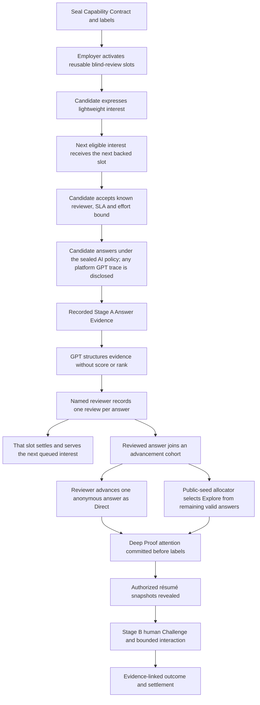

# CareerMutual Product Doctrine

## Blind answer first, attention before labor

**Version:** 1.8
**Date:** 2026-07-21
**Status:** Normative product principles; product, engineering, AI, Demo, and Agent rules must not conflict with this document.

---

## 1. One-sentence principle

> **The Employer must first stake a named review obligation for an anonymous answer; the Candidate answers only after that obligation exists; the Employer may select who enters the next interaction only according to the actual evidence produced by the Candidate against the JD Critical Challenge.**

CareerMutual does not replace résumé screening with Claim screening, nor does it let GPT predict who is worth interviewing using another set of text. The product changes the order of judgment and who owns attention.

```text
Not: résumé / Profile / self-reported Claim → select a person → request an answer

Instead: seal labels → lock the blind-answer review obligation → Candidate answers
        → Employer forms an Evidence-linked Review for each answer
        → decide the next interaction only from the anonymous answer
```

---

## 2. The old sequence we reject

The following flow violates the product doctrine:

```text
Candidate submits résumé or capability Claim
→ GPT generates a MatchEdge between Candidate and role
→ Employer clicks Choose as Direct on the Candidate card
→ Attention is reserved
→ Candidate then answers the actual question
```

Reasons:

- The Employer still chooses who deserves contact before the Candidate produces job evidence;
- Self-reported Claims, source packaging, and GPT rationale become new résumé proxy signals;
- Communication ability and material-preparation ability can still capture human attention;
- Attention is locked only after selection, so the Candidate’s actual answer is not the reason for receiving the opportunity;
- `Explore` can alleviate only part of the bias and cannot repair Direct’s Profile-first causal order.

Therefore, any product behavior named `Choose as Direct` that occurs before the actual answer must be removed.

---

## 3. Fixed information and control sequence



This sequence must not be bypassed through the UI, Replay, manual operation, or GPT recommendations.

### 3.1 Critical Challenge is a whole, not a plain-text question

Starting with v1.4, “JD key question” in older documents is uniformly called the versioned `Critical Challenge` on the primary application path. It is an ordered task list in the public Job Contract, sealed simultaneously, and may contain the following Parts:

```text
TEXT + AUDIO + IMAGE + FILE
```

Parts are the source, instructions, or delivery constraints of the same Challenge; they are not multi-round interview questions that may be split and scored separately. Before registering Interest or spending Credit, the Candidate must be able to see the complete list, media types, task objectives, and permitted assumptions. After publication, Part order, content hashes, and resource references must not change silently. The Employer reviews each Candidate’s anonymous Submission for the entire Challenge and must not preselect Candidates based on a Part that better matches résumé preferences.

In the MVP, cross-domain synthetic roles may express real work inputs through accounting spreadsheets, sales Pipelines, synthetic audio excerpts, or visual direction boards. A clearly disclosed Seed may use locally synthesized material. A Recruiter-authored JobPost may instead use a private `IMAGE`, `AUDIO`, or `FILE` upload only after owner, MIME, size, SHA-256, content-signature, and accessibility validation. The verified object is bound to one Draft and becomes immutable when Publish seals the complete Manifest. Third-party remote URLs, real personal information, and unverified or cross-owner objects must not be disguised as sealed facts. `VIDEO` is visibly marked as planned but remains outside the MVP schema and upload surface.

---

## 4. Five indestructible invariants

```text
No held blind-review obligation → No candidate answer
No recorded answer evidence → No candidate selection
No completed cohort reviews → No Direct / Explore allocation
No work evidence → No pedigree reveal
No settled human obligation → That review Slot cannot serve the next candidate
```

The server must guarantee:

1. Before the Candidate begins a formal answer, a named Reviewer, Answer Review Slot, SLA, and `CreditHold=HELD` must exist;
2. Before an answer is produced, the Employer must not receive the Candidate’s Claim, résumé, school, former Employer, Referral, GPT matching rationale, or candidate ranking;
3. An Answer Review Slot is reusable concurrent capacity, not the total application quota for a role; the Employer cannot choose who receives the pre-answer opportunity;
4. The Candidate first passes Candidate-only background access and deterministic hard conditions: background access may come only from `OPEN_TO_ALL` or a positive Evidence-to-tag connection generated by GPT and validated by the server; legal, language, time-zone, and other typed predicates are still judged by deterministic code. After entering the public queue, only qualification-pass time, Interest time, and public tie-break rules may be used; Profile, Claim, GPT score, and material packaging must not be used;
5. Every formal Application that the system permits to be submitted must produce an independent Human Review Receipt or enter a visible Employer Breach;
6. The Direct candidate pool may contain only submitted Answers that received `ADVANCE_ELIGIBLE` while in blind-résumé status; the Allocation Command references only Answer Evidence and accepts neither Resume score nor AI Candidate rank. It no longer claims that the Reviewer has not seen the authorized résumé during this subsequent stage;
7. Explore may be generated only from remaining valid anonymous answers in the same Advancement Cohort through the public Seed;
8. Direct or Explore cannot be selected or run while required Review Receipts for the current Cohort are incomplete. However, a settled Answer Review Slot must immediately be able to serve the next person in the queue and must not wait for the full Cohort barrier;
9. Opening a page, time spent, scrolling to the bottom, an AI summary, or a batch Reject does not count as completing a review;
10. Each review must be submitted by a named Reviewer, cite the current Answer’s Evidence, and produce an immutable Receipt;
11. Employer timeout must form a Breach, Credit consequence, and WIP consequence; the obligation must not be released silently;
12. Platform failure, Candidate Decline, or Candidate Withdrawal must not be disguised as capability failure or Employer Breach;
13. `ADVANCE_ELIGIBLE` is the Employer’s “advance this answer” judgment on the current anonymous Answer while the résumé is unseen; that Human Review Receipt and the Reveal Authorization for the designated Resume Snapshot must be submitted in the same transaction;
14. When accepting a Backed Offer, the Candidate must see and record versioned conditional consent: “If the anonymous answer is advanced by the Employer, the current fixed Resume Snapshot will be revealed to the named Reviewer”; a Candidate who is not advanced, withdraws, or exits remains sealed;
15. The complete résumé may enter only a reviewer-scoped, independently paginated Recruiter Candidate Workspace; the sequential Answer Review page, AI Analyst, Queue, and matching inputs must continue not to see the résumé, ensuring that the normal answer judgment is completed first.

---

## 5. The status of Claim in the MVP

Candidate Claim may be used to:

- Let the Candidate choose roles they want to apply for;
- Generate or preview the Candidate-side answer-preparation scope;
- Form an immutable self-report record for later auditing;
- Explain why the Candidate chose a particular approach after Evidence has been produced.

Candidate Claim may not be used to:

- Let the Employer select a Candidate before an answer;
- Let GPT decide who is `proofable` before an answer;
- Produce Direct / Explore candidate rankings;
- Replace Stage A Answer Evidence;
- Be described as an already verified capability fact.

The MVP does not need to complete GitHub ownership, former Employer verification, or complete Source Attestation. A lightweight Claim Snapshot proves only that “the Candidate submitted this self-report in a certain version”; it does not prove that the self-report is true.

### 5.1 Candidate Evidence Passport and job discovery

A Candidate may voluntarily maintain a Candidate-only `Evidence Passport`, recording synthetic GitHub Repository, Certification, Work Sample, Online Work Proof, and redacted Employment Verification as hashed source entries and publishing an immutable Snapshot. `SYNTHETIC_SOURCE_ATTACHED` means only that a synthetic source has been attached; it does not mean that the platform has verified capability, ownership, employment, or material authenticity.

The Passport must record the Candidate’s highest-education status and must also allow an explicit selection of `NO_FORMAL_DEGREE`; absence of a formal degree must not be interpreted as a negative capability conclusion. Candidate-side discovery uses a deterministic, non-scoring evidence order: using Snapshot publication time as the basis, when the graduation date is within two inclusive years, education evidence precedes work experience/certifications; after two years, work experience/certifications precede education. School names do not enter GPT discovery input, and complete education information is revealed only with the complete résumé after an answer is advanced.

GPT may establish limited discovery signals on the Candidate side between these sources and public Job Contract capabilities:

```text
Passport source refs + public Job capabilities
→ bounded discovery connections + still_unknown
→ Candidate decides whether to register Interest
```

This mechanism is not Employer Matching before an answer; it is Candidate-side JobPost access control. The Recruiter seals a role as `OPEN_TO_ALL` or `EVIDENCE_MATCH_REQUIRED`: the former is always visible; the latter enters the Candidate’s Feed, detail view, and Interest API only when `deriveCandidateEligibilityMatches` returns at least one server-validated positive `Evidence ref ↔ accepted tag` connection. A Candidate without a Passport can see only `OPEN_TO_ALL`; AI failure displays `MATCHING | PARTIAL | FAILED | STALE` and must not be written as “unqualified.” Existing Interest/Application records retain their original access basis and are not retrospectively removed because of Passport updates.

This access edge uses OR semantics only: any lawful positive connection among education, work experience, certification, or work sample may unlock access; it does not output score, rank, fit, or Queue order. Legal, language, time-zone, and other hard conditions are still judged by deterministic code at Interest time. Legacy `deriveCandidateJobSignals` data remains for compatibility but no longer controls Feed visibility. These results must not change the Interest Queue, Answer Invitation, Attention Slot, Employer review order, or Direct / Explore. Sarah cannot see the Passport, Snapshot, Signal, or GPT rationale before an anonymous answer is advanced; afterward, she reads only the authorized complete Resume Snapshot, not the Candidate-only discovery rationale.

---

## 6. Interest, Application, and two levels of attention commitment

CareerMutual must honestly distinguish two actions:

> **Interest is not an Application. A formal Application exists only after entering a backed Slot and submitting an Answer.**

- **Interest:** A low-cost registration by a Candidate for a public Opportunity. It produces a verifiable receipt and enters a non-Profile queue; it requires no answer labor and does not claim that an individual human judgment has already been provided.
- **Application:** A job answer submitted by a Candidate after a named Reviewer, SLA, available Slot, and `CreditHold=HELD` exist. Every Application must be reviewed individually.

Candidate Application Credit is a frequency and concurrency constraint, not a Bid, Boost, or ranking signal. Registering Interest is free; one Credit is spent only when the Candidate has received a Backed Offer, confirmed the versioned terms, and atomically started the Answer Session. Employer Review Breach or Platform Abort returns the Credit; voluntary abandonment or blank timeout after the Answer has started does not. The Employer cannot see the Credit balance or rank by Credit amount.

If no backed Slot is currently available, the interface must not continue accepting an Answer and call it an Application; it may display only `WAITING_FOR_BACKED_SLOT`. The Candidate should see the queue-policy version, their queue status, and whether the Opportunity is currently continuing fulfillment, paused, or closed.

The product distinguishes two forms of limited attention:

| Level               | Employer obligation                                                                                                      | What the Candidate receives                                         |
| ------------------- | ------------------------------------------------------------------------------------------------------------------------ | ------------------------------------------------------------------- |
| Blind Answer Review | Maintain several reusable Slots and individually review each short answer submitted into an occupied Slot within the SLA | A job Application that is certain to be handled by a named Reviewer |
| Deep Proof Window   | Conduct a Stage B Challenge and final Outcome for a selected anonymous answer                                            | A deeper Candidate-specific interaction                             |

The first commitment must exist before the Candidate answers. The second selection may rely only on the anonymous answer evidence produced by the first.

The complete Interest Queue may be larger than the current number of concurrent Slots. A Candidate without a Slot has status `WAITING_FOR_BACKED_SLOT`, not `ABSTAIN`, `UNQUALIFIED`, delivered-but-unread, or weak capability. After a Slot’s review is completed and settled, that Slot serves the next person according to the public queue rules; it must not remain idle because the current Advancement Cohort is incomplete.

The Employer may close an Opportunity, but must first see the number of Interests still waiting, submit an explicit closure action, and have the system send a Closure Receipt to those waiting. An Interest that had not received a Slot before closure does not become an Application, Reject, or capability conclusion.

---

## 7. What “review individually” means

The system does not claim it can prove a Reviewer’s mental state. It enforces observable, attributable actions.

Each `HumanAnswerReview` contains at least:

```json
{
  "answer_ref": "answer-opaque-04",
  "reviewer_ref": "reviewer-sarah-chen",
  "decision": "ADVANCE_ELIGIBLE",
  "evidence_refs": ["event-E17", "verification-V03"],
  "still_unknown": ["Cross-region recovery remains untested"],
  "reviewed_at": "database-time",
  "expected_version": 3
}
```

Permitted review outcomes are limited and are not overall capability conclusions, for example:

```text
ADVANCE_ELIGIBLE
NO_FURTHER_PROOF
INCONCLUSIVE
```

They describe whether this answer is worth continuing to verify; they are not equivalent to Hire, Reject, a total talent score, or a prediction of long-term work performance.

---

## 8. The correct meanings of Direct and Explore

- **Direct:** After all required Answer Reviews are complete, the Reviewer actively selects one Answer that has passed while in blind-résumé status for continued verification;
- **Explore:** A deterministic procedure selects one from the remaining valid anonymous answers in the same Advancement Cohort using the public Seed;
- Both occur after the answer;
- The procedures for Direct / Explore do not read résumés, Resume score, or AI Candidate rank. During the subsequent Direct stage, the Reviewer may already have seen the selected person’s authorized résumé through an independent page, so the product does not claim that later cognition remains completely anonymous;
- GPT does not select Direct or Explore;
- The UI CTA should say `Advance this anonymous answer`, not `Choose as Direct` before the answer.
- `ADVANCE_ELIGIBLE` Human Review and Resume Reveal Authorization are submitted atomically; the résumé may be read only through the independently paginated Recruiter Candidate Workspace and cannot write back to or modify the submitted anonymous Review Receipt.
- Subsequent Direct / Explore and Deep Proof must still reference anonymous Answer Evidence. The existence of Reveal explicitly limits the product promise to “the first normal answer judgment is not influenced by the résumé,” rather than promising that all subsequent interactions remain permanently label-free.

Explore tests whether, even after the Reviewer has actively selected someone based on a work answer, another valid answer can expose something missed during deeper verification. It is not a patch for Profile-first Direct.

---

## 9. The correct position of GPT

GPT may:

1. Compile the JD, Ticket, Repo, and Employer answers into a Sealed Capability Contract and Critical Challenge;
2. After the Candidate answers, compress events, Artifacts, Diffs, and Verification into Answer Evidence;
3. Establish auditable Evidence Edges between Answer Evidence and Contract uncertainty;
4. Recommend equally weighted Challenge IDs from a versioned Catalog based on produced Stage A Evidence;
5. Compress final Evidence and explicitly identify `still_unknown`;
6. When the Sealed Contract explicitly specifies `PLATFORM_ASSISTANT_ALLOWED`, provide disclosed thinking assistance within the Candidate Answer Session. Inputs include only the sealed question, permitted assumptions, current draft, and existing conversation in this Session; the complete user/assistant/error trace is frozen with the Answer and shown to the Reviewer.
7. Generate a derived Transcript from the original Voice Memo; the original audio is always the source of truth, and transcription failure is a Platform status;
8. From a Candidate’s voluntarily published private Evidence Passport Snapshot, generate for that Candidate access hypotheses, source references, and `still_unknown` connected to Recruiter-sealed role tags. Only lawful positive connections may unlock evidence-gated roles; the result cannot enter the Employer path or Queue ranking.

GPT may not:

- Establish candidate-selection edges from Claims before the Candidate answers;
- Decide who receives an Answer Invitation;
- Output Candidate score, rank, Hire/Reject, Direct/Explore;
- Turn a self-report into a verified fact;
- Complete any Human Answer Review;
- Impersonate the Reviewer’s Attention;
- Submit the final Answer on behalf of the Candidate, call tools/network/files, or hide the conversation Trace.

Candidate-side GPT is not a mechanism for “proving that the Candidate completed the work independently.” It limits the meaning of this round’s evidence to “work completed by the Candidate under disclosed platform-tool conditions.” A JobPost that must assess personal capability without AI must seal a `PROHIBITED` Policy; a remote webpage still cannot prove that the Candidate has no second device nearby. The current feature Demo selects `PLATFORM_ASSISTANT_ALLOWED` and prohibits undisclosed external AI.

### 9.1 Answer Sandbox Focus Policy

The Candidate enters the server-timed full-screen Answer Sandbox only after a Backed Offer exists, terms have been accepted, and Credit has been atomically consumed. `sandbox-focus-policy@1` records browser-reported page visibility and window focus, but not URLs, names of other applications, mouse movement, keystrokes, camera data, emotion, or identity information. Window blur and page hidden are combined into the same Away interval; an interval no longer than two seconds does not count, the first valid departure triggers a warning, and the second or a cumulative fifteen seconds triggers `FOCUS_POLICY_AUTO`, sealing existing persistent content. The microphone-permission dialog has a one-time, maximum-thirty-second non-counting window.

Focus Policy constrains the submission boundary of the disclosed Answer Session. Its automatic-submission source may enter the Answer Behavior Profile with the Candidate’s prior consent, but a Focus event alone is not a Candidate quality or integrity fact:

- It does not output cheating probability, Integrity Score, Hire/Reject, or capability inference;
- Browser events can be tampered with and cannot detect a second device, so they are not proof of being “AI-free”;
- When the platform or network cannot record an event, the absence must not be attributed to the Candidate;
- After automatic submission, the Reviewer sees only the submission source and its versioned severity, not the complete Focus timeline;
- When an empty Session is terminated by policy, it produces no Answer or capability conclusion, the Employer Slot is released, and Credit already spent by a Candidate who began answering remains spent.

The target AI Operation should use `buildAnswerEvidenceEdge` after the answer instead of `buildMatchEdge` before the answer. The legacy Operation remains only as a current-implementation compatibility fact and is not part of the target product path.

### 9.2 Employer Evidence Analyst evaluates the Answer, not the résumé

CareerMutual’s core promise is that the first-round judgment does not read Candidate résumé labels, not that the Employer is forbidden to evaluate the anonymous Answer and disclosed answering process produced by the Candidate within a backed opportunity. In exchange for the résumé-blind opportunity, the Candidate agrees before spending Credit and beginning the answer to versioned terms that allow CareerMutual to collect limited server behavior records and show a deterministically derived Behavior Profile to the named Reviewer. The normative boundary is:

```text
Immutable Answer Submission
→ deterministic red / yellow / green Behavior Profile
→ source-linked Good / Bad Answer verdict, language analysis and criterion findings
→ independent Human Answer Review
```

- Before publishing a JobPost, the analysis Policy must be sealed as `OFF | ANSWER_ONLY | ANSWER_PLUS_PROCESS`, together with 1–8 Review Criteria; the default is `OFF`, and retrospective analysis of old Answers is prohibited.
- `Good Answer | Bad Answer` evaluates only the quality of the answer to this sealed Challenge. It is not a Candidate Score, role ranking, Hire/Reject, or cross-role personality conclusion. The Verdict must cite frozen original text and pass deterministic consistency validation.
- Language Analysis describes only this Answer’s `LOGICAL_STRUCTURE | CLARITY | INTERNAL_CONSISTENCY | RESPONSIVENESS`; every observation must cite the original text and use `GREEN | YELLOW | RED` severity. Language performance must not be written as a stable Candidate personality attribute.
- Each Criterion may receive only `SUPPORTED | CONTRADICTED | NOT_ADDRESSED | INSUFFICIENT_EVIDENCE`; it cannot produce Candidate ranking, Hire/Reject, or an automatic advancement recommendation.
- Only after `ANSWER_PLUS_PROCESS + employer-ai-review-disclosure@2` has been accepted by the Candidate may `AnswerProcessEvidence@2` classify, in the Submission transaction, initial content delay, revision gap, deletion/edit magnitude, submission pressure, disclosed platform assistance, and platform reliability using `onlyboth.answer-behavior-severity@1`. Rules, observations, severity, caveat, and ref are frozen together; historical `@1` is not retrospectively classified.
- Process Source cannot support or contradict a capability Criterion and cannot change the Good/Bad Answer Verdict. It is shown as a separate human-review signal; Sarah may cite its immutable signal ref and form her own limited judgment.
- Red, yellow, and green are review severities, not factual truth: no server-recorded edit does not mean the Candidate was inactive; permitted and disclosed platform GPT does not equal cheating; a platform failure cannot become a red Candidate signal; external AI use cannot be proved by these records.
- Keystrokes, clipboard, mouse movement, camera, and biometric data are not collected or analyzed; laziness, suspiciousness, integrity, personality, emotion, or cheating probability are not inferred. The Reviewer may use behavior signals for this capability/integrity check, but must distinguish “server record” from “human interpretation” and must not treat severity as an automatic integrity conclusion.
- The AI Panel cannot prefill or submit Human Review. Sarah must still cite original Evidence and personally write the comment and `still_unknown`. An AI Output ref is not an Evidence ref.
- `DISABLED | ANALYZING | NEEDS_HUMAN | FAILED | SUPERSEDED` must not block Human Review, release a fulfilled Slot, or serve the next Interest.

Therefore, the Employer Evidence Analyst’s value is to turn the anonymous Answer and disclosed behavior into faster, traceable inputs for human judgment, not to replace résumé-label screening with a Candidate ranking model.

---

## 10. Normative result of the MVP Demo

The target Demo should express:

```text
20 eligible interests
→ Sarah activates 8 reusable blind-answer review Slots
→ the first 8 eligible Interests receive backed offers by the public queue rule
→ Candidates submit recorded answers to the same sealed JD uncertainty
→ each completed Review settles one Slot and unlocks the next queued Interest
→ reviewed answers accumulate in an 8-answer Advancement Cohort
→ Sarah advances one reviewed answer as Direct
→ public seed selects Explore from another reviewed answer
→ both enter the existing Stage B Challenge path while Slots continue serving the queue
```

The Demo may preload external GPT, Sandbox, and Verifier outputs, but the following actions must execute for real:

- Sarah’s rolling Review Commitment;
- At least one `AnswerReviewSettled → next queued Interest offered`;
- Candidate Answer state changes;
- Every `HumanAnswerReviewed` Command;
- Post-answer Direct selection;
- Public Seed Explore allocation;
- Credit, Slot, Breach, and Settlement;
- Sarah’s Challenge authorization and the Candidate’s Stage B state changes.

Golden Replay can prove only the engineering causal chain; it cannot prove real GPT matching quality or real hiring effectiveness.

---

## 11. Honest status of the current implementation

As of 2026-07-21, the primary `/candidate` and `/employer` entry points execute the real persistent chain described in the first half of this document: one-year actor-bound synthetic Sessions, PostgreSQL JobPost/Interest/Slot/Credit, Backed Offer, server-timed Answer Session, private Object Storage rich text and Voice Memo, disclosed GPT/transcription on the Worker side, versioned Focus Policy, full-screen answering modal, immutable Submission, strict sequential Human Review, per-Slot release, and Review SLA Breach handling that returns Candidate Credit, penalizes Employer Credit, and retires the Slot. `/prototype` is no longer a primary entry point or acceptance fact.

The Demo now provides seven synthetic Candidates with different résumés; `Start as` issues an independent Session for each actor only when `DEMO_MODE=true`. The seven people each hold Credit, a real PostgreSQL `Evidence Passport`, an immutable Snapshot, a Candidate-only discovery/Eligibility Projection, and a Resume Snapshot. The Demo’s Backend Eligibility Match includes one explicitly disclosed `RECORDED_LIVE` output; runtime Publish/Refresh uses Worker LIVE only and does not fall back to recorded output on failure. Employer, Queue, and Attention do not read the Passport or rationale; Eligibility consumes only the dedicated, server-validated, version-fixed Candidate-only Match projection.

The synthetic runtime data also includes one primary engineering role, twenty roles spanning accounting, BD, creative, sales, marketing, product, operations, People, Legal, Healthcare, and Sustainability, and six technical Match Lab roles for comparing the Eligibility Feeds of six engineering-oriented Candidates. Each role publishes an independent Critical Challenge; the complete Corpus covers TEXT, AUDIO, IMAGE, and FILE Parts. This validates that the mechanism can be reused across disciplines; it does not mean the platform has validated the real hiring effectiveness of these roles.

The post-answer `ADVANCE_ELIGIBLE Human Review → pinned Resume Reveal → recruiter pagination` is connected to a real PostgreSQL transaction and new browser page; `Advancement Cohort Allocation → Deep Proof → Challenge` is not yet connected to this new browser chain. Legacy Claim-first Matching, Golden Challenge Replay, and `/demo` remain only as historical/regression assets and must not become the primary application path again. The current feature chain proves that “an accepted anonymous answer receives individual handling, and only a Candidate who passes the answer unlocks the fixed résumé”; it does not mean final hiring has been completed.

---

## 12. Architecture acceptance questions

Before any new design, PR, or Demo is merged, it must answer:

1. Before the Candidate answers, which specific database record proves that a named Reviewer has undertaken the review obligation?
2. Can the Employer see any Candidate Claim, résumé, or GPT rationale before the answer? The answer must be no.
3. How does the next available Slot serve the public Interest Queue without using Candidate Profile or model ranking?
4. Through which Command and Receipt is each committed answer human-reviewed?
5. Is there a path that allows Direct to be selected while the Advancement Cohort is not fully reviewed? The answer must be no.
6. Does the Direct Command reference only passed Answer Evidence and exclude Resume score / AI rank?
7. Is Explore generated only from remaining valid answers in the same Advancement Cohort using the public Seed?
8. After a Review settles normally, does that Slot immediately serve the next person without waiting for the entire Cohort? The answer must be yes.
9. What does Reviewer timeout freeze, penalize, and block?
10. Is Platform failure clearly separated from participant responsibility?
11. Do Golden, LIVE, and UI execute the same business Commands rather than treating prerecorded results as final state?
12. Does the Candidate see the complete, ordered, sealed Critical Challenge Part list before Interest/Credit?

If any of these questions cannot be answered, the architecture does not yet embody CareerMutual’s product doctrine.
