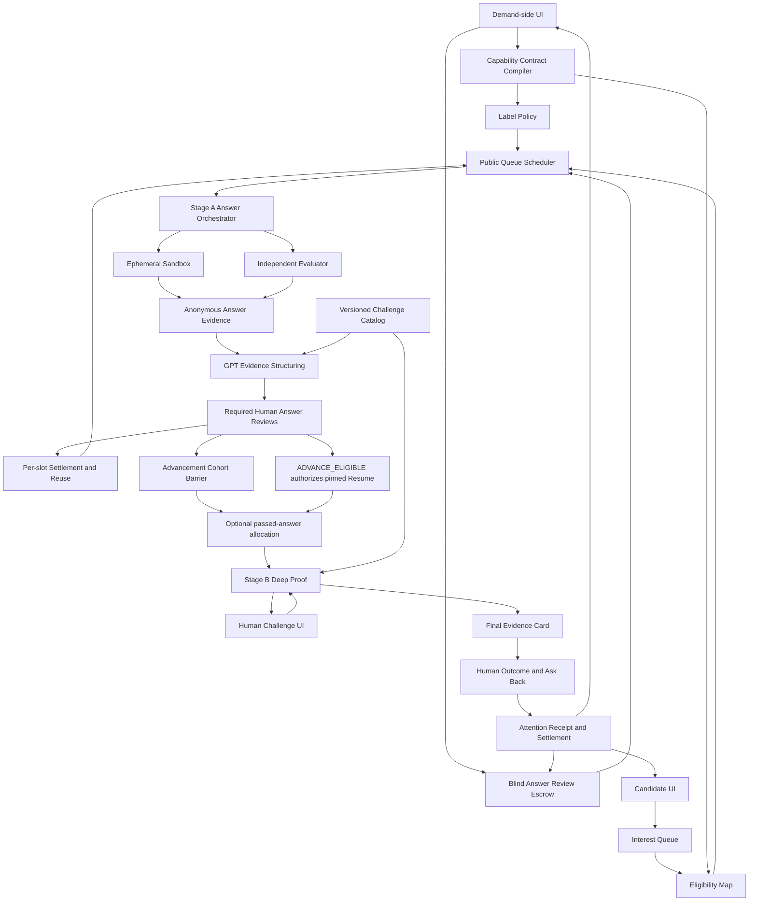

# CareerMutual

## Label-blind, attention-backed work proofs

> **Hide the labels. Stake the attention. Test the work.**
> Delay the résumé labels most likely to trigger intuitive judgment; first lock in the demanding party’s real human attention; then let actual work evidence determine the next interaction.

**Current positioning:** A Label-blind Proof and Attention Escrow mechanism for hiring scenarios.
**First runnable primary path:** Senior Backend Engineer; additionally, validate the mechanism’s generality with twenty cross-domain synthetic roles, and compare the Candidate-only Eligibility Feed for six engineering-oriented Candidates across six technical Match Lab roles.
**Recommended track:** OpenAI Build Week — Work & Productivity.
**Root problem:** Resume-first screening simultaneously creates False Positives and False Negatives.
**Core mechanisms:** Label Veil, Blind Answer Review Escrow, Answer-first Selection, WIP-limited Proof Windows, Causal Human Checkpoint, Evidence / Attention Receipt.
**Document status:** Authoritative product plan v0.9, 2026-07-21.
**Normative product doctrine:** [`CareerMutual-Product-Doctrine.md`](CareerMutual-Product-Doctrine.md). If an earlier section of this document or the current implementation conflicts with this principle, this principle prevails.

---

## 0. Override Statement

This version wholly replaces:

- The former dating, social, and Shared Table directions;
- The Proof central path of “use GPT uniformly for all Candidates, then observe who challenges the AI”;
- The positioning that treats an AI Interviewer, dynamic follow-up questions, an interview Copilot, or a Sandbox itself as the product innovation;
- Designs that prove recruiter attention solely through page opens, time spent, or clicking “read”;
- The practice of describing the result of a single short task as the Candidate’s overall quality or final work performance.
- The matching sequence that selects Direct based on the Candidate Profile, self-reported Claim, source packaging, or GPT rationale before answering key JD questions.

From this version onward, CareerMutual solves only one clearly defined problem:

> Hiring processes use fast proxy signals such as school, former-employer brand, title, photo, and materials packaging to decide too early who deserves costly human contact. This lets people who look strong but cannot pass job validation occupy interviews, while people with nonstandard backgrounds who can do the work are eliminated before they can prove it.

CareerMutual’s five inviolable invariants:

```text
No held blind-review obligation → No candidate answer
No recorded answer evidence → No candidate selection
No completed cohort reviews → No Direct / Explore allocation
No work evidence → No pedigree reveal
No settled human obligation → That review Slot cannot serve the next candidate
```

### 0.1 Current Runnable Vertical Path

The primary `/candidate` and `/employer` entry points now use PostgreSQL and private Object Storage to execute:

```text
temporary signed role session
→ PostgreSQL JobPost feed and reusable held Attention Slots
→ free Interest / backed Offer
→ versioned declarations + Candidate Credit 3→2
→ full-screen six-minute rich text / Voice Memo / disclosed platform GPT Sandbox
→ disclosed browser-focus warning / deterministic auto-submit boundary
→ immutable Answer Submission and Artifact manifest
→ one anonymous Employer Answer at a time
→ mandatory evidence-linked Human Review
→ Hold settlement + per-Slot release + next Queue offer
```

Candidate Credit is a non-transferable application-frequency limit, not a Bid, Boost, or ranking. Without a Backed Offer, only `Interest` is registered and no Credit is consumed; Credit is consumed only when the terms are confirmed and the Answer Session starts atomically. An Employer Review Breach or Platform Abort refunds it; voluntary abandonment after the Candidate starts, or a blank timeout, does not.

The Employer cannot prefetch the next Answer; before the current `HumanAnswerReview` transaction succeeds, both the API and DOM return only the earliest unreviewed Submission. When the Review SLA times out, the Worker settles a Breach using database time: Candidate Credit is refunded, the Employer Hold is forfeited, a reliability penalty is recorded, and the Slot is retired; no Candidate Failure is generated.

`/prototype` and `/demo` remain visual/historical references, but are no longer primary product entry points or substitutes for feature acceptance. The pinned Resume Reveal after an answer passes and the independent pagination of `/employer/candidates` are connected to the real path; Advancement and Deep Proof are still pending integration.

The top-level App Shell switches Breadcrumbs and navigation with the signed Session: Candidates see only Opportunity / Evidence Passport, while Recruiters see only JobPosts / Revealed Candidates / Audit. The full résumé page displays only one passed Candidate at a time and places the corresponding Human Review Receipt before the résumé; it is not a subpanel of the anonymous sequential review page.

All seven synthetic Candidates can maintain their respective Candidate-only Evidence Ledger at `/candidate/evidence-passport`, publish immutable Snapshots, and view GPT-generated evidence-linked Eligibility guidance in the job Feed. The job Feed presents only valid positive Evidence matches, `OPEN_TO_ALL`, and existing Active Journeys; it no longer offers `Explore all jobs` to bypass access control. Candidates without a Passport can see only `OPEN_TO_ALL`; AI failures remain Pending/Failed rather than making the Candidate ineligible. These signals do not enter Employer Projection, Interest Queue ordering, Attention, or anonymous review order. The Demo preloads one explicitly marked synthetic Snapshot; edits use only the LIVE Worker, and failure does not switch to a Fixture. `Start as` in `/login` is only a Demo operator identity issuer and does not enter Employer Projection; each Candidate is bound to different Credit, Passport, discovery signals, and Resume Snapshot. The Passport’s highest level of education is required and can explicitly be set to `NO_FORMAL_DEGREE`; for discovery inputs within two years of graduation, education evidence is placed before work/certifications, while after two years, work/certifications are placed before education. This order is not a score, and school names do not enter AI input.

### 0.2 The Key Question Unified as Critical Challenge

The primary application path no longer models the job input as an isolated string. `Critical Challenge` is an ordered Manifest sealed together with the JobPost and supports `TEXT | AUDIO | IMAGE | FILE` Parts; all Parts together constitute the context and constraints for one finite response. Before registering Interest and spending Credit, the Candidate can view the complete Manifest; after submission, the Employer reviews the same version. MVP media resources may be disclosed local synthetic fixtures or private Employer uploads. Employer uploads must pass the exact type/size policy, object metadata, checksum, and content-signature validation before they can enter a Draft, and Publish seals their immutable references into the Contract transaction. `VIDEO` is explicitly a future capability and is rejected by the current Contract and upload endpoints.

The initial synthetic catalog includes one payment reliability engineering role, twenty cross-domain roles, and six technical Match Lab roles, covering accounting, FP&A, BD, Enterprise Partnerships, Brand Illustration, Product Design, Sales Leadership, Enterprise Sales, Growth, Customer Success, Supply Chain, People, Legal/Privacy, Healthcare, Construction, Sourcing, Content, Game Art, and Sustainability. This catalog demonstrates that the Attention-backed blind-answer mechanism does not depend on coding questions; it does not allow GPT or the Employer to rank Candidates before they answer.

### 0.3 Optional Employer AI Evidence Analyst

Before publishing a JobPost, the demanding party may choose `OFF | ANSWER_ONLY | ANSWER_PLUS_PROCESS` and confirm 1–8 finite Review Criteria. Before accepting a Backed Offer, the Candidate sees the selected Policy, disclosure version, data scope, behavioral classification rules, and their uses, and consent is recorded with the Application terms. CareerMutual’s blind-review commitment is not to let labels such as résumé, school, or former employer interfere with first-round judgment; it does not promise that an anonymous Answer or an answer process collected with consent will not be evaluated by the demanding party.

After the Answer is submitted, the Worker asynchronously generates a source-linked Summary, `Good Answer | Bad Answer`, four language-performance dimensions, four-state evidence conclusions for each Criterion, original-text highlights, `still_unknown`, and Reviewer Questions. Good/Bad evaluates only the currently sealed Challenge, not the Candidate’s overall score. Language analysis always covers logical structure, clarity, internal consistency, and responsiveness; each item must cite frozen original text and display green, yellow, or red severity.

`ANSWER_PLUS_PROCESS` additionally displays `AnswerProcessEvidence@2`: according to versioned rules, the Submission transaction classifies the delay before initial content, the longest interval during which “no modification was recorded by the server,” the extent of deletion and revision, submission pressure, disclosed platform GPT/Voice use, and platform failures as red/yellow/green. Observed values, rules, and caveats are displayed together; intermediate draft text, keystrokes, clipboard, camera, and biometric features do not enter the Profile.

This is not automated hiring decision-making: there is no Candidate-wide Score, ranking, Advance/Close recommendation, or cheating/personality inference. Process Evidence cannot change the Criterion Finding or Good/Bad Verdict; red/yellow/green is not ground truth about integrity, and it cannot prove external AI use. Platform failures must not be attributed to the Candidate. When AI is off, analyzing, failed, or `needs_human`, Sarah can still complete the same mandatory Human Review; AI cannot prefill a decision/comment, release a Slot, or read the next Answer. If a human finishes first, late analysis enters `SUPERSEDED`.

The product does not guarantee that recruiters possess any particular unobservable mental state. The product guarantees:

> A named, authenticated account of the demanding party, within the agreed period, first authorizes a Challenge for the Candidate’s Stage A evidence that will change subsequent Proof, and then reaches a citable Outcome on the final evidence; otherwise the Window cannot settle normally, and the demanding party cannot continue obtaining the next Proof Candidate.

---

## 1. Executive Summary

### 1.1 Root Problem: Profile Prediction and Work Evidence Are Misaligned

The traditional hiring funnel is usually:

```text
Photo / name / school / former-employer brand / title / LinkedIn packaging
                         ↓
                Decide who receives an interview
                         ↓
       Verify actual work ability for the first time only at the costly human stage
```

This simultaneously causes:

- **False Positive risk:** A high Prestige Signal is mistaken for high job capability, consuming the recruiter’s full interview time;
- **False Negative risk:** A low Prestige Signal is mistaken for low job capability, and the Candidate does not even get an opportunity to produce behavioral evidence.

AI has further lowered the packaging cost of résumés, Cover Letters, project descriptions, and standard interview answers. The question is no longer “who can write a good application,” but:

> Who can handle, under controlled conditions, the genuinely costly, ambiguous, changing problem of this role?

### 1.2 CareerMutual’s Three-Step Reversal

```text
1. Seal the question and labels
   First fix the key uncertainties in the JD; delay school, employer brand, name, photo, Warm Intro, and materials packaging

2. Reserve the attention
   Before the Candidate starts answering, the recruiter locks in the Reviewer, deadline, capacity, and fulfillment consequences for reviewing blind answers one by one

3. Test the work
   The Candidate answers a real job question in Closed Proof; after reviewing answers one by one, the demanding party may select the next interaction only on the basis of anonymous answer evidence
```

CareerMutual does not permanently delete résumés or hide qualifications directly relevant to the role. It changes only the order of information:

```text
Hard qualifications
→ public non-profile queue for reusable held review capacity
→ next eligible Interest receives the next backed Answer Invitation
→ Label-blind recorded answer evidence
→ required Human Answer Reviews
→ ADVANCE_ELIGIBLE + pinned résumé reveal in a separate Recruiter page
→ optional passed-answer Direct + deterministic Explore + held Deep Proof attention
→ Human checkpoint + evidence-linked outcome
├─ Advance + Candidate Continue → Full interview
└─ Close / clarify → Explicit outcome
```

### 1.3 GPT’s Position

GPT is primarily situated on the demanding-party and institutional layers; when the Job Contract explicitly selects `PLATFORM_ASSISTANT_ALLOWED`, it may also serve as a fully disclosed restricted tool on the Candidate side:

1. Compile the role, real Ticket, Repo, and most costly failure into a Capability Contract;
2. After the Candidate answers, structure the actual Answer, Artifact, events, and job uncertainties into auditable Evidence Edges;
3. Based on the Candidate’s already-produced Artifacts, recommend three executable Challenge IDs from the prevalidated Catalog to the recruiter;
4. Compress events, code differences, and tests into traceable Evidence Cards;
5. Help the recruiter complete dense, individually attributable Reviews within tens of seconds.
6. Within the Candidate Answer Session, read only the sealed question, permitted assumptions, current draft, and this conversation, and provide structure, counterexamples, or test suggestions; the complete Trace is frozen with the Answer, and GPT has no authority to submit finally.
7. Transcribe the original Voice Memo into a derived Transcript; the original audio remains the source of truth.
8. After the Candidate actively publishes a private Evidence Passport, establish a Candidate-only discovery connection between de-identified source refs and public Job capabilities, and explicitly identify `still_unknown`; it does not decide Interest for the Candidate.

GPT must not use Candidate Claim, Profile, or source packaging before the Candidate answers to decide who deserves attention. An Answer Invitation is the public queue-scheduling result for recyclable Slots, not a judgment of Candidate quality; WIP, Credit, and Explore are all controlled by deterministic procedures; Direct may be selected only by a human after the required anonymous answer reviews in the Advancement Cohort are complete.

Undisclosed external models remain prohibited. CareerMutual does not claim that a webpage can prove there is no second device in the room. The platform guarantees only that the browser has no API Key, the Candidate can use an allowed model only through a versioned Sidecar Command, the complete conversation/failure is disclosed to the Reviewer, and the model has no tools, web, files, or submission permissions. Roles requiring individual attribution without AI should seal the `PROHIBITED` Policy; the current feature Demo evaluates the Candidate’s work under disclosed platform-tool conditions.

### 1.4 Product Optimization Objective

CareerMutual does not optimize résumé click-through rates or AI interview throughput. It optimizes:

> **Expose errors between Resume Signal and job evidence as early as possible under limited, guaranteed human attention.**

More specifically:

- Expose False Positive risk before the full interview;
- Give some people whom traditional Profile screening would miss an Evidence-first opportunity;
- Ensure that every formal Application accepted by the system exists together with a verifiable obligation of the demanding party;
- Use Backpressure to prevent recruiters from issuing unlimited unreviewed tasks.
- Use recyclable Slots to increase the number of Candidates actually reviewed, rather than mistaking concurrent capacity for the total application limit of a role.

---

## 2. Product Problem

### 2.1 False Positive: Résumé Labels Occupy Costly Interviews

When information is insufficient, recruiters reasonably use school, company brand, job title, and fluency of expression as shortcuts. But these signals can be packaged, and they may have nothing to do with the capability most important to the current role.

The true cost of a False Positive is not “choosing the wrong résumé,” but:

- The Hiring Manager invests 30–60 minutes before discovering that core judgment ability is missing;
- Interview slots are consumed by incorrect priorities within the limited Candidate pool;
- People who are a better fit are excluded before behavioral validation;
- The hiring team continues reinforcing the feedback loop of “strong labels = strong ability.”

### 2.2 False Negative: Ability Is Blocked by Labels Before It Produces Evidence

Nonstandard Candidates may receive no opportunity to engage with a real job problem because of:

- A non-elite school or no traditional degree;
- Small-company, freelance, or cross-industry experience;
- A career interruption;
- Weakness at LinkedIn and résumé marketing;
- Lack of a Warm Intro;

CareerMutual does not promise that these people are necessarily better. It simply reserves controlled Explore capacity for a small portion of hard-condition-qualified people, giving them an opportunity to compare evidence with Profile prediction.

### 2.3 The Most Intuitive Labels Appear Too Early

Once a recruiter first sees:

```text
Top-5 CS
Ex-BigTech
Staff Engineer
Warm referral
```

subsequent evidence is easily interpreted through the existing judgment. CareerMutual therefore divides first-round inputs into three categories:

1. Hard qualifications that must appear in advance;
2. Intuitive labels delayed until after Proof;
3. Protected attributes that should never be inferred or used for ranking.

### 2.4 AI Makes “Correct Answer” Lose Single-Source Attribution

The product adopts a strong threat assumption:

> External frontier models can generate high-quality answers to nearly all preset interview questions.

Therefore:

- Dynamic follow-up questions cannot prove that a Candidate completed the work independently;
- Hidden Tests can validate an Artifact, but not its author;
- Behavioral traces may also be guided by an off-platform model;
- Disclosed platform GPT validates a working system consisting of the Candidate and a fixed tool, not individual ability without tools.

Therefore, the Candidate AI Policy must be sealed with the role: `PROHIBITED` is used for individual-ability attribution without AI; `PLATFORM_ASSISTANT_ALLOWED` is used to evaluate transparent human–AI working methods. Neither mode can rule out a remote second device; roles that cannot accept residual remote risk are unsuitable for pure online CareerMutual Proof.

### 2.5 Candidate Labor and Human Attention Have No Exchange Relationship

Traditional Take-home, Case Study, and long Proposal tasks often allow:

```text
Candidate invests first
→ demanding party may not read it later
→ no capacity, deadline, compensation, or consequence
```

CareerMutual reverses the order:

```text
Demanding party first locks in Reviewer + Capacity + Deadline
→ Candidate Proof can begin
→ the Window can release the next person normally only after the mid-process Checkpoint and final Outcome are complete
```

### 2.6 What the Demanding Party Actually Lacks Is Dense Judgment, Not More Profiles

Recruiters do not lack Candidates. They lack:

- The ability to turn job risk into short, effective validation;
- A first-round signal not contaminated in advance by background labels;
- Behavioral evidence that can be reviewed within tens of seconds;
- A work-in-progress task load that will not expand without limit;
- Candidate comparisons with clear causal grounds for the next step.

---

## 3. Product Commitments and Honest Boundaries

### 3.1 What We Commit To

- Bind a named Reviewer, SLA, WIP Token, and Review Credit before formal Proof begins;
- Bind a clear Blind Answer Review Obligation before the Candidate answers;
- Delay low-quality intuitive labels before Proof while retaining necessary qualifications and material risks;
- The complete Interest Queue may be large, but before the answer the Employer cannot search Candidate Profile or Claim;
- Candidates cannot purchase, bid for, or Boost an Attention Slot;
- An Answer Review Slot is recyclable concurrent capacity, not the total application quota for a role; every settled Slot must serve the next person according to public, non-Profile queue rules;
- Answer Invitation uses deterministic, non-Profile queue scheduling; Direct is generated only from answers that have individually passed the blind-résumé stage, while Explore is publicly allocated from the remaining valid answers in the same Advancement Cohort; the Allocation DTO does not accept a Resume score or AI Candidate rank;
- Every formal Application accepted and submitted by the system generates a named Review Receipt or enters a visible Employer Breach;
- Every completed Proof must generate a mid-process Human Checkpoint and a final Evidence-linked Outcome;
- If the previous Review has not been fulfilled, the next formal Candidate for that Review Slot cannot unlock; other settled Slots are not blocked by a job-wide barrier;
- Evidence states only traceable behavior, tool results, corrections, and unknowns;
- Humans retain advancement, closure, and final hiring decisions.

### 3.2 What We Do Not Commit To

- We do not misrepresent Interest as an Application: Interest receives only registration and a queue receipt; once a Candidate submits an answer in a guaranteed Slot, the system guarantees a named, accountable Review Receipt or Employer Breach;
- We do not guarantee that every Interest reaches a Slot before the role closes; however, while the Opportunity is open, the Employer cannot select people from the queue by Profile, and after a Slot settles it must continue cycling according to public rules;
- We do not guarantee Proof, an interview, an Offer, or hiring;
- We do not guarantee that one short task predicts complete work performance;
- We do not guarantee that a recruiter has genuinely thought carefully internally;
- We do not guarantee that a remote personal-device environment absolutely lacks a phone, earphones, or a second computer;
- We do not automatically detect the “probability of AI cheating”;
- We do not automatically eliminate people based on eye contact, facial expressions, head movements, keystroke rhythm, or personality inference; versioned and disclosed server revisions and submission signals may enter the human-review profile;
- We do not permanently hide necessary qualifications, false experience, conflicts of interest, or material risks;
- We do not hire or reject automatically;
- We do not equate Label-blind with unbiased;
- We do not replace an ATS, background checks, complete interviews, or employment compliance reviews.

### 3.3 Verifiable Definition of Attention

Attention is a mental state that cannot be directly observed. CareerMutual guarantees only five observable levels:

| Level              | Verifiable event                                                                                                             |
| ------------------ | ---------------------------------------------------------------------------------------------------------------------------- |
| Availability       | A named Reviewer activates a recyclable Blind Answer Review Slot, Credit, and deadline before the Candidate answers          |
| Access             | Candidate Answer Evidence is delivered and bound to a Review Obligation that must be completed                               |
| Accountable Review | The Reviewer cites Evidence for each committed anonymous answer to form a structured Receipt                                 |
| Causal Engagement  | After completing the required Answer Reviews, the Reviewer selects or modifies a Challenge that will change subsequent Proof |
| Outcome            | The Reviewer cites Evidence to advance, close, or answer Ask Back                                                            |

Page opens, time spent, and automatic AI summaries do not constitute valid attention.

### 3.4 Interest Is Not an Application

CareerMutual’s commitment regarding being “seen” must use a verifiable definition:

```text
Interest
= low-cost registration + queue receipt + Opportunity closure notification
≠ already submitted
≠ already received individual human judgment

Application
= job answer submitted under a held Slot
= must receive an individual Human Review Receipt or Employer Breach
```

When no Slot is available, the product closes formal `Apply` and allows only `Register interest`. This is not a rejection of the Candidate; it is the platform refusing to accept labor that no one is currently committed to read. Before closing an Opportunity, the Employer must explicitly see the number waiting and submit a closure action; the system sends Candidates still in the queue a Closure Receipt, without generating a Rejection or capability conclusion.

### 3.5 Two-Sided Value Exchange

For the applicant:

> My background labels will not end my opportunity before I produce job evidence; I will not invest labor in a formal task without a human commitment.

For the demanding party:

> I retain final hiring authority, and I retain the ability to actively select within anonymous answer evidence; but before the Candidate answers, I cannot use Profile or Claim to decide who deserves this round of attention.

---

## 4. Launch Scenario and Roles

### 4.1 Only MVP: Technical Hiring

The MVP implements only:

> Sarah is hiring a Senior Backend Engineer. Before the full interview, she needs to verify whether Candidates can identify the non-atomic state transition in a payment retry system.

This scenario is selected because:

- False Positive and False Negative can be directly compared through the same job question;
- Code Artifacts and concurrency tests can be validated deterministically;
- GPT can recommend recruiter-side Challenges from a prevalidated Catalog based on the real Ticket, Repo, and Stage A Evidence;
- Label Veil, Attention Escrow, and Human Checkpoint can produce visible state changes within three minutes.

### 4.2 Two Synthetic Candidates

The Demo uses entirely synthetic data:

**Candidate A**

- Very strong traditional Resume Signal;
- Top-5 CS, Tier-1 Tech, polished project descriptions;
- In Proof, adopts a superficially reasonable fix that cannot cover concurrency failures.

**Candidate B**

- Weak traditional Resume Signal;
- Nonstandard background, small-company experience, and weak packaging;
- In Proof, identifies the atomicity boundary and passes deterministic tests.

The Demo does not claim that A is an “unqualified person” or that B is the best Candidate. It proves only:

> A’s job evidence conflicts with a high Resume Signal; B’s job evidence conflicts with a low Resume Signal.

### 4.3 Current Non-Goals

- The primary Demo for fundraising, partner, or dating matching;
- A general talent marketplace and complete ATS;
- High-volume microtasks with low value and very low cost of an incorrect judgment;
- Positions without a genuine Hiring Mandate;
- Hiring for which the key job failure cannot be defined;
- High-security roles requiring an absolute guarantee of no remote AI;
- Hackathon demonstrations using real sensitive Candidate data.

---

## 5. Use Cases on Both Sides

### 5.1 Candidate: Non-Standard Background but Relevant Capabilities

Chen Mo’s user story:

> I am willing to complete a six-minute role Proof, but only if the named Hiring Manager has already reserved Review, my background brand will not determine the outcome first, and I will receive a candidate-specific response.

Process:

1. Optionally maintain a Candidate-only Evidence Passport; the Feed aggregates valid positive Evidence matches, `OPEN_TO_ALL`, and existing Active Journeys. Without completing a Passport, only `OPEN_TO_ALL` is visible, and model failure does not form an adverse conclusion;
2. Lightly express role Interest and hard conditions; the Candidate Claim and Passport do not enter the pre-response selection interface for the demand-side party;
3. Do not write a long Cover Letter or pay a Bid;
4. The system writes the `OPEN_TO_ALL | AI_POSITIVE_EVIDENCE` background-access pin together with explicit legal/language/time-zone hard conditions into `EligibilityEdge@2`; GPT does not participate in hard-condition decisions;
5. School, company brand, name, photo, and materials packaging enter the Label Veil;
6. If a recyclable Slot is available, atomically reserve a Blind Answer Slot with a locked Reviewer, deadline, and Review Credit; otherwise receive a `WAITING_FOR_BACKED_SLOT` receipt and an explainable queue status, without being required to answer;
7. After accepting the versioned Focus disclosure, use rich text, Voice Memo, and, when allowed by the role, the disclosure-based platform GPT within the full-screen, server-timed Answer Workspace inside the JobPost to answer key JD questions that have been Sealed; external AI remains prohibited; the original Voice Memo is the source of truth, and a successful derived Transcript may only be actively inserted into the draft by the Candidate;
8. `sandbox-focus-policy@1` merges and counts browser departures lasting more than two seconds: warn the first time, and automatically archive existing persistent content on the second departure or after a cumulative fifteen seconds; this source marker does not constitute cheating or a capability judgment;
9. Receive an Evidence-linked Review Receipt submitted by Sarah for the anonymous answer;
10. If the answer is selected for Direct or Explore, see which Challenge Sarah selected based on her own Artifact;
11. Complete Stage B and receive expandable Evidence;
12. Receive advancement, an Evidence-linked Close, or a candidate-specific follow-up question;
13. Use Ask Back once to decide whether to continue.

### 5.2 Demand-Side Party: Hiring Manager

Sarah’s user story:

> I want to discover, before a full interview, whether a strong résumé can withstand real-role validation, and I also want to use very limited Explore capacity to find people whom résumé ranking would miss.

Process:

1. Upload a JD, one real Ticket, and a minimal Demo Repo;
2. Tell GPT the most expensive failure for the role and which uncertainty the first contact should reduce;
3. Confirm the Capability Contract, Label Policy, and Candidate AI Policy;
4. Set recyclable Blind Answer Review WIP, Answer Review SLA, Advancement Cohort size, Stage B capacity, and final-interview capacity;
5. Without seeing the Candidate Profile, Claim, or GPT matching rationale, first activate individual Answer Review Slots and Credits;
6. The system assigns each newly available Slot to the next eligible Interest according to public, deterministic, non-Profile queue rules;
7. View and process each anonymous Stage A Answer Evidence individually;
8. After each Review settles, that Slot immediately serves the next person in the queue; once the required Review Receipts for an Advancement Cohort are complete, select Direct based only on that Cohort’s anonymous answers, and the system deterministically selects Explore from the remaining valid answers;
9. Select one Challenge for the answers entering Stage B from three GPT-recommended pre-validated Challenge IDs;
10. View the final Evidence Card;
11. Cite evidence to Advance, Clarify, or Close;
12. Answer Ask Back and complete the Attention Receipt;
13. The Answer Review Token is independently released per Slot and continues serving the queue; the Deep Proof Token is released after the Outcome.

---

## 6. Label Veil

### 6.1 What Is Delayed

The following are deferred by default in the first round:

- Name and avatar;
- School name and school brand;
- Previous employer name and employer brand;
- Prestige title;
- Warm Intro and referral source;
- Long-form self-marketing;
- Design packaging unrelated to capability validation;
- Fragments in free text that can directly recover the labels above.

### 6.2 What Must Be Retained

The following may be displayed or deterministically checked before Proof:

- Work authorization and necessary regional restrictions;
- Compensation, schedule, time zone, and start-date availability;
- Licenses or certifications explicitly required by the role;
- A confirmed relevant work-experience range, if genuinely necessary;
- Explicit skill statements and verifiable Artifact types;
- Conflicts of interest;
- Facts materially relevant to safety, integrity, and law.

### 6.3 What Should Never Be Inferred

- Race, ethnicity, religion, gender, or sexual orientation;
- Disability, health, or family status;
- Age proxies;
- “Cultural-fit personality”;
- Protected attributes based on name, photo, writing style, or voice.

### 6.4 Information Order

```text
Hard facts visible
→ Pedigree labels sealed
→ Closed Proof evidence generated
→ Evidence-linked Human Answer Review recorded
├─ ADVANCE_ELIGIBLE + Backed Offer consent valid → Authorized Résumé Snapshot revealed
└─ Other Review result / consent invalid → Labels remain sealed to the reviewer
→ Optional post-answer Advancement + Deep Proof attention
```

After Label Reveal, the Evidence Card remains foremost in the decision interface to prevent the profile page from covering the behavioral evidence again.

`ADVANCE_ELIGIBLE` is a pass judgment made by the demand-side party on one limited anonymous Answer without seeing the résumé. The Review Receipt and Reveal Authorization for the designated Resume Snapshot are submitted atomically; the Recruiter may then view the complete résumé only on an independent paginated page. The Resume does not enter the ordered Review DTO and cannot write back to an already submitted Review conclusion.

The Demo may display the synthetic candidate’s original labels and traditional ranking in an independent Judge / Auditor Counterfactual layer to demonstrate Prediction disagreement; this mapping does not belong to Sarah’s hiring interface and does not trigger Label Reveal for a Closed Candidate.

### 6.5 Implementation Boundaries

- Structured fields are hidden by deterministic rules;
- GPT may only suggest potential proxy fragments in free text;
- The final Label Policy is confirmed by the demand-side party and the platform template;
- All hide, display, and Reveal events enter Replay;
- Candidates may preview their own Label-blind Profile and appeal erroneous deletion;
- Label Veil must not be used to conceal false experience or missing necessary qualifications.
- Candidates who are `Close`d are not revealed their archived labels to the Reviewer by default; only audit permissions may access the minimum necessary mapping.

---

## 7. Capability / Attention Contract

The demand-side party cannot merely upload a JD and let GPT freely determine the talent standard. GPT must ask:

- What is the most expensive real-world error for this role?
- Which uncertainty should the first contact genuinely reduce?
- What observable behavior could support or refute this capability?
- Which hard qualifications must be checked before Proof?
- Which Prestige labels should not participate in the first round?
- Is the Candidate allowed to use AI? The current feature Demo is Sealed as
  `PLATFORM_ASSISTANT_ALLOWED`: only a disclosure-based platform Sidecar is allowed, and the complete Trace is frozen with the Answer; roles requiring personal capability evidence without AI must create a separate `PROHIBITED` Contract, but the webpage cannot prove that a second device does not exist.
- How many Active Windows can the Reviewer fulfill simultaneously?
- Which intermediate Checkpoint and which final Outcome count as fulfillment of the commitment?

Example Contract:

```json
{
  "opportunity": "Senior Backend Engineer",
  "reviewer": {
    "id": "sarah_chen",
    "display_name": "Sarah Chen"
  },
  "critical_failure": "duplicate_charge_after_retry",
  "decision_uncertainty": "can_reason_about_atomicity_and_failure_boundaries",
  "capabilities": [
    "clarify_ambiguous_failure",
    "inspect_state_transition",
    "design_verification",
    "revise_under_failover"
  ],
  "hard_facts_visible": ["work_authorization", "timezone_overlap", "required_language"],
  "labels_sealed_until_backed_post_answer_advancement": [
    "name",
    "photo",
    "school_name",
    "previous_employer_name",
    "referral_source"
  ],
  "label_reveal_condition": "reviewed_answer_and_held_post_answer_advancement_with_prior_consent",
  "candidate_conditional_reveal_consent_version": "resume-reveal-consent@1",
  "closed_candidate_reveal": false,
  "candidate_ai_policy": "prohibited",
  "proof_assurance": "controlled_remote",
  "active_wip": 2,
  "blind_answer_review_wip": 8,
  "blind_answer_review_sla_hours": 24,
  "advancement_cohort_size": 8,
  "interest_queue_policy": "onlyboth.interest-queue@1",
  "direct_slots": 1,
  "explore_slots": 1,
  "candidate_effort_limit_minutes": 6,
  "checkpoint_sla_seconds": 90,
  "final_review_sla_hours": 24,
  "required_checkpoint": "approve_executable_candidate_specific_challenge",
  "required_final_action": "evidence_linked_advance_clarify_or_close",
  "attention_credit_per_window": 10
}
```

The Contract must:

- Use a finite Schema;
- Be confirmed item by item by the demand-side party;
- Generate a version and hash after Seal;
- Use the same capability dimensions and difficulty band within the same comparison group;
- Not write changes back to Proof that has already started;
- Seal Blind Answer Review WIP, Interest Queue policy, Advancement Cohort size, Answer Review SLA, and Stage B capacity before the Candidate answers;
- Allow tasks, Evidence, Challenges, and Outcomes to reference only confirmed dimensions;
- Show the Candidate the AI Policy, monitoring scope, time limit, and Review commitment before accepting the Window.

---

## 8. Core Funnel and State Machine

```text
Interest Queue
Lightweight registration; the queue can be large; a status receipt exists but no Application has yet been formed
        ↓
Eligibility
Checks only explicit hard conditions
        ↓
Label Veil
Prestige proxies are deferred
        ↓
Rolling Blind Answer Review Escrow
Reviewer + reusable Answer Review Slots + SLA + Credit activated
        ↓
Public Queue Scheduler
Each free Slot serves the next person; does not read Profile, Claim, or model ranking
        ↓
Closed Proof — Stage A
The platform provides no AI; rules prohibit external AI; the Candidate answers Sealed key JD questions
        ↓
Required Human Answer Reviews
Named Reviewer cites Evidence for each answer and forms a Receipt
        ↓
Per-slot Settlement + Cohort Accumulation
That Slot immediately recycles; the reviewed Answer enters the Advancement Cohort
        ↓
Answer-only Direct + deterministic Explore
Stage B may be assigned only after all required reviews in the current Cohort are complete
        ↓
Causal Human Checkpoint
The hiring party approves one Challenge that will actually change Stage B
        ↓
Closed Proof — Stage B
The Candidate revises and verifies under new constraints
        ↓
Evidence Card
Observed + Verified + Revised + Unresolved
        ↓
Human Outcome + Ask Back
Advance / Clarify / Evidence-linked Close
        ↓
Attention Receipt
Answer Slot recycles per use; Deep Proof Token is released after settlement
```

### 8.1 State Machine

```mermaid
stateDiagram-v2
    [*] --> Interest: Lightweight interest
    Interest --> Eligible: Hard constraints pass
    Interest --> Ineligible: Hard constraint fails
    Eligible --> Queued: No backed Slot currently available
    Eligible --> Veiled: Label policy applied
    Queued --> Reserved: Next reusable Slot offered
    Veiled --> Reserved: Reusable Slot available now
    Reserved --> StageA: Candidate accepts invitation
    Reserved --> Released: Declines or pre-start expiry
    StageA --> AnswerReviewPending: Answer evidence submitted
    StageA --> Withdrawn: Candidate exits
    AnswerReviewPending --> AnswerReviewed: Reviewer records evidence-linked review
    AnswerReviewPending --> Breached: Answer review SLA missed
    AnswerReviewed --> WaitingAdvancement: Receipt settles and recycles Answer Slot
    WaitingAdvancement --> ResumeRevealed: ADVANCE_ELIGIBLE + valid conditional consent
    ResumeRevealed --> AdvancementCommitted: Optional Cohort allocation and Deep Proof hold
    AdvancementCommitted --> CheckpointPending: Candidate accepts Deep Proof
    WaitingAdvancement --> Settling: Cohort closes without Deep Proof
    CheckpointPending --> StageB: Human approves challenge
    CheckpointPending --> Breached: Challenge SLA missed
    CheckpointPending --> Withdrawn: Candidate exits
    StageB --> EvidenceReady: Verification complete
    StageB --> Withdrawn: Candidate exits
    EvidenceReady --> OutcomeRecorded: Advance / Clarify / Close
    EvidenceReady --> Breached: Final SLA missed
    OutcomeRecorded --> AskBackPending: Candidate asks one question
    OutcomeRecorded --> Settling: Close / Clarify / Ask Back waived
    AskBackPending --> Settling: Answered or cannot disclose
    Breached --> Remediation: Notify, compensate, penalize
    Remediation --> Settling: Old slot retired
    Released --> Settling: Credit and token returned
    Withdrawn --> Settling: Exit recorded; no adverse inference
    Settling --> Settled: Settlement rule evaluated
    Settled --> [*]
    Ineligible --> [*]
```



### 8.2 States Candidates Must Understand

| State                                      |                                                                                                                                                   Human commitment |                                                                     Candidate cost |
| ------------------------------------------ | -----------------------------------------------------------------------------------------------------------------------------------------------------------------: | ---------------------------------------------------------------------------------: |
| `Interest recorded`                        |                                                                                                                                                               None |                                                                  Dozens of seconds |
| `Eligible / labels sealed`                 |                                                                                                                                                               None |                                                                No additional labor |
| `Waiting for backed slot`                  |                                                          No individual Review obligation yet; queue policy and status receipt exist, with no capability conclusion |                                                                No additional labor |
| `Blind answer review reserved`             |                                                                                                         Reviewer, Answer Review deadline, and Credit are committed |                                                       May choose whether to answer |
| `Answer review pending`                    |                                                                                                                       Yes; a named Review Receipt must be produced |                                                           Stage A already invested |
| `Answer reviewed`                          |                                                 An Evidence-linked human action has occurred; this Answer Review Slot has recycled to the next person in the queue |             Waiting for Cohort disposition; no longer occupying a first-layer Slot |
| `Anonymous answer passed`                  | `ADVANCE_ELIGIBLE` Review Receipt and pinned Resume Reveal are submitted atomically; the complete résumé enters only the independent paginated Recruiter Workspace |       Receives one contact based on answer evidence that opens identity and résumé |
| `Post-answer advancement committed`        |                                      Direct / Explore, Deep Proof Slot, and Credit Hold are submitted atomically, without rewriting the completed anonymous Review | Receives an in-depth interaction backed by guaranteed attention for the next stage |
| `Checkpoint pending`                       |                                                                     Has entered Stage B based on the anonymous answer; the next step is determined by human action |                                                           Stage A already invested |
| `Human challenge selected`                 |                                                                                                                           A candidate-specific action has occurred |                                                                     Enters Stage B |
| `Evidence ready`                           |                                                                                                                                          Waiting for the final SLA |                                                            Limited Proof completed |
| `Advanced / clarified / explicitly closed` |                                                                                                                           Checkpoint and Outcome are both complete |                              Receives the next step, a question, or a clear ending |
| `Employer breached`                        |                                                                                                                  Not fulfilled; waiting for Remediation Settlement |                  Receives notification, compensation status, and the right to exit |

---

## 9. Attention Escrow and Backpressure

### 9.1 Do Not Request a Commitment; Control Traffic

CareerMutual does not rely on recruiters checking “I promise I will review it.” The platform controls the flow of formal Candidates:

```text
Reviewer activates a bounded number of reusable Blind Answer Review Slots
→ each free Slot is offered to the next eligible Interest by public queue policy
→ each submitted answer creates one named Human Review Obligation
→ that obligation receives an Evidence-linked Review Receipt
→ its Slot settles and immediately serves the next queued Interest
→ reviewed answers accumulate in an Advancement Cohort
→ only after that Cohort is fully reviewed can post-answer Direct / Explore run
→ selected answers enter separate Deep Proof Windows
```

The most valuable collateral is not cash, but:

> The recruiter’s continued permission to use that Review Slot to receive the next formal Application.

### 9.2 What Actions Release the Token

Attention has two independent fulfillment units:

1. **Blind Answer Review:** The Reviewer cites Evidence for each submitted anonymous answer and records `ADVANCE_ELIGIBLE | NO_FURTHER_PROOF | INCONCLUSIVE`;
2. **Deep Proof Window:** The Reviewer selects an executable Challenge based on the selected answer’s Stage A Evidence and records Advance, Clarify, or Close for the final Evidence.

Direct / Explore selection remains locked until all required Blind Answer Reviews in the Advancement Cohort are complete. But this is not an opportunity-level traffic Barrier: after each answer receives a Review Receipt, its Answer Review Slot settles independently and serves the next person according to queue rules. An answer entering Stage B occupies a separate Deep Proof Slot and does not reoccupy the released Answer Review Slot.

If the Candidate uses Ask Back within the Window, the Reviewer must also answer or explicitly state that the information cannot be disclosed before the Window can settle normally.

The following do not release the Token:

- Opening the page;
- Browsing duration;
- GPT-generated results;
- A `Reviewed` click that does not cite the current Answer Evidence;
- Batch Reject;
- A generic template without Evidence citations;
- An action performed only by a system account without a named person responsible.

### 9.3 Slot Recycling and Queue Discipline

Slot limits simultaneous unsettled review debt; it does not limit the total number of Applications that can be seen over the lifetime of the opportunity:

```text
8 reusable Slots
≠ only 8 Candidates may apply

1 Answer Review settles
→ 1 Slot becomes AVAILABLE
→ next eligible Interest receives a backed offer
```

By default, the `onlyboth.interest-queue@1` queue sorts ascending by `eligible_at` and `interest_created_at`, using a public hash to break ties with the same timestamp. The Employer cannot reorder, search, skip, or claim candidates by Candidate Profile. The Candidate can see the policy version, their own status, and the number of eligible Interests ahead of them, but cannot see the identities of other Candidates.

An Opportunity displays `Guaranteed application slots active` only when the Commitment is `ACTIVE` and Credit is available. When the Commitment is paused, formal Apply is closed; when the Opportunity is closed, the Interest Closure Receipts still waiting must be settled.

### 9.4 Breach

```text
On time
→ Credit returned
→ Token released immediately
→ Reliability maintained

SLA missed
→ Token remains occupied
→ That Slot's next candidate stays locked until remediation settles
→ Credit forfeited to candidate compensation pool
→ Reliability and future WIP reduced
→ Current slot is retired after notification and compensation are recorded

Repeated breach
→ New Proof Windows suspended
```

The MVP uses platform Review Credits, not real money, blockchain, or tradable Tokens.

A breach is not a permanent deadlock. The Remediation Service must first record Candidate notification, Credit compensation, the Breach reason, and the WIP penalty; only then may it retire the current Slot and release or destroy the old Token. Whether the demand-side party can continue to the next person depends on the new WIP after penalties; for repeated breaches, it becomes zero and new Windows are suspended.

### 9.5 Cancellation

- Before the Candidate starts, the demand-side party may release the Window at no cost;
- After the Candidate completes Stage A, the demand-side party cannot use ordinary cancellation: it must complete the Checkpoint and Outcome, or enter Employer Remediation that forfeits Credit;
- When the opportunity closes, unopened Windows are released automatically;
- When the opportunity closes, opened Windows must still complete both actions or enter Breach / Remediation;
- The Candidate may reject the Challenge or exit without affecting other opportunities.

When the Candidate rejects, no-shows, or exits midway, the process enters a non-demand-side-party-breach Settlement: the system records the exit and returns or releases the Token, generates no negative capability inference, and does not require a Human Outcome that does not exist.

### 9.6 Mechanical Click Boundaries

The platform cannot prove that a recruiter actually thought. It increases the cost of mechanical clicks through causality:

- The Challenge must cite a Candidate Artifact;
- The Reviewer’s choice must actually change Sandbox conditions or a Hidden Test;
- The Candidate can see who selected what;
- The final action must cite an Evidence ID;
- Low-quality mechanical operation directly harms the demand-side party’s own judgment;
- Sampling audits can discover generic-template abuse.

The product should use:

> Accountable human action

rather than the impossible-to-prove:

> Guaranteed thoughtful attention

### 9.7 Why Recruiters May Accept

- The complete Interest Queue is not truncated by initial concurrent WIP, and the Candidate Profile or Claim is not exposed to the Employer before the answer;
- Recruiters set their own WIP;
- Recruiters set their own rolling Answer Review WIP, Advancement Cohort, and Stage B capacity;
- Each Blind Answer Review, Checkpoint, and final Review targets 30–60 seconds;
- The Evidence Card is displayed before the complete résumé;
- Credit costs zero when commitments are fulfilled on time;
- Slots can recycle, so current concurrent capacity does not become the total number of people contacted for the opportunity;
- Early exposure of False Positive risk can reduce wasted full interviews.

CareerMutual must control Proof unlocking, disclosure of Candidate contact information, access for the next person, and reliability status. If it is merely an ATS plugin that can be bypassed, Attention Escrow has no enforcement power.

## 10. Blind Answer Invitation and Direct / Explore After Answering

### 10.1 No Candidate Matching Before Answering

Before a Candidate answers, the system may execute only:

```text
Sealed Contract + Eligibility Match Policy
→ OPEN_TO_ALL or validated Candidate-only AI positive Evidence connection
→ deterministic legal / language / timezone hard Eligibility
→ active reusable Blind Answer Review Slots
→ versioned, non-profile Interest Queue policy
→ next available Slot offer
```

The Employer cannot see the Candidate Profile, Claim, source packaging, or GPT matching rationale. GPT also may not use these materials to establish candidate-selection edges. A Candidate who has not yet reached a Slot is recorded as `WAITING_FOR_BACKED_SLOT`, not as `abstain`, rejected, submitted-but-unread, or lacking capability. The Scheduler does not select “winners” from the pool; it continues processing the queue whenever a Slot becomes available.

Candidate-side Eligibility does not change the Employer’s blind-review rules: Passport Match only returns the Candidate to that Candidate’s Job Feed.
Ordinary jobs must have at least one server-validated positive Evidence-to-tag connection; `OPEN_TO_ALL` does not require a Passport.
Unauthorized jobs uniformly do not enter the Feed, details, or Interest API. The Employer and Scheduler do not read Passport, Match, or connection; the Scheduler reads only the final opaque Eligibility Edge, so this is not an Employer pre-answer MatchEdge.

### 10.2 Evidence Edge After Answering

After a Candidate submits Stage A, GPT may structure the work that has already occurred as:

```text
Sealed JD uncertainty
↔ Recorded Answer / Artifact / Event / Verification refs
↔ Allowed Stage B proof template
+ still_unknown
```

This `AnswerEvidenceEdge` describes only “what is worth verifying next from this answer”; it does not output a Fit Score, talent ranking, or hiring recommendation.

### 10.3 Direct and Explore

- **Direct:** After all required Blind Answer Reviews for the current Advancement Cohort are complete, the requester selects one Answer that has passed while in blind-resume status for continued verification;
- **Explore:** An allocation is made through a public seed from the remaining valid anonymous answers in the same Cohort;
- Both Direct and Explore occur after the Candidate has answered;
- The public seed, input Answer refs, algorithm version, and result enter the audit event;
- Candidates cannot pay or bid to obtain an Invitation or Stage B Slot.
- `ADVANCE_ELIGIBLE` Human Review and pinned Resume Reveal Authorization are submitted atomically; other Review results, withdrawals, Declines, Breaches, or Platform Aborts remain sealed.
- Direct / Explore Allocation must still be atomically submitted with the Deep Proof Slot, Credit Hold, and capability-scoped Challenge pin, but these are attention constraints for subsequent interaction and are no longer prerequisites for the first Resume Reveal.

The UI uses `Advance this anonymous answer`, not the pre-answer `Choose as Direct`.

Each backed Offer fixes one `AdvancementCohortSeat` at creation. The first eight Offers belong to Cohort 1; after the first Review settles, the Offer sent to the ninth Candidate through the looping Slot belongs to Cohort 2, even if Cohort 1 has not yet completed. This allows the Slot to continue cycling while ensuring that a Candidate’s comparison group is not affected by review-completion order.

### 10.4 Basic Capacity Model

Define:

- \(i\in C\): candidate;
- \(j\in D\): job;
- \(a_{ij}\in\{0,1\}\): deterministic hard-condition compatibility;
- \(o_{ij}(t)\in\{0,1\}\): whether one unsettled Answer Review Slot is occupied at time \(t\);
- \(s_{ij}\in\{0,1\}\): whether a formal Application / Answer has already been submitted;
- \(r_{ij}\in\{0,1\}\): whether the submitted answer has received a named Human Review Receipt;
- \(x_{ij}\in\{0,1\}\): whether the anonymous answer has advanced to Stage B;
- \(K_j^{answer}\): recyclable concurrent WIP for Blind Answer Review;
- \(K_j^{deep}\): Stage B Deep Proof capacity;
- \(Q_i\): the maximum Active Window a candidate can undertake simultaneously, 1 for the MVP.

Constraints:

\[
o_{ij}(t)\le a_{ij}
\]

\[
\sum_i o_{ij}(t)\le K_j^{answer}\quad\forall t
\]

\[
s_{ij}\le o_{ij}(submitted\_at)
\]

\[
r_{ij}\le s_{ij}
\]

\[
x_{ij}\le r_{ij}
\]

\[
\sum_i x_{ij}\le K_j^{deep}
\]

\[
\sum_j o_{ij}(t)\le Q_i\quad\forall t
\]

The system must also ensure that every \(s_{ij}=1\) ultimately has either \(r_{ij}=1\) or a structured Employer Breach; a Slot may be reassigned only after Review Settlement. Before running Direct / Explore, the required condition is the current Advancement Cohort barrier, not the job-level Slot barrier: every valid Answer in the Cohort already has a Receipt, while a settled Slot may simultaneously serve the next Cohort. The MVP does not need to display the formula in the main Demo; it only needs to show the causal sequence: “concurrent capacity can cycle, every formal submission is reviewed, and selection comes only from reviewed answers.”

---

## 11. Closed Proof

### 11.1 Candidate AI Policy

The MVP seals two policies in the Job Contract; the current functional Demo uses the second:

```text
PROHIBITED
  Candidate-side platform AI: unavailable
  External AI: prohibited

PLATFORM_ASSISTANT_ALLOWED
  Platform GPT: available only through the disclosed server-side Sidecar
  Complete trace: sealed with the Answer and visible to the Reviewer
  Browser API key / tools / web / files / final-submit authority: none

Both policies
  External network from the Answer workspace: blocked
  Arbitrary file import and code execution: unavailable in this browser MVP
```

Before accepting the Window, the Candidate must see:

- AI usage rules;
- workspace restrictions;
- events that will be recorded;
- Proof duration;
- Review commitment;
- available accessibility alternatives;
- the honest boundaries of remote integrity guarantees.

### 11.2 What Can and Cannot Be Guaranteed

The workspace can strongly guarantee:

- No public-network egress from the container;
- The Candidate cannot call external AI APIs from the workspace;
- The Candidate cannot install local models or plugins in the workspace;
- The platform does not expose an OpenAI Key to the Candidate; permitted GPT calls can only be made by the Worker and returned with a disclosed Trace;
- File import, external mounts, and large pastes are restricted;
- Code, commands, Diffs, tests, and the timeline are recorded server-side.

A purely remote personal device cannot strongly guarantee:

- That there is no phone or second computer in the room;
- That there is no concealed earbud or off-site human;
- That all system-level Overlays are absent from the device;
- That every judgment made by the Candidate is completely independent.

The product may label:

> Completed in a controlled remote workspace under the disclosed monitoring policy.

It may not label:

> Proven AI-free.

### 11.3 Two-Stage Proof

The MVP uses a scheduled short synchronous Window: after Stage A submission, the Proof timer pauses and a read-only Snapshot is saved; Sarah must authorize a Catalog Challenge within 90 seconds. The Candidate sees the named Reviewer and countdown. A timeout enters Employer Breach; the Candidate is not allowed to return hours later to a temporary Sandbox. The final Evidence-linked Outcome can be completed asynchronously within a 24-hour SLA because the Candidate has already received one real, causal interaction at the Checkpoint.

```text
Stage A — Initial reasoning
Candidate clarifies, inspects the system, and submits the initial Artifact
        ↓
Human Checkpoint
GPT recommends three candidate-specific Scenario IDs from the pre-validated, versioned Challenge Catalog for Sarah
Sarah selects or modifies one within the permitted parameters
        ↓
Stage B — Revision
The deterministic Orchestrator actually changes the failure conditions according to the Scenario ID
Candidate revises and runs verification
```

### 11.4 Technical Task

Ticket:

> The payment service occasionally charges twice when requests are retried. Diagnose the failure boundary and provide the smallest safe fix.

Stage A:

1. The Candidate inspects the request, Payment Intent, and persistence path;
2. Submits an initial fix;
3. Runs visible baseline tests;
4. The Evidence Extractor generates the initial Brief.

On the recruiter side, GPT recommends from the versioned Catalog:

```text
A. Inject Redis failover
B. Duplicate webhook delivery
C. Cross-region retry
```

Sarah selects `Redis failover`. The deterministic Orchestrator loads the pre-validated Scenario and Hidden Test; it does not execute arbitrary code generated by GPT, nor does it merely send a question.

Stage B:

1. The Candidate sees “Sarah chose to test Redis failover”;
2. A new test exposes the acknowledgement-loss path;
3. The Candidate modifies the state transition;
4. The independent Evaluator returns the minimally necessary test results.

### 11.5 Evaluation Boundaries

The system observes:

- Which states the Candidate inspected;
- What code changes were submitted;
- Which tests were run;
- How the Candidate modified the implementation after the new constraint appeared;
- Whether the deterministic tests passed;
- Which issues remain uncovered.

The system does not infer:

- Personality;
- An “integrity score”;
- Eye contact or emotion;
- Capability from writing style;
- That one task equals the Candidate’s overall value.

---

## 12. Division of Labor Among GPT, Deterministic Programs, and Humans

### 12.1 GPT Is Responsible For

- Compiling the JD, Ticket, Repo, and requester answers into a Capability Contract;
- Identifying undefined decision uncertainty;
- Suggesting Label Veil fragments from free text;
- Suggesting template-constrained Proof variants for the same capability dimension;
- After the Candidate answers, structuring the Answer, Artifact, events, and Verification refs into an Answer Evidence Edge;
- Recommending three Challenge IDs from the pre-validated, versioned Catalog based on the Stage A Artifact;
- Compressing events, Diffs, and tests into an Evidence Card;
- Generating Evidence-linked options for the final Review;
- Recording what remains unknown;
- Generating readable explanations for Replay.
- Generating job Eligibility Match, source refs, and `still_unknown` from a Candidate-only Evidence Passport Snapshot; only server-validated positive connections may authorize Candidate access to evidence-gated jobs;

### 12.2 Deterministic Programs Are Responsible For

- Contract Schema, version, Seal, and hash;
- Hiding the structured fields of the Label Policy;
- Legal/language/timezone hard qualifications, the deterministic portion of the Eligibility Edge, and the non-Profile Answer Invitation;
- Rolling Answer Review Slot, Interest Queue, Advancement Cohort barrier, WIP, Credit, and public-seed Explore;
- Sandbox, network restrictions, and resource restrictions;
- Independent Hidden Test;
- Attention Token, Credit, SLA, Breach, and Backpressure;
- Evidence reference integrity;
- Human Action and Receipt records.

### 12.3 Human Requesters Are Responsible For

- Confirming the most costly failure for the role;
- Confirming capability dimensions and the Label Policy;
- Locking Blind Answer Review Capacity before seeing Candidate answers;
- Submitting an Evidence-linked Human Answer Review for every committed anonymous answer;
- After all required reviews are complete, selecting Direct from the set of answers that passed blind review; Allocation may reference only Answer Evidence;
- Selecting or modifying the Challenge based on Stage A Evidence;
- Advancing, Clarifying, or Closing based on the final Evidence;
- Answering Ask Back;
- Conducting the complete interview and making the final hiring decision.

### 12.4 GPT Must Not Be Responsible For

- Helping the Candidate answer unless the Sealed Contract explicitly permits a disclosed Sidecar;
- Automatically hiring, rejecting, or ranking the entire talent pool;
- Selecting who receives an answer or contact opportunity before the Candidate answers based on Profile, Claim, or source packaging;
- Outputting a Candidate score/rank, changing queue order or Attention allocation, or generating an Employer candidate list;
- Rewriting `SYNTHETIC_SOURCE_ATTACHED` as verified capability or material authenticity;
- Replacing Sarah in completing Human Answer Review or selecting Direct / Explore;
- Outputting a general talent score;
- Determining whether a Candidate is “cheating by using AI”;
- Ranking based on school, employer brand, photo, voice, or writing style;
- Generating a Predicate based on protected or proxy attributes;
- Impersonating Sarah to complete human actions;
- Allowing Candidate text to modify the Rubric, System Prompt, or tool permissions;
- Writing unverifiable inferences as facts.

> **GPT prepares and compresses the buyer’s judgment; it does not impersonate the buyer’s attention or the candidate’s competence.**

---

## 13. Evidence and Attention Receipt

### 13.1 Do Not Output a Black-Box Overall Score

Do not output:

```text
Candidate Score: 87
Culture Fit: 91%
AI Cheating Probability: 74%
```

Output:

```text
Capability
Failure-boundary reasoning

Observed
• Inspected whether payment execution and retry state were committed atomically
• Added a uniqueness constraint before the first hidden test

Verified
• Stage A concurrency tests: 4/6
• Stage B failover tests after revision: 6/6

Revised
• Changed the transition after Sarah introduced acknowledgement loss

Unresolved
• Cross-region replay was not evaluated
```

Each item links to an event, Diff, command, or Verification Run.

### 13.2 Causal Human Checkpoint

The Candidate side displays:

```text
Sarah reviewed your initial artifact at 2:14 PM.
She chose to test:
Redis failover after payment acceptance.
```

This action must:

- Occur after Stage A;
- Reference the Candidate Artifact;
- Change the Stage B environment;
- Be submitted by the named Reviewer;
- Enter a non-rewritable Timeline.

### 13.3 Final Human Outcome

Valid outcomes:

- `Advance`: reference Evidence and reserve a complete interview;
- `Clarify`: ask a Candidate-specific question;
- `Close`: provide a clear close citing Evidence;
- `Answer Ask Back`: the requester assumes responsibility for the answer.

### 13.4 Ask Back

The Candidate has one reverse question, for example:

> What production failure is this role most likely to be responsible for during its first month?

The requester may answer, select a pre-confirmed answer, or clearly state that it cannot currently be disclosed. After receiving the answer, the Candidate may decline to enter the next stage.

### 13.5 Attention Receipt

```json
{
  "slot_id": "slot_42",
  "reviewer": "Sarah Chen",
  "labels_revealed_after_evidence": true,
  "reveal_reason": "backed_post_answer_advancement",
  "conditional_reveal_consent_version": "resume-reveal-consent@1",
  "checkpoint": {
    "evidence_refs": ["E17", "D04"],
    "challenge": "redis_failover",
    "completed_at": "2026-07-18T14:14:00Z"
  },
  "verification_refs": ["T06"],
  "outcome": "interview_unlocked",
  "ask_back_answered": true,
  "sla": "fulfilled",
  "credit": "returned",
  "token": "released"
}
```

---

## 14. Privacy, Fairness, and High-Risk Boundaries

### 14.1 Label Veil Is Not Hiding Defects

What is temporarily withheld is low-quality background proxy information. The following must be handled truthfully:

- Necessary qualifications;
- False experience;
- Conflicts of interest;
- Security risks;
- Facts that would materially change the hiring conditions.

### 14.2 Candidate Rights

- Know the rules, duration, Reviewer, deadline, and monitoring scope before accepting;
- Preview the Label-blind Profile;
- Request an accessible alternative format;
- View events used for Evidence;
- Appeal erroneous events or summaries;
- Decline the Challenge or exit;
- Request deletion of unnecessary raw records;
- Not have a disability or health information inferred from requesting accommodations.

### 14.3 Recording and Proctoring

MVP:

- Does not implement camera-based AI proctoring;
- Does not implement eye-contact, emotion, posture, or typing-rhythm judgments;
- The Answer Sandbox records only the browser-reported `visibilitychange` and window focus; it does not record mouse paths, keystroke content, opened websites, or other application names;
- `sandbox-focus-policy@1` uses database receipt time: a two-second grace period, a first warning, and automatic sealing on the second occurrence or after a cumulative fifteen seconds; microphone permission is exempted for at most thirty seconds;
- Complete Focus events enter the Candidate/internal audit boundary only; the Employer receives only the automatic-sealing source and its versioned behavioral severity, and does not read the raw Focus timeline;
- Behavioral profiles may help the Reviewer formulate capability/integrity verification questions for this instance, but do not generate a cheating probability, Integrity Score, or automatic Reject; missing browser events and platform failures cannot be attributed to the Candidate;
- The current Answer Workspace is a restricted browser workspace and does not claim to block a second device or all external tools;
- Uses synthetic Replay.

Production High-Assurance Mode may choose:

- Screen, microphone, and camera recording;
- Identity verification;
- Secure client and single-monitor checks;
- Human review of complete integrity events;
- Explicit minimum retention periods and alternative assessments.

These capabilities increase the cost of violations but cannot provide absolute proof that a second device is absent.

### 14.4 High-Risk Decisions

- CareerMutual does not automatically reject;
- Evidence is only an input to human decision-making;
- Candidate terms authorization is a data boundary and product-fairness exchange, not a compliance exemption. If behavioral severity or Good/Bad Answer materially assists screening, a New York City deployment must separately determine whether it constitutes an AEDT and satisfy bias-audit, public-results, advance-notice, and alternative-process requirements; see [NYC DCWP AEDT](https://www.nyc.gov/site/dca/about/automated-employment-decision-tools.page).
- An accessible alternative process must be provided to avoid incorrectly screening out Candidates with disabilities who can perform the work because of time, input method, or revision-trace requirements; see [EEOC guidance on AI and disability hiring](https://www.eeoc.gov/newsroom/us-eeoc-and-us-department-justice-warn-against-disability-discrimination).
- EU recruitment, personnel selection, and work evaluation based on personal behavior may constitute high-risk uses under the AI Act; real deployments must complete assessments of risk management, data governance, documentation, logging, transparency, and human oversight; see [Regulation (EU) 2024/1689](https://eur-lex.europa.eu/legal-content/en/TXT/?uri=CELEX%3A32024R1689).
- Dynamic tasks must undergo calibration for difficulty, job relevance, and group fairness;
- Employment, privacy, accessibility, and automated-decision compliance assessments must be completed before real deployment;
- The product must not promote Hackathon synthetic results as validity research.

## 15. Technical Architecture



### 15.1 Component Responsibilities

| Component                   | Responsibility                                                                                                                    | MVP                                                   |
| --------------------------- | --------------------------------------------------------------------------------------------------------------------------------- | ----------------------------------------------------- |
| Contract Compiler           | Job risk → structured Contract                                                                                                    | GPT structured output + Schema                        |
| Candidate Evidence Passport | Private synthetic-source Ledger, immutable Snapshot, and Candidate-only Job discovery                                             | Candidate 42 seed + LIVE refresh                      |
| Label Veil Engine           | Hide Prestige proxies                                                                                                             | Structured rules + synthetic text                     |
| Interest Queue              | Lightweight interest, hard conditions, public queue strategy, and status receipts; does not expose Profile/Claim before answering | 20 synthetic candidates                               |
| Eligibility Map             | Explicit hard-eligibility edges                                                                                                   | Deterministic checks                                  |
| Queue Scheduler             | Each recyclable Slot serves the next Interest in public non-Profile order                                                         | 8 concurrent Slots, continuously processing the queue |
| Blind Review Escrow         | Reviewer, recyclable Answer Review Slots, Credit, SLA                                                                             | Platform credits state machine                        |
| Human Answer Review         | Evidence-linked Receipt for each formal Application                                                                               | Single Slot Settlement                                |
| Advancement Cohort          | Aggregates reviewed Answers; does not control Slot recycling                                                                      | 8 reviewed Answers                                    |
| Advancement Allocator       | Direct and public-seed Explore after Cohort completion                                                                            | 1 Direct + 1 Explore                                  |
| Closed Proof                | Stage A Answer / Human Challenge / Stage B                                                                                        | One payment-retry scenario                            |
| Sandbox                     | Isolated code, no public network, event logging                                                                                   | Hardened temporary container                          |
| Evaluator                   | Hidden Tests                                                                                                                      | Independent concurrent testing                        |
| GPT Evidence Service        | Recommends Catalog Challenges based on Evidence and compresses evidence                                                           | Three versioned Scenario IDs                          |
| Human Review UI             | Select Challenge, Advance, Close                                                                                                  | Sarah’s side                                          |
| Receipt / Replay            | Labels, Proof, actions, settlement timeline                                                                                       | One-click replay                                      |

### 15.2 Minimal Data Model

| Entity                            | Key fields                                                                                                                               |
| --------------------------------- | ---------------------------------------------------------------------------------------------------------------------------------------- |
| Opportunity                       | `id`, `owner_id`, `status`                                                                                                               |
| ContractVersion                   | `opportunity_id`, `schema`, `hash`                                                                                                       |
| LabelPolicy                       | `visible_fields`, `sealed_fields`, `reveal_condition`                                                                                    |
| CandidateEvidencePassportDraft    | `candidate_id`, `version`, `evidence_items`, `updated_at`                                                                                |
| CandidateEvidencePassportSnapshot | `candidate_id`, `snapshot_version`, `hash`, `source_refs`, `consent_version`                                                             |
| CandidateDiscoverySignalSet       | `candidate_id`, `passport_snapshot_ref`, `job_set_hash`, `status`, `ai_output_ref`                                                       |
| CandidateJobDiscoverySignal       | `opportunity_id`, `capability_refs`, `evidence_refs`, `band`, `still_unknown`                                                            |
| Interest                          | `candidate_id`, `hard_facts`; claims never enter pre-answer Employer selection                                                           |
| EligibilityEdge                   | `candidate_id`, `opportunity_id`, `reason_refs`                                                                                          |
| BlindReviewCommitment             | `reviewer_id`, `answer_review_wip`, `answer_review_sla`, `queue_policy_version`, `stage_b_capacity`, `status`                            |
| AnswerReviewSlot                  | `commitment_id`, `ordinal`, `current_obligation_id`, `status`, `version`                                                                 |
| AnswerReviewObligation            | `slot_id`, `candidate_id`, `credit_hold_id`, `status`, `deadline`                                                                        |
| AnswerInvitation                  | `obligation_id`, `cohort_seat_id`, `candidate_id`, `queue_position_ref`, `policy_version`, `public_tie_break`                            |
| AnswerSubmission                  | `slot_id`, `snapshot_ref`, `artifact_ref`, `hash`, `submitted_at`                                                                        |
| AnswerEvidenceEdge                | `answer_ref`, `uncertainty_ref`, `evidence_refs`, `proof_template_ref`, `still_unknown`                                                  |
| HumanAnswerReview                 | `answer_ref`, `reviewer_id`, `decision`, `evidence_refs`, `completed_at`                                                                 |
| AdvancementCohort                 | `commitment_id`, `sequence`, `target_size`, `state`                                                                                      |
| AdvancementCohortSeat             | `cohort_id`, `ordinal`, `obligation_id`, `answer_ref`, `review_ref`, `state`                                                             |
| AdvancementAllocation             | `cohort_id`, `direct_answer_ref`, `explore_answer_ref`, `seed`, `algorithm_version`, `deep_proof_hold_refs`, `reveal_authorization_refs` |
| AttentionSlot                     | `answer_evidence_edge_id`, `kind`, `status`, `checkpoint_deadline`, `final_deadline`                                                     |
| ProofSession                      | `slot_id`, `stage`, `events`, `ai_policy`                                                                                                |
| StageASnapshot                    | `proof_id`, `artifact_ref`, `remaining_time`, `created_at`                                                                               |
| VerificationRun                   | `proof_id`, `test_version`, `result`                                                                                                     |
| HumanCheckpoint                   | `slot_id`, `reviewer_id`, `evidence_refs`, `challenge_id`, `completed_at`                                                                |
| EvidenceItem                      | `proof_id`, `type`, `statement`, `source_ref`                                                                                            |
| HumanOutcome                      | `slot_id`, `type`, `evidence_refs`, `completed_at`                                                                                       |
| AskBack                           | `slot_id`, `question`, `answer`                                                                                                          |
| AttentionReceipt                  | `slot_id`, `timeline`, `outcome`, `settlement`                                                                                           |
| BreachSettlement                  | `slot_id`, `reason`, `notice_at`, `compensation`, `wip_after`, `retired_at`                                                              |

### 15.3 Sandbox Boundaries

```text
Candidate Browser
├── sealed Critical Challenge + TipTap editor
├── original Voice Memo + derived Transcript insertion
├── disclosed platform GPT when Contract permits
└── versioned visibility/focus events; no content or destination capture
          ↓
Session Control Plane
├── database-time deadline and Focus projection
├── append-only raw Activity timeline
├── MANUAL / DEADLINE_AUTO / FOCUS_POLICY_AUTO seal
└── immutable Artifact manifest
          ↓
Private Object Storage + Worker
├── create-only rich text / audio / transcript / GPT trace
├── bounded transcription and assistant settlement
└── no browser OpenAI key
```

This section describes the primary Application Answer Workspace, not the Stage B Docker code Sandbox that has not yet been integrated. Stronger isolation is still required when running untrusted multi-tenant code in production.

---

## 16. Three-Minute Demo

### 16.1 Demonstration Principles

The Demo uses an Outcome-first Cold Open:

1. Show within the first 30 seconds how Resume prediction is reversed by job evidence;
2. Then use “Rewind” to explain Label Veil, Attention Escrow, GPT, and Human Checkpoint;
3. Do not begin with JD upload, backend settings, or algorithm formulas;
4. Do not treat the AI Interviewer, Sandbox, or Scorecard as the climax.

### 16.2 The First 30 Seconds

#### 0:00–0:07: The Counterfactual of Traditional Ranking

The top of the screen must be clearly labeled:

```text
COUNTERFACTUAL — conventional résumé ranking
Judge overlay only — never shown to Sarah
```

Then display:

```text
Candidate A
Top-5 CS — Tier-1 Tech
Traditional résumé rank: #1
→ 30-minute interview

Candidate B
Nontraditional background — Local company
Traditional résumé rank: #73
→ Auto-rejected
```

Voiceover:

> **A conventional résumé screen would interview A and reject B before either produced job-specific evidence.**

#### 0:07–0:12: Seal the Labels

Cut to the CareerMutual interface Sarah sees for the first time. The labels and Candidate Claim have never been shown to her; she sees only the sealed job questions and activatable rolling review capacity:

```text
Critical question sealed
20 hard-eligible interests
Candidate profiles unavailable before answers
```

Voiceover:

> **CareerMutual delays pedigree—not qualifications—until work evidence exists.**

#### 0:12–0:18: Stake the Attention

The candidate’s `Start Proof` button is initially locked:

```text
Candidate work locked
No human review reserved
```

Sarah clicks `Activate 8 reusable review slots`:

```text
Reviewer: Sarah Chen
Concurrent blind review slots: 8
Answer review deadline: 24 hours after submission
Deep proof windows after review: 2
Final review deadline: Today, 4 PM
Advancement cohort: 8 reviewed answers
Each settled slot: immediately serves the next queued interest
Direct / Explore selection: locked until cohort reaches 8/8 reviews
```

The public Queue Scheduler issues guaranteed Answer Invitations to the first eight people in the queue. The eight represents concurrent WIP, not the total application limit. Before accepting, the Candidate sees Sarah, the SLA, the duration, and the frozen Credit.

Voiceover:

> **No application is accepted until Sarah funds its named review—and every settled slot immediately serves the next person waiting.**

#### 0:18–0:27: Test the Work

Play two representative recorded Stage A Answers at accelerated speed and show the Advancement Cohort being reviewed item by item:

```text
Blind Answer 17
Human review receipt: complete
Stage B result: 2/6

Blind Answer 42
Human review receipt: complete
Stage B result: 6/6

Advancement cohort: 8/8 human reviews complete
Slot #1 settled → next queued interest offered
```

#### 0:27–0:30: Reveal the Disagreement

```text
Prestigious résumé
→ Verified evidence contradicted the strong profile signal
→ FALSE-POSITIVE RISK EXPOSED

Nontraditional résumé
→ Verified evidence contradicted the weak profile signal
→ FALSE-NEGATIVE RISK SURFACED
```

This Crosswalk exists only in the synthetic Demo’s Judge / Auditor layer; Sarah still cannot see the sealed labels for Candidate 17, who was Closed.

Closing screen:

> **Résumé picked A. Work evidence surfaced B.**

### 16.3 The Following 150 Seconds

#### 0:30–0:50: Rewind — GPT Compiles Job Risk

Sarah provides the JD, Ticket, and Repo. GPT generates:

```text
Critical failure
Duplicate execution after retry

Decision uncertainty
Can reason about atomicity and failure boundaries

Proof
Diagnose → modify → verify under failover
```

Voiceover:

> GPT does not rank people. It turns Sarah’s real hiring uncertainty into the smallest work sample capable of resolving it.

#### 0:50–1:10: Rolling Blind Answer Slots

```text
20 eligible Interests
8 active reusable Review Slots
8 backed offers now
12 WAITING_FOR_BACKED_SLOT, not rejected
next offer is triggered by the first settled Review
0 Candidate profiles shown to Sarah
```

Voiceover:

> Sarah activates reusable review capacity before anyone answers. The public queue—not profile prediction—decides who receives each next backed offer.

#### 1:10–1:45: Expand Two Closed Proofs

- The Candidate side provides only platform GPT that may be disclosed and has no submission permissions; external AI is prohibited by the rules;
- Sandbox external network calls fail;
- The Candidate currently occupying one of the 8 Slots answers the same critical uncertainty in the sealed JD;
- Representative answers from Candidate 17 and Candidate 42 form expandable Evidence Briefs;
- Sarah must submit a Review Receipt citing Evidence for each of the 8 answers.
- When the first Review settles, the interface simultaneously shows that the Slot has issued a backed offer to the next queued Interest, proving that the position was not cut off at the initial 8 people.

#### 1:45–2:15: Post-answer Selection and Human Causal Intervention

The Advancement Cohort UI changes from `7/8 reviewed — selection locked` to `8/8 reviewed — selection unlocked`. This does not block settled Slots from serving the next person. Sarah may select only from the set of Answers that passed while in blind-resume status; the Allocation DTO references only Answer Evidence:

```text
Direct → Blind Answer 42
Explore → Blind Answer 17 (public seed)
```

GPT then recommends a Scenario ID for each of the two selected Answers from the prevalidated Catalog. Sarah must select one for each:

```text
Blind Answer 17 → duplicate_webhook_v2
Blind Answer 42 → redis_failover_v1
```

The deterministic Orchestrator changes the two Sandbox scenarios respectively. Candidate 17 ultimately scores 2/6; Candidate 42 scores 6/6 after modification. Both Windows genuinely pass through Stage A → Human Checkpoint → Stage B.

The candidate-side display shows:

> Sarah reviewed your artifact and chose where to challenge you next.

#### 2:15–2:40: Outcome and Ask Back

Sarah:

- Selects Evidence-linked Close for Candidate 17;
- Unlocks a 15-minute human interview for Candidate 42;
- Answers Candidate 42’s Ask Back.

#### 2:40–3:00: Receipt, Backpressure, and Business Outcome

Display:

```text
8/8 cohort answers received human review receipts
1 settled answer-review slot already served the next queued interest
1 profile false-positive risk exposed by answer evidence
1 profile false-negative risk surfaced by answer evidence
0 unbacked candidate work
2/2 deep human reviews fulfilled
1 next-step recommendation changed by evidence
```

After Sarah completes the final Evidence-linked Outcome for both:

```text
2 checkpoints + 2 outcomes fulfilled
→ Deep Proof Tokens released
→ Rolling Answer Slots continue serving the queue
```

Final Pitch:

> **CareerMutual accepts no application without a funded human review, recycles every settled review slot to the next person waiting, and lets anonymous work—not résumé prestige—decide who earns the deeper conversation.**

### 16.4 Ten-Second Wow

```text
Résumé said A
Work evidence said B

Candidate work: locked
→ Sarah reserves review
→ Proof unlocks
```

The core is not “AI completes the interview,” but:

> **A high-ranked Profile failed this job’s Proof; a low-ranked Profile passed and earned the human next step.**

### 16.5 Do Not Show in the First 30 Seconds

- WIP, Bond, LP, or mathematical formulas;
- GPT architecture;
- Upwork, CoderPad, HackerRank;
- A lengthy discussion of “fair hiring”;
- AI Score;
- Camera proctoring;
- The complete job-creation flow;
- A product feature list.

---

## 17. Five-Day MVP

### Day 1: Dual-side UI and Label Veil

- Opportunity and synthetic candidates;
- Traditional résumé view;
- Label-blind Profile;
- Field Seal / Reveal;
- Two independent clients for the candidate and Sarah;
- First 12-second Cold Open animation.

### Day 2: Contract, Eligibility, and Attention Escrow

- JD / Ticket → Capability Contract;
- Schema, confirmation, Seal;
- Hard-eligibility Edge;
- Rolling Blind Answer Review Commitment, recyclable Slots, public Queue Scheduler, and `WAITING_FOR_BACKED_SLOT`;
- Answer Review Token, Credit, SLA;
- `No review → Proof locked`;
- `No completed cohort reviews → Selection locked`, while also verifying that settled Slots are not blocked by the Cohort barrier.

### Day 3: Closed Proof and Verifier

- Payment-retry Demo Repo;
- Stage A / Stage B;
- No-public-network Sandbox;
- File import prohibited;
- Independent Hidden Evaluator;
- Two fixed Replay sets for Candidate A / B;
- Six concurrency and Failover tests.

### Day 4: GPT and Human Checkpoint

- Post-answer Answer Evidence Edge and per-answer Human Answer Review;
- Unlock Direct / Explore after all required Review Receipts are complete;
- GPT recommends three Challenge IDs from the prevalidated Catalog;
- Sarah modifies the Sandbox Scenario after selection;
- Evidence Brief and Evidence Card;
- Evidence-linked Advance / Close;
- Ask Back;
- Attention Receipt.

### Day 5: Demo and Reliability

- First 30-second Cold Open;
- Fixed three-minute script;
- Accelerated SLA demonstration and Breach fallback;
- Mock GPT fallback;
- One-click reset;
- End-to-end Replay;
- README, tests, and submission materials.

### 17.1 MVP Must-Haves

- One job;
- Two core synthetic candidates, plus 18 lightweight-pool candidates;
- Resume-first counterfactual;
- Label Veil;
- Attention Escrow and Backpressure;
- 8 recyclable Blind Answer Review Slots, a public Interest Queue, per-answer Review Receipts, an 8-answer Advancement Cohort, and 1 Direct + 1 Explore after answering;
- The platform provides no AI on the candidate side; external AI is prohibited by the rules, without claiming that this can be proven absolutely;
- One controlled technical Proof;
- Stage A → Human Checkpoint → Stage B;
- Deterministic testing;
- Evidence and Attention Receipt;
- Advance, Close, Ask Back;
- The first-30-second reversal.

### 17.2 Explicitly Out of Scope

- A complete ATS or real talent marketplace;
- Real sensitive hiring data;
- Production-grade real-money Bond;
- Automatic hiring or rejection;
- A general talent score;
- AI cheating-probability detection;
- Camera-based AI proctoring, emotion, or gaze analysis;
- Production-grade Secure Desktop;
- Large-scale challenge difficulty calibration;
- Complete background checks;
- Funding, partnership, or dating scenarios;
- Disguising Interest as a submitted Application; Interest receives queue/closure receipts, and only occupying a collateralized Slot and submitting an Answer creates a per-answer review obligation;
- Claiming that a short Proof already predicts long-term job performance.

## 18. Metrics and Validation

### 18.1 What the MVP Can Prove Strictly

| Metric                                                                                                     |                                                             Target |
| ---------------------------------------------------------------------------------------------------------- | -----------------------------------------------------------------: |
| Formal Proofs without a bound Reviewer                                                                     |                                                                  0 |
| Formal Applications accepted by the system but without an escrowed Review Slot                             |                                                                  0 |
| Submitted and escrowed Blind Answers missing a Human Review Receipt                                        |                                                                  0 |
| Direct / Explore selections occurring before the Candidate Answer                                          |                                                                  0 |
| Candidate Claim, Profile, or GPT rationale in the payload before the Employer answers                      |                                                                  0 |
| Advancement Cohort unlocking selection before all required Reviews are complete                            |                                                                  0 |
| Settled Answer Review Slots failing to serve the next person in the queue because the Cohort is incomplete |                                                                  0 |
| Sealed Prestige labels shown in the Reviewer UI before Evidence                                            |                                                                  0 |
| Active Proof exceeding WIP                                                                                 |                                                                  0 |
| Next person unlocking normally before the Checkpoint or final Outcome is complete                          |                                                                  0 |
| Successful external network access from the Sandbox                                                        |                                                                  0 |
| Undisclosed Candidate-side GPT calls or GPT calls unrelated to the current Answer Session                  | 0 (this does not prove that there is no second device in the room) |
| Platform GPT conversations missing a frozen Trace or Reviewer disclosure                                   |                                                                  0 |
| Evidence Items missing an event or test reference                                                          |                                                                  0 |
| Completed Proofs missing a candidate-specific action                                                       |                                                                  0 |
| Failure to replay with the same version and seed                                                           |                                                                  0 |

### 18.2 The Demo Should Measure Rather Than Fabricate

- The actual number of seconds Sarah takes to complete the Checkpoint;
- The actual number of seconds spent reviewing an Evidence Card;
- The actual duration of the candidate’s Formal Proof;
- The states in which Tokens are locked and released;
- The actual divergence between Resume ranking and Proof evidence;
- The actual results of the Stage B tests.

The following must not be claimed:

- “Reduce bad hires by 40%”;
- “Improve hiring efficiency by 83%”;
- “Accurately predict job performance”;
- “Eliminate hiring bias”;
- “Guarantee AI-free”;

unless supported by real future experiments.

### 18.3 The First Assumption the Real Product Must Validate

The most important question is not model accuracy, but whether the demand side accepts the mechanism:

> Are hiring professionals willing to activate recyclable anonymous role-answer Review Slots without seeing the Candidate Profile or Claim, and accept that every Formal Application must be reviewed, with the corresponding Slot frozen if the obligation is not fulfilled?

Minimum experiment:

1. Interview 5–10 Hiring Managers with genuine hiring needs;
2. Have them choose rolling Answer Review WIP, Advancement Cohort, Stage B WIP, and SLA in the Prototype;
3. Observe whether they are willing to lock platform Credits and have the Slot automatically serve the next person after each review is settled;
4. Measure the time required to complete a Causal Checkpoint;
5. Compare the selection divergence between Resume-first and anonymous-answer-first;
6. Ask candidates whether they perceive the Human Checkpoint as real interaction;
7. Record whether hiring professionals attempt to bypass or mechanically complete the actions.

### 18.4 Subsequent Effect Metrics

- Resume–Proof disagreement rate;
- The disagreement rate between Resume-selected and answer-selected candidates;
- The Evidence divergence between Stage B Direct Answers and public-seed Explore;
- Review SLA fulfillment rate;
- Interest → backed Slot wait time and queue completion rate;
- The actual number of Applications completed by each Slot during the Opportunity lifecycle;
- Evidence → Full Interview conversion;
- Change in invalid meetings within Full Interviews;
- Candidate Ghost rate;
- Candidate perceived human contact;
- Hiring Manager time required per valid next step;
- Difficulty consistency across task variants;
- Employer breach and bypass rate.

These metrics describe risks and processes; they do not treat a short Proof as final Ground Truth.

---

## 19. Competitive Boundaries

### 19.1 Capabilities That Already Exist

| Capability                                                          | Direct precedents                                 | What CareerMutual cannot claim                            |
| ------------------------------------------------------------------- | ------------------------------------------------- | --------------------------------------------------------- |
| Automated AI first-round interviews and dynamic follow-up questions | Alex, HireVue, CodeSignal, Mercor, Braintrust AIR | “The first AI Interviewer”                                |
| Human interviews + real-time AI Coach                               | CoderPad AI Interview Coach                       | “The first to put GPT behind the interviewer”             |
| Real Repos, IDEs, replay, and integrity signals                     | HackerRank, CoderPad, CodeSignal, Karat           | “The first technical interview environment of the AI era” |
| AI Vetting and talent matching                                      | Mercor, Turing, Braintrust                        | “The first AI skills matching”                            |
| Limited pools, guaranteed human responses, and SLA                  | Koali, JobPeer                                    | “The first guaranteed Recruiter Review”                   |
| Limited online 1:1 time slots                                       | Handshake Virtual Fairs                           | “The first to allocate limited human contact”             |
| Candidates paying or using Credits for exposure/applications        | Upwork, Koali, JobPeer                            | “Application Credits themselves are an innovation”        |

Official product references:

- [Alex AI Interviewer](https://www.alex.com/product/ai-interviewer)
- [HireVue AI Interviewer](https://www.hirevue.com/platform/ai-interviewer)
- [CodeSignal AI Interviewer](https://codesignal.com/ai-interviewer/)
- [Mercor AI Interview](https://talent.docs.mercor.com/support/ai-interview)
- [CoderPad AI Interview Coach](https://coderpad.io/features/ai-interview-coach/)
- [HackerRank Interview](https://www.hackerrank.com/products/interview)
- [Turing Talent Network](https://www.turing.com/hire-developers)
- [Braintrust](https://www.usebraintrust.com/)
- [Koali](https://www.koali.ca/)
- [JobPeer](https://www.jobpeer.in/)
- [Handshake Virtual Fairs](https://support.joinhandshake.com/hc/en-us/articles/360049971954-Virtual-Fairs-in-Handshake-A-Guide-for-Employers)
- [Upwork Boosted Proposals](https://support.upwork.com/hc/en-us/articles/4406541109011-What-are-Boosted-Proposals-on-Upwork)

### 19.2 Combinations That May Still Be Distinctive

The following complete combination has not yet been found in public materials:

1. **Evidence-first Label Veil**: Necessary qualifications remain visible, but Prestige labels are sealed before Proof evidence;
2. **Employer-side Attention Escrow**: The demand side, rather than the candidate, escrows access to the next person and Review Credits;
3. **Rolling Blind Answer Review WIP**: The complete Interest Queue can be large; each recyclable Slot accepts only one Application backed by per-answer review escrow, automatically serving the next person according to public rules after settlement, with no Candidate Profile search before the answer;
4. **Blind-pass-first Direct + Explore**: The demand side actively selects only from answers that have passed per-answer review while still in blind-resume status. Allocation references only Answer Evidence; the system retains a small amount of public-seed Explore from the remaining valid answers in the same batch;
5. **Causal Human Checkpoint**: The human action must actually change the Candidate Proof rather than merely open a report;
6. **Evidence-first Backed Reveal**: Only after an anonymous Answer has been recorded by a named Reviewer as
   `ADVANCE_ELIGIBLE`, and the conditional consent recorded by the Candidate at the Backed Offer remains valid, does the designated Resume Snapshot appear on the independent Recruiter Candidate page; other Review outcomes are not Revealed;
7. **Attention Backpressure**: If the previous Application is not fulfilled, the next person in the same Slot does not unlock; other Slots are not held back by a whole-Opportunity barrier;
8. **Two-way Receipt**: Candidates receive the named action, Ask Back, Outcome, and breach status.

This is a hiring transaction protocol, not a new AI interview technology. A unique combination does not mean that market demand is established; it must be validated through hiring-professional commitment experiments.

### 19.3 Key Differences from Koali

| Koali                                              | CareerMutual                                                                                                                                            |
| -------------------------------------------------- | ------------------------------------------------------------------------------------------------------------------------------------------------------- |
| A hard application cap for the entire role         | The complete Interest Queue can be large; only simultaneous unsettled Blind Answer Review and Deep Proof WIP is limited; Slots recycle after settlement |
| Candidates purchase or use Application Credits     | Candidates cannot purchase Attention                                                                                                                    |
| Guaranteed written human response                  | Guaranteed causal Checkpoint during the process + final Evidence-linked Outcome                                                                         |
| Candidate Credits refunded after timeout           | The corresponding Employer Slot is frozen after timeout and Review Credits are lost                                                                     |
| Ordinary applications enter a small pool           | The Reviewer is locked before the high-cost Proof                                                                                                       |
| Does not emphasize the Label-before-evidence order | Prestige labels are Sealed before Evidence                                                                                                              |

### 19.4 Key Difference from CoderPad / HackerRank

They optimize “how to evaluate people who have entered an interview or test.” CareerMutual attempts to optimize:

> Who can enter a role Proof with guaranteed human attention, and how the demand side must honor that attention.

Closed Proof is a validation component, not the product claim.

---

## 20. Risks and Mitigations

| Risk                                                 | Mitigation                                                                                                                                              |
| ---------------------------------------------------- | ------------------------------------------------------------------------------------------------------------------------------------------------------- |
| Label Veil removes useful role information           | Three-layer field policy; retain necessary qualifications; candidate preview and appeals                                                                |
| A single short Proof cannot represent job ability    | Describe only evidence conflicts and unresolved questions; do not output an overall score                                                               |
| Hiring professionals are unwilling to lock attention | Self-selected WIP, Direct as the primary path, 30–60 second Reviews, zero cost for timeliness                                                           |
| Hiring professionals bypass the platform             | Contact and the next Proof are controlled by the platform; otherwise the mechanism does not work                                                        |
| Initial WIP becomes a hidden total application cap   | Slots must settle per use and automatically serve the next person in the public queue; closing an Opportunity produces a waiting-person Closure Receipt |
| Checkpoints or Outcomes are mechanically clicked     | Causal Challenge during the process, final Evidence references, candidate visibility, and sampling audits                                               |
| A second-device AI cannot be completely prevented    | Honest assurance label; controlled workspace; High-Assurance Mode when necessary                                                                        |
| The secure environment harms candidate experience    | Disclose rules in advance, use short tasks, provide accessible alternatives, and avoid excessive monitoring                                             |
| GPT Challenge difficulty is inconsistent             | GPT may recommend only prevalidated Catalog IDs; use capability bands, test versions, Replay, and human approval                                        |
| GPT generates invalid or dangerous tasks             | Fixed scenarios, Schema, Evaluator, and Fallback                                                                                                        |
| Explore is perceived as forced randomness            | Direct remains the majority; confirm the Explore ratio in advance; allocate only among those meeting hard conditions                                    |
| Employer Bond appears punitive                       | Use refundable platform Credits in the MVP; the actual constraint is recyclable capacity                                                                |
| Candidates still perform unpaid labor                | Six-minute limit; work begins only in a guaranteed Window; visible compensation is available after timeout                                              |
| The Demo appears pre-scripted                        | Clearly label synthetic data; use deterministic tests, event Replay, and a real state machine                                                           |
| Competitors quickly copy the concept                 | Do not claim a moat from individual features; validate whether network and fulfillment data form an institutional advantage                             |
| High-risk hiring compliance                          | Human final decision, synthetic Demo, professional assessment before launch                                                                             |
| The benefit to hiring professionals is unclear       | The Demo simultaneously shows one bad complete interview being stopped and one overlooked candidate being discovered                                    |
| Marketplace cold start                               | First validate with a single high-intent hiring professional in the MVP; do not build an open marketplace                                               |

### 20.1 The Most Dangerous False Propositions

CareerMutual cannot claim all of the following at once:

- Purely remote use with personal devices;
- Zero monitoring friction;
- Rules prohibiting external AI;
- Complete disclosure for permitted platform GPT;
- Fully verifying individual ability.

It also cannot claim all of the following at once:

- Everyone is guaranteed attention;
- Hiring professionals retain unlimited concurrent tasks;
- Candidates do not bear the cost of unread labor.

The product must preserve:

> The Interest Queue can be large; Formal Applications must be constrained by concurrent Attention Capacity, but that Capacity must recycle rather than become a cap on the total number of people.

### 20.2 Go / No-Go

**Go:**

- Hiring professionals are willing to lock at least 1 Explore Window;
- The candidate-specific Checkpoint takes less than 60 seconds;
- Backpressure is understood as queue discipline rather than punishment;
- Candidates perceive Sarah’s Challenge as real contact;
- Label-blind Evidence produces interpretable Resume–Proof disagreement.

**No-Go:**

- Hiring professionals are willing to use only Direct and reject any SLA;
- Hiring professionals can easily bypass the platform to obtain all candidate value;
- The Human Checkpoint degenerates into batch clicking;
- The Demo can show only an AI interview, Scorecard, or Sandbox;
- The short Proof cannot establish a meaningful relationship with a key failure for the role;
- Candidate AI Policy cannot be enforced with sufficient credibility in the target scenario.

---

## 21. Pitch

### 21.1 One Sentence

> **CareerMutual accepts no application without a funded blind review, recycles that review capacity through a public queue, and requires the first pass decision before résumé reveal.**

### 21.2 Three-word Structure

> **Fund the review. Reuse the slot. Choose from evidence.**

### 21.3 Candidate Version

> **Do not submit into a black hole. Your application starts only when a named reviewer-backed slot reaches you.**

### 21.4 Demand-side Version

> **Catch résumé false positives before a full interview, and recover false negatives before profile labels erase them.**

### 21.5 30-second Pitch

> Hiring makes its first expensive decision using the signals that are easiest to polish: school, employer brand, title and résumé language. CareerMutual removes that decision point. A named hiring manager activates reusable blind-review slots for one sealed, role-specific Critical Challenge. Each slot accepts one application only after its review is funded, then returns to the public queue when the human receipt is complete. Every submitted answer is reviewed; only reviewed anonymous evidence can earn the deeper conversation. GPT structures evidence and recommends bounded Challenge IDs, but it never ranks people or spends human attention.

### 21.6 Demo Closing

> **Résumé picked A. Work evidence surfaced B.**

And:

> **No held blind review, no candidate answer. Every submitted application gets a receipt. Every settled slot serves the next person waiting.**

---

## 22. Confirmed Decisions and Open Validation Questions

### 22.1 Currently Confirmed

- The root problem is False Positive and False Negative in hiring;
- The MVP focuses only on technical hiring;
- Profile-first labels enter the Label Veil before Evidence;
- Necessary qualifications, material risks, and integrity facts cannot be hidden;
- The complete Interest Queue can be large, but before the answer the Employer cannot read the Candidate Profile, Claim, or GPT matching rationale;
- Candidates cannot purchase Attention Slots;
- Interest is a low-cost queue registration, not a Formal Application, and does not fabricate an individual human judgment;
- An Answer Review Slot is recyclable concurrent WIP, not a total application cap for the role;
- Answer Invitation uses public, deterministic, non-Profile queue scheduling; a Slot that has not yet been reached is in the `WAITING_FOR_BACKED_SLOT` state and carries no capability conclusion;
- Before a Candidate answers, a named Reviewer, per-answer Review deadline, and Credit must be bound;
- Every escrowed and submitted anonymous answer must produce an Evidence-linked Human Answer Review Receipt;
- After each Human Answer Review is settled, that Slot must immediately serve the next person according to queue rules, without waiting for the whole Cohort;
- Direct / Explore remain locked until all required Answer Reviews for the current Advancement Cohort are complete;
- The demand side selects Direct only from the blind-reviewed-passing Answer set in that Cohort, and Allocation references only Answer Evidence; Explore is generated from the remaining valid answers using a public Seed;
- Candidate AI Policy is sealed in the Job Contract; the current functional Demo uses
  `PLATFORM_ASSISTANT_ALLOWED`, while undisclosed external AI remains prohibited;
- Candidate Sidecar only helps organize the current Answer, with the complete Trace disclosed and no submission rights; other GPT instances continue to serve the Contract, Challenge, and Evidence;
- Answer Workspace has no arbitrary public network access, no arbitrary file import, and no browser OpenAI Key;
- A remote environment cannot guarantee the absolute absence of a second device;
- Proof consists of Stage A, a synchronous Human Checkpoint, and Stage B; the MVP Checkpoint SLA is 90 seconds;
- The Human Checkpoint must causally change the subsequent Proof;
- Both the Checkpoint and final Outcome for the same Window must be completed before Tokens can be released normally;
- The final action must reference Candidate Evidence;
- When the previous Application is not fulfilled, the next person in the same Slot does not unlock until Remediation Settlement is complete; other settled Slots continue to recycle; afterward, recovery is determined by the reduced WIP;
- The MVP Bond uses platform Review Credits;
- Label Reveal occurs only after the anonymous Human Review `ADVANCE_ELIGIBLE` branch and valid conditional consent; other Reviews, withdrawals, Breach, or Platform Abort remain sealed;
- No overall talent score, personality score, or AI cheating probability is output;
- Humans are responsible for the final advancement, closure, and hiring decisions;
- The first 30 seconds of the Demo show the Resume prediction being reversed by Work evidence;
- The Demo’s core line is “Résumé picked A. Work evidence surfaced B.”

### 22.2 Still to Be Decided Before the Hackathon

1. The exact Label Veil field list;
2. The capacity ratios for Rolling Answer Review WIP, Advancement Cohort, and Stage B Direct / Explore;
3. The exact durations of Stage A and Stage B;
4. The production assurance level for Candidate AI Policy;
5. Whether screen, microphone, or camera recording is required;
6. The specific invariants for the six Hidden Tests;
7. How the three Catalog Challenges will maintain equivalent difficulty;
8. The numerical value, compensation, and recovery logic for Review Credits;
9. The minimum concrete level of Evidence-linked Close;
10. Whether Ask Back uses free text or a constrained template;
11. Confirmed: after `ADVANCE_ELIGIBLE`, the Candidate’s fixed complete résumé is displayed on the independent Recruiter Candidate page; the sequential Answer Review page continues to return no résumé fields;
12. How the Employer will verify a genuine Hiring Mandate;
13. Whether CareerMutual must possess a complete Marketplace to execute Backpressure;
14. Whether the product name should retain CareerMutual;
15. Whether hiring professionals are willing, without seeing the Candidate Profile or Claim, to make a real commitment to per-answer anonymous review, Explore, and SLA.

### 22.3 Recommended Trade-offs

The three-minute main line should cover only:

```text
Strong résumé A / overlooked résumé B
→ Seal the JD question and labels
→ Sarah activates reusable blind-answer review Slots before seeing candidates
→ public queue scheduling + recorded answers
→ Sarah completes every required anonymous Answer Review
→ each settled Slot serves the next queued Interest
→ blind-pass-first Direct + public-seed Explore
→ Sarah selects one Catalog challenge for each candidate
→ Sarah records two evidence-linked outcomes
→ Anonymous work evidence, not résumé prediction, decides the next conversation
→ Both tokens release
```

Put the matching formula, competitive matrix, High-Assurance monitoring, Bond details, and financing expansion into the Auditor and Q&A rather than competing for attention with the first thirty seconds.
