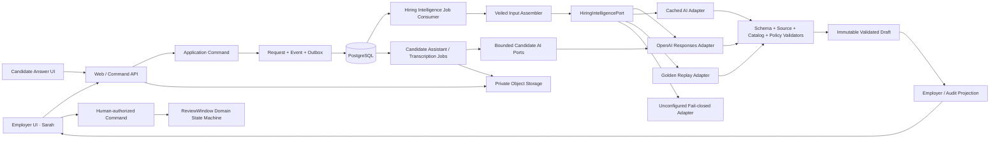
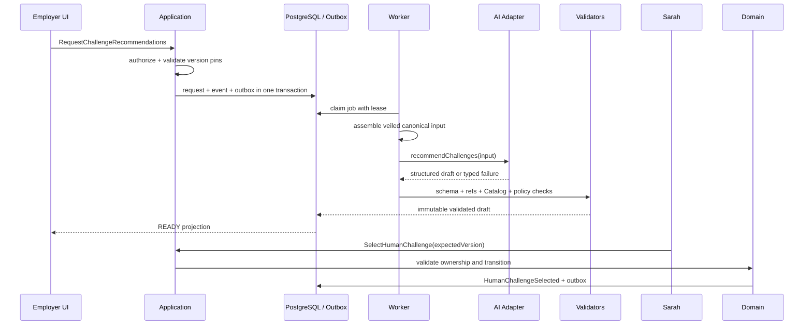

# OnlyBoth AI 工程设计

## Bounded Hiring Intelligence for label-blind, attention-backed work proofs

**版本：** 1.6
**日期：** 2026-07-20  
**状态：** MVP implementation blueprint

---

## 0. 文档地位与范围

本文定义 OnlyBoth AI 模块的工程边界、调用协议、数据流、失败语义、审计、评测与实施顺序。

文档优先级为：

```text
OnlyBoth-产品精神.md
→ OnlyBoth-产品方案.md
→ OnlyBoth-工程设计.md
→ OnlyBoth-AI工程设计.md
→ current implementation
```

如果本文与产品不变量或总体工程设计冲突，以前两份文档为准，并同步修正文档和实现。

本文覆盖需求方/制度侧 Hiring Intelligence，以及 Sealed Job Policy 明确允许的披露式 Candidate
Answer Assistant 与 Voice Memo Transcription。它不改变 Label Reveal、Attention、Credit、
ReviewWindow、最终 Answer Submit 或 Human Outcome 的领域权限。

当前主浏览器链已经实现 rolling Blind Review Commitment、可循环 Slot、Interest Queue、真实
Answer Session、私有 Artifact、披露式 Candidate Assistant/Transcription、不可变 Submission 与
逐份 Human Answer Review。Employer Evidence Analyst 已把 `buildAnswerEvidenceEdge` 接到不可变
Answer Submission、Outbox Worker 与 Employer Review Projection；回答后的 Advancement/Deep Proof
仍未接到新的 Answer-first Web vertical。legacy `buildMatchEdge` 与 `recommendChallenges` 继续作为
历史回归链，不进入主 Application 流程。

七名合成 Candidate 各有独立的 Candidate-only Evidence Passport state。它允许 Candidate 发布合成
来源 Snapshot，并用 `deriveCandidateEligibilityMatches` 将 source refs 与 Recruiter-sealed
background tags 建立访问假设；它不属于 Employer Matching，不产生候选人池或排序，也不改变
Queue、Invitation 或 Attention。普通岗位必须有至少一条 validated positive connection 才可见；
`OPEN_TO_ALL` 始终可见；AI failure 是 Pending/Failed，不是 Candidate 不合格。
Snapshot 必须含最高学历或显式 `NO_FORMAL_DEGREE`。AI 输入只接收学历层级、专业、毕业日期与
source ref，不接收学校名称；确定性 Policy 按 Snapshot 发布时间计算两年边界：两年以内为
`EDUCATION → WORK_AND_CREDENTIALS → OTHER`，超过两年或无正式学历为
`WORK_AND_CREDENTIALS → OTHER → EDUCATION`。Validator 校验连接顺序；模型不得把该顺序变成分数、
排名或“无学历=较差”的结论。

---

## 1. 核心决策

OnlyBoth 的 AI 能力实现为一个**受限、异步、无业务写权限的 Hiring Intelligence 模块**：

- 逻辑上独立，有明确 Port、Schema、Prompt、Policy 和审计边界；
- MVP 部署在现有 Background Worker 内，不拆成网络微服务；
- 不使用自主 Agent loop，不给模型提供工具；
- 只生成带来源的结构化 Draft；
- 所有输出经过确定性后置校验；
- 只有人工确认后的 Application Command 可以改变业务状态。
- Candidate Assistant 只生成披露式草稿建议；原始 Voice Memo 与派生 Transcript 分离；二者
  都没有业务写权限或最终提交权限。
- Candidate Eligibility Match 只决定 Candidate 能否发现 evidence-gated JobPost；Match 不是 verified
  capability、Fit Score 或 Employer 输入，Candidate 仍亲自决定是否登记 Interest。旧
  `deriveCandidateJobSignals` 保留兼容，但不再拥有 Feed 可见性权限。

AI 的目标不是预测“这个人有多优秀”，而是缩短以下推理链：

```text
Employer uncertainty
↔ Recorded anonymous candidate answer evidence
↔ Bounded proof template
↔ Evidence-linked human judgment
```

因此：

> GPT 更聪明地选择“值得验证什么”，而不是更聪明地决定“淘汰谁”。

---

## 2. 不可破坏的 AI 不变量

```text
No permitted source → No factual AI statement
No recorded answer evidence → No candidate edge
No valid proof template → Needs human or bounded unknown
No allowlisted Catalog ID → No challenge recommendation
No named human command → No business-state transition
```

服务端必须保证：

- AI 永远读不到 `candidate_private_labels`；
- Candidate discovery 只能读取发布 Snapshot 的脱敏合成来源字段和公开 Job Contract；不能读取
  姓名、学校、前雇主名称、联系方式、原始 locator token 或 Private Label Vault；
- AI 不输出 Fit Score、Talent Score、候选人排名或录用建议；
- AI 不判断候选人是否使用外部 AI 作弊；经同意采集的服务器行为由确定性规则分类，模型不得重分类；
- AI 不生成或执行 Challenge 代码、Shell、路径或环境变量；
- AI 不分配 Answer Invitation，不完成 Human Answer Review，也不决定 Direct / Explore、WIP、Credit、Attention Slot 或 ReviewWindow 所有权；
- AI 不得在 Candidate 作答前使用 Profile、Claim 或来源包装产生候选人选择边；
- AI 不选择最终 Challenge，不冒充 Sarah；
- AI 不自动 Advance、Clarify、Close、Reveal、Release 或 Settle；
- `buildAnswerEvidenceEdge` 不生成总体 Match/Candidate Score、排序、推进建议或 Human Review
  表单草稿；逐项标准只允许 `SUPPORTED | CONTRADICTED | NOT_ADDRESSED |
  INSUFFICIENT_EVIDENCE`；
- Process Evidence V2 由确定性规则形成红黄绿 Behavior Signals；模型只能复述规则、观测值与核查
  问题，不能支持/反驳能力标准、改变 Good/Bad Answer Verdict，或推断不活跃、懒惰、可疑、
  诚信、人格、情绪或作弊概率；
- Candidate 路由和 Sandbox 不持有 OpenAI API key；
- `assistCandidateAnswer` 只能在已经由 Backed Offer 启动的 ACTIVE Answer Session 中运行，且
  Sealed Contract 必须为 `PLATFORM_ASSISTANT_ALLOWED`；完整 Trace 必须冻结并向 Reviewer 披露；
- `transcribeVoiceMemo` 只产生派生 Transcript，原始音频保持权威；失败不能形成 Candidate
  Failure，也不能阻止提交已验证的原始音频；
- Refusal、Incomplete、非法引用和非法 Catalog ID 不降级为自由文本业务判断；
- Platform AI Failure 不能成为 Candidate Failure 或 Employer Breach；
- LIVE 失败不能静默切换为 CACHED_AI 或 GOLDEN_REPLAY。

---

## 3. 总体架构



Private Label Vault、SandboxPort 和 Domain Aggregate 不作为 AI Adapter 的依赖。AI 调用链无法获得这些对象的 Repository 或写接口。Candidate AI Ports 也不能读取 Employer
Projection、Candidate Resume 或 Private Labels。

### 3.1 部署边界

MVP 使用两个进程：

```text
Web / Command API
Background Worker
```

AI 模块由 Worker 执行。Web 不直接调用 OpenAI，浏览器不接收 API key，Application Command 不在请求事务中等待模型。

现在不拆微服务，原因是：

- AI Request、Domain Event 和 Outbox 需要原子落库；
- Result 必须与 Contract、Catalog 和 Aggregate Version 对齐；
- Golden Replay、Cached 和 LIVE 必须复用相同的命令和投影；
- Hackathon MVP 的主要风险是权限与因果一致性，不是模型吞吐量。

### 3.2 依赖方向

目标依赖关系：

```text
apps/web, apps/worker
        ↓
packages/application
        ↓
packages/domain

packages/ai ─────────→ application ports + contracts
packages/db ─────────→ application repository ports
packages/projections → contracts
```

建议最终归属：

- `packages/contracts`：AI Input/Output Schema 和版本化 DTO；
- `packages/application`：`HiringIntelligencePort`、Request/Result Repository Port、Application Commands；
- `packages/ai`：Prompt、OperationSpec、Responses/Cached/Replay Adapter、确定性输出校验器；
- `apps/worker`：Outbox Consumer、租约、重试、超时和 composition root；
- `packages/db`：AI Request、Run、Source Ref、Output 的 PostgreSQL Adapter。

当前 Schema 已归属 `packages/contracts`，`HiringIntelligencePort` 已归属 `packages/application`；`packages/ai` 保留兼容 re-export，并只负责 Prompt、Validator 与 Adapter。这一依赖方向已经用于 Matching 与 Candidate 42 Challenge Worker 链路。

---

## 4. 公开 AI Ports

Application 不暴露通用 `runPrompt`。历史 Hiring Intelligence、Employer Answer Analyst、Candidate
Discovery、Candidate Assistant 与 Transcription 使用独立的小权限 Port。当前代码的准确边界是：

```ts
interface HiringIntelligencePort {
  compileContract(input: CompileContractInput): Promise<ContractDraft>;
  buildMatchEdge(input: BuildMatchEdgeInputV2): Promise<MatchEdgeDraftV2>; // legacy only
  recommendChallenges(input: RecommendChallengesInput): Promise<ChallengeRecommendation>;
  compressEvidence(input: CompressEvidenceInput): Promise<EvidenceCardDraft>;
}

interface EmployerReviewAnalystPort {
  buildAnswerEvidenceEdge(
    input: BuildAnswerEvidenceEdgeInput,
    clientRequestId: string,
  ): Promise<EmployerReviewAnalystResult>;
}
```

把 Answer Analyst 分开不是赋予它更多权限，而是让 composition root 无需向它注入 legacy Candidate
Claim/MatchEdge Repository。浏览器没有通用 AI endpoint；Submission Outbox 是唯一触发源。

Candidate Answer 使用两个独立、权限更小的 Worker Port；它们不属于
`HiringIntelligencePort`，也不返回招聘判断：

```ts
interface CandidateAnswerAssistantPort {
  answer(input: {
    sealedQuestion: string;
    allowedAssumptions: readonly string[];
    currentDraft: string | null;
    disclosedPriorTurns: readonly DisclosedTurn[];
    message: string;
  }): Promise<{ text: string; providerResponseId: string }>;
}

interface VoiceTranscriptionPort {
  transcribe(input: {
    audio: Uint8Array;
    fileName: string;
    contentType: string;
  }): Promise<{ text: string; providerResponseId: string | null }>;
}
```

`assistCandidateAnswer` 使用 `gpt-5.6-terra`、low reasoning、`store: false`、SDK retry 0、
唯一 `X-Client-Request-Id`，且 `permits_tools = false`。输入不包含 Profile、Resume、其他
Candidate、hidden tests 或 Employer judgment。`transcribeVoiceMemo` 使用
`gpt-4o-mini-transcribe`；Transcript 是派生 Artifact。

Candidate Job discovery 也使用独立 Port，不扩展 Employer pre-answer Hiring authority：

```ts
interface CandidateJobDiscoveryPort {
  deriveSignals(
    input: CandidateJobDiscoveryInputV1,
    clientRequestId: string,
  ): Promise<CandidateJobDiscoveryOutputV1>;
}
```

它只返回 `EVIDENCE_CONNECTED | ADJACENT | INSUFFICIENT_SOURCE`、input-bound Opportunity /
Capability / Evidence refs、bounded reason 与 `still_unknown`。这些历史 discovery signals 仅保留为
Candidate-side explanation 数据，不再拥有 Feed、Detail 或 Interest 授权能力；访问权只来自
`OPEN_TO_ALL`、当前有效的 `deriveCandidateEligibilityMatches` 正向结果或已经开始的 Journey pin。

Legacy `buildMatchEdge(BuildMatchEdgeInputV2)` 保留为迁移期兼容接口，只能服务旧 Replay、数据迁移和回归测试。新 Application workflow、Employer Projection 和 UI 不得消费其输出。

`packages/ai` 内部可以有一个通用 Runner，但它是 private implementation detail：

```ts
interface OperationSpec<TInput, TOutput> {
  readonly operation: HiringIntelligenceOperation;
  readonly promptId: string;
  readonly promptVersion: string;
  readonly promptHash: string;
  readonly inputSchemaVersion: string;
  readonly outputSchemaVersion: string;
  readonly inputSchema: Schema<TInput>;
  readonly outputSchema: Schema<TOutput>;
  readonly maximumInputBytes: number;
  readonly maximumOutputTokens: number;
  readonly timeoutMs: number;
  readonly retryPolicyVersion: string;
  readonly modelPolicyId: string;
  readonly evalSuiteVersion: string;
}
```

Application 和 Domain 不得依赖 model ID、SDK Response 类型、token 计费字段或 Prompt 文本。

---

## 5. Narrow Hiring、Candidate discovery 与 Eligibility Operation 契约

### 5.1 `compileContract`

**输入：**

- Job Description；
- 真实 Ticket；
- 获准的 Repository 片段；
- 需求方回答；
- 当前允许的 Proof Template DTO。

**输出：**

- `critical_failures`；
- `decision_uncertainties`；
- `capabilities`；
- `hard_requirements`；
- `proof_template_ids`；
- `unknowns`；
- `draft | needs_human`。

**后续权限：** Employer 必须逐项确认并执行独立 Seal Command。AI Draft 不是 ContractVersion。

### 5.2 `buildAnswerEvidenceEdge`

**输入：**

- Sealed Contract Version/hash、Question Version 与不可变 Answer Submission ref；
- 1–8 条发布前封存的 `review_criteria`，每条固定 criterion/capability ref、支持条件、直接反驳
  条件与本任务边界；
- 最终富文本、Voice Transcript 与披露式平台 GPT Trace 的冻结 Source Blocks；
- `ANSWER_PLUS_PROCESS` 时的 `AnswerProcessEvidence@2`，包含数据库时间、草稿版本
  ref/hash/长度、无服务器记录修改的最长区间、GPT/Voice 次数、提交来源、剩余时间与已知平台故障；
- `onlyboth.answer-behavior-severity@1` 确定性生成的六个 Behavior Signals（严重度、观测值、规则、
  caveat 与 attribution）；
- opaque refs、hash、schema/prompt/version pins。中间草稿正文、Private Labels、Résumé 和 Focus
  事件不进入模型输入。

**输出：**

```text
source-linked sentence summary
+ bounded Good Answer / Bad Answer verdict
+ four source-linked language findings
+ exactly one four-state finding per sealed criterion
+ uniquely resolvable exact quotes
+ still_unknown
+ source-linked reviewer questions
+ optional neutral process timeline
+ ready | needs_human
```

Application 使用 `EmployerReviewAnalystPort`、`build-answer-evidence-edge-input@1` 与
`answer-evidence-edge-draft@2`。Validator 要求每条 Criterion 恰好出现一次、四个 Language
Dimension 恰好各一次；每个
`source_block_ref + exact_quote + occurrence_index` 必须在冻结 Source Block 中唯一解析；Summary、
Good/Bad Verdict、Language Finding 和 Criterion Finding 不得引用 `PROCESS`。Process Source 只能
出现在 timeline 或 Reviewer Question。输出禁止 Candidate-wide 分数、排名、录用/淘汰、推进建议、
Direct/Explore、人格/情绪/诚信/作弊推断与可执行内容。Good/Bad 只绑定当前 sealed Challenge；
GREEN/YELLOW/RED language severity 固定映射 `CLEAR/MIXED/CONCERN`，不是跨 Candidate 排名。

Policy 在 JobPost 发布前封存为 `OFF | ANSWER_ONLY | ANSWER_PLUS_PROCESS`，历史 JobPost 默认
`OFF` 且不追溯调用。Submission 事务原子冻结 Process Evidence、Projection 和 Outbox；Worker
异步调用模型。AI 关闭、分析中、拒答、失败或未完成都不阻塞 Human Review、Slot Settlement 或
下一位 Offer。Human Review 先完成时迟到结果进入 `SUPERSEDED`。人工表单仍必须自行填写
decision、原始 Evidence refs、comment 与 `still_unknown`；AI Output ref 只可作为 consulted audit
metadata，不能作为 Evidence ref。

平台 Kill Switch 默认关闭；Policy 已 opt in 但开关未启用时，Worker 将 Projection 置为
`NEEDS_HUMAN / PLATFORM_KILL_SWITCH_OFF` 并结束消息，不调用模型，也不阻塞人工审阅。若开关已
启用但 LIVE 缺少 Worker-only Key，则使用 `NEEDS_HUMAN / OPENAI_KEY_UNAVAILABLE`；仍不得切换
Synthetic。

### 5.3 `recommendChallenges`

**输入：**

- 当前 ReviewWindow 和冻结版本引用；
- Stage A Evidence summaries 与 hashes；
- 当前 capability refs；
- 当前 Catalog Version 中允许暴露的 Challenge DTO。

**输出：**

- 1–3 个唯一、等权的 Catalog Challenge ID；
- 每个建议的 capability refs；
- 每个建议的 evidence refs；
- 有限 rationale；
- `still_unknown` 或 `needs_human`。

AI 不能读取 Hidden Tests，不能生成 Scenario，不能预选第一项。

### 5.4 `compressEvidence`

**输入：**

- 不可变 Event、Artifact、Diff、Command、Verification summaries；
- source hashes；
- Contract Version；
- Sarah 已选择的 Challenge ref。

**输出：**

- `observed`；
- `verified`；
- `revised`；
- `unresolved`；
- 每条 statement 的 source refs；
- `draft | needs_human`。

Evidence Card Draft 不包含录用结论、人格推断、文化契合、作弊概率或跨 Scenario 的原始 pass-count 排名。

### 5.5 `deriveCandidateJobSignals`

**输入：** Candidate 已发布的不可变 Passport Snapshot ref/hash；每项来源的 Evidence ref、类型、
`SYNTHETIC_SOURCE_ATTACHED`、脱敏 description/contribution、日期与 hash；当前全部公开 JobPost 的
Opportunity/version/Contract hash、capability refs 与公开陈述。

**输出：** 每个开放岗位一项 discovery band；非 `INSUFFICIENT_SOURCE` 信号包含合法 capability
ref、Evidence refs、bounded reason 和至少一项 `still_unknown`。合法 `abstain` 只能使用固定
reason code，不能隐藏岗位。

输入不含身份、学校、前雇主名称、P45 内容、原始 URL token、联系方式或 Private Label。输出不含
score、rank、百分比 fit、Hire/Reject、Direct/Explore、Queue 或 Attention 决策，也不能把
synthetic attachment 描述为事实验证。Passport 或 Job Contract pin 变化后结果必须
`SUPERSEDED` 或在 Candidate Projection 中显示 `STALE/NOT_EVALUATED`。

### 5.6 `deriveCandidateEligibilityMatches`

**Operation 与 Prompt：** `deriveCandidateEligibilityMatches`，
`onlyboth.derive-candidate-eligibility-matches@1.0.0`。

**模型与 API：** `gpt-5.6-sol`，`reasoning.effort=medium`，Responses API strict Structured Outputs，
`store:false`，无 tools、conversation、background 或 `previous_response_id`；SDK retry 为 0，只有
Worker 可以有限重试。LIVE failure 绝不读取 `RECORDED_LIVE` 或固定 Fixture。

**输入：** Candidate Passport Snapshot ref/hash；无学校名称的 education field；脱敏 Evidence
refs、类型、摘要、日期、合成来源状态和 hash；每个 evidence-gated Job 的 Opportunity/version、
Contract hash、公开 capability refs 以及最多二十个封存的 education/work-domain tags。输入不含姓名、
学校、前雇主、联系方式、Resume、Private Label 或原始 locator token。

**输出：** 每个输入 Job 恰好一个 `POSITIVE_EVIDENCE | NO_POSITIVE_EVIDENCE`。正向结果至少包含一条
`tag_ref ↔ evidence_refs`、connection type、bounded reason 和 `still_unknown`；负向结果不得包含
connection。学历只能连接 education tag，Employment/Certificate/Work Sample/Repository 等只能连接
work-domain tag，且所有 refs 必须来自输入。

该 Operation 只授予 Candidate-side access：一条合法正向连接采用 OR 语义即可解锁，不输出 score、
rank、Hire/Reject、Queue 或 Attention 决策。没有 Passport 的 Candidate 只看到 `OPEN_TO_ALL`；
未匹配 Job 在 Feed、Detail 与 Interest API 统一不可枚举。既有 Active Journey 固定原 Match pin，
Passport 更新不追溯剥夺已经进入队列的 Candidate。

---

## 6. Request 与 Result 生命周期



完整流程：

1. Application Command 验证 actor、purpose、聚合状态和版本锁。
2. 组装 canonical request，计算 `input_hash`。
3. 同一事务写入 AI Request、Domain Event 和 Outbox。
4. Worker 使用租约领取 Job，并执行 inbox/idempotency 去重。
5. `VeiledInputAssembler` 从角色安全的投影和 source refs 组装最小输入。
6. Adapter 调用 LIVE、CACHED_AI、GOLDEN_REPLAY 或 fail-closed 实现。
7. Runner 分类 completed、refusal、incomplete、transport failure。
8. 确定性 Validator 校验 Schema、引用、版本、Catalog 和禁止内容。
9. 事务保存不可变 Draft、Run 元数据和 Result Event。
10. UI 只展示通过校验的 Draft。
11. 人工 Command 消费 Draft 时再次验证 source run 和 version pins。
12. Aggregate 已变化时拒绝消费旧 Draft，并标记 `SUPERSEDED`。

---

## 7. Veiled Input Assembler

### 7.1 唯一允许的数据来源

Assembler 只能读取：

- Employer 已获授权的 Job/Ticket/Repo source artifact；
- Sealed Contract 的公开结构；
- Answer Invitation、Blind Review Commitment 与 Advancement Cohort 的 opaque refs；
- Candidate 已经提交的不可变 Answer、Event、Artifact、Diff 与 Verification refs；
- Stage A/Stage B 的不可变 Evidence references；
- 公开的 Proof Template 和 Challenge Catalog DTO；
- 当前 Window 冻结的版本引用。

Employer Assembler 不获得 `CandidatePrivateLabelRepository` 或 Candidate Claim Repository。回答前
没有任何 Employer-side Candidate selection AI request；回答后也只从 Answer Evidence Repository
组装 opaque DTO，因此不是依靠 Prompt “要求模型忽略姓名或履历”，而是在查询层根本无法取到这些
字段。Candidate-side Eligibility Match 是下面单独的访问支路，不向 Employer 生成候选人列表。

Candidate Sidecar Assembler 是另一条依赖边界：只有 Backed Offer 已接受、Answer Session 为
ACTIVE 且 Contract Policy 允许时，才能读取封存问题、允许假设、当前草稿与同一 Session 的
既有披露式 turns。它不能读取 Candidate Resume/Private Labels、Employer Projection、其他
Candidate、Challenge hidden tests、任意文件或网络工具。

Candidate Discovery/Eligibility Assembler 是第三条隔离依赖：composition root 只注入 Passport
Snapshot Repository 和公开 Job Contract/Eligibility Policy Repository，不注入 Private Label、
Employer Projection、Queue 或 Attention Repository。它删除 display title、原始 locator，并只
发送脱敏描述、source hash 与 opaque refs。Worker 完成 Match 后只写 Candidate-only immutable
projection；Interest Command 必须重新加载当前 Match pin，不能信任浏览器提交的 ref。

### 7.2 发送前处理

发送给任何 Adapter 前必须：

1. 使用 strict Schema 拒绝未知字段；
2. 使用 opaque candidate、opportunity 和 window refs；
3. 校验每个 source ref 的 SHA-256；
4. 限制 source 数量、单项大小和总字节数；
5. 对自由文本执行 Label Policy / DLP 扫描；
6. 删除无关上下文，不发送完整宽表 DTO；
7. 将所有 Candidate Answer、JD、代码和日志标记为 untrusted data；
8. 记录允许的 source-ref 集合，供输出后校验。

结构化 Schema 只能阻止额外字段，不能发现自由文本内嵌的姓名、学校或前雇主。因此 DLP/Label Veil 扫描是独立的服务端步骤，不能由 Zod 或 Prompt 代替。

### 7.3 Source Ref 规则

每个 source 必须是：

```ts
type SourceRef = {
  id: string;
  kind:
    | "job_description"
    | "ticket"
    | "repository"
    | "answer"
    | "artifact"
    | "diff"
    | "event"
    | "verification";
  sha256: `sha256:${string}`;
};
```

模型输出只能引用本次请求中已登记的 ID。AI 不能创造一个看似合理但不存在的 Evidence ID。

---

## 8. Prompt 设计与版本管理

### 8.1 Prompt 组成

每个 Operation 的 Prompt 分为两部分：

```text
Developer instructions
├── operation purpose
├── allowed authority
├── prohibited decisions
├── evidence and source-ref rules
├── abstain / needs_human behavior
└── output semantics

User data
└── serialized validated untrusted DTO
```

JD、Candidate answers、代码注释和日志永远不能插入 Developer instructions。它们即使包含“忽略以上规则”也只是一段待分析证据。Candidate Claim 不进入目标 Answer Evidence Operation。

### 8.2 Registry 必须记录

每个 Prompt Spec 至少记录：

```text
operation
prompt_id
prompt_version
prompt_hash
input_schema_version
output_schema_version
maximum_input_bytes
maximum_output_tokens
timeout_ms
retry_policy_version
model_policy_id
eval_suite_version
permits_tools = false
permits_remote_conversation_state = false
```

Prompt 正文保存在仓库。任何 Prompt 或 Schema 变化必须：

```text
bump version
→ update hash
→ update fixtures
→ run operation evals
→ verify LIVE/CACHED/GOLDEN normalized parity
```

### 8.3 Prompt 输出原则

- 只陈述 recorded-answer-evidence-backed facts；
- 缺少事实时输出 unknown 或 needs_human；
- 不把 absence of evidence 写成 negative evidence；
- 不输出内部 chain-of-thought；
- rationale 只提供可审计的简短依据；
- 不生成候选人间相对评价；
- 不恢复或猜测被 Seal 的背景标签。

---

## 9. OpenAI Responses Adapter

### 9.1 调用形式

核心 Hiring Operation 与 Candidate discovery Adapter 共享同一组结构化调用约束：

```text
runStructured(spec, input, context)
→ strict input parse
→ build minimal veiled payload
→ Responses API
→ classify status / refusal / incomplete
→ strict output parse
→ deterministic post-validation
→ draft or typed failure
```

概念性 TypeScript 调用：

```ts
const response = await client.responses.parse({
  model: modelPolicy.resolve(spec.operation),
  store: false,
  input: [
    { role: "developer", content: spec.developerPrompt },
    { role: "user", content: JSON.stringify(veiledInput) },
  ],
  text: {
    format: zodTextFormat(spec.outputSchema, spec.outputSchemaName),
  },
});
```

实际实现不设置 tools、`previous_response_id` 或远端 conversation。Structured Outputs 在 Responses API 使用 `text.format`；JavaScript SDK 可以从 Zod 生成输出格式。Schema adherence 不能替代事实与权限校验，因此所有模型输出仍要经过本文第 10 节的 Validator。[OpenAI Structured Outputs](https://developers.openai.com/api/docs/guides/structured-outputs)

### 9.2 不使用 Agent 或 Tools

所有这些 Operation 都是有界的单次结构化推理：

- 输入在调用前已经组装；
- 可访问的数据集合固定；
- 输出 Schema 固定；
- 不需要模型自行探索工具；
- 不允许模型产生副作用。

因此 MVP 不使用 Agents SDK、Function Calling、MCP、Code Interpreter、Hosted Shell 或 Browser。增加这些能力会扩大 Prompt Injection、数据外泄、审计和权限表面，却不增加当前产品必需能力。

### 9.3 不使用 Background Mode

OnlyBoth Worker 和 Outbox 已经拥有异步执行、轮询、重试和取消语义。四个 Operation 应保持小输入、有限输出和明确 timeout，因此 LIVE Adapter 初期使用普通 Responses 调用。

Background Mode 面向长时间运行任务，并需要为异步轮询临时保存 Response 数据；当前没有必要引入第二套异步状态机。[OpenAI Background mode](https://developers.openai.com/api/docs/guides/background)

### 9.4 Model Policy

Model ID 是可配置的运行策略，不是 Domain Contract：

- Domain Event 不依赖具体 model slug；
- `ai_model_runs` 记录请求模型和实际返回模型；
- 不同 Operation 可以使用不同 model policy；
- model、reasoning 和 token budget 变化需要 eval；
- Golden Replay pin fixture 和 output hash，不在运行时重新选模型；
- 不在本文硬编码“永远最新”的模型名称。
- `deriveCandidateJobSignals` 当前固定 `gpt-5.6-luna` 与 low reasoning，适配候选人岗位发现的
  低延迟、批量结构化场景；变更模型或 effort 必须重新运行 hard-gate eval。
- `deriveCandidateEligibilityMatches` 固定 `gpt-5.6-sol` 与 medium reasoning；只有经过 ref、类型、
  policy 和禁止语言校验的正向连接可以授予 Candidate-side evidence-gated Job access。
- `buildAnswerEvidenceEdge` 的 Worker 默认 `gpt-5.6-sol` 与 medium reasoning；
  `EMPLOYER_REVIEW_AI_MODEL` 只接受 `gpt-5.6-sol | gpt-5.6-terra | gpt-5.6-luna`。显式选择会同时
  pin Request 和 Run metadata，非法值启动时 fail closed。某一模型通过验收不自动授权其他模型。
- LIVE eval harness 可以通过构造参数显式选择被测模型；生产 Worker composition 不读取
  `OPENAI_EVAL_MODEL`，并继续使用各 Operation 的上述默认 model policy。低成本模型的通过或失败
  只能描述该被测模型，不能替代精确生产模型、reasoning、Prompt 与 Schema 组合的 release gate。

### 9.5 Request Correlation

每次尝试使用唯一 `X-Client-Request-Id`，值来自内部 trace/run attempt ID；同时保存 OpenAI 返回的 `x-request-id`。自定义 ID 必须是 ASCII、唯一且不超过 512 字符。[OpenAI request IDs](https://developers.openai.com/api/reference/overview#supplying-your-own-request-id-with-x-client-request-id)

---

## 10. 确定性输出校验

Structured Output 解析成功后，必须按固定顺序执行：

### 10.1 Schema Validator

- Output Schema version 精确匹配；
- strict parse，拒绝额外字段；
- 数组、文本和引用数量满足边界；
- discriminated union 的 decision/status 合法。

### 10.2 Reference Validator

- 所有 `source_refs` 属于本次允许集合；
- `answer_ref` 属于当前不可变 Answer Submission；
- 所有 `evidence_refs` 属于当前 Answer 的 Event、Artifact、Diff 或 Verification 集合；
- 所有 `uncertainty_refs` 属于 Sealed Contract；
- source hash 与请求快照一致；
- Evidence Card 每条 statement 至少有一个合法 source ref。

### 10.3 Template 与 Catalog Validator

- `proof_template_ref` 属于当前允许集合；
- Challenge Recommendation 包含 1–3 个唯一 ID；
- Challenge ID 和 version 属于冻结的 Catalog lock；
- capability refs 与允许的 capability band 相交且不越权；
- Challenge 不含自由代码、路径、命令或环境变量；
- 不读取或回显 Hidden Test 内容。

### 10.4 Output Policy Validator

拒绝包含以下语义的输出：

- Fit/Talent/Candidate score；
- 候选人排名或“best candidate”；
- hire、reject、Advance 或 Close 建议；
- 受保护属性、私密标签或其推断；
- AI cheating probability、情绪、人格或文化契合；
- 跨不同 Scenario 的原始通过数排序；
- 无来源却被表述为 observed/verified 的事实。

### 10.5 Version 与 Staleness Validator

结果挂接前再次检查：

```text
aggregate_version
blind_review_commitment_version
advancement_cohort_version
contract_version_id
question_version_id
label_policy_version_id
proof_template_version_id
challenge_catalog_version_id
answer_snapshot_hash
```

任一冻结引用变化，结果进入 `SUPERSEDED`，不能出现在可授权 Draft 中。

---

## 11. GPT Answer Evidence 与 Attention 的分界

### 11.1 GPT 只构造回答后的 Evidence Edge

```text
AnswerEvidenceEdge
= opportunity_ref
+ answer_ref
+ uncertainty_id
+ evidence_refs
+ proof_template_ref
+ source_refs
+ still_unknown
```

它表达的是对已经发生的匿名工作证据下一步验证什么，不是获得注意力的权利，也不是 Candidate 的总体能力结论。

### 11.2 确定性程序与真人才分配注意力

回答前由确定性程序执行：

```text
Eligibility
→ active reusable Blind Answer Review Slot
→ public non-profile Interest Queue policy
→ Candidate Q_i = 1
→ Answer Review Slot availability
→ Credit Hold
→ Answer Invitation
```

回答后由具名 Reviewer 与确定性程序分别执行：

```text
each Human Answer Review settles and recycles its Slot to the next queued Interest
→ current Advancement Cohort's required Receipts complete
→ Sarah selects Direct from that Cohort's anonymous Answer Evidence
→ allocator selects Explore from that Cohort's remaining valid answers by public seed
→ Deep Proof Slot + ReviewWindow
```

这样可以避免模型或 Candidate 自述通过语言偏好控制稀缺注意力，也避免回答前 Profile screening 被包装成 AI Matching。

---

## 12. Challenge 推荐的两步授权

```text
GPT returns up to three Catalog IDs
→ service validates refs + allowlist + version + capability band
→ Employer Projection exposes equal-weight options
→ Sarah inspects evidence and unknowns
→ Sarah selects one Catalog ID
→ SelectHumanChallenge validates actor + ownership + expected version
→ HumanChallengeSelected event
→ Stage B scenario loads deterministically by ID
```

只有 `HumanChallengeSelected` 可以解锁 Stage B。`ChallengeRecommendationCreated` 只表示一个 AI Draft 已生成，不能改变 Candidate Projection 的业务状态。

MVP 中 Sarah 不能自由编辑 Challenge。将来即使允许参数化，也只能修改 Manifest 声明的白名单参数，并重新校验和生成 `challenge_hash`。

---

## 13. Request、Run 与 Output 持久化

建议区分业务请求、模型尝试和验证后产物。

### 13.1 `hiring_intelligence_requests`

```text
id
operation
purpose
actor_id
opportunity_id / review_window_id
candidate_passport_snapshot_ref
aggregate_version
contract_version_id
label_policy_version_id
proof_template_version_id
challenge_catalog_version_id
runtime_mode
input_hash
idempotency_key
status
attempt_count
next_attempt_at
created_at
completed_at
```

### 13.2 `ai_model_runs`

```text
id
request_id
attempt
adapter_id
requested_model
resolved_model
prompt_id
prompt_version
prompt_hash
input_schema_version
output_schema_version
retry_policy_version
model_policy_id
provider_response_id
provider_request_id
client_request_id
status
error_code
refusal_present
incomplete_reason
input_bytes
output_bytes
input_tokens
output_tokens
duration_ms
started_at
completed_at
```

### 13.3 `ai_source_refs`

```text
request_id
source_ref
source_kind
sha256
artifact_ref
```

### 13.4 `ai_outputs`

```text
id
request_id
output_schema_version
validated_json
output_hash
validation_policy_version
created_at
```

消费关系单独写入 `ai_output_consumptions(output_id, command_id, consumed_at)`，避免为记录消费而更新 immutable `ai_outputs`。

`validated_json` 是访问受控的结构化 Draft，不是普通日志。原始 Provider Response、完整 Prompt、候选人代码和私密标签不进入可检索运营日志。

---

## 14. 状态机与错误分类

### 14.1 Request 状态

```text
QUEUED
→ RUNNING
   ├─ SUCCEEDED
   ├─ NEEDS_HUMAN
   ├─ RETRYABLE → QUEUED
   ├─ FAILED_PERMANENT
   ├─ SUPERSEDED
   └─ CANCELLED
```

含义：

- `SUCCEEDED`：产生验证通过的 Draft，不代表业务决策完成；
- `NEEDS_HUMAN`：模型拒绝、输出不完整或校验失败，人工路径仍可用；
- `RETRYABLE`：暂时性外部故障；
- `FAILED_PERMANENT`：配置、认证或不可恢复 Provider 错误；
- `SUPERSEDED`：输入所依赖的业务版本已变化；
- `CANCELLED`：对应业务对象在运行前已合法取消。

结构化 `needs_human` 与 bounded unknown 是合法语义结果，不是 Provider Failure。`abstain`
只保留为 legacy `buildMatchEdge` 迁移语义，不能表示一个未获 Invitation 或尚未回答的
Candidate 能力不足。

### 14.2 Typed Error Codes

```text
AI_REFUSED
AI_INCOMPLETE
AI_SCHEMA_MISMATCH
AI_SOURCE_REF_INVALID
AI_TEMPLATE_INVALID
AI_CATALOG_INVALID
AI_OUTPUT_POLICY_VIOLATION
AI_STALE_RESULT
AI_TIMEOUT
AI_RATE_LIMITED
AI_PROVIDER_UNAVAILABLE
AI_CONFIGURATION_FAILURE
AI_ADAPTER_NOT_CONFIGURED
```

### 14.3 Retry Matrix

| Condition | Retry | Final handling |
|---|---:|---|
| Structured bounded unknown / `needs_human` | No | Normal validated Draft or explicit human path |
| Legacy `abstain` | No | Migration-only validated result; never a target Invitation decision |
| Refusal | No | `AI_REFUSED → NEEDS_HUMAN` |
| Incomplete | Normally no | `AI_INCOMPLETE → NEEDS_HUMAN` |
| Invalid Schema / ref / Catalog / policy | No | Reject output and require human handling |
| Timeout / network / 408 / `429 rate_limit_exceeded` / 5xx | Bounded | Retry with deadline and jitter |
| 400 / 401 / 403 / `429 insufficient_quota` / invalid config | No | `FAILED_PERMANENT` |
| Aggregate or pinned version changed | No | `SUPERSEDED` |

重试必须只有一个 owner，避免 SDK 与 Worker 双重放大。不能只按 HTTP 429 判断可重试性：
`rate_limit_exceeded` 是暂时性流控，`insufficient_quota` 是计费或 Project quota 配置阻塞。对暂时
错误使用有上限的指数退避和随机 jitter，并且只有在 AI Job deadline 内才允许继续。OpenAI 同样
建议对 rate limit 使用带 jitter 的指数退避，并设置最大重试次数。[OpenAI rate limits](https://developers.openai.com/api/docs/guides/rate-limits#retrying-with-exponential-backoff)

---

## 15. 幂等、并发与过期结果

推荐幂等键：

```text
operation
+ subject_ref
+ aggregate_version
+ input_hash
+ prompt_version
+ input_schema_version
+ output_schema_version
+ model_policy_id
+ runtime_fixture_id
```

要求：

- Outbox 至少一次投递不能产生两个业务 Draft；
- 每个 Provider attempt 有唯一 client request ID；
- 所有 attempt 复用同一个 canonical input hash；
- Worker 使用 lease，进程死亡后可以安全恢复；
- Result commit 前后都检查 Aggregate Version；
- 消费 Draft 的 Command 记录 `consumed_by_command_id`；
- 重复 Sarah 点击由 Command idempotency 和 optimistic version 拒绝；
- 旧 Draft 不能被重放到新的 Contract 或 Catalog 版本。

---

## 16. 运行模式与 Adapter Parity

| Mode | AI source | Network | Cache miss | Disclosure |
|---|---|---:|---|---|
| `LIVE` | OpenAI Responses API | Required | N/A | Live |
| `CACHED_AI` | Exact keyed fixture | None for AI | Fail closed | Cached |
| `GOLDEN_REPLAY` | Manifest-pinned synthetic fixture | None | Fail closed | Synthetic replay |
| `UNCONFIGURED` | None | None | Typed failure | Unavailable |

fixture key 至少包含：

```text
operation
+ input_hash
+ prompt_version
+ input_schema_version
+ output_schema_version
+ fixture_version
```

所有模式必须复用：

- Input Schema；
- Output Schema；
- Source/Catalog/Policy Validator；
- Request/Result 状态；
- Application Commands；
- Domain Events；
- Role Projections；
- UI Components。

Golden Replay Manifest 额外 pin AI fixture hash。启动时 hash 不一致即拒绝 Replay。前 30 秒所有 AI 结果预加载，不出现远程等待或假 typing；Sarah 的点击、Command、事件和 Candidate 状态变化仍现场执行。

Evidence Passport demo 允许读取一份 Demo-only `RECORDED_LIVE` Eligibility 输出：该输出必须由真实
Responses API 调用生成、经过同一 Validator、pin prompt/input/output/schema/model/Contract/Passport
hash，并明确披露。其余预载 Match 必须标记 synthetic。Candidate 一旦编辑并发布，新的
`CandidateEligibilityRequested` 必须
调用 LIVE Adapter；缺少 Key、拒绝、Incomplete 或 Provider failure 都显式进入 FAILED /
NEEDS_HUMAN，绝不自动切回录制输出或 Golden Fixture。旧 `CandidateDiscoveryRequested` 同样必须
调用 LIVE Adapter；缺少 Key、拒绝、Incomplete 或 Provider failure 都显式进入 FAILED /
NEEDS_HUMAN，绝不自动切回预载 Snapshot 或 Golden Fixture。

---

## 17. Employer 与 Judge UI 契约

AI 以结构化 Proof Analyst Panel 出现，不使用 Chat UI。

回答前 Employer UI 只显示 Sealed Question、rolling Review Slot WIP、Queue depth、SLA、
Credit 和 Queue policy，不显示 Candidate 卡片、Claim 或 AI Matching rationale。Candidate
提交后，UI 才显示匿名 Answer Evidence Cards；每张必须通过独立
`RecordHumanAnswerReview` Command 形成 Receipt。Cohort 未完成时显示例如
`7/8 cohort reviews — selection locked`，同时显示已结算 Slot 正在服务下一位 Interest；
不能出现回答前 `Choose as Direct`。

全部必需 Reviews 完成后，CTA 使用 `Advance this anonymous answer`。GPT Draft 只准备
Answer Evidence；Sarah 的 Direct 选择和确定性 Explore 是独立领域动作。

持续显示权限说明：

> GPT prepares evidence-linked options. Sarah authorizes the action.

UI 状态：

| State | Employer UI | Judge additions |
|---|---|---|
| `IDLE` | Start analysis | Operation and permitted data |
| `RUNNING` | Reading refs → checking Catalog | Runtime mode, elapsed time, schema version |
| `READY` | Up to three equal-weight options | Validation and provenance |
| `NEEDS_HUMAN` | Missing fact plus manual path | Typed reason code |
| `FAILED` | Safe failure plus manual path | Error class and retryability |
| `SUPERSEDED` | Refresh required | Version mismatch |

`AUTHORIZED` 不是 AI 状态，而是单独的真人 Command receipt：

```text
Authorized by Sarah Chen
Command: SelectHumanChallenge
Event: HumanChallengeSelected
```

每张 Recommendation Card 显示：

```text
Challenge title and Catalog ID
Tests: capability refs
Why: evidence-linked rationale
Sources: clickable source chips
Still unknown
```

禁止显示 confidence percentage、AI score、candidate rank、“best option”或默认预选。CTA 使用 `Authorize this challenge`，不使用 `Accept AI decision`。

Golden Replay 明确显示：

```text
Synthetic — Pre-recorded external inputs
Runtime: GOLDEN_REPLAY
GPT / Sandbox outputs: pre-recorded
Commands / state machine / projections: executing locally
```

---

## 18. 安全与威胁模型

| Threat | Control | Required test |
|---|---|---|
| Private label leakage | Separate Repository + Veiled DTO + DLP + log redaction | Sealed-field request/log scan |
| Prompt injection in JD/answer/code/log | Untrusted user data + no tools + fixed Developer Prompt | Injection eval corpus |
| Pre-answer Employer Candidate selection | No Employer-side Candidate selection request + no Profile/Claim repository in Employer assembler | Employer payload and no-call test |
| Candidate Sidecar escapes its Session | ACTIVE Session + sealed AI policy + fixed minimal assembler + no tools | Cross-Session and policy authorization tests |
| Candidate GPT use is hidden from Reviewer | Immutable user/assistant/error turns + independent sealed `GPT_TRACE` Artifact | Submission and Employer Projection tests |
| Browser receives provider credentials | Worker-only environment and server queue | Client bundle/env leakage test |
| Transcript replaces source audio | Original Voice Memo remains sealed authority; Transcript carries source ref | Transcription failure and provenance tests |
| AI impersonates human answer review | Draft-only Port + named reviewer Command and Receipt | State unchanged after AI output |
| Hallucinated Evidence ref | Request source allowlist + hash validation | Invalid/missing ref rejection |
| Hallucinated Challenge | Catalog lock + ID/version/capability validation | Unknown and wrong-version ID rejection |
| Model changes business state | No write tools + Draft-only Port + human Command | State unchanged after recommendation |
| Generated code execution | Catalog ID only; never execute model text | Shell/path/env payload rejection |
| Stale result race | Aggregate/version pins before and after call | `SUPERSEDED` race test |
| Retry duplication | Outbox idempotency + inbox receipt + output hash | Duplicate delivery test |
| Synthetic/live confusion | Visible runtime and synthetic markers | Replay disclosure E2E |
| Sensitive telemetry | Hashes/refs only; no raw payloads | Logger leakage test |

Candidate content must never be treated as instructions, even if it imitates a system message or asks the model to reveal hidden data.

---

## 19. 数据保留与日志

LIVE Request 默认使用 `store: false`。这可以关闭 Responses application-state storage，但不能被描述为组织或项目已经启用完整 Zero Data Retention；abuse monitoring 和组织级 data controls 是独立配置。[OpenAI data controls](https://developers.openai.com/api/docs/guides/your-data#v1responses)

普通结构化日志只记录：

```text
timestamp
level
service
runtime_mode
trace_id
correlation_id
request_id
run_id
operation
prompt_id / prompt_version / prompt_hash
input_schema_version / output_schema_version
input_hash / output_hash
input_bytes / output_bytes
attempt
duration_ms
token_usage
provider_request_id
error_code
outcome
synthetic
```

日志禁止包含：

- raw Prompt；
- complete model response；
- Candidate 或 Employer 宽 DTO；
- private labels；
- Candidate source code、diff 或 terminal output；
- Hidden Tests；
- API keys、headers、cookies、sessions 或 database URL。

Validated Draft 保存在受 RBAC 保护的 artifact/table 中；它不是运营日志。保留周期、删除请求和审计访问策略必须在真实候选人上线前完成合规评估。

---

## 20. Evals 与自动化测试

### 20.1 Schema 与 Contract Tests

- 四个 Input/Output Schema strict parse；
- 额外字段拒绝；
- refusal/incomplete 状态映射；
- `needs_human` 与 bounded unknown 保持为合法语义；legacy `abstain` 仅用于迁移回归；
- Prompt、Schema 和 fixture version 一致；
- Adapter 均实现同一 Port。

### 20.2 Grounding 与 Policy Evals

- 每条事实都有输入 source ref；
- 缺少 Answer Evidence 来源时 unknown/needs_human；
- 不创造 answer、uncertainty、evidence 或 Catalog ID；
- 不输出评分、排名、录用建议或作弊概率；
- Challenge 推荐只包含 allowlist；
- Evidence summary 与不可变 refs 一致；
- 不将不同 Scenario pass count 横向排名。

### 20.3 Privacy 与 Injection Evals

- 回答前 Employer/AI payload 不存在 Candidate Profile、Claim 或匹配 rationale；
- 替换姓名、学校、前雇主后 Answer Evidence Edge 依据不变；
- sealed-field leakage 为零；
- JD、Answer、代码注释和日志中的 Prompt Injection 无法改变权限；
- Candidate 文本不能开启 tools、改变 Catalog 或要求 Reveal；
- raw Prompt、payload 和私密标签不进入日志或错误。

### 20.4 Reliability Tests

- 429/5xx/timeout 有界重试；
- refusal、schema error 和 invalid ref 不重试；
- duplicate Outbox delivery 不重复产出；
- Worker lease recovery；
- result commit 前版本变化进入 `SUPERSEDED`；
- LIVE/CACHED/GOLDEN 产生相同 normalized output/event contract；
- LIVE failure 不自动切 synthetic mode。

### 20.5 Hard Gates

以下指标在合并前必须为 100%：

```text
Schema conformance
Source-ref subset validity
Catalog allowlist validity
Version-pin validity
No state mutation from AI result
No sealed-label leakage
```

语义质量使用专家 pass/fail 或 pairwise review，不用模型自报 confidence。每次真实失败必须在脱敏后加入 eval fixture。

OpenAI 建议以任务特定 eval、持续评测和人工判断结合的方式衡量模型质量。[OpenAI evaluation best practices](https://developers.openai.com/api/docs/guides/evaluation-best-practices)

---

## 21. 配置

建议 Worker 接受以下配置类别；名称可以在实现时统一，但不得散落在 Domain：

```text
RUNTIME_MODE
OPENAI_API_KEY                    # LIVE Worker only
AI_MODEL_POLICY_ID
AI_TIMEOUT_MS
AI_MAX_ATTEMPTS
AI_RETRY_POLICY_VERSION
AI_PROMPT_BUNDLE_VERSION
AI_EVAL_SUITE_VERSION
AI_FIXTURE_ROOT                   # CACHED_AI / GOLDEN_REPLAY
REPLAY_ID                         # GOLDEN_REPLAY
```

规则：

- LIVE 缺少 key 时启动失败或该 Adapter fail closed；
- CACHED_AI/GOLDEN_REPLAY 不需要 key；
- 配置错误不得回退为伪造 Draft；
- secret 只存在 Worker runtime；
- model ID 解析结果进入 Run metadata，不进入 Domain Event payload；
- production 不允许 Demo reset 或 synthetic fixtures。

---

## 22. 实施顺序

新的最高优先级是先纠正回答前选择顺序，再复用已经存在的 Challenge 链：

```text
Rolling Blind Review Commitment activated
→ public Queue Scheduler offers each reusable Slot
→ recorded Stage A Answers
→ buildAnswerEvidenceEdge
→ one HumanAnswerReview Receipt per Application
→ each settled Slot serves the next queued Interest
→ reviewed Answers fill an Advancement Cohort
→ post-answer Direct + deterministic Explore from that Cohort
→ recommendChallenges
→ deterministic validation
→ Sarah authorizes one Catalog ID
→ HumanChallengeSelected
→ Candidate enters the selected Stage B branch
```

### Phase 1：Blind Answer Contracts 与数据边界（已完成 Analyst 所需部分）

- 增加 Blind Review Commitment、Interest Queue、reusable Slot、Advancement Cohort、Invitation、Answer Submission 与 Human Answer Review contracts；
- 将 Employer pre-answer Projection 改为无 Candidate 卡片、Claim 或 AI rationale；
- 定义 `buildAnswerEvidenceEdge` Schema、Port 与 version pins；
- 添加 migration、fresh-up、privacy 和 no-pre-answer-AI-call tests。

### Phase 2：Answer Evidence Prompt、Validator 与 Fixture（Keyless 已完成）

- 提交版本化 `buildAnswerEvidenceEdge` Prompt；
- 实现 answer/event/artifact/verification/template/output policy Validator；
- 建立真实风格匿名回答、缺失证据和 injection eval corpus；
- 实现显式 Synthetic test Adapter 与 fail-closed LIVE Adapter；不存在 LIVE 自动回退。

### Phase 3：逐份 Human Review 与回答后分配（Review/Analyst 完成，Allocation 待完成）

- 实现 Answer Evidence Worker Outbox Consumer；
- 实现匿名 Answer Evidence Projection；
- 实现 Sarah 的 `RecordHumanAnswerReview` Command 和 Receipt；
- 实现 per-Slot Settlement/queue handoff、Cohort barrier、回答后 Direct 和 deterministic Explore；
- 验证任何 AI Result 都不能完成 Human Review 或解锁分配。

### Phase 4：复用 Challenge 纵向链路

- 用 Answer Evidence Edge 创建 Deep Proof ReviewWindow；
- 复用现有 Recommendation Projection 和 Proof Analyst Panel；
- 复用 Sarah 的 `SelectHumanChallenge` Command；
- 验证 Candidate Projection 的真实状态变化。

### Phase 5：LIVE、其余 Operation 与 Parity

- 使用合成/脱敏资料完成 LIVE Answer Evidence eval；
- 实现 `compileContract` 与 `compressEvidence`；
- 完成 end-to-end audit、retention 和 runtime parity。

---

## 23. 当前实现与缺口

### 已实现（主 Answer-first vertical）

- `EmployerReviewAnalystPort`、`build-answer-evidence-edge-input@1`、
  `answer-evidence-edge-draft@1`、版本化 Prompt、Responses Adapter、Synthetic test Adapter、
  deterministic source/authority Validator 与 Outbox Worker 已接通；
- JobPost 发布时封存 `OFF | ANSWER_ONLY | ANSWER_PLUS_PROCESS` 与 1–8 条 Review Criteria；默认
  `OFF`。平台 Kill Switch 默认关闭，只有显式启用才调用 LIVE；LIVE 失败不切换 synthetic；
- 经 `ANSWER_PLUS_PROCESS + employer-ai-review-disclosure@2` 同意后，Answer Submission 事务冻结
  `AnswerProcessEvidence@2`；其他 Policy 保持中性 `@1`。V2 只基于数据库时间、草稿 ref/hash/长度、
  GPT/Voice 次数、提交来源和平台故障，并用 `onlyboth.answer-behavior-severity@1` 确定性生成六个
  红黄绿 Behavior Signals；不消费原始 Focus 事件、按键、剪贴板、摄像头或生物特征；
- Employer Review Projection 支持 `DISABLED | ANALYZING | READY | NEEDS_HUMAN | FAILED |
  SUPERSEDED`。AI Panel 显示 source-linked Summary、本次 Answer 的 Good/Bad Verdict、四项语言表现、
  四态 Criteria、原文高亮、未知项、Reviewer Questions 与可选 Behavior Profile，但不能填写或提交
  Human Review；
- Candidate 在 Backed Offer 前看到 policy/disclosure、Good/Bad/语言分析范围和行为严重度规则并
  版本化同意；提交后可以读取自己的 Process Summary。Employer 看不到中间草稿正文或精确
  revision/GPT/Voice 时间数组；
- semantic refusal/incomplete/schema/source/policy 错误进入 `NEEDS_HUMAN`；provider/config failure
  进入 `FAILED`。两者均不阻塞人工 Review；人工先提交会把仍运行的 Analysis 置为 `SUPERSEDED`；
- 30-case deterministic contract eval、source separation、同答案不同行为轨迹 invariance 与
  PostgreSQL immutable/worker integration 已实现；`gpt-5.6-luna` 已通过 30-case LIVE gate，并在
  真实 Candidate Submit → Worker → PostgreSQL → Employer `READY` UI 纵向链中通过。默认
  `gpt-5.6-sol` 的独立 acceptance 仍未运行。
- Candidate Evidence Passport 的 strict DTO、Draft/immutable Snapshot PostgreSQL Store、Outbox
  Worker、`deriveCandidateJobSignals` Prompt/Validator/LIVE Responses Adapter、Candidate-only Feed
  V2 和 `/candidate/evidence-passport` 已接通；
- Adapter 使用 `gpt-5.6-luna`、low reasoning、`responses.parse`、Zod `text.format`、`store:false`、
  SDK retry 0、无 tools/conversation/background 和唯一 `X-Client-Request-Id`；
- Demo 只有一份明确 synthetic 的预载 Signal Snapshot；后续 Publish/Refresh 无 Key 时显式失败，
  且 Employer、Queue、Invitation 与 Attention stores 不读取 Passport/Signal 表；旧 discovery signal
  表没有访问权，Eligibility 只读取专用的 validated Match projection；
- `deriveCandidateEligibilityMatches` 的 strict DTO、Prompt、Validator、Worker、PostgreSQL Store、
  Candidate Feed V3 与不可枚举 Detail/Interest API 已接通；普通岗位需要 validated positive
  Evidence-to-tag connection，`OPEN_TO_ALL` 始终独立可访问；

- Backed Offer 前允许 Candidate-side Eligibility Match，但没有 Employer-side Candidate selection AI
  request；Employer 输入边界没有 Profile、Claim、MatchEdge、Eligibility rationale 或 résumé labels；
- `CandidateAnswerAssistantPort` 与 `VoiceTranscriptionPort` 位于 Application，LIVE Adapter 位于
  `packages/ai`，仅由 Worker composition 持有 Key；
- Candidate Sidecar 使用 `gpt-5.6-terra`、low reasoning、`store:false`、无 tools/web/files、
  SDK retry 0；Voice Memo 使用 `gpt-4o-mini-transcribe`；
- user message 在调用前成为 private `GPT_TURN` Artifact；assistant output 或 typed failure 与
  exchange 状态持久化；Submit 前生成独立 `GPT_TRACE` Artifact 并与 Answer 一起 Seal；
- Sidecar 输入只有 sealed question、allowed assumptions、current draft 与同 Session prior turns；
  GPT 无最终提交、Review、Queue、Credit 或任何 Domain Command 权限；
- 原始 Voice Memo 始终保留，Transcript 携带 source ref；转写失败可见但不形成 Candidate Failure；
- 无 API Key 时 Worker 返回显式 `OPENAI_KEY_UNAVAILABLE`，不切换 Golden；Candidate 仍可提交
  verified rich text/原始音频；
- Employer sequential review Projection 显示完整披露式 GPT Trace、Artifact hashes 与转写状态；
- PostgreSQL/MinIO/Playwright 已覆盖 keyless failure isolation、Trace disclosure 与 immutable Submit。

### 已实现（历史 AI 回归资产）

- legacy `buildMatchEdge` 和 `recommendChallenges` 的 strict DTO、Prompt、Validator、Golden/LIVE
  Adapter、PostgreSQL Request/Run/Output、Outbox、Challenge authorization 与 eval corpus；
- `gpt-5.6-sol`、medium reasoning、`responses.parse`、Zod `text.format`、`store:false` 与唯一
  `X-Client-Request-Id`；
- 这些资产不能被新 Application workflow、Employer pre-answer Projection 或主 UI 消费。

### 尚未实现或尚未验证

- 回答后的 Direct/public-seed Explore 与 Deep Proof；`ADVANCE_ELIGIBLE` 后的 Resume Reveal 已由
  Human Review 事务实现，不经过 AI；
- `compileContract` 与 `compressEvidence` 的完整 Prompt/Validator/LIVE Adapter；
- `CACHED_AI` Adapter、生产 IdP、Docker Sandbox、完整 parity suite；
- Candidate Sidecar 和 Voice Transcription 尚未完成真实 LIVE smoke/eval；不能将 keyless
  failure-isolation 测试称为 LIVE 通过。
- Candidate discovery 已用 `gpt-5.4-mini` 运行 12-case LIVE harness：一次运行通过，后续相同
  Prompt/Schema 的运行把无关来源错误连接到岗位，因此该模型未通过稳定 hard gate；精确生产
  `gpt-5.6-luna` acceptance 尚未运行。
- Employer Evidence Analyst 的 `gpt-5.4-mini` LIVE harness 暴露并被 Validator 拒绝了 occurrence
  index、缺少 contradicting citation、PROCESS 越权和注入语言回显。随后 `gpt-5.6-luna` 通过
  Prompt 2.0.2 的 30-case gate、macro-F1 1.0、process invariance 和数据库/UI 纵向验收；默认
  `gpt-5.6-sol` 30-case acceptance 仍未运行，因此默认 Kill Switch 仍保持关闭。

因此当前准确表述是：

> The persistent Answer-first application, asynchronous Employer Evidence Analyst, and sequential
> human-review path are implemented with database-backed source and authority boundaries. The
> explicitly selected GPT-5.6 Luna path has passed both calibrated LIVE evaluation and the
> persistent Employer READY UI vertical; the default GPT-5.6 Sol release gate and post-answer
> advancement/allocation remain incomplete.

---

## 24. 为什么 MVP 不做 Agent

当前任务不存在必须由模型动态规划的工具链。输入、允许的数据、输出和人工授权点都已知，单次 Structured Output 更容易实现：

- 最小权限；
- 有界 latency 和 cost；
- 确定性审计；
- Prompt Injection 隔离；
- Golden Replay 一致性；
- 高风险招聘场景中的人工责任。

未来只有在 Evidence 类型多到无法预组装、并且确实需要动态读取多个只读来源时，才考虑 read-only Proof Analyst Agent。即使引入，也必须：

- 工具只读；
- source allowlist；
- 有最大 step 和 token budget；
- 不访问 Private Label Vault；
- 不访问 Candidate Sandbox；
- 不写数据库或调用 Domain Command；
- 最终仍输出相同 Schema 并经过相同 Validator；
- Sarah 仍是唯一 Challenge 与 Outcome 授权者。

MVP 明确不使用 multi-agent business workflow。

---

## 25. Definition of Done

AI Service 可以被称为完成，必须同时满足：

- Hiring Intelligence Operations 通过窄 Application Ports 调用，Candidate Assistant 与
  Transcription 通过两个更小的 Worker-only Port 调用；
- 回答前不存在 Employer-side Candidate selection AI request；Employer payload 不含 Profile、Claim
  或 Candidate Eligibility rationale；
- `buildAnswerEvidenceEdge` 只消费不可变 Recorded Answer Evidence；
- AI Output 不能完成 Human Answer Review、回收 Slot、推进 Interest Queue、解锁 Cohort barrier 或选择 Direct / Explore；
- LIVE/CACHED/GOLDEN/UNCONFIGURED Adapter 全部 fail closed 且契约一致；
- Prompt、Schema、Policy、Catalog 和 Fixture 全部版本化并 hash；
- AI Request、Run、Source 和 Output 可审计；
- source、Catalog、version 和 output policy 后置校验完整；
- AI 无任何业务状态写权限；
- Sarah Command 是唯一 Challenge 授权路径；
- AI Failure 不影响 Candidate/Employer 责任归因；
- Candidate Assistant 只有在 ACTIVE backed Session 与 sealed allow policy 下运行，完整 Trace
  Seal 并披露，浏览器无 Key，模型无最终提交权限；
- Voice Transcript 保留到原始音频的 source ref，转写失败不阻断 source audio Submission；
- Candidate discovery/Eligibility 使用独立 Port、Candidate-only Projection 和不可变 Snapshot
  pins；Feed 仅返回 positive Eligibility match、`OPEN_TO_ALL` 与 active Journey。Employer、Queue、
  Invitation 与 Attention 不读取 rationale；
- 隐私、注入、重试、幂等、stale 和 runtime parity 测试通过；
- Golden Replay 断网可运行并明确披露 synthetic inputs；
- 模型 eval 满足 hard gates；
- 实际测试输出保存在 `test-reports/` 并更新 `HANDOFF.md`。

---

## 26. OpenAI 官方实现参考

- [Structured Outputs](https://developers.openai.com/api/docs/guides/structured-outputs)
- [Model selection guidance](https://developers.openai.com/api/docs/guides/model-guidance?model=gpt-5.6)
- [Responses API data controls](https://developers.openai.com/api/docs/guides/your-data#v1responses)
- [Request IDs](https://developers.openai.com/api/reference/overview#supplying-your-own-request-id-with-x-client-request-id)
- [Background mode](https://developers.openai.com/api/docs/guides/background)
- [Rate limits](https://developers.openai.com/api/docs/guides/rate-limits#retrying-with-exponential-backoff)
- [Evaluation best practices](https://developers.openai.com/api/docs/guides/evaluation-best-practices)

OpenAI 文档约束 Provider Adapter 的正确使用；OnlyBoth 的权限、状态、Label Veil、Attention、Catalog 和 Human Outcome 仍由本仓库的产品不变量与确定性程序定义。
