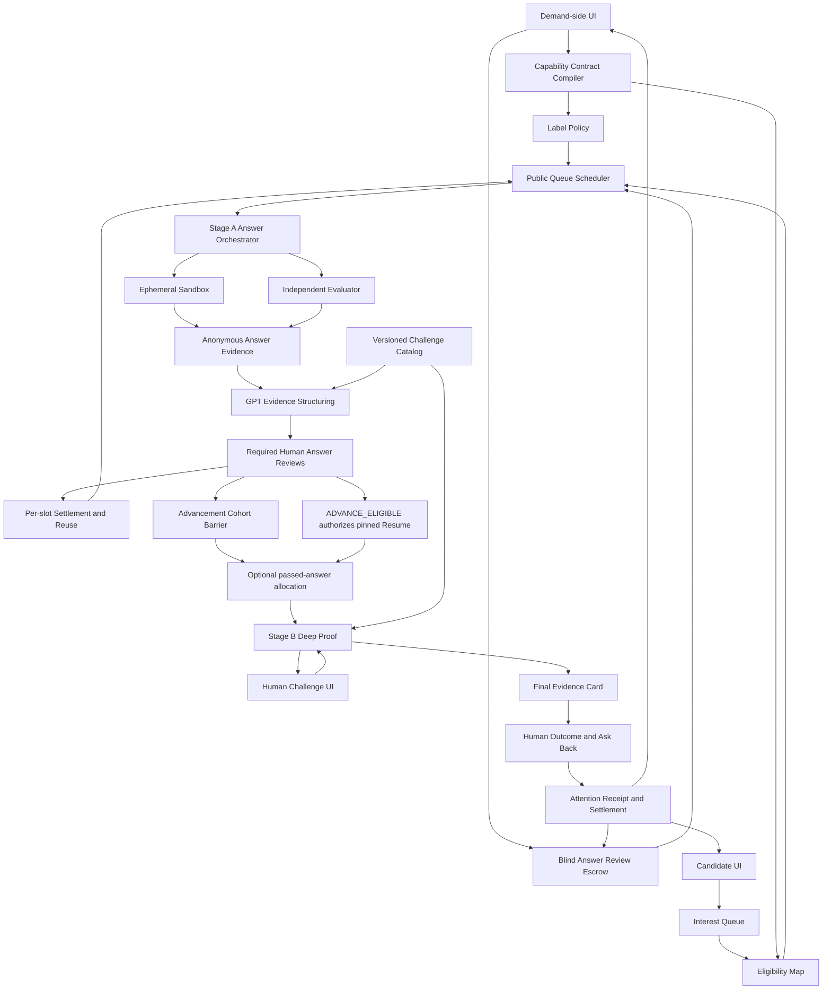

# OnlyBoth

## Label-blind, attention-backed work proofs

> **Hide the labels. Stake the attention. Test the work.**  
> 延迟最容易造成直觉判断的履历标签；先锁定需求方真人注意力；再让实际工作证据决定下一次接触。

**当前定位：** 面向招聘场景的 Label-blind Proof 与 Attention Escrow 机制。  
**首个可运行主链：** Senior Backend Engineer；另以二十个跨领域合成岗位验证机制通用性。
**推荐赛道：** OpenAI Build Week — Work & Productivity。  
**根问题：** Resume-first 筛选同时制造 False Positive 与 False Negative。  
**核心机制：** Label Veil、Blind Answer Review Escrow、Answer-first Selection、WIP-limited Proof Windows、Causal Human Checkpoint、Evidence / Attention Receipt。  
**文档状态：** 权威产品方案 v0.9，2026-07-21。
**规范性产品精神：** [`OnlyBoth-产品精神.md`](OnlyBoth-产品精神.md)。如本文旧段落或当前实现与该原则冲突，以该原则为准。

---

## 0. Override 声明

本版本整体替代：

- 原约会、社交与 Shared Table 方向；
- “所有候选人统一使用 GPT，再观察谁会挑战 AI”的 Proof 主线；
- 将 AI Interviewer、动态追问、面试 Copilot 或 Sandbox 本身视为产品创新的定位；
- 仅靠页面打开、停留时间或点击“已读”证明招聘者注意力的设计；
- 把一次短任务结果表述为候选人总体质量或最终工作表现的做法。
- 根据 Candidate Profile、自述 Claim、来源包装或 GPT rationale 在回答 JD 关键问题之前选择 Direct 的撮合顺序。

从本版本起，OnlyBoth 只解决一个明确问题：

> 招聘流程使用学校、前雇主品牌、头衔、照片与材料包装等快速代理信号，过早决定谁值得获得昂贵真人接触。这会让看起来强但无法通过岗位验证的人占据面试，也会让背景非标准但能完成工作的人在证明之前出局。

OnlyBoth 的五个不可破坏不变量：

```text
No held blind-review obligation → No candidate answer
No recorded answer evidence → No candidate selection
No completed cohort reviews → No Direct / Explore allocation
No work evidence → No pedigree reveal
No settled human obligation → That review Slot cannot serve the next candidate
```

### 0.1 当前可运行纵向链路

主 `/candidate` 与 `/employer` 入口现已使用 PostgreSQL 与私有 Object Storage 执行：

```text
temporary signed role session
→ PostgreSQL JobPost feed and reusable held Attention Slots
→ free Interest / backed Offer
→ versioned declarations + Candidate Credit 3→2
→ full-screen six-minute rich text / Voice Memo / disclosed platform GPT Sandbox
→ disclosed browser-focus warning / deterministic auto-submit boundary
→ immutable Answer Submission and Artifact manifest
→ one anonymous Employer Answer at a time
→ mandatory evidence-linked Human Review
→ Hold settlement + per-Slot release + next Queue offer
```

Candidate Credit 是不可转让的申请频率限制，不是 Bid、Boost 或排名。没有 Backed Offer 时只登记
Interest，不消耗 Credit；只有条款确认与 Answer Session 原子启动时消耗 1 Credit。Employer Review
Breach 或 Platform Abort 退还，Candidate 开始后自行放弃或空白超时不退还。

Employer 不能预取下一份 Answer；当前 `HumanAnswerReview` 事务成功前，API 与 DOM 都只返回最早的
一份未审 Submission。Review SLA 超时由 Worker 使用数据库时间结算 Breach：Candidate Credit
退还、Employer Hold 罚没、可靠性惩罚记录、Slot 退休，且不生成 Candidate Failure。

`/prototype` 与 `/demo` 保留为视觉/历史参考，不再是主产品入口或功能验收替代物。回答通过后的
pinned Resume Reveal 与 `/employer/candidates` 独立分页已接入真实链路；Advancement 与 Deep Proof
仍待接入。

顶层 App Shell 随签名 Session 切换 Breadcrumb 与导航：Candidate 只看到 Opportunity / Evidence
Passport，Recruiter 只看到 JobPosts / Revealed Candidates / Audit。完整履历页一次只显示一位已通过
Candidate，并把对应 Human Review Receipt 放在履历前；这不是匿名顺序审核页的子面板。

七名合成 Candidate 都可以在 `/candidate/evidence-passport` 维护各自 Candidate-only Evidence Ledger、
发布不可变 Snapshot，并在岗位 Feed 查看 GPT 生成的 evidence-linked discovery guidance。所有
开放岗位始终显示；这些信号不进入 Employer Projection、Eligibility、Interest Queue、Attention
或匿名审阅顺序。Demo 预载一份明确标记的 synthetic Snapshot；编辑后生成只走 LIVE Worker，
失败不切换 Fixture。`/login` 的 `Start as` 仅是 Demo operator 身份签发器，不进入 Employer
Projection；每位 Candidate 绑定不同 Credit、Passport、发现信号与 Resume Snapshot。Passport 的
最高学历为必填项，可明确选择 `NO_FORMAL_DEGREE`；毕业两年以内
的发现输入把学历证据置于工作/证书前，两年以上则把工作/证书置于学历前。该顺序不是分数，且
学校名称不进入 AI 输入。

### 0.2 关键问题统一为 Critical Challenge

主申请链不再把岗位输入建模为一个孤立字符串。`Critical Challenge` 是随 JobPost 一起封存的有序
Manifest，支持 `TEXT | AUDIO | IMAGE | FILE` Part；所有 Part 共同构成一次有限作答的上下文与
约束。Candidate 在登记 Interest 和花费 Credit 前可查看完整 Manifest，提交后 Employer 也审阅
同一版本。MVP 的媒体资源是有 hash、MIME、bytes 和 accessibility metadata 的本地合成材料。

初始合成目录包括一个支付可靠性工程岗和二十个跨领域岗位，覆盖会计、FP&A、BD、Enterprise
Partnerships、Brand Illustration、Product Design、Sales Leadership、Enterprise Sales、Growth、
Customer Success、Supply Chain、People、Legal/Privacy、Healthcare、Construction、Sourcing、
Content、Game Art 与 Sustainability。这个目录用于证明 Attention-backed blind answer 机制不依赖
代码题；它不让 GPT 或 Employer 在回答前对 Candidate 排名。

### 0.3 可选 Employer AI Evidence Analyst

需求方可以在 JobPost 发布前选择 `OFF | ANSWER_ONLY | ANSWER_PLUS_PROCESS`，并确认 1–8 条有限
Review Criteria。Candidate 在接受 Backed Offer 前看到所选 Policy、披露版本、数据范围、行为
分类规则及其用途，并随 Application 条款记录同意。OnlyBoth 的盲审承诺是不使用 Resume、学校、
前雇主等标签干扰首轮判断；它不承诺匿名 Answer 或经同意采集的作答过程不被需求方评价。

Answer 提交后，Worker 异步生成 source-linked Summary、`Good Answer | Bad Answer`、四项语言
表现、每条 Criterion 的四态证据结论、原文高亮、`still_unknown` 与 Reviewer Questions。Good/Bad
只评价当前封存 Challenge，不是 Candidate 总分。语言分析固定覆盖逻辑结构、清晰度、内部一致性
与响应度，每项必须引用冻结原文并显示绿色、黄色或红色严重度。

`ANSWER_PLUS_PROCESS` 额外展示 `AnswerProcessEvidence@2`：Submission 事务按版本化规则对首次内容
延迟、最长“没有服务器记录到修改”的区间、删改幅度、提交压力、披露式平台 GPT/Voice 使用与平台
故障分类为红/黄/绿。观测值、规则和 caveat 一起展示；中间草稿正文、按键、剪贴板、摄像头或生物
特征不进入 Profile。

这不是自动招聘决策：没有 Candidate-wide Score、排名、Advance/Close 建议或作弊/人格推断。
Process Evidence 不能改变 Criterion Finding 或 Good/Bad Verdict；红黄绿不是诚信真值，外部 AI 使用
不能由它证明，平台故障不得归责 Candidate。AI 关闭、分析中、失败或 `needs_human` 时，
Sarah 仍可完成相同的强制 Human Review；AI 不能预填 decision/comment，不能释放 Slot，也不能
读取下一份 Answer。人工先完成时迟到分析进入 `SUPERSEDED`。

产品不保证招聘者具有某种不可观察的心理状态。产品保证的是：

> 一个具名、已认证的需求方账号，在约定期限内，先对该候选人的 Stage A 证据授权一个会改变后续 Proof 的 Challenge，再对最终证据作出可引用的 Outcome；否则该 Window 不能正常结算，需求方也不能继续获得下一位 Proof Candidate。

---

## 1. Executive Summary

### 1.1 根问题：Profile prediction 与 work evidence 错位

传统招聘漏斗通常是：

```text
照片 / 姓名 / 学校 / 前雇主品牌 / 头衔 / LinkedIn包装
                         ↓
                决定谁获得面试
                         ↓
       到昂贵真人阶段才第一次验证实际工作能力
```

这同时造成：

- **False Positive risk：** 高 Prestige Signal 被误当成高岗位能力，消耗招聘者的完整面试时间；
- **False Negative risk：** 低 Prestige Signal 被误当成低岗位能力，候选人甚至没有产生行为证据的机会。

AI 进一步降低了简历、Cover Letter、项目描述和标准面试回答的包装成本。问题已经不是“谁会写一份好申请”，而是：

> 谁能够在受控条件下处理这个岗位真正昂贵、模糊、会变化的问题？

### 1.2 OnlyBoth 的三步反转

```text
1. Seal the question and labels
   先固定 JD 关键不确定性；延迟学校、雇主品牌、姓名、照片、Warm Intro和材料包装

2. Reserve the attention
   候选人开始回答前，招聘者锁定逐份盲答审核的Reviewer、期限、容量和履约后果

3. Test the work
   候选人在Closed Proof中回答真实岗位问题，需求方逐份审核后只能依据匿名回答证据选择下一次接触
```

OnlyBoth 不永久删除简历，也不隐藏与岗位直接相关的资格。它只改变信息顺序：

```text
Hard qualifications
→ public non-profile queue for reusable held review capacity
→ next eligible Interest receives the next backed Answer Invitation
→ Label-blind recorded answer evidence
→ required Human Answer Reviews
→ ADVANCE_ELIGIBLE + pinned résumé reveal in a separate Recruiter page
→ optional passed-answer Direct + deterministic Explore + held Deep Proof attention
→ Human checkpoint + evidence-linked outcome
├─ Advance + Candidate Continue → Full interview
└─ Close / clarify → Explicit outcome
```

### 1.3 GPT 的位置

GPT 主要位于需求方和制度层；当 Job Contract 显式选择
`PLATFORM_ASSISTANT_ALLOWED` 时，也可以作为 Candidate 侧完全披露的受限工具：

1. 将岗位、真实 Ticket、Repo 与最昂贵失败编译成 Capability Contract；
2. 候选人作答后，将实际 Answer、Artifact、事件与岗位不确定性结构化为可审计 Evidence Edge；
3. 根据候选人已经产生的 Artifact，从预验证 Catalog 为招聘者推荐三个可执行 Challenge ID；
4. 将事件、代码差异与测试压缩成可追溯 Evidence Card；
5. 帮助招聘者在几十秒内完成逐份、可归责的高密度 Review。
6. 在 Candidate Answer Session 内只读取封存问题、允许假设、当前草稿与本次对话，提供结构、
   反例或测试建议；完整 Trace 随 Answer 冻结，GPT 无权最终提交。
7. 将原始 Voice Memo 转写为派生 Transcript；原始音频仍为事实来源。
8. 在 Candidate 主动发布私有 Evidence Passport 后，把脱敏来源 ref 与公开 Job capability 建立
   Candidate-only discovery connection，并明确 `still_unknown`；不替 Candidate 决定 Interest。

GPT 不得在 Candidate 作答之前使用 Candidate Claim、Profile 或来源包装决定谁值得获得注意力。Answer Invitation 是可循环 Slot 的公开队列调度结果，不是候选人优劣判断；WIP、Credit 与 Explore 均由确定性程序控制；Direct 只能由真人在 Advancement Cohort 的必需匿名回答审核完成后选择。

未披露的外部模型仍被禁止。OnlyBoth 不声称网页可以证明房间里没有第二台设备。平台只保证：
浏览器没有 API Key，Candidate 只能通过版本化 Sidecar Command 使用允许的模型，完整对话/失败
会向 Reviewer 披露，模型没有 tools、web、files 或提交权限。需要无 AI 个人归因的岗位应 Seal
`PROHIBITED` Policy；当前功能 Demo 评估的是 Candidate 在披露式平台工具条件下的工作。

### 1.4 产品优化目标

OnlyBoth 不优化简历点击率，也不优化 AI 面试吞吐量。它优化：

> **在有限、已担保的人类注意力下，尽早暴露 Resume Signal 与岗位证据之间的错误。**

更具体地说：

- 在完整面试前暴露 False Positive risk；
- 让一部分传统 Profile 筛选会遗漏的人获得 Evidence-first 机会；
- 保证每一份被系统接受的正式 Application 都与需求方可验证义务同时存在；
- 用 Backpressure 防止招聘者无限发出未审阅任务。
- 用可循环 Slot 扩大实际被审核的候选人数量，而不是把并发容量误作岗位总申请上限。

---

## 2. 产品问题

### 2.1 False Positive：履历标签占据昂贵面试

招聘者在信息不足时会合理地使用学校、公司品牌、职位名称和表达流畅度作为快捷判断。但这些信号可以被包装，也可能与当前岗位最关键的能力无关。

False Positive 的真实成本不是“选错了一张简历”，而是：

- Hiring Manager 投入 30–60 分钟后才发现核心判断能力缺失；
- 面试名额被有限候选池中的错误优先级占用；
- 更适合的人在进入行为验证前被排除；
- 招聘团队继续强化“强标签 = 强能力”的反馈循环。

### 2.2 False Negative：能力在产生证据前被标签挡住

非标准候选人可能因为：

- 非名校或无传统学历；
- 小公司、自由职业或跨行业经历；
- 职业中断；
- 不擅长 LinkedIn 与简历营销；
- 缺少 Warm Intro；

而无法获得任何与真实岗位问题接触的机会。

OnlyBoth 不承诺这些人一定更优秀。它只为其中一小部分硬条件合格者保留受控 Explore 容量，使他们有机会让证据与 Profile prediction 发生比较。

### 2.3 最直观标签出现得太早

一旦招聘者先看到：

```text
Top-5 CS
Ex-BigTech
Staff Engineer
Warm referral
```

之后的证据很容易被已有判断解释。OnlyBoth 因此把第一轮输入分为三类：

1. 必须提前出现的硬资格；
2. 在 Proof 前暂缓展示的直觉标签；
3. 永远不应被推断或用于排序的受保护属性。

### 2.4 AI 让“答案正确”失去单一归因

产品采用强威胁假设：

> 外部前沿模型可以生成几乎所有预设面试题的高质量答案。

因此：

- 动态追问不能证明候选人独立完成；
- Hidden Test 只能验证 Artifact，不能验证作者；
- 行为轨迹也可能由场外模型指导；
- 披露式平台 GPT 验证的是 Candidate 与固定工具组成的工作系统，不是无工具个人能力。

因此 Candidate AI Policy 必须在岗位封存：`PROHIBITED` 用于无 AI 的个人能力归因；
`PLATFORM_ASSISTANT_ALLOWED` 用于评估透明的人机工作方式。两种模式都无法排除远程第二设备；
无法接受残余远程风险的岗位，不适合使用纯线上 OnlyBoth Proof。

### 2.5 候选人劳动与真人注意力没有交换关系

传统 Take-home、Case Study 和长 Proposal 常允许：

```text
候选人先投入
→ 需求方之后可以不读
→ 没有容量、期限、补偿或后果
```

OnlyBoth 反转顺序：

```text
需求方先锁定 Reviewer + Capacity + Deadline
→ 候选人 Proof 才能开始
→ 中途 Checkpoint 与最终 Outcome 都完成，Window 才能正常释放下一位
```

### 2.6 需求方真正缺的是高密度判断，而不是更多 Profile

招聘者并不缺候选人。他们缺：

- 能把岗位风险变成短而有效的验证；
- 不被背景标签抢先污染的第一轮信号；
- 能在几十秒内审阅的行为证据；
- 不会无限膨胀的在制任务；
- 对下一步有明确因果依据的候选人比较。

---

## 3. 产品承诺与诚实边界

### 3.1 我们承诺什么

- 正式 Proof 开始前绑定具名 Reviewer、SLA、WIP Token 与 Review Credit；
- 候选人回答前绑定一份明确的 Blind Answer Review Obligation；
- Proof 前延迟低质量直觉标签，保留必要资格与实质风险；
- 完整 Interest Queue 可以很大，但 Employer 在回答前不能搜索 Candidate Profile 或 Claim；
- 候选人不能购买、竞价或 Boost Attention Slot；
- Answer Review Slot 是可循环并发容量，而不是岗位总申请名额；每个已结算 Slot 必须按公开、非 Profile 队列规则服务下一位；
- Answer Invitation 使用确定性、非 Profile 的队列调度；Direct 只从已在盲履历阶段逐份通过的回答中
  产生，Explore 从同一 Advancement Cohort 剩余有效回答中公开分配；Allocation DTO 不接收 Resume
  score 或 AI Candidate rank；
- 每一份被系统接受并提交的正式 Application 都产生具名 Review Receipt，或进入可见 Employer Breach；
- 每个完成的 Proof 都必须产生中途 Human Checkpoint 与最终 Evidence-linked Outcome；
- 上一份 Review 未履约，该 Review Slot 的下一位正式候选人不能解锁；其他已结算 Slot 不受全岗位 barrier 阻塞；
- Evidence 只陈述可追溯行为、工具结果、修正与未知；
- 真人拥有推进、关闭和最终录用决定。

### 3.2 我们不承诺什么

- 不把 Interest 冒充 Application：Interest 只获得登记与队列回执；一旦 Candidate 在已担保 Slot 中提交回答，则保证产生具名、可追责的 Review Receipt 或 Employer Breach；
- 不保证每个 Interest 在岗位关闭前一定轮到 Slot；但 Opportunity 开放期间，Employer 不能从队列中按 Profile 挑人，Slot 结算后必须继续按公开规则循环；
- 不保证获得 Proof、面试、Offer 或录用；
- 不保证一次短任务预测完整工作表现；
- 不保证招聘者内心一定进行了认真思考；
- 不保证远程自有设备环境绝对不存在手机、耳机或第二台电脑；
- 不自动检测“AI 作弊概率”；
- 不根据眼神、表情、头部动作、按键节奏或人格推断自动淘汰；版本化、已披露的服务器 revision
  与提交信号可以进入人工审阅画像；
- 不永久隐藏必要资格、虚假经历、利益冲突或实质风险；
- 不自动录用或拒绝；
- 不把 Label-blind 等同于无偏见；
- 不替代 ATS、背景调查、完整面试和就业合规审查。

### 3.3 可验证的注意力定义

注意力是不可直接观察的心理状态。OnlyBoth 只保证五个可观察层级：

| 层级 | 可验证事件 |
|---|---|
| Availability | 具名 Reviewer 在 Candidate 作答前激活可循环 Blind Answer Review Slot、Credit 与期限 |
| Access | Candidate Answer Evidence 已送达并绑定一项必须完成的 Review Obligation |
| Accountable Review | Reviewer 对每份已承诺匿名回答引用 Evidence 形成结构化 Receipt |
| Causal Engagement | 完成必需 Answer Reviews 后，Reviewer 选择或修改一个会改变后续 Proof 的 Challenge |
| Outcome | Reviewer 引用 Evidence 推进、关闭或回答 Ask Back |

页面打开、停留时长和 AI 自动摘要不属于有效注意力。

### 3.4 Interest 不是 Application

CareerMutual/OnlyBoth 对“被看到”的承诺必须使用可验证定义：

```text
Interest
= 低成本登记 + 队列回执 + Opportunity 关闭通知
≠ 已经投递
≠ 已经获得个体人工判断

Application
= 已抵押 Slot 下提交的岗位回答
= 必须获得逐份 Human Review Receipt 或 Employer Breach
```

没有可用 Slot 时，产品关闭正式 `Apply`，只允许 `Register interest`。这不是拒绝 Candidate，而是拒绝平台接收一份当前无人承诺阅读的劳动。Employer 关闭 Opportunity 前必须显式看到等待数量并提交关闭动作；系统向仍在队列中的 Candidate 发送 Closure Receipt，且不生成 Reject 或能力结论。

### 3.5 双边价值交换

对应征方：

> 我的背景标签不会在我产生岗位证据前结束机会；我不会为一个没有真人承诺的正式任务投入劳动。

对需求方：

> 我保留最终录用权，也保留在匿名回答证据中的主动选择权；但在候选人回答前，我不能使用 Profile 或 Claim 决定谁值得获得本轮注意力。

---

## 4. 首发场景与角色

### 4.1 唯一 MVP：技术招聘

MVP 只实现：

> Sarah 招聘 Senior Backend Engineer。她需要在完整面试前验证候选人能否发现支付重试系统中的非原子状态转换。

选择该场景因为：

- False Positive 与 False Negative 可以通过同一岗位问题直观对比；
- 代码 Artifact 与并发测试可以确定性验证；
- GPT 可以根据真实 Ticket、Repo 与 Stage A Evidence，从预验证 Catalog 推荐招聘者侧 Challenge；
- Label Veil、Attention Escrow 和 Human Checkpoint 可以在三分钟内形成可见状态变化。

### 4.2 两位合成候选人

Demo 使用完全合成的数据：

**Candidate A**

- 传统 Resume Signal 很强；
- Top-5 CS、Tier-1 Tech、精致项目描述；
- 在 Proof 中采用表面合理但无法覆盖并发失败的修复。

**Candidate B**

- 传统 Resume Signal 较弱；
- 非标准背景、小公司经历、不擅长包装；
- 在 Proof 中定位原子性边界并通过确定性测试。

Demo 不声称 A 是“不合格的人”或 B 是“最佳候选人”。它只证明：

> A 的岗位证据与高 Resume Signal 冲突；B 的岗位证据与低 Resume Signal 冲突。

### 4.3 当前非目标

- 融资、合伙人或约会匹配的主 Demo；
- 通用人才市场和完整 ATS；
- 低价值、一次错误判断成本很低的海量微任务；
- 没有真实 Hiring Mandate 的职位；
- 无法定义岗位关键失败的招聘；
- 要求绝对远程无 AI 保证的高安全岗位；
- 使用真实敏感候选人数据的黑客松演示。

---

## 5. 两侧用例

### 5.1 候选人：背景非标准但有相关能力

陈默的用户故事：

> 我愿意完成一个六分钟岗位 Proof，但只有在具名 Hiring Manager 已经预留 Review、我的背景品牌不会先决定结果、并且我会得到一个候选人特定回应时才投入。

流程：

1. 可选维护 Candidate-only Evidence Passport，并用带来源的发现信号浏览全部开放岗位；不填写也不会失去岗位访问权；
2. 轻量表达岗位 Interest 与硬条件；Candidate Claim 和 Passport 不会进入需求方的回答前选择界面；
3. 不写长 Cover Letter，不支付 Bid；
4. 系统只用显式硬条件建立 Eligibility Edge；
5. 学校、公司品牌、姓名、照片和材料包装进入 Label Veil；
6. 如果可循环 Slot 可用，原子占用一个已锁定 Reviewer、期限和 Review Credit 的 Blind Answer Slot；否则获得 `WAITING_FOR_BACKED_SLOT` 回执和可解释队列状态，不被要求答题；
7. 接受版本化 Focus disclosure 后，在 JobPost 内的全屏、服务器计时 Answer Workspace 中使用
   富文本、Voice Memo，以及岗位允许时的披露式平台 GPT 回答已 Seal 的 JD 关键问题；外部 AI
   仍被禁止；原始 Voice Memo 是事实来源，成功的派生 Transcript 只能由 Candidate 主动插入草稿；
8. `sandbox-focus-policy@1` 将超过两秒的浏览器离开合并计数：第一次警告，第二次或累计十五秒
   自动封存已有持久内容；该来源标记不构成作弊或能力判断；
9. 获得 Sarah 针对该匿名回答提交的 Evidence-linked Review Receipt；
10. 如果回答被 Direct 或 Explore 选中，看到 Sarah 根据自己的 Artifact 选择了哪个 Challenge；
11. 完成 Stage B 并获得可展开 Evidence；
12. 收到推进、Evidence-linked Close 或候选人特定追问；
13. 使用一次 Ask Back 判断自己是否继续。

### 5.2 需求方：Hiring Manager

Sarah 的用户故事：

> 我希望在完整面试前发现一份强简历是否经不起真实岗位验证，也希望用极少 Explore 容量发现简历排序会漏掉的人。

流程：

1. 上传 JD、一个真实 Ticket 和最小 Demo Repo；
2. 告诉 GPT 该岗位最昂贵的失败和首次接触要减少的不确定性；
3. 确认 Capability Contract、Label Policy 与 Candidate AI Policy；
4. 设置可循环 Blind Answer Review WIP、Answer Review SLA、Advancement Cohort 大小、Stage B 容量和最终面试容量；
5. 在看不到 Candidate Profile、Claim 或 GPT 匹配理由时，先激活逐份 Answer Review Slots 与 Credits；
6. 系统按公开、确定性、非 Profile 的队列规则，把每个新空闲 Slot 交给下一位 eligible Interest；
7. 查看并逐份处理匿名 Stage A Answer Evidence；
8. 每份 Review 结算后，该 Slot 立即服务队列下一位；一个 Advancement Cohort 的必需 Review Receipts 完成后，仅依据该 Cohort 的匿名回答选择 Direct，系统从其中剩余有效回答确定性选择 Explore；
9. 从 GPT 推荐的三个预验证 Challenge ID 中为进入 Stage B 的回答选择一个；
10. 查看最终 Evidence Card；
11. 引用证据 Advance、Clarify 或 Close；
12. 回答 Ask Back，完成 Attention Receipt；
13. Answer Review Token 按 Slot 独立释放并持续服务队列；Deep Proof Token 在 Outcome 后释放。

---

## 6. Label Veil

### 6.1 延迟什么

第一轮默认暂缓展示：

- 姓名与头像；
- 学校名称和学校品牌；
- 前雇主名称和雇主品牌；
- Prestige title；
- Warm Intro 与推荐来源；
- 长篇自我营销；
- 与能力验证无关的设计包装；
- 自由文本中可直接恢复上述标签的片段。

### 6.2 必须保留什么

Proof 前可以显示或确定性检查：

- 工作许可和必要地区限制；
- 薪资、时间、时区和入职可用性；
- 岗位明确要求的执照或认证；
- 已确认的相关工作年限区间，如果确属必要；
- 明确技能声明与可验证 Artifact 类型；
- 利益冲突；
- 安全、诚信和法律上实质相关的事实。

### 6.3 永远不应推断什么

- 种族、民族、宗教、性别、性取向；
- 残障、健康或家庭状态；
- 年龄代理；
- “文化契合人格”；
- 基于姓名、照片、写作风格或声音的受保护属性。

### 6.4 信息顺序

```text
Hard facts visible
→ Pedigree labels sealed
→ Closed Proof evidence generated
→ Evidence-linked Human Answer Review recorded
├─ ADVANCE_ELIGIBLE + Backed Offer consent valid → Authorized Résumé Snapshot revealed
└─ Other Review result / consent invalid → Labels remain sealed to the reviewer
→ Optional post-answer Advancement + Deep Proof attention
```

标签 Reveal 后，Evidence Card 保持在决策界面最前方，避免资料页重新覆盖行为证据。

`ADVANCE_ELIGIBLE` 是需求方在看不到履历时对一次有限匿名 Answer 作出的通过判断。Review Receipt
与指定 Resume Snapshot 的 Reveal Authorization 原子提交；Recruiter 随后只能在独立分页页面查看
完整履历。Resume 不进入顺序 Review DTO，也不能回写已经提交的 Review 结论。

Demo 可以在独立的 Judge / Auditor Counterfactual 层显示合成候选人的原始标签与传统排序，用于证明 Prediction disagreement；该映射不属于 Sarah 的招聘界面，也不触发 Closed Candidate 的 Label Reveal。

### 6.5 实现边界

- 结构化字段由确定性规则隐藏；
- GPT 只能建议自由文本中的潜在代理片段；
- 最终 Label Policy 由需求方和平台模板确认；
- 所有隐藏、显示和 Reveal 事件进入 Replay；
- 候选人可以预览自己的 Label-blind Profile 并申诉错误删除；
- Label Veil 不能被用于掩盖虚假经历或必要资格缺失。
- 被 `Close` 的候选人默认不向 Reviewer Reveal 被封存标签；只有审计权限可以访问最小必要映射。

---

## 7. Capability / Attention Contract

需求方不能只上传一段 JD 后让 GPT 自由决定人才标准。GPT 必须追问：

- 该岗位最昂贵的实际错误是什么？
- 第一次接触真正要减少哪个不确定性？
- 什么可观察行为能支持或反驳该能力？
- 哪些硬资格必须在 Proof 前检查？
- 哪些 Prestige labels 不应参与第一轮？
- 候选人是否被允许使用 AI？当前功能 Demo 封存为
  `PLATFORM_ASSISTANT_ALLOWED`：只允许披露式平台 Sidecar，完整 Trace 随 Answer 冻结；需要无 AI
  个人能力证据的岗位必须另建 `PROHIBITED` Contract，但网页不能证明不存在第二设备。
- Reviewer 能同时履约多少个 Active Windows？
- 哪个中途 Checkpoint 与哪个最终 Outcome 才算完成承诺？

示例 Contract：

```json
{
  "opportunity": "Senior Backend Engineer",
  "reviewer": {
    "id": "sarah_chen",
    "display_name": "Sarah Chen"
  },
  "critical_failure": "duplicate_charge_after_retry",
  "decision_uncertainty": "can_reason_about_atomicity_and_failure_boundaries",
  "capabilities": [
    "clarify_ambiguous_failure",
    "inspect_state_transition",
    "design_verification",
    "revise_under_failover"
  ],
  "hard_facts_visible": [
    "work_authorization",
    "timezone_overlap",
    "required_language"
  ],
  "labels_sealed_until_backed_post_answer_advancement": [
    "name",
    "photo",
    "school_name",
    "previous_employer_name",
    "referral_source"
  ],
  "label_reveal_condition": "reviewed_answer_and_held_post_answer_advancement_with_prior_consent",
  "candidate_conditional_reveal_consent_version": "resume-reveal-consent@1",
  "closed_candidate_reveal": false,
  "candidate_ai_policy": "prohibited",
  "proof_assurance": "controlled_remote",
  "active_wip": 2,
  "blind_answer_review_wip": 8,
  "blind_answer_review_sla_hours": 24,
  "advancement_cohort_size": 8,
  "interest_queue_policy": "onlyboth.interest-queue@1",
  "direct_slots": 1,
  "explore_slots": 1,
  "candidate_effort_limit_minutes": 6,
  "checkpoint_sla_seconds": 90,
  "final_review_sla_hours": 24,
  "required_checkpoint": "approve_executable_candidate_specific_challenge",
  "required_final_action": "evidence_linked_advance_clarify_or_close",
  "attention_credit_per_window": 10
}
```

Contract 必须：

- 使用有限 Schema；
- 由需求方逐项确认；
- Seal 后生成版本与 hash；
- 同一比较组使用同一能力维度与难度带；
- Contract 变更不能回写已开始 Proof；
- Blind Answer Review WIP、Interest Queue policy、Advancement Cohort size、Answer Review SLA 和 Stage B 容量必须在 Candidate 回答前 Seal；
- 任务、Evidence、Challenge 和 Outcome 只能引用已确认维度；
- 候选人在接受 Window 前看到 AI Policy、监测范围、时间上限和 Review 承诺。

---

## 8. 核心漏斗与状态机

```text
Interest Queue
轻量登记；队列可大；有状态回执但尚未形成Application
        ↓
Eligibility
只检查显式硬条件
        ↓
Label Veil
Prestige proxies 暂缓展示
        ↓
Rolling Blind Answer Review Escrow
Reviewer + reusable Answer Review Slots + SLA + Credit 已激活
        ↓
Public Queue Scheduler
每个空闲Slot服务下一位；不读取Profile、Claim或模型排名
        ↓
Closed Proof — Stage A
平台不提供AI；规则禁止外部AI；候选人回答已Seal的JD关键问题
        ↓
Required Human Answer Reviews
具名Reviewer逐份引用Evidence形成Receipt
        ↓
Per-slot Settlement + Cohort Accumulation
该Slot立即循环；已审核Answer进入Advancement Cohort
        ↓
Answer-only Direct + deterministic Explore
当前Cohort所有必需审核完成后才允许分配Stage B
        ↓
Causal Human Checkpoint
招聘者批准一个会实际改变Stage B的Challenge
        ↓
Closed Proof — Stage B
候选人在新约束下修正并验证
        ↓
Evidence Card
Observed + Verified + Revised + Unresolved
        ↓
Human Outcome + Ask Back
Advance / Clarify / Evidence-linked Close
        ↓
Attention Receipt
Answer Slot按次循环；Deep Proof Token在结算后释放
```

### 8.1 状态机

```mermaid
stateDiagram-v2
    [*] --> Interest: Lightweight interest
    Interest --> Eligible: Hard constraints pass
    Interest --> Ineligible: Hard constraint fails
    Eligible --> Queued: No backed Slot currently available
    Eligible --> Veiled: Label policy applied
    Queued --> Reserved: Next reusable Slot offered
    Veiled --> Reserved: Reusable Slot available now
    Reserved --> StageA: Candidate accepts invitation
    Reserved --> Released: Declines or pre-start expiry
    StageA --> AnswerReviewPending: Answer evidence submitted
    StageA --> Withdrawn: Candidate exits
    AnswerReviewPending --> AnswerReviewed: Reviewer records evidence-linked review
    AnswerReviewPending --> Breached: Answer review SLA missed
    AnswerReviewed --> WaitingAdvancement: Receipt settles and recycles Answer Slot
    WaitingAdvancement --> ResumeRevealed: ADVANCE_ELIGIBLE + valid conditional consent
    ResumeRevealed --> AdvancementCommitted: Optional Cohort allocation and Deep Proof hold
    AdvancementCommitted --> CheckpointPending: Candidate accepts Deep Proof
    WaitingAdvancement --> Settling: Cohort closes without Deep Proof
    CheckpointPending --> StageB: Human approves challenge
    CheckpointPending --> Breached: Challenge SLA missed
    CheckpointPending --> Withdrawn: Candidate exits
    StageB --> EvidenceReady: Verification complete
    StageB --> Withdrawn: Candidate exits
    EvidenceReady --> OutcomeRecorded: Advance / Clarify / Close
    EvidenceReady --> Breached: Final SLA missed
    OutcomeRecorded --> AskBackPending: Candidate asks one question
    OutcomeRecorded --> Settling: Close / Clarify / Ask Back waived
    AskBackPending --> Settling: Answered or cannot disclose
    Breached --> Remediation: Notify, compensate, penalize
    Remediation --> Settling: Old slot retired
    Released --> Settling: Credit and token returned
    Withdrawn --> Settling: Exit recorded; no adverse inference
    Settling --> Settled: Settlement rule evaluated
    Settled --> [*]
    Ineligible --> [*]
```



### 8.2 候选人必须看懂的状态

| 状态 | 真人承诺 | 候选人成本 |
|---|---:|---:|
| `Interest recorded` | 无 | 几十秒 |
| `Eligible / labels sealed` | 无 | 无新增劳动 |
| `Waiting for backed slot` | 尚无个体审核义务；有队列策略和状态回执，没有能力结论 | 无新增劳动 |
| `Blind answer review reserved` | 有 Reviewer、Answer Review期限、Credit | 可选择是否回答 |
| `Answer review pending` | 有；必须产生具名 Review Receipt | 已投入 Stage A |
| `Answer reviewed` | 已发生 Evidence-linked 人工动作；该 Answer Review Slot 已循环给队列下一位 | 等待 Cohort disposition，不再占用第一层 Slot |
| `Anonymous answer passed` | `ADVANCE_ELIGIBLE` Review Receipt 与 pinned Resume Reveal 原子提交；完整履历只进入独立分页 Recruiter Workspace | 获得一次基于作答证据打开身份与履历的接触 |
| `Post-answer advancement committed` | Direct / Explore、Deep Proof Slot 与 Credit Hold 原子提交，不改写已完成的匿名 Review | 获得一份有下一阶段注意力担保的深入互动 |
| `Checkpoint pending` | 已根据匿名回答进入 Stage B，下一步由真人动作决定 | 已投入 Stage A |
| `Human challenge selected` | 已发生候选人特定动作 | 进入 Stage B |
| `Evidence ready` | 等待最终 SLA | 已完成有限 Proof |
| `Advanced / clarified / explicitly closed` | Checkpoint 与 Outcome 均已完成 | 获得下一步、问题或明确结束 |
| `Employer breached` | 未兑现；等待 Remediation Settlement | 获得通知、补偿状态与退出权 |

---

## 9. Attention Escrow 与 Backpressure

### 9.1 不请求承诺，而是控制流量

OnlyBoth 不依赖招聘者勾选“我保证会看”。平台控制正式候选人流量：

```text
Reviewer activates a bounded number of reusable Blind Answer Review Slots
→ each free Slot is offered to the next eligible Interest by public queue policy
→ each submitted answer creates one named Human Review Obligation
→ that obligation receives an Evidence-linked Review Receipt
→ its Slot settles and immediately serves the next queued Interest
→ reviewed answers accumulate in an Advancement Cohort
→ only after that Cohort is fully reviewed can post-answer Direct / Explore run
→ selected answers enter separate Deep Proof Windows
```

最有价值的抵押物不是现金，而是：

> 招聘者继续使用该审核 Slot 接收下一份正式 Application 的权限。

### 9.2 什么动作才释放 Token

Attention 有两种独立的履约单元：

1. **Blind Answer Review：** Reviewer 对每份已提交匿名回答引用 Evidence，记录 `ADVANCE_ELIGIBLE | NO_FURTHER_PROOF | INCONCLUSIVE`；
2. **Deep Proof Window：** Reviewer 根据被选中回答的 Stage A Evidence 选择一个可执行 Challenge，并对最终 Evidence 记录 Advance、Clarify 或 Close。

Advancement Cohort 中所有必需 Blind Answer Reviews 完成之前，Direct / Explore 选择保持锁定。但这不是岗位级流量 Barrier：每份回答收到 Review Receipt 后，其 Answer Review Slot 独立结算并按队列规则服务下一位。进入 Stage B 的回答另行占用 Deep Proof Slot，不重新占用已释放的 Answer Review Slot。

如果候选人在 Window 内使用 Ask Back，Reviewer 还必须回答或明确说明不能披露，Window 才能正常 Settlement。

以下不释放 Token：

- 打开页面；
- 浏览时长；
- GPT 自动生成结果；
- 未引用当前 Answer Evidence 的 `Reviewed` 点击；
- 批量 Reject；
- 没有 Evidence 引用的通用模板；
- 只有系统账号、没有具名责任人的动作。

### 9.3 Slot 循环与队列纪律

Slot 限制同时未结算的审核债务，而不限制岗位生命周期内能够被看到的 Application 总数：

```text
8 reusable Slots
≠ only 8 Candidates may apply

1 Answer Review settles
→ 1 Slot becomes AVAILABLE
→ next eligible Interest receives a backed offer
```

默认队列 `onlyboth.interest-queue@1` 按 `eligible_at`、`interest_created_at` 升序，并用公开 hash 打破同时间戳平局。Employer 不能重排、搜索、跳过或按 Candidate Profile 领取。Candidate 可以看到 policy version、自身状态和前方 eligible Interest 数量，但看不到其他 Candidate 身份。

Opportunity 只有在 Commitment 为 `ACTIVE` 且 Credit 可用时显示 `Guaranteed application slots active`。Commitment 暂停时正式 Apply 关闭；Opportunity 关闭时必须结算仍在等待的 Interest Closure Receipts。

### 9.4 违约

```text
On time
→ Credit returned
→ Token released immediately
→ Reliability maintained

SLA missed
→ Token remains occupied
→ That Slot's next candidate stays locked until remediation settles
→ Credit forfeited to candidate compensation pool
→ Reliability and future WIP reduced
→ Current slot is retired after notification and compensation are recorded

Repeated breach
→ New Proof Windows suspended
```

MVP 使用平台 Review Credits，不使用真钱、区块链或可交易 Token。

违约不是永久死锁。Remediation Service 必须先记录候选人通知、Credit 补偿、Breach 原因与 WIP 惩罚，之后才 retire 当前 Slot 并释放或销毁旧 Token。需求方能否继续进入下一位取决于惩罚后的新 WIP；重复违约时为零并暂停新 Window。

### 9.5 取消

- 候选人开始前，需求方可以无成本释放 Window；
- 候选人完成 Stage A 后，需求方不能走普通取消：必须完成 Checkpoint 与 Outcome，或进入会 forfeiture Credit 的 Employer Remediation；
- 岗位关闭时，未开始 Window 自动释放；
- 岗位关闭时，已开始 Window 仍必须完成两个动作或进入 Breach / Remediation；
- 候选人可以拒绝 Challenge 或退出，不影响其他机会。

候选人拒绝、No-show 或中途退出时进入非需求方违约 Settlement：系统记录退出、返还或释放 Token，不生成负面能力推断，也不要求不存在的 Human Outcome。

### 9.6 机械点击边界

平台无法证明招聘者真的思考。平台通过因果性提高机械点击成本：

- Challenge 必须引用 Candidate Artifact；
- Reviewer 的选择会实际改变 Sandbox 条件或 Hidden Test；
- 候选人可以看到谁选择了什么；
- 最终动作必须引用 Evidence ID；
- 低质量机械操作会直接损害需求方自己的判断；
- 抽样审计可以发现通用模板滥用。

产品应使用：

> Accountable human action

而不是不可证明的：

> Guaranteed thoughtful attention

### 9.7 为什么招聘者可能接受

- 完整 Interest Queue 不按初始并发 WIP 截断，回答前也不向 Employer 暴露 Candidate Profile 或 Claim；
- 招聘者自己设置 WIP；
- 招聘者自己设置 rolling Answer Review WIP、Advancement Cohort 与 Stage B 容量；
- 每次 Blind Answer Review、Checkpoint 与最终 Review 目标为 30–60 秒；
- Evidence Card 先于完整履历展示；
- 按时履约时 Credit 成本为零；
- Slot 可循环，不把当前并发容量变成岗位总共接触人数；
- 早期暴露 False Positive risk 可以减少完整面试浪费。

OnlyBoth 必须控制 Proof 解锁、候选人联系揭示、下一位访问权和可靠性状态。如果只是一个可以绕过的 ATS 插件，Attention Escrow 不具有强制力。

---

## 10. Blind Answer Invitation 与回答后 Direct / Explore

### 10.1 回答前不做候选人撮合

Candidate 作答之前，系统只允许执行：

```text
Sealed Contract
→ deterministic hard Eligibility
→ active reusable Blind Answer Review Slots
→ versioned, non-profile Interest Queue policy
→ next available Slot offer
```

Employer 看不到 Candidate Profile、Claim、来源包装或 GPT 匹配理由。GPT 也不得从这些材料建立候选人选择边。暂未轮到 Slot 的 Candidate 记录为 `WAITING_FOR_BACKED_SLOT`，不是 `abstain`、淘汰、已投递未读或能力不足。Scheduler 不是从池中选“赢家”，而是在每次 Slot 可用时继续处理队列。

Candidate 侧岗位发现不改变这条规则：Passport Signal 只回到该 Candidate 的 Job Feed，所有开放
岗位继续可见，Candidate 自己决定是否登记 Interest。Employer、Eligibility 与 Scheduler 不读取
Passport 或 Signal 表，因此这不是一个隐藏的 pre-answer MatchEdge。

### 10.2 回答后的 Evidence Edge

Candidate 提交 Stage A 后，GPT 可以把已经发生的工作结构化为：

```text
Sealed JD uncertainty
↔ Recorded Answer / Artifact / Event / Verification refs
↔ Allowed Stage B proof template
+ still_unknown
```

这个 `AnswerEvidenceEdge` 只描述“这份回答下一步值得验证什么”，不输出 Fit Score、人才排名或录用建议。

### 10.3 Direct 与 Explore

- **Direct：** 当前 Advancement Cohort 的所有必需 Blind Answer Reviews 完成后，需求方从已在盲履历状态下通过的 Answer 中选择一个继续验证；
- **Explore：** 从同一 Cohort 剩余的有效匿名回答中通过公开 seed 分配；
- Direct 与 Explore 都发生在 Candidate 回答之后；
- Public seed、输入 Answer refs、算法版本与结果进入审计事件；
- 候选人不能支付或竞价获得 Invitation 或 Stage B Slot。
- `ADVANCE_ELIGIBLE` Human Review 与 pinned Resume Reveal Authorization 原子提交；其他 Review
  结果、撤回、Decline、Breach 或 Platform Abort 保持封存。
- Direct / Explore Allocation 仍必须与 Deep Proof Slot、Credit Hold 和 capability-scoped Challenge
  pin 原子提交，但它们是后续互动的注意力约束，不再是首次 Resume Reveal 的前置条件。

UI 使用 `Advance this anonymous answer`，不使用回答前的 `Choose as Direct`。

每个 backed Offer 在创建时固定一个 `AdvancementCohortSeat`。前八个 Offer 属于 Cohort 1；第一个 Review 结算后，循环 Slot 发给第九位 Candidate 的 Offer 属于 Cohort 2，即使 Cohort 1 尚未完成。这样 Slot 可以持续循环，而 Candidate 的比较组不会受审核完成顺序影响。

### 10.4 基础容量模型

定义：

- \(i\in C\)：候选人；
- \(j\in D\)：岗位；
- \(a_{ij}\in\{0,1\}\)：确定性硬条件兼容；
- \(o_{ij}(t)\in\{0,1\}\)：时刻 \(t\) 是否占用一个尚未结算的 Answer Review Slot；
- \(s_{ij}\in\{0,1\}\)：是否已经提交正式 Application / Answer；
- \(r_{ij}\in\{0,1\}\)：已提交回答是否获得具名 Human Review Receipt；
- \(x_{ij}\in\{0,1\}\)：是否从匿名回答进入 Stage B；
- \(K_j^{answer}\)：可循环的 Blind Answer Review 并发 WIP；
- \(K_j^{deep}\)：Stage B Deep Proof 容量；
- \(Q_i\)：候选人同时可承担的最大 Active Window，MVP 为 1。

约束：

\[
o_{ij}(t)\le a_{ij}
\]

\[
\sum_i o_{ij}(t)\le K_j^{answer}\quad\forall t
\]

\[
s_{ij}\le o_{ij}(submitted\_at)

\]

\[
r_{ij}\le s_{ij}

\]

\[
x_{ij}\le r_{ij}
\]

\[
\sum_i x_{ij}\le K_j^{deep}
\]

\[
\sum_j o_{ij}(t)\le Q_i\quad\forall t
\]

系统还必须保证每个 \(s_{ij}=1\) 最终都有 \(r_{ij}=1\) 或结构化 Employer Breach；Slot 只能在 Review Settlement 后重新分配。运行 Direct / Explore 前满足的是当前 Advancement Cohort barrier，而不是岗位级 Slot barrier：Cohort 内所有有效 Answer 都已经有 Receipt，但已结算 Slot 可以同时服务下一 Cohort。MVP 不需要在主 Demo 展示公式，只展示“并发容量可循环、每份正式投递必审、选择只来自已审回答”的因果顺序。

---

## 11. Closed Proof

### 11.1 候选人 AI Policy

MVP 由 Job Contract 封存两种策略；当前功能 Demo 使用第二种：

```text
PROHIBITED
  Candidate-side platform AI: unavailable
  External AI: prohibited

PLATFORM_ASSISTANT_ALLOWED
  Platform GPT: available only through the disclosed server-side Sidecar
  Complete trace: sealed with the Answer and visible to the Reviewer
  Browser API key / tools / web / files / final-submit authority: none

Both policies
  External network from the Answer workspace: blocked
  Arbitrary file import and code execution: unavailable in this browser MVP
```

接受 Window 前，候选人必须看到：

- AI 使用规则；
- 工作区限制；
- 会记录的事件；
- Proof 时长；
- Review 承诺；
- 可申请的无障碍替代方式；
- 远程完整性保证的诚实边界。

### 11.2 能保证与不能保证

工作区可以强保证：

- 容器无公网出口；
- 候选人无法从工作区调用外部 AI API；
- 候选人无法在工作区安装本地模型或插件；
- 平台不向候选人暴露 OpenAI Key；允许的 GPT 只能由 Worker 调用并返回披露式 Trace；
- 文件导入、外部挂载和大段粘贴受限；
- 代码、命令、Diff、测试和时间线由服务端记录。

纯远程自有设备不能强保证：

- 房间里没有手机或第二台电脑；
- 没有隐形耳机或场外人类；
- 本机不存在所有系统级 Overlay；
- 候选人的每一步判断都完全独立。

产品只能标记：

> Completed in a controlled remote workspace under the disclosed monitoring policy.

不能标记：

> Proven AI-free.

### 11.3 两阶段 Proof

MVP 使用预约式短同步 Window：Stage A 提交后，Proof 计时暂停并保存只读 Snapshot；Sarah 必须在 90 秒内授权 Catalog Challenge。候选人看到具名 Reviewer 与倒计时。超时进入 Employer Breach，不让候选人隔数小时再返回一个临时 Sandbox。最终 Evidence-linked Outcome 可以在 24 小时 SLA 内异步完成，因为候选人已经在 Checkpoint 获得一次真实、因果性的接触。

```text
Stage A — Initial reasoning
候选人澄清、检查系统、提交初始Artifact
        ↓
Human Checkpoint
GPT从预验证、版本化的Challenge Catalog中为Sarah推荐三个候选人特定的Scenario ID
Sarah在允许参数内选择或修改一个
        ↓
Stage B — Revision
确定性Orchestrator按Scenario ID实际改变故障条件
候选人修正并运行验证
```

### 11.4 技术任务

Ticket：

> 支付服务在请求重试时偶尔重复扣款。诊断失败边界，并给出最小安全修复。

Stage A：

1. 候选人检查请求、Payment Intent 与持久化路径；
2. 提交初始修复；
3. 可见基础测试运行；
4. Evidence Extractor 生成初始 Brief。

GPT 在招聘者侧从版本化 Catalog 推荐：

```text
A. Inject Redis failover
B. Duplicate webhook delivery
C. Cross-region retry
```

Sarah 选择 `Redis failover`。确定性 Orchestrator 加载预验证 Scenario 与 Hidden Test，不执行 GPT 生成的任意代码，也不只是发送一句问题。

Stage B：

1. Candidate 看到 “Sarah chose to test Redis failover”；
2. 新测试暴露 acknowledgement-loss 路径；
3. 候选人修改状态转换；
4. 独立 Evaluator 返回最小必要测试结果。

### 11.5 评估边界

系统观察：

- 候选人检查了哪些状态；
- 提交了什么代码变化；
- 运行了哪些测试；
- 新约束出现后如何修改；
- 确定性测试是否通过；
- 仍有哪些问题未覆盖。

系统不推断：

- 人格；
- “诚信分”；
- 眼神或情绪；
- 写作风格代表的能力；
- 一次任务等于总体候选人价值。

---

## 12. GPT、确定性程序与真人分工

### 12.1 GPT 负责

- 将 JD、Ticket、Repo 与需求方回答编译为 Capability Contract；
- 识别未定义的决策不确定性；
- 从自由文本建议 Label Veil 片段；
- 为相同能力维度建议受模板约束的 Proof 变体；
- Candidate 作答后，将 Answer、Artifact、事件和 Verification refs 结构化为 Answer Evidence Edge；
- 根据 Stage A Artifact 从预验证、版本化 Catalog 推荐三个 Challenge ID；
- 将事件、Diff 与测试压缩为 Evidence Card；
- 为最终 Review 生成 Evidence-linked 选项；
- 记录仍未知的部分；
- 为 Replay 生成可读解释。
- 从 Candidate-only Evidence Passport Snapshot 生成公开岗位发现信号、source refs 与
  `still_unknown`，仅供 Candidate 自己浏览和决定 Interest；

### 12.2 确定性程序负责

- Contract Schema、版本、Seal 与 hash；
- Label Policy 的结构化字段隐藏；
- 硬资格、Eligibility Edge 与非 Profile Answer Invitation；
- rolling Answer Review Slot、Interest Queue、Advancement Cohort barrier、WIP、Credit 与公开-seed Explore；
- Sandbox、网络限制与资源限制；
- 独立 Hidden Test；
- Attention Token、Credit、SLA、Breach 与 Backpressure；
- Evidence 引用完整性；
- Human Action 与 Receipt 记录。

### 12.3 真人需求方负责

- 确认岗位最昂贵失败；
- 确认能力维度和 Label Policy；
- 在看到 Candidate 回答前锁定 Blind Answer Review Capacity；
- 对每份已承诺匿名回答提交 Evidence-linked Human Answer Review；
- 所有必需审核完成后，从已盲审通过的 Answer 集合选择 Direct；Allocation 只引用 Answer Evidence；
- 根据 Stage A Evidence 选择或修改 Challenge；
- 根据最终 Evidence Advance、Clarify 或 Close；
- 回答 Ask Back；
- 进行完整面试与最终录用决定。

### 12.4 GPT 不得负责

- 在 Sealed Contract 未明确允许披露式 Sidecar 时帮助 Candidate 答题；
- 自动录用、拒绝或排序整个人才池；
- 在 Candidate 作答前根据 Profile、Claim 或来源包装选择谁获得回答或接触机会；
- 把 Candidate discovery band 当作 Eligibility、队列顺序、Attention 分配或 Employer 排名；
- 把 `SYNTHETIC_SOURCE_ATTACHED` 改写成已验证的能力或材料真实性；
- 代替 Sarah 完成 Human Answer Review 或选择 Direct / Explore；
- 输出通用人才总分；
- 判断候选人是否“使用 AI 作弊”；
- 根据学校、雇主品牌、照片、声音或写作风格排名；
- 根据受保护属性或代理属性生成 Predicate；
- 冒充 Sarah 完成人类动作；
- 让 Candidate 文本修改 Rubric、System Prompt 或工具权限；
- 把无法验证的推断写成事实。

> **GPT prepares and compresses the buyer’s judgment; it does not impersonate the buyer’s attention or the candidate’s competence.**

---

## 13. Evidence 与 Attention Receipt

### 13.1 不输出黑箱总分

不输出：

```text
Candidate Score: 87
Culture Fit: 91%
AI Cheating Probability: 74%
```

输出：

```text
Capability
Failure-boundary reasoning

Observed
• Inspected whether payment execution and retry state were committed atomically
• Added a uniqueness constraint before the first hidden test

Verified
• Stage A concurrency tests: 4/6
• Stage B failover tests after revision: 6/6

Revised
• Changed the transition after Sarah introduced acknowledgement loss

Unresolved
• Cross-region replay was not evaluated
```

每项链接到事件、Diff、命令或 Verification Run。

### 13.2 Causal Human Checkpoint

候选人端显示：

```text
Sarah reviewed your initial artifact at 2:14 PM.
She chose to test:
Redis failover after payment acceptance.
```

这个动作必须：

- 发生在 Stage A 之后；
- 引用 Candidate Artifact；
- 改变 Stage B 环境；
- 由具名 Reviewer 提交；
- 进入不可回写 Timeline。

### 13.3 最终 Human Outcome

有效结果：

- `Advance`：引用 Evidence 并预留完整面试；
- `Clarify`：提出候选人特定问题；
- `Close`：引用 Evidence 给出明确关闭；
- `Answer Ask Back`：由需求方承担回答。

### 13.4 Ask Back

候选人拥有一次反向问题，例如：

> 这个岗位入职第一个月最可能负责的生产故障是什么？

需求方可以回答、选择预先确认答案，或明确说明暂不能披露。候选人收到回答后可以拒绝进入下一阶段。

### 13.5 Attention Receipt

```json
{
  "slot_id": "slot_42",
  "reviewer": "Sarah Chen",
  "labels_revealed_after_evidence": true,
  "reveal_reason": "backed_post_answer_advancement",
  "conditional_reveal_consent_version": "resume-reveal-consent@1",
  "checkpoint": {
    "evidence_refs": ["E17", "D04"],
    "challenge": "redis_failover",
    "completed_at": "2026-07-18T14:14:00Z"
  },
  "verification_refs": ["T06"],
  "outcome": "interview_unlocked",
  "ask_back_answered": true,
  "sla": "fulfilled",
  "credit": "returned",
  "token": "released"
}
```

---

## 14. 隐私、公平与高风险边界

### 14.1 Label Veil 不是隐藏缺陷

暂缓展示的是低质量背景代理信号。必须如实处理：

- 必要资格；
- 虚假经历；
- 利益冲突；
- 安全风险；
- 会实质改变录用条件的事实。

### 14.2 候选人权利

- 在接受前知道规则、时长、Reviewer、期限与监测范围；
- 预览 Label-blind Profile；
- 申请无障碍替代形式；
- 查看用于 Evidence 的事件；
- 申诉错误的事件或摘要；
- 拒绝 Challenge 或退出；
- 请求删除非必要原始记录；
- 不因申请便利安排而被推断残障或健康信息。

### 14.3 录制与监考

MVP：

- 不实现摄像头 AI 监考；
- 不实现眼神、情绪、姿态或打字节奏判断；
- Answer Sandbox 只记录浏览器报告的 `visibilitychange` 与 window focus；不记录鼠标轨迹、按键
  内容、打开的网站或其他应用名称；
- `sandbox-focus-policy@1` 使用数据库接收时间：两秒宽限、第一次警告、第二次或累计十五秒
  自动封存；麦克风权限最多豁免三十秒；
- 完整 Focus 事件只进入 Candidate/内部审计边界；Employer 只收到自动封存来源及其版本化行为
  严重度，不读取原始 Focus 时间线；
- 行为画像可以帮助 Reviewer 提出本次能力/诚实度核查问题，但不生成作弊概率、Integrity Score
  或自动 Reject；浏览器事件缺失和平台失败不能归因于 Candidate；
- 当前 Answer Workspace 是受限浏览器工作区，不声称阻断第二设备或所有外部工具；
- 使用合成 Replay。

生产 High-Assurance Mode 可以选择：

- 屏幕、麦克风、摄像头录制；
- 身份核验；
- 安全客户端与单显示器检查；
- 真人复核完整性事件；
- 明确最短留存周期与替代评估。

这些能力提高违规成本，但不能提供绝对无第二设备证明。

### 14.4 高风险决策

- OnlyBoth 不自动拒绝；
- Evidence 仅作为人工决策输入；
- Candidate 条款授权是数据边界与产品公平交换，不是合规豁免。若行为严重度或 Good/Bad Answer
  实质辅助筛选，纽约市部署需单独判断是否属于 AEDT 并满足偏差审计、公开结果、提前通知与替代
  流程；参见 [NYC DCWP AEDT](https://www.nyc.gov/site/dca/about/automated-employment-decision-tools.page)。
- 必须提供无障碍替代流程，避免时间、输入方式或修订轨迹把能够完成工作的残障 Candidate 错误
  筛出；参见 [EEOC AI 与残障招聘指引](https://www.eeoc.gov/newsroom/us-eeoc-and-us-department-justice-warn-against-disability-discrimination)。
- 欧盟招聘、人员选择和基于个人行为的工作评价可能属于 AI Act 高风险用途；真实部署必须完成
  风险管理、数据治理、文档、日志、透明度与人工监督评估；参见
  [Regulation (EU) 2024/1689](https://eur-lex.europa.eu/legal-content/en/TXT/?uri=CELEX%3A32024R1689)。
- 动态任务必须做难度、岗位相关性与群体公平校准；
- 真实部署前必须完成就业、隐私、无障碍和自动化决策合规评估；
- 产品不能把 Hackathon 合成结果宣传为有效性研究。

---

## 15. 技术架构



### 15.1 组件职责

| 组件 | 职责 | MVP |
|---|---|---|
| Contract Compiler | 岗位风险 → 结构化 Contract | GPT structured output + Schema |
| Candidate Evidence Passport | 私有合成来源 Ledger、不可变 Snapshot 与 Candidate-only Job discovery | Candidate 42 seed + LIVE refresh |
| Label Veil Engine | 隐藏 Prestige proxies | 结构化规则 + 合成文本 |
| Interest Queue | 轻量意向、硬条件、公开队列策略与状态回执；回答前不暴露 Profile/Claim | 20 个合成候选人 |
| Eligibility Map | 显式硬资格边 | 确定性检查 |
| Queue Scheduler | 每个可循环 Slot 按公开非 Profile 顺序服务下一位 Interest | 8 个并发 Slot，持续处理队列 |
| Blind Review Escrow | Reviewer、可循环 Answer Review Slots、Credit、SLA | 平台 credits 状态机 |
| Human Answer Review | 每份正式 Application 的 Evidence-linked Receipt | 单 Slot Settlement |
| Advancement Cohort | 汇集已审核 Answer；不控制 Slot 循环 | 8 份已审核 Answer |
| Advancement Allocator | Cohort 完成后的 Direct 与公开-seed Explore | 1 Direct + 1 Explore |
| Closed Proof | Stage A Answer / Human Challenge / Stage B | 一个支付重试场景 |
| Sandbox | 隔离代码、无公网、事件记录 | 加固临时容器 |
| Evaluator | Hidden Tests | 独立并发测试 |
| GPT Evidence Service | 根据 Evidence 推荐 Catalog Challenge 并压缩证据 | 三个版本化 Scenario ID |
| Human Review UI | 选择 Challenge、Advance、Close | Sarah 端 |
| Receipt / Replay | 标签、Proof、动作、结算时间线 | 一键重放 |

### 15.2 最小数据模型

| 实体 | 关键字段 |
|---|---|
| Opportunity | `id`, `owner_id`, `status` |
| ContractVersion | `opportunity_id`, `schema`, `hash` |
| LabelPolicy | `visible_fields`, `sealed_fields`, `reveal_condition` |
| CandidateEvidencePassportDraft | `candidate_id`, `version`, `evidence_items`, `updated_at` |
| CandidateEvidencePassportSnapshot | `candidate_id`, `snapshot_version`, `hash`, `source_refs`, `consent_version` |
| CandidateDiscoverySignalSet | `candidate_id`, `passport_snapshot_ref`, `job_set_hash`, `status`, `ai_output_ref` |
| CandidateJobDiscoverySignal | `opportunity_id`, `capability_refs`, `evidence_refs`, `band`, `still_unknown` |
| Interest | `candidate_id`, `hard_facts`; claims never enter pre-answer Employer selection |
| EligibilityEdge | `candidate_id`, `opportunity_id`, `reason_refs` |
| BlindReviewCommitment | `reviewer_id`, `answer_review_wip`, `answer_review_sla`, `queue_policy_version`, `stage_b_capacity`, `status` |
| AnswerReviewSlot | `commitment_id`, `ordinal`, `current_obligation_id`, `status`, `version` |
| AnswerReviewObligation | `slot_id`, `candidate_id`, `credit_hold_id`, `status`, `deadline` |
| AnswerInvitation | `obligation_id`, `cohort_seat_id`, `candidate_id`, `queue_position_ref`, `policy_version`, `public_tie_break` |
| AnswerSubmission | `slot_id`, `snapshot_ref`, `artifact_ref`, `hash`, `submitted_at` |
| AnswerEvidenceEdge | `answer_ref`, `uncertainty_ref`, `evidence_refs`, `proof_template_ref`, `still_unknown` |
| HumanAnswerReview | `answer_ref`, `reviewer_id`, `decision`, `evidence_refs`, `completed_at` |
| AdvancementCohort | `commitment_id`, `sequence`, `target_size`, `state` |
| AdvancementCohortSeat | `cohort_id`, `ordinal`, `obligation_id`, `answer_ref`, `review_ref`, `state` |
| AdvancementAllocation | `cohort_id`, `direct_answer_ref`, `explore_answer_ref`, `seed`, `algorithm_version`, `deep_proof_hold_refs`, `reveal_authorization_refs` |
| AttentionSlot | `answer_evidence_edge_id`, `kind`, `status`, `checkpoint_deadline`, `final_deadline` |
| ProofSession | `slot_id`, `stage`, `events`, `ai_policy` |
| StageASnapshot | `proof_id`, `artifact_ref`, `remaining_time`, `created_at` |
| VerificationRun | `proof_id`, `test_version`, `result` |
| HumanCheckpoint | `slot_id`, `reviewer_id`, `evidence_refs`, `challenge_id`, `completed_at` |
| EvidenceItem | `proof_id`, `type`, `statement`, `source_ref` |
| HumanOutcome | `slot_id`, `type`, `evidence_refs`, `completed_at` |
| AskBack | `slot_id`, `question`, `answer` |
| AttentionReceipt | `slot_id`, `timeline`, `outcome`, `settlement` |
| BreachSettlement | `slot_id`, `reason`, `notice_at`, `compensation`, `wip_after`, `retired_at` |

### 15.3 Sandbox 边界

```text
Candidate Browser
├── sealed Critical Challenge + TipTap editor
├── original Voice Memo + derived Transcript insertion
├── disclosed platform GPT when Contract permits
└── versioned visibility/focus events; no content or destination capture
          ↓
Session Control Plane
├── database-time deadline and Focus projection
├── append-only raw Activity timeline
├── MANUAL / DEADLINE_AUTO / FOCUS_POLICY_AUTO seal
└── immutable Artifact manifest
          ↓
Private Object Storage + Worker
├── create-only rich text / audio / transcript / GPT trace
├── bounded transcription and assistant settlement
└── no browser OpenAI key
```

本节描述主 Application Answer Workspace，不是尚未接入的 Stage B Docker code Sandbox。生产环境
运行不可信多租户代码时仍需要更强的隔离。

---

## 16. 三分钟 Demo

### 16.1 演示原则

Demo 使用 Outcome-first Cold Open：

1. 前 30 秒先展示 Resume prediction 被岗位证据反转；
2. 之后用“Rewind”解释 Label Veil、Attention Escrow、GPT 与 Human Checkpoint；
3. 不从上传 JD、后台设置或算法公式开始；
4. 不把 AI Interviewer、Sandbox 或 Scorecard 当作高潮。

### 16.2 前 30 秒

#### 0:00–0:07：传统排序的反事实

画面顶部必须明确标注：

```text
COUNTERFACTUAL — conventional résumé ranking
Judge overlay only · never shown to Sarah
```

然后显示：

```text
Candidate A
Top-5 CS · Tier-1 Tech
Traditional résumé rank: #1
→ 30-minute interview

Candidate B
Nontraditional background · Local company
Traditional résumé rank: #73
→ Auto-rejected
```

旁白：

> **A conventional résumé screen would interview A and reject B before either produced job-specific evidence.**

#### 0:07–0:12：Seal the labels

切入 Sarah 第一次真正看到的 OnlyBoth 界面。标签和 Candidate Claim 从未向她显示；她只看到已 Seal 的岗位问题和可激活的 rolling review capacity：

```text
Critical question sealed
20 hard-eligible interests
Candidate profiles unavailable before answers
```

旁白：

> **OnlyBoth delays pedigree—not qualifications—until work evidence exists.**

#### 0:12–0:18：Stake the attention

候选人的 `Start Proof` 按钮最初锁定：

```text
Candidate work locked
No human review reserved
```

Sarah 点击 `Activate 8 reusable review slots`：

```text
Reviewer: Sarah Chen
Concurrent blind review slots: 8
Answer review deadline: 24 hours after submission
Deep proof windows after review: 2
Final review deadline: Today, 4 PM
Advancement cohort: 8 reviewed answers
Each settled slot: immediately serves the next queued interest
Direct / Explore selection: locked until cohort reaches 8/8 reviews
```

公开 Queue Scheduler 向队列前8名发放有担保的 Answer Invitations。这里的8是并发 WIP，不是总申请上限。Candidate 在接受前看到 Sarah、SLA、时长和已冻结 Credit。

旁白：

> **No application is accepted until Sarah funds its named review—and every settled slot immediately serves the next person waiting.**

#### 0:18–0:27：Test the work

加速播放两份代表性的已记录 Stage A Answer，并显示 Advancement Cohort 已逐份审核：

```text
Blind Answer 17
Human review receipt: complete
Stage B result: 2/6

Blind Answer 42
Human review receipt: complete
Stage B result: 6/6

Advancement cohort: 8/8 human reviews complete
Slot #1 settled → next queued interest offered
```

#### 0:27–0:30：Reveal the disagreement

```text
Prestigious résumé
→ Verified evidence contradicted the strong profile signal
→ FALSE-POSITIVE RISK EXPOSED

Nontraditional résumé
→ Verified evidence contradicted the weak profile signal
→ FALSE-NEGATIVE RISK SURFACED
```

这张 Crosswalk 只存在于合成 Demo 的 Judge / Auditor 层；Sarah 对被 Close 的 Candidate 17 仍看不到被封存标签。

收尾画面：

> **Résumé picked A. Work evidence surfaced B.**

### 16.3 后 150 秒

#### 0:30–0:50：Rewind — GPT 编译岗位风险

Sarah 提供 JD、Ticket 和 Repo。GPT 生成：

```text
Critical failure
Duplicate execution after retry

Decision uncertainty
Can reason about atomicity and failure boundaries

Proof
Diagnose → modify → verify under failover
```

旁白：

> GPT does not rank people. It turns Sarah’s real hiring uncertainty into the smallest work sample capable of resolving it.

#### 0:50–1:10：Rolling Blind Answer Slots

```text
20 eligible Interests
8 active reusable Review Slots
8 backed offers now
12 WAITING_FOR_BACKED_SLOT, not rejected
next offer is triggered by the first settled Review
0 Candidate profiles shown to Sarah
```

旁白：

> Sarah activates reusable review capacity before anyone answers. The public queue—not profile prediction—decides who receives each next backed offer.

#### 1:10–1:45：展开两份 Closed Proof

- Candidate 端只提供可披露、无提交权限的平台 GPT；外部 AI 被规则禁止；
- Sandbox 外网调用失败；
- 当前占用8个 Slot 的 Candidate 回答同一个已 Seal 的 JD 关键不确定性；
- Candidate 17 与 Candidate 42 的代表性回答形成可展开 Evidence Brief；
- Sarah 必须为8份回答分别提交引用 Evidence 的 Review Receipt。
- 第一份 Review 结算时，界面同时展示该 Slot 已向下一位 queued Interest 发出 backed offer，证明岗位没有被初始8人截断。

#### 1:45–2:15：回答后选择与真人因果介入

Advancement Cohort UI 从 `7/8 reviewed — selection locked` 变为 `8/8 reviewed — selection unlocked`。这不阻塞已结算 Slot 服务下一位。Sarah 只能从已在盲履历状态下通过的 Answer 集合选择；Allocation DTO 只引用 Answer Evidence：

```text
Direct → Blind Answer 42
Explore → Blind Answer 17 (public seed)
```

随后 GPT 从预验证 Catalog 为两份被选中回答分别推荐 Scenario ID。Sarah 必须各选择一个：

```text
Blind Answer 17 → duplicate_webhook_v2
Blind Answer 42 → redis_failover_v1
```

确定性 Orchestrator 分别改变两个 Sandbox。Candidate 17 最终为 2/6；Candidate 42 修改后为 6/6。两份 Window 都真实经过 Stage A → Human Checkpoint → Stage B。

候选人端显示：

> Sarah reviewed your artifact and chose where to challenge you next.

#### 2:15–2:40：结果与 Ask Back

Sarah：

- 对 Candidate 17 选择 Evidence-linked Close；
- 对 Candidate 42 解锁 15 分钟真人面试；
- 回答 Candidate 42 的 Ask Back。

#### 2:40–3:00：Receipt、Backpressure 与商业结果

显示：

```text
8/8 cohort answers received human review receipts
1 settled answer-review slot already served the next queued interest
1 profile false-positive risk exposed by answer evidence
1 profile false-negative risk surfaced by answer evidence
0 unbacked candidate work
2/2 deep human reviews fulfilled
1 next-step recommendation changed by evidence
```

Sarah 对两人都完成最终 Evidence-linked Outcome 后：

```text
2 checkpoints + 2 outcomes fulfilled
→ Deep Proof Tokens released
→ Rolling Answer Slots continue serving the queue
```

最终 Pitch：

> **OnlyBoth accepts no application without a funded human review, recycles every settled review slot to the next person waiting, and lets anonymous work—not résumé prestige—decide who earns the deeper conversation.**

### 16.4 十秒 Wow

```text
Résumé said A
Work evidence said B

Candidate work: locked
→ Sarah reserves review
→ Proof unlocks
```

核心不是“AI 完成面试”，而是：

> **一个高排序 Profile 未通过这次岗位 Proof；一个低排序 Profile 通过并获得真人下一步。**

### 16.5 前 30 秒不要出现

- WIP、Bond、LP 或数学公式；
- GPT 架构；
- Upwork、CoderPad、HackerRank；
- “公平招聘”的长篇论述；
- AI Score；
- 摄像头监考；
- 完整岗位创建流程；
- 产品功能清单。

---

## 17. 五天 MVP

### Day 1：双端 UI 与 Label Veil

- Opportunity 与合成候选人；
- Traditional résumé view；
- Label-blind Profile；
- 字段 Seal / Reveal；
- 候选人和 Sarah 两个独立客户端；
- 前 12 秒 Cold Open 动画。

### Day 2：Contract、Eligibility 与 Attention Escrow

- JD / Ticket → Capability Contract；
- Schema、确认、Seal；
- 硬资格 Edge；
- Rolling Blind Answer Review Commitment、可循环 Slot、公开 Queue Scheduler 与 `WAITING_FOR_BACKED_SLOT`；
- Answer Review Token、Credit、SLA；
- `No review → Proof locked`；
- `No completed cohort reviews → Selection locked`，同时验证已结算 Slot 不被 Cohort barrier 阻塞。

### Day 3：Closed Proof 与 Verifier

- 支付重试 Demo Repo；
- Stage A / Stage B；
- 无公网 Sandbox；
- 禁止文件导入；
- 独立 Hidden Evaluator；
- Candidate A / B 两套固定 Replay；
- 六个并发与 Failover 测试。

### Day 4：GPT 与 Human Checkpoint

- 回答后 Answer Evidence Edge 与逐份 Human Answer Review；
- 所有必需 Review Receipts 完成后解锁 Direct / Explore；
- GPT 从预验证 Catalog 推荐三个 Challenge ID；
- Sarah 选择后修改 Sandbox Scenario；
- Evidence Brief 与 Evidence Card；
- Evidence-linked Advance / Close；
- Ask Back；
- Attention Receipt。

### Day 5：演示与可靠性

- 前 30 秒 Cold Open；
- 三分钟固定脚本；
- SLA 加速演示与 Breach fallback；
- Mock GPT fallback；
- 一键重置；
- 全链路 Replay；
- README、测试与提交材料。

### 17.1 MVP 必做

- 一个岗位；
- 两名核心合成候选人，加 18 名轻量池候选人；
- Resume-first counterfactual；
- Label Veil；
- Attention Escrow 与 Backpressure；
- 8 个可循环 Blind Answer Review Slot、公开 Interest Queue、逐份 Review Receipt、8-answer Advancement Cohort，以及回答后的 1 Direct + 1 Explore；
- 平台候选人端不提供 AI；外部 AI 被规则禁止，但不声称绝对可证明；
- 一个受控技术 Proof；
- Stage A → Human Checkpoint → Stage B；
- 确定性测试；
- Evidence 与 Attention Receipt；
- Advance、Close、Ask Back；
- 前 30 秒反转。

### 17.2 明确不做

- 完整 ATS 或真实人才市场；
- 真实敏感招聘数据；
- 生产级真钱 Bond；
- 自动录用或拒绝；
- 通用人才分；
- AI 作弊概率检测；
- 摄像头 AI 监考、情绪或眼神分析；
- 生产级 Secure Desktop；
- 大规模题目难度校准；
- 完整背景调查；
- 融资、合伙人与约会场景；
- 把 Interest 伪装成已提交 Application；Interest 获得队列/关闭回执，只有占用已抵押 Slot 并提交 Answer 才形成逐份审核义务；
- 宣称短 Proof 已经预测长期工作表现。

---

## 18. 指标与验证

### 18.1 MVP 可以严格证明

| 指标 | 目标 |
|---|---:|
| 未绑定 Reviewer 的正式 Proof | 0 |
| 系统接受但没有已抵押 Review Slot 的正式 Application | 0 |
| 已抵押并提交的 Blind Answer 缺少 Human Review Receipt | 0 |
| Candidate Answer 前发生的 Direct / Explore 选择 | 0 |
| Employer 回答前 payload 中的 Candidate Claim、Profile 或 GPT rationale | 0 |
| Advancement Cohort 未完成全部必需 Reviews 却解锁选择 | 0 |
| 已结算 Answer Review Slot 因 Cohort 未完成而未服务队列下一位 | 0 |
| Evidence 前在 Reviewer UI 显示被 Seal 的 Prestige label | 0 |
| Active Proof 超过 WIP | 0 |
| Checkpoint 或最终 Outcome 未完成却正常解锁下一位 | 0 |
| Sandbox 对外网络成功访问 | 0 |
| 未披露或不属于当前 Answer Session 的 Candidate-side GPT 调用 | 0（不等于证明房间内无第二设备） |
| 平台 GPT 对话缺少冻结 Trace 或 Reviewer disclosure | 0 |
| Evidence Item 缺少事件或测试引用 | 0 |
| 完成 Proof 缺少候选人特定动作 | 0 |
| 相同版本和 seed 无法重放 | 0 |

### 18.2 Demo 应测量而不是虚构

- Sarah 实际完成 Checkpoint 的秒数；
- Evidence Card 实际审阅秒数；
- 候选人 Formal Proof 的实际时长；
- Token 被锁定和释放的状态；
- Resume ranking 与 Proof evidence 的实际分歧；
- Stage B 测试的实际结果。

不得声称：

- “减少 40% 错误招聘”；
- “提高 83% 招聘效率”；
- “准确预测工作表现”；
- “消除招聘偏见”；
- “保证 AI-free”；

除非未来真实实验支持。

### 18.3 真实产品首先验证的假设

最重要的不是模型准确率，而是需求方是否接受机制：

> 招聘者是否愿意在看不到 Candidate Profile 或 Claim 时，激活可循环的匿名岗位回答 Review Slots，并接受每份正式 Application 必审、未履约会冻结对应 Slot？

最小实验：

1. 访谈 5–10 名有真实招聘需求的 Hiring Manager；
2. 让其在 Prototype 中选择 rolling Answer Review WIP、Advancement Cohort、Stage B WIP 与 SLA；
3. 观察是否愿意锁定平台 Credit，并在每份审核结算后让 Slot 自动服务下一位；
4. 测量完成一个 Causal Checkpoint 的时间；
5. 比较 Resume-first 与 anonymous-answer-first 的选择分歧；
6. 询问候选人是否把 Human Checkpoint 感知为真实互动；
7. 记录招聘者是否试图绕过或机械完成动作。

### 18.4 后续效果指标

- Resume–Proof disagreement rate；
- Resume-selected 与 answer-selected 候选人的分歧率；
- Answer Direct 与公开-seed Explore 在 Stage B 的 Evidence 分歧；
- Review SLA 履约率；
- Interest → backed Slot 等待时间与队列完成率；
- 每个 Slot 在 Opportunity 生命周期内实际完成的 Application 数；
- Evidence → Full Interview 转化；
- Full Interview 中无效会面的变化；
- Candidate Ghost rate；
- Candidate perceived human contact；
- 每个有效下一步所需 Hiring Manager 时间；
- 不同任务变体的难度一致性；
- Employer breach 与绕过率。

这些指标描述风险与流程，不把短 Proof 当作最终 Ground Truth。

---

## 19. 竞争边界

### 19.1 已经存在的能力

| 能力 | 直接先例 | OnlyBoth 不能声称 |
|---|---|---|
| AI 自动初面与动态追问 | Alex、HireVue、CodeSignal、Mercor、Braintrust AIR | “首个 AI Interviewer” |
| 真人面试 + 实时 AI Coach | CoderPad AI Interview Coach | “首次让 GPT 坐在面试官背后” |
| 真实 Repo、IDE、回放与完整性信号 | HackerRank、CoderPad、CodeSignal、Karat | “首个 AI-era 技术面试环境” |
| AI Vetting 与人才匹配 | Mercor、Turing、Braintrust | “首个 AI 技能撮合” |
| 有限池、保证人工回复与 SLA | Koali、JobPeer | “首个保证 Recruiter Review” |
| 有限线上 1:1 时段 | Handshake Virtual Fairs | “首次分配有限真人接触” |
| 候选人付费或 Credit 换曝光/申请 | Upwork、Koali、JobPeer | “申请 Credit 本身是创新” |

官方产品参考：

- [Alex AI Interviewer](https://www.alex.com/product/ai-interviewer)
- [HireVue AI Interviewer](https://www.hirevue.com/platform/ai-interviewer)
- [CodeSignal AI Interviewer](https://codesignal.com/ai-interviewer/)
- [Mercor AI Interview](https://talent.docs.mercor.com/support/ai-interview)
- [CoderPad AI Interview Coach](https://coderpad.io/features/ai-interview-coach/)
- [HackerRank Interview](https://www.hackerrank.com/products/interview)
- [Turing Talent Network](https://www.turing.com/hire-developers)
- [Braintrust](https://www.usebraintrust.com/)
- [Koali](https://www.koali.ca/)
- [JobPeer](https://www.jobpeer.in/)
- [Handshake Virtual Fairs](https://support.joinhandshake.com/hc/en-us/articles/360049971954-Virtual-Fairs-in-Handshake-A-Guide-for-Employers)
- [Upwork Boosted Proposals](https://support.upwork.com/hc/en-us/articles/4406541109011-What-are-Boosted-Proposals-on-Upwork)

### 19.2 当前仍可能有辨识度的组合

公开资料中尚未发现以下完整组合：

1. **Evidence-first Label Veil**：必要资格可见，但 Prestige labels 在 Proof evidence 前封存；
2. **Employer-side Attention Escrow**：不是候选人付费，而是需求方用下一位人才访问权和 Review Credit 抵押；
3. **Rolling Blind Answer Review WIP**：完整 Interest Queue 可以大；每个可循环 Slot 只接受一份有逐份审核抵押的 Application，结算后按公开规则自动服务下一位，回答前不提供 Candidate Profile 搜索；
4. **Blind-pass-first Direct + Explore**：需求方只从已在盲履历状态下逐份通过的回答中主动选择，
   Allocation 只引用 Answer Evidence；系统从同批剩余有效回答中保留少量公开-seed Explore；
5. **Causal Human Checkpoint**：真人动作必须实际改变 Candidate Proof，而不是只打开报告；
6. **Evidence-first Backed Reveal**：只有匿名 Answer 已被具名 Reviewer 记录为
   `ADVANCE_ELIGIBLE`、且 Candidate 在 Backed Offer 时记录的条件同意仍有效，指定 Resume Snapshot
   才在独立 Recruiter Candidate 页出现；其他 Review 结果不 Reveal；
7. **Attention Backpressure**：上一份未履约，同一 Slot 的下一位不解锁；其他 Slot 不受全岗位 barrier 牵连；
8. **双向 Receipt**：候选人获得具名动作、Ask Back、Outcome 与违约状态。

这是一种招聘交易协议，而不是新的 AI 面试技术。组合独特不等于市场需求成立，必须通过招聘者承诺实验验证。

### 19.3 与 Koali 的关键区别

| Koali | OnlyBoth |
|---|---|
| 整个岗位有硬申请上限 | 完整 Interest Queue 可大，只限制同时未结算的 Blind Answer Review 与 Deep Proof WIP；Slot 结算后循环 |
| 候选人购买或使用 Application Credit | 候选人不能购买 Attention |
| 保证人工书面响应 | 保证中途因果 Checkpoint + 最终 Evidence-linked Outcome |
| 超时退还候选人 Credit | 超时冻结对应 Employer Slot 并损失 Review Credit |
| 普通申请进入小池 | 高成本 Proof 前先锁定 Reviewer |
| 不强调 Label-before-evidence 顺序 | Prestige labels 在 Evidence 前 Seal |

### 19.4 与 CoderPad / HackerRank 的关键区别

它们优化“如何评估已进入面试或测试的人”。OnlyBoth 试图优化：

> 谁可以进入一份有真人注意力担保的岗位 Proof，以及需求方必须如何兑现这份注意力。

Closed Proof 是验证组件，不是产品主张。

---

## 20. 风险与缓解

| 风险 | 缓解 |
|---|---|
| Label Veil 删除了有效岗位信息 | 三层字段政策；必要资格保留；候选人预览与申诉 |
| 一次短 Proof 不能代表工作能力 | 只描述证据冲突与未决问题；不输出总体分 |
| 招聘者不愿锁定注意力 | WIP 自选、Direct 为主、Review 30–60 秒、按时成本为零 |
| 招聘者绕过平台 | Contact 与下一位 Proof 由平台控制；否则机制不成立 |
| 初始 WIP 变成隐形总申请上限 | Slot 必须按次结算并自动服务公开队列下一位；Opportunity 关闭产生等待者 Closure Receipt |
| Checkpoint 或 Outcome 被机械点击 | 中途因果 Challenge、最终 Evidence 引用、候选人可见、抽样审计 |
| 第二设备 AI 无法完全阻止 | 诚实 assurance label；受控工作区；必要时 High-Assurance Mode |
| Secure 环境伤害候选体验 | 规则提前披露、短时任务、无障碍替代、不过度监控 |
| GPT Challenge 难度不一致 | GPT 只能推荐预验证 Catalog ID；能力带、测试版本、Replay、人工批准 |
| GPT 生成无效或危险任务 | 固定场景、Schema、Evaluator、Fallback |
| Explore 被认为强迫随机 | 大部分 Direct；Explore 比例预先确认；只在硬条件合格者中分配 |
| Employer Bond 显得惩罚性 | MVP 用可返还平台 Credit；真正约束是循环容量 |
| 候选人仍投入无偿劳动 | 六分钟上限；只有已担保 Window 才开始；超时可见补偿 |
| Demo 看起来预先编排 | 合成数据明确标注；确定性测试、事件 Replay 和真实状态机 |
| 竞品快速复制 | 不声称单项功能 moat；验证网络与履约数据是否形成制度优势 |
| 高风险招聘合规 | 人类最终决定、合成 Demo、上线前专业评估 |
| 招聘者需求方收益不清晰 | Demo 同时展示一个错误完整面试被拦下和一个遗漏候选人被发现 |
| Marketplace 冷启动 | MVP 先验证单一高意图招聘者，不构建开放市场 |

### 20.1 最危险的伪命题

OnlyBoth 不能同时声称：

- 纯远程自有设备；
- 零监控摩擦；
- 对外部 AI 的规则禁止；
- 对允许的平台 GPT 提供完整披露；
- 完全验证个人能力。

它也不能同时声称：

- 保证所有人得到注意力；
- 招聘者保留无限并发任务；
- 候选人不承担未读劳动。

产品必须守住：

> Interest Queue 可以很大；Formal Application 必须受并发 Attention Capacity 限制，但该 Capacity 必须循环而不能成为总人数上限。

### 20.2 Go / No-Go

**Go：**

- 招聘者愿意锁定至少 1 个 Explore Window；
- 完成候选人特定 Checkpoint 小于 60 秒；
- Backpressure 被理解为队列纪律而不是惩罚；
- 候选人把 Sarah 的 Challenge 感知为真实接触；
- Label-blind Evidence 能产生可解释的 Resume–Proof disagreement。

**No-Go：**

- 招聘者只愿使用 Direct 且拒绝任何 SLA；
- 招聘者可以轻易绕过平台获得全部候选人价值；
- Human Checkpoint 退化成批量点击；
- Demo 只能展示 AI 面试、Scorecard 或 Sandbox；
- 短 Proof 无法与岗位关键失败建立有效关系；
- Candidate AI Policy 在目标场景无法得到足够可信的执行。

---

## 21. Pitch

### 21.1 一句话

> **OnlyBoth accepts no application without a funded blind review, recycles that review capacity through a public queue, and requires the first pass decision before résumé reveal.**

### 21.2 三词结构

> **Fund the review. Reuse the slot. Choose from evidence.**

### 21.3 候选人版本

> **Do not submit into a black hole. Your application starts only when a named reviewer-backed slot reaches you.**

### 21.4 需求方版本

> **Catch résumé false positives before a full interview, and recover false negatives before profile labels erase them.**

### 21.5 30 秒 Pitch

> Hiring makes its first expensive decision using the signals that are easiest to polish: school, employer brand, title and résumé language. OnlyBoth removes that decision point. A named hiring manager activates reusable blind-review slots for one sealed, role-specific Critical Challenge. Each slot accepts one application only after its review is funded, then returns to the public queue when the human receipt is complete. Every submitted answer is reviewed; only reviewed anonymous evidence can earn the deeper conversation. GPT structures evidence and recommends bounded Challenge IDs, but it never ranks people or spends human attention.

### 21.6 Demo 收尾

> **Résumé picked A. Work evidence surfaced B.**

以及：

> **No held blind review, no candidate answer. Every submitted application gets a receipt. Every settled slot serves the next person waiting.**

---

## 22. 已确定决策与待验证问题

### 22.1 当前已确定

- 根问题是招聘中的 False Positive 与 False Negative；
- MVP 只做技术招聘；
- Profile-first 标签在 Evidence 前进入 Label Veil；
- 必要资格、实质风险和诚信事实不能隐藏；
- 完整 Interest Queue 可大，但 Employer 在回答前不能读取 Candidate Profile、Claim 或 GPT 匹配理由；
- 候选人不能购买 Attention Slot；
- Interest 是低成本队列登记，不是正式 Application，也不虚构个体人工判断；
- Answer Review Slot 是可循环并发 WIP，不是岗位总申请上限；
- Answer Invitation 使用公开、确定性、非 Profile 的队列调度；暂未轮到 Slot 的状态是 `WAITING_FOR_BACKED_SLOT`，没有能力结论；
- Candidate 回答前必须绑定具名 Reviewer、逐份 Answer Review 期限与 Credit；
- 每份已抵押并提交的匿名回答必须产生 Evidence-linked Human Answer Review Receipt；
- 每份 Human Answer Review 结算后，该 Slot 必须立即按队列规则服务下一位，不等待全 Cohort；
- 当前 Advancement Cohort 的所有必需 Answer Reviews 完成前，Direct / Explore 保持锁定；
- 需求方只从该 Cohort 已盲审通过的 Answer 集合选择 Direct，Allocation 只引用 Answer Evidence；
  Explore 从其中剩余有效回答按公开 Seed 产生；
- Candidate AI Policy 在 Job Contract 中封存；当前功能 Demo 为
  `PLATFORM_ASSISTANT_ALLOWED`，未披露的外部 AI 仍禁止；
- Candidate Sidecar 只帮助梳理当前 Answer，完整 Trace 披露且无提交权；其他 GPT 继续服务
  Contract、Challenge 与 Evidence；
- Answer Workspace 无任意公网、无任意文件导入、无浏览器 OpenAI Key；
- 远程环境不能保证绝对无第二设备；
- Proof 分为 Stage A、同步 Human Checkpoint、Stage B；MVP Checkpoint SLA 为 90 秒；
- Human Checkpoint 必须因果改变后续 Proof；
- 同一 Window 的 Checkpoint 与最终 Outcome 都完成后才能正常释放 Token；
- 最终动作必须引用 Candidate Evidence；
- 上一份未履约时，同一 Slot 的下一位在 Remediation Settlement 完成前不解锁；其他已结算 Slot 继续循环；之后按降低后的 WIP 决定是否恢复；
- MVP Bond 使用平台 Review Credits；
- Label Reveal 只发生在匿名 Human Review 的 `ADVANCE_ELIGIBLE` 分支和有效条件同意之后；其他
  Review、撤回、Breach 或 Platform Abort 保持封存；
- 不输出人才总分、人格分或 AI 作弊概率；
- 人类负责最终推进、关闭和录用；
- Demo 前 30 秒先展示 Resume prediction 被 Work evidence 反转；
- Demo 核心句为 “Résumé picked A. Work evidence surfaced B.”

### 22.2 黑客松前仍需决定

1. Label Veil 精确字段清单；
2. Rolling Answer Review WIP、Advancement Cohort 和 Stage B Direct / Explore 的容量比例；
3. Stage A 和 Stage B 的准确时长；
4. Candidate AI Policy 的生产保障等级；
5. 是否需要屏幕、麦克风或摄像头录制；
6. 六个 Hidden Test 的具体不变量；
7. 三个 Catalog Challenge 如何保持难度等价；
8. Review Credit 的数值、补偿与恢复逻辑；
9. Evidence-linked Close 的最低具体程度；
10. Ask Back 使用自由文本还是受约束模板；
11. 已确认：`ADVANCE_ELIGIBLE` 后在独立 Recruiter Candidate 页显示 Candidate 固定的完整履历；
    顺序 Answer Review 页继续不返回任何履历字段；
12. Employer 如何验证真实 Hiring Mandate；
13. OnlyBoth 是否必须拥有完整 Marketplace 才能执行 Backpressure；
14. 产品名称是否保留 OnlyBoth；
15. 招聘者是否愿意在看不到 Candidate Profile 或 Claim 时，为逐份匿名回答审核、Explore 与 SLA 做真实承诺。

### 22.3 推荐取舍

三分钟主线只讲：

```text
Strong résumé A / overlooked résumé B
→ Seal the JD question and labels
→ Sarah activates reusable blind-answer review Slots before seeing candidates
→ public queue scheduling + recorded answers
→ Sarah completes every required anonymous Answer Review
→ each settled Slot serves the next queued Interest
→ blind-pass-first Direct + public-seed Explore
→ Sarah selects one Catalog challenge for each candidate
→ Sarah records two evidence-linked outcomes
→ Anonymous work evidence, not résumé prediction, decides the next conversation
→ Both tokens release
```

匹配公式、竞品矩阵、High-Assurance 监考、Bond 细节和融资扩展放入 Auditor 与 Q&A，不与前三十秒争夺注意力。
