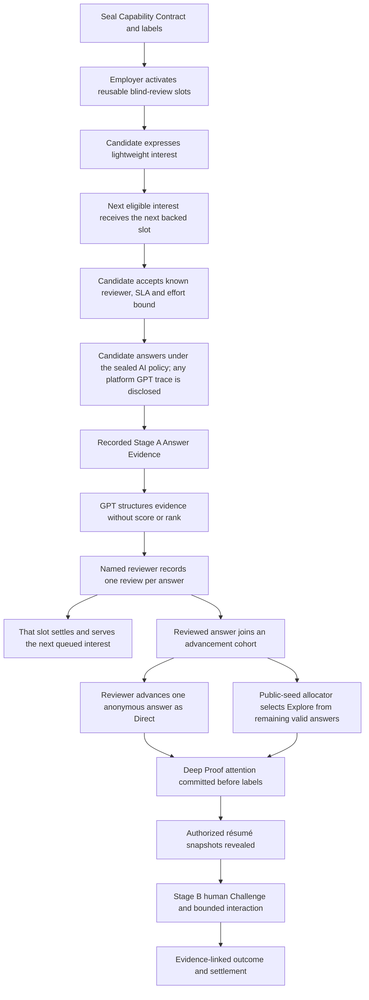

# OnlyBoth 产品精神

## Blind answer first, attention before labor

**版本：** 1.6
**日期：** 2026-07-21
**地位：** 规范性产品原则；产品、工程、AI、Demo 与 Agent 规则不得与本文冲突。

---

## 1. 一句话原则

> **需求方必须先为匿名回答抵押具名审核义务；候选人只有在这份义务已经成立后才作答；需求方只能根据候选人对 JD Critical Challenge 产生的实际证据选择谁进入下一次接触。**

OnlyBoth 不是把简历筛选替换成 Claim 筛选，也不是让 GPT 用另一组文字预测谁值得面试。产品改变的是判断顺序和注意力所有权。

```text
不是：履历 / Profile / 自述 Claim → 选人 → 要求作答

而是：封存标签 → 锁定盲答审核义务 → 候选人作答
     → 需求方逐份形成 Evidence-linked Review
     → 仅依据匿名回答决定下一次接触
```

---

## 2. 我们反对的旧顺序

以下流程违反产品精神：

```text
Candidate 提交履历或能力 Claim
→ GPT 生成候选人与岗位的 MatchEdge
→ Employer 在候选人卡片上 Choose as Direct
→ Attention 才被预留
→ Candidate 才回答实际问题
```

原因是：

- Employer 仍在 Candidate 产生岗位证据前选择谁值得接触；
- 自述 Claim、来源包装和 GPT rationale 会成为新的履历代理信号；
- 表达能力和材料准备能力仍然可以抢占真人注意力；
- Attention 在选人之后才锁定，候选人的实际回答不是获得机会的原因；
- `Explore` 只能缓解一部分偏差，不能修复 Direct 的 Profile-first 因果顺序。

因此，任何名为 `Choose as Direct`、但发生在实际回答之前的产品行为都必须删除。

---

## 3. 固定的信息与控制顺序



这个顺序不能通过 UI、Replay、人工操作或 GPT 建议绕过。

### 3.1 Critical Challenge 是一个整体，不是一道纯文本题

从 v1.4 起，旧文档中的“JD 关键问题”在主申请链上统一指版本化 `Critical Challenge`。它是岗位公开
Contract 中的一个有序、同时 Seal 的任务清单，可以由以下 Part 组成：

```text
TEXT + AUDIO + IMAGE + FILE
```

Part 是同一个 Challenge 的来源、说明或交付约束，不是可以拆开计分的多轮面试题。Candidate 在登记
Interest 或花费 Credit 之前必须能够看到完整清单、媒介类型、任务目标与允许假设；发布后 Part 顺序、
内容 hash 与资源引用不可静默变化。Employer 逐份审核的是 Candidate 对整个 Challenge 形成的匿名
Submission，不得按某个更符合履历偏好的 Part 预先选人。

MVP 中跨领域合成岗位可以用会计表、销售 Pipeline、合成音频摘录或视觉方向板表达真实工作输入。
这些资源必须是本地合成材料、具有 MIME、bytes、SHA-256 和可访问替代说明；不得把第三方远程 URL、
真实个人资料或未验证上传伪装成封存事实。

---

## 4. 五个不可破坏的不变量

```text
No held blind-review obligation → No candidate answer
No recorded answer evidence → No candidate selection
No completed cohort reviews → No Direct / Explore allocation
No work evidence → No pedigree reveal
No settled human obligation → That review Slot cannot serve the next candidate
```

服务端必须保证：

1. Candidate 开始正式回答前，必须存在具名 Reviewer、Answer Review Slot、SLA 与 `CreditHold=HELD`；
2. Employer 在回答产生前不能收到 Candidate Claim、履历、学校、前雇主、Referral、GPT 匹配理由或候选人排名；
3. Answer Review Slot 是可循环的并发容量，不是岗位总申请名额；Employer 不能选择谁获得回答前机会；
4. Candidate 通过确定性 Eligibility 与公开队列规则获得下一个可用 Slot；队列规则只能使用资格通过时间、Interest 时间和公开 tie-break，不能使用 Profile、Claim、GPT 或材料包装；
5. 每一份系统允许提交的正式 Application 都必须产生独立 Human Review Receipt，或进入可见 Employer Breach；
6. Direct 的候选池只能包含已提交并在盲履历状态下得到 `ADVANCE_ELIGIBLE` 的 Answer；Allocation
   Command 只引用 Answer Evidence，不接收 Resume score 或 AI Candidate rank，但不再声称 Reviewer
   在这一后续阶段尚未看过已授权履历；
7. Explore 只能从同一 Advancement Cohort 剩余的有效匿名回答中通过公开 Seed 产生；
8. 当前 Cohort 的必需 Review Receipts 未完成时，不能选择 Direct 或运行 Explore；但一个已结算 Answer Review Slot 必须立即能够服务队列中的下一位，不能等待全 Cohort barrier；
9. 打开页面、停留时间、滚动到底、AI 摘要或批量 Reject 不算完成审核；
10. 每个审核必须由具名 Reviewer 提交，引用当前 Answer 的 Evidence，并产生不可变 Receipt；
11. Employer 超时必须形成 Breach、Credit 后果与 WIP 后果，不能静默释放义务；
12. Platform failure、Candidate Decline 或 Candidate Withdrawal 不能被伪装成能力失败或 Employer Breach。
13. `ADVANCE_ELIGIBLE` 是需求方在看不到履历时对当前匿名 Answer 作出的“通过作答”判断；该 Human Review Receipt 与指定 Resume Snapshot 的 Reveal Authorization 必须在同一事务提交；
14. Candidate 必须在接受 Backed Offer 时看到并记录版本化条件同意：“如果匿名回答被需求方通过，当前固定 Resume Snapshot 将向具名 Reviewer Reveal”；未通过、撤回或退出的 Candidate 保持封存；
15. 完整履历只能进入 reviewer-scoped、独立分页的 Recruiter Candidate Workspace；顺序 Answer Review 页面、AI Analyst、Queue 与撮合输入继续看不到履历，确保正常作答判断已经先完成。

---

## 5. Claim 在 MVP 中的地位

Candidate Claim 可以用于：

- 候选人自己选择想申请的岗位；
- 生成或预览候选人侧的回答准备范围；
- 形成不可变的自述记录，供后续审计；
- 在 Evidence 已经产生后解释 Candidate 为什么选择某种方法。

Candidate Claim 不可以用于：

- Employer 在回答前选择 Candidate；
- GPT 在回答前决定谁是 `proofable`；
- 产生 Direct / Explore 候选人排序；
- 代替 Stage A Answer Evidence；
- 被描述为已经验证的能力事实。

MVP 不需要完成 GitHub ownership、前雇主证明或完整 Source Attestation。轻量 Claim Snapshot 只证明“候选人在某个版本提交过这段自述”，不证明自述为真。

### 5.1 Candidate Evidence Passport 与岗位发现

Candidate 可以自愿维护一份 Candidate-only `Evidence Passport`，把合成 GitHub Repository、
Certification、Work Sample、Online Work Proof 和脱敏 Employment Verification 记录为带 hash 的
来源条目，并发布不可变 Snapshot。`SYNTHETIC_SOURCE_ATTACHED` 只表示一份合成来源已经附着，
不表示平台验证了能力、所有权、雇佣关系或材料真实性。

Passport 必须记录 Candidate 的最高学历状态，也允许明确选择 `NO_FORMAL_DEGREE`，不能把缺少正式
学历解释为负面能力结论。Candidate-side discovery 使用确定性、非评分的证据顺序：以 Snapshot
发布时间为基准，毕业日期在含边界的两年以内时，学历证据先于工作经历/证书；超过两年时，工作
经历/证书先于学历。学校名称不进入 GPT discovery input，完整学历只随通过作答后的完整履历 Reveal。

GPT 可以在 Candidate 侧把这些来源与公开 Job Contract capability 建立有限发现信号：

```text
Passport source refs + public Job capabilities
→ bounded discovery connections + still_unknown
→ Candidate 自己决定是否登记 Interest
```

这个机制不是回答前的 Employer Matching。所有开放岗位始终可见；信号不得改变 Eligibility、
Interest Queue、Answer Invitation、Attention Slot、Employer 审阅顺序或 Direct / Explore。Sarah
在匿名回答被推进之前看不到 Passport、Snapshot、Signal 或 GPT 理由；通过后也只读取被授权的
完整 Resume Snapshot，而不读取 Candidate-only discovery rationale。

---

## 6. Interest、Application 与两级注意力承诺

OnlyBoth 必须诚实区分两个动作：

> **Interest 不是 Application。只有进入已抵押 Slot 并提交 Answer，正式 Application 才成立。**

- **Interest：** Candidate 对公开 Opportunity 的低成本登记。它产生可验证回执，并进入非 Profile 队列；不要求答题劳动，也不声称已经获得个体人工判断。
- **Application：** Candidate 在具名 Reviewer、SLA、可用 Slot 与 `CreditHold=HELD` 已成立后提交的岗位回答。每份 Application 必须被逐份审核。

Candidate Application Credit 是频率与并发约束，不是 Bid、Boost 或排序信号。登记 Interest
免费；只有 Candidate 已经获得 Backed Offer、确认版本化条款并原子启动 Answer Session 时才消耗
1 Credit。Employer Review Breach 或 Platform Abort 退还该 Credit；Candidate 在 Answer 已开始后
自行放弃或空白超时不退还。Employer 看不到 Credit 余额，也不能按 Credit 多少排序。

如果当前没有可用的已抵押 Slot，界面不能继续接受 Answer 并把它称为 Application；只能显示 `WAITING_FOR_BACKED_SLOT`。Candidate 应看到队列策略版本、自己的队列状态以及 Opportunity 当前是继续履约、暂停还是关闭。

产品区分两种有限注意力：

| 层级 | 需求方义务 | Candidate 获得什么 |
|---|---|---|
| Blind Answer Review | 维持若干可循环 Slot，并在 SLA 内逐份审核每个占用 Slot 提交的短回答 | 一次确定会被具名 Reviewer 处理的岗位 Application |
| Deep Proof Window | 对被选中的匿名回答进行 Stage B Challenge 与最终 Outcome | 一次更深的候选人特定互动 |

第一层承诺必须在 Candidate 作答前成立。第二层选择只能依据第一层产生的匿名回答证据。

完整 Interest Queue 可以大于当前并发 Slot 数量。未获得 Slot 的 Candidate 状态是 `WAITING_FOR_BACKED_SLOT`，不是 `ABSTAIN`、`UNQUALIFIED`、已投递未读或能力较弱。一个 Slot 的 Review 完成并结算后，该 Slot 按公开队列规则服务下一位；它不能因为本轮 Advancement Cohort 尚未完成而闲置。

Employer 可以关闭 Opportunity，但必须先看到仍在等待的 Interest 数量，提交显式关闭动作，并让系统向等待者发送 Closure Receipt。关闭前没有获得 Slot 的 Interest 不形成 Application、Reject 或能力结论。

---

## 7. 什么叫“逐份审核”

系统不声称能够证明 Reviewer 的心理状态。它强制的是可观察、可归责的动作。

每个 `HumanAnswerReview` 至少包含：

```json
{
  "answer_ref": "answer-opaque-04",
  "reviewer_ref": "reviewer-sarah-chen",
  "decision": "ADVANCE_ELIGIBLE",
  "evidence_refs": ["event-E17", "verification-V03"],
  "still_unknown": ["Cross-region recovery remains untested"],
  "reviewed_at": "database-time",
  "expected_version": 3
}
```

允许的审核结果是有限、非总体能力结论，例如：

```text
ADVANCE_ELIGIBLE
NO_FURTHER_PROOF
INCONCLUSIVE
```

它们描述本次回答是否值得继续验证，不等同于 Hire、Reject、人才总分或长期工作表现预测。

---

## 8. Direct 与 Explore 的正确含义

- **Direct：** Reviewer 在所有必需 Answer Reviews 完成后，从已在盲履历状态下通过的 Answer 中主动选择一个继续验证；
- **Explore：** 确定性程序从同一 Advancement Cohort 剩余的有效匿名回答中，按公开 Seed 选择一个继续验证；
- 两者都发生在回答之后；
- Direct / Explore 的程序输入都不读取履历、Resume score 或 AI Candidate rank；Reviewer 在后续
  Direct 阶段可能已经通过独立页面看过通过者的授权履历，因此产品不声称后续认知仍完全匿名；
- GPT 不选择 Direct 或 Explore；
- UI CTA 应表达 `Advance this anonymous answer`，不能表达回答前的 `Choose as Direct`。
- `ADVANCE_ELIGIBLE` Human Review 与 Resume Reveal Authorization 原子提交；Resume 只能在独立
  Recruiter Candidate Workspace 分页读取，不能回写或修改已经提交的匿名 Review Receipt。
- 后续 Direct / Explore 与 Deep Proof 仍应引用匿名 Answer Evidence；Reveal 的存在把产品承诺
  明确限定为“首次正常作答判断不受履历干扰”，而不是承诺后续所有接触永远无标签。

Explore 测试的是：即使 Reviewer 已经根据工作回答作出主动选择，另一份有效回答是否能在更深验证中暴露遗漏。它不是对 Profile-first Direct 的补丁。

---

## 9. GPT 的正确位置

GPT 可以：

1. 将 JD、Ticket、Repo 与需求方回答编译成 Sealed Capability Contract 和 Critical Challenge；
2. 在 Candidate 作答后，将事件、Artifact、Diff 与 Verification 压缩为 Answer Evidence；
3. 将 Answer Evidence 与 Contract uncertainty 建立可审计的 Evidence Edge；
4. 根据已产生的 Stage A Evidence，从版本化 Catalog 推荐等权 Challenge ID；
5. 压缩最终 Evidence，并明确 `still_unknown`。
6. 当 Sealed Contract 明确为 `PLATFORM_ASSISTANT_ALLOWED` 时，在 Candidate Answer Session 内提供
   披露式思考辅助；输入只包括封存问题、允许假设、当前草稿和本 Session 的既有对话；完整
   user/assistant/error trace 随 Answer 冻结并向 Reviewer 展示。
7. 从原始 Voice Memo 生成派生 Transcript；原始音频始终是事实来源，转写失败是 Platform 状态。
8. 从 Candidate 主动发布的私有 Evidence Passport Snapshot，为 Candidate 自己生成与公开岗位
   capability 相连的发现假设、来源引用与 `still_unknown`；该结果不能进入 Employer 路径。

GPT 不可以：

- 在 Candidate 作答前根据 Claim 建立候选人选择边；
- 决定谁获得 Answer Invitation；
- 输出 Candidate score、rank、Hire/Reject、Direct/Explore；
- 将自述写成 verified fact；
- 完成任何 Human Answer Review；
- 冒充 Reviewer 的 Attention。
- 代表 Candidate 提交最终 Answer、调用工具/网络/文件或隐藏对话 Trace。

Candidate 侧 GPT 不是“证明候选人独立完成”的机制。它把本轮证据的含义明确限定为“Candidate
在披露式平台工具条件下完成的工作”。需要评估无 AI 个人能力的 JobPost 必须 Seal
`PROHIBITED` Policy；远程网页仍不能证明候选人身边没有第二台设备。当前功能 Demo 选择
`PLATFORM_ASSISTANT_ALLOWED`，并禁止未披露的外部 AI。

### 9.1 Answer Sandbox Focus Policy

Candidate 只有在 Backed Offer 已成立、条款已接受且 Credit 已原子消耗后，才进入服务器计时的
全屏 Answer Sandbox。`sandbox-focus-policy@1` 记录浏览器报告的页面可见性和窗口焦点，不记录
网址、其他应用名称、鼠标轨迹、按键内容、摄像头、情绪或身份信息。Window blur 与 page hidden
合并为同一 Away interval；不超过两秒不计，第一次有效离开警告，第二次或累计十五秒触发
`FOCUS_POLICY_AUTO` 封存已有持久内容。麦克风权限对话具有一次、最长三十秒的非计数窗口。

Focus Policy 约束的是已披露 Answer Session 的提交边界。它的自动提交来源可以进入经 Candidate
事先同意的 Answer Behavior Profile，但单独的 Focus 事件不是 Candidate 质量或诚信事实：

- 它不输出作弊概率、Integrity Score、Hire/Reject 或能力推断；
- 浏览器事件可被篡改，也不能发现第二台设备，因此不是“AI-free”证明；
- 平台或网络无法记录事件时不得把缺失归因于 Candidate；
- 自动提交后 Reviewer 只看到提交来源及其版本化严重度，不读取完整 Focus 时间线；
- 空 Session 被策略终止时不生成 Answer 或能力结论，Employer Slot 释放，已开始作答的 Candidate
  Credit 保持消耗。

目标 AI Operation 应使用回答后的 `buildAnswerEvidenceEdge` 替代回答前的 `buildMatchEdge`。旧 Operation 仅作为当前实现兼容事实保留，不属于目标产品路径。

### 9.2 Employer Evidence Analyst 评价 Answer，不评价履历

OnlyBoth 的核心承诺是首轮判断不读取 Candidate 履历标签，而不是禁止需求方评价 Candidate 在已抵押
机会中产生的匿名 Answer 与披露式作答过程。Candidate 获得履历盲审机会的对价包括：在消耗 Credit
并开始作答前，同意版本化条款，允许 OnlyBoth 采集限定的服务器行为记录，并把确定性派生的 Behavior
Profile 向具名 Reviewer 展示。规范边界是：

```text
Immutable Answer Submission
→ deterministic red / yellow / green Behavior Profile
→ source-linked Good / Bad Answer verdict, language analysis and criterion findings
→ independent Human Answer Review
```

- JobPost 发布前必须把分析 Policy 封存为 `OFF | ANSWER_ONLY | ANSWER_PLUS_PROCESS`，并封存 1–8
  条 Review Criteria；默认 `OFF`，不得对旧 Answer 追溯分析。
- `Good Answer | Bad Answer` 只评价这一次封存 Challenge 的回答质量，不是 Candidate Score、岗位排名、
  Hire/Reject 或跨岗位人格结论；Verdict 必须引用冻结原文并通过确定性一致性校验。
- Language Analysis 只描述本 Answer 的 `LOGICAL_STRUCTURE | CLARITY | INTERNAL_CONSISTENCY |
  RESPONSIVENESS`；每条观察必须引用原文并使用 `GREEN | YELLOW | RED` 严重度，不得把语言表现写成
  Candidate 的稳定人格属性。
- 每条 Criterion 只能得到 `SUPPORTED | CONTRADICTED | NOT_ADDRESSED |
  INSUFFICIENT_EVIDENCE`，不能产生 Candidate 排名、Hire/Reject 或自动推进建议。
- 只有 `ANSWER_PLUS_PROCESS + employer-ai-review-disclosure@2` 经 Candidate 同意后，
  `AnswerProcessEvidence@2` 才在 Submission 事务中用 `onlyboth.answer-behavior-severity@1` 分类首次内容
  延迟、revision gap、删改幅度、提交压力、披露式平台辅助和平台可靠性。规则、观测值、严重度、
  caveat 与 ref 一起冻结；历史 `@1` 不追溯分类。
- Process Source 不能由 GPT 支持或反驳能力 Criterion，也不能改变 Good/Bad Answer Verdict；它作为
  单独的人类审阅信号展示，Sarah 可以引用其不可变 signal ref 并自行形成有限判断。
- 红黄绿是审阅严重度，不是事实真值：没有服务器记录到修改不等于 Candidate 不活跃；允许且披露的
  平台 GPT 不等于作弊；平台故障不能成为红色 Candidate 信号；外部 AI 使用不能由这些记录证明。
- 不采集或分析按键、剪贴板、鼠标轨迹、摄像头、生物特征；不推断懒惰、可疑、诚信、人格、
  情绪或作弊概率。Reviewer 可以把行为信号用于本次能力/诚实度核查，但必须区分“服务器记录”与
  “人的解释”，不能把严重度当成自动诚信结论。
- AI Panel 不能预填或提交 Human Review。Sarah 仍必须引用原始 Evidence，亲自写 comment 与
  `still_unknown`。AI Output ref 不是 Evidence ref。
- `DISABLED | ANALYZING | NEEDS_HUMAN | FAILED | SUPERSEDED` 都不能阻断人工 Review、释放已履约
  Slot 或服务下一位 Interest。

因此 Employer Evidence Analyst 的价值是把匿名 Answer 与已披露行为变成更快、可追溯的人工判断
输入，而不是把履历标签筛选替换成 Candidate 排名模型。

---

## 10. MVP Demo 的规范结果

目标 Demo 应表达：

```text
20 eligible interests
→ Sarah activates 8 reusable blind-answer review Slots
→ the first 8 eligible Interests receive backed offers by the public queue rule
→ Candidates submit recorded answers to the same sealed JD uncertainty
→ each completed Review settles one Slot and unlocks the next queued Interest
→ reviewed answers accumulate in an 8-answer Advancement Cohort
→ Sarah advances one reviewed answer as Direct
→ public seed selects Explore from another reviewed answer
→ both enter the existing Stage B Challenge path while Slots continue serving the queue
```

Demo 可以预加载 GPT、Sandbox 与 Verifier 外部输出，但以下动作必须真实执行：

- Sarah 的 rolling Review Commitment；
- 至少一次 `AnswerReviewSettled → next queued Interest offered`；
- Candidate 的 Answer 状态变化；
- 每份 `HumanAnswerReviewed` Command；
- Direct 的回答后选择；
- Explore 的公开 Seed 分配；
- Credit、Slot、Breach 与 Settlement；
- Sarah 的 Challenge 授权和 Candidate Stage B 状态变化。

Golden Replay 只能证明工程因果链，不能证明真实 GPT 匹配质量或真实招聘有效性。

---

## 11. 当前实现的诚实状态

截至 2026-07-21，主 `/candidate` 与 `/employer` 入口已经执行本文前半段的真实持久链路：一年期
actor-bound 合成 Session、PostgreSQL JobPost/Interest/Slot/Credit、Backed Offer、服务器计时 Answer Session、
私有 Object Storage 富文本与 Voice Memo、Worker 侧披露式 GPT/转写、版本化 Focus Policy、
全屏作答弹窗、不可变 Submission、严格
顺序 Human Review、逐 Slot 释放，以及 Review SLA Breach 的 Candidate Credit 退还、Employer
Credit 罚没和 Slot 退休。`/prototype` 不再是主入口或验收事实。

Demo 现在提供六名不同履历的合成 Candidate；`Start as` 只在 `DEMO_MODE=true` 为每个 actor 签发
独立 Session。六人分别持有 Credit、真实 PostgreSQL `Evidence Passport`、不可变 Snapshot、
Candidate-only discovery Projection 和 Resume Snapshot。Demo 预载明确标注的 synthetic Signal；
Candidate 修改并发布后的生成只走 Worker LIVE `gpt-5.6-luna`，没有 Key 或调用失败时显式失败，
不切换固定 Fixture。Employer、Eligibility、Queue 与 Attention 代码不读取这些表。

合成运行数据还包含一个主工程岗位和二十个跨会计、BD、创意、销售、营销、产品、运营、People、
Legal、Healthcare 与 Sustainability 的岗位。每个岗位都发布一个独立 Critical Challenge；整个
Corpus 覆盖 TEXT、AUDIO、IMAGE、FILE Part。它验证机制可跨专业复用，不代表平台已验证这些岗位的
真实招聘效度。

回答后的 `ADVANCE_ELIGIBLE Human Review → pinned Resume Reveal → recruiter pagination` 已接到
真实 PostgreSQL 事务与新浏览器页；`Advancement Cohort Allocation → Deep Proof → Challenge`
尚未接到这条新浏览器链。旧的 Claim-first Matching、Golden Challenge Replay 与
`/demo` 仅保留为历史/回归资产，不能重新成为主申请路径。当前功能链证明的是“被接受的匿名
回答会获得逐份处理，且只有通过作答者才解锁固定履历”，不是已经完成最终录用。

---

## 12. 架构验收问题

任何新设计、PR 或 Demo 在合并前必须回答：

1. Candidate 作答之前，具体哪条数据库记录证明具名 Reviewer 已承担审核义务？
2. Employer 在作答前能否看到任何 Candidate Claim、履历或 GPT rationale？答案必须是否。
3. 下一个可用 Slot 如何在不使用 Candidate Profile 或模型排名的情况下服务公开 Interest Queue？
4. 每份已承诺回答通过哪个 Command 和 Receipt 完成人工审核？
5. 是否存在“未审完 Advancement Cohort 仍可选择 Direct”的路径？答案必须是否。
6. Direct Command 是否只引用已通过的 Answer Evidence，并排除 Resume score / AI rank？
7. Explore 是否只从同一 Advancement Cohort 剩余有效回答中按公开 Seed 产生？
8. 一个 Review 正常结算后，该 Slot 是否立即服务下一位，而不等待整个 Cohort？答案必须是。
9. Reviewer 超时会冻结什么、罚没什么、阻止什么？
10. Platform failure 是否与参与者责任明确分离？
11. Golden、LIVE 和 UI 是否执行相同业务 Command，而不是把预录结果当作最终状态？
12. Candidate 是否在 Interest/Credit 之前看到完整、按顺序封存的 Critical Challenge Part 清单？

如果其中任何一项无法回答，架构尚未体现 OnlyBoth 的产品精神。
