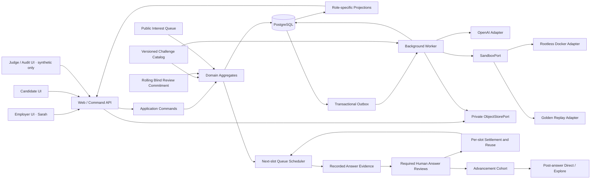
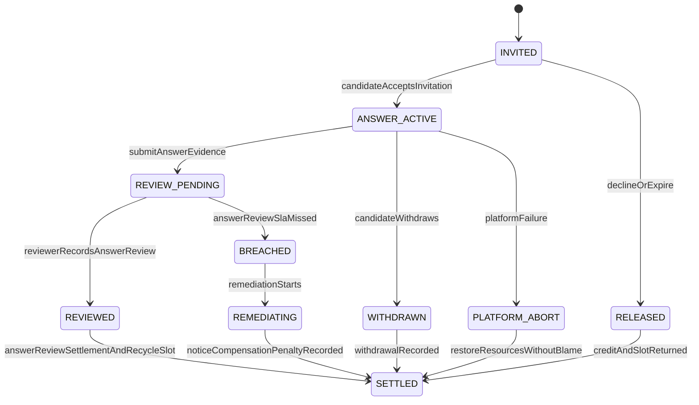
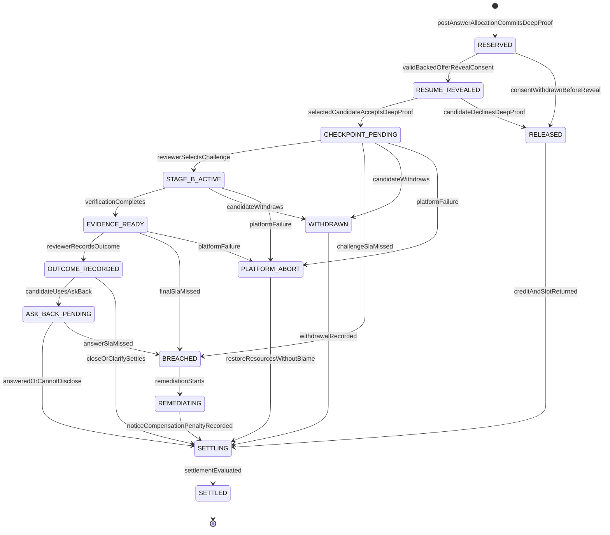

# OnlyBoth 工程设计

## Label-blind, attention-backed work proofs

**文档状态：** 工程设计 v0.5，2026-07-20
**对应产品精神：** `OnlyBoth-产品精神.md` v1.3
**对应产品方案：** `OnlyBoth-产品方案.md` v0.7
**首个 MVP：** Senior Backend Engineer 技术招聘  
**默认 Demo 场景：** Payment retry / duplicate charge  
**核心实现原则：** 外部输入可重放，产品机制必须真实执行。

---

## 0. 文档目的与优先级

本文把产品方案中的机制落实为可以在 Build Week 内完成的工程结构，重点保证：

1. Label Veil 在数据边界上成立，而不只是前端隐藏；
2. Candidate 回答必须以已预留的逐份 Blind Answer Review 义务为前提，且每个 Review Slot 必须可循环服务公开 Interest Queue；
3. Candidate 作答前不能发生基于 Profile、Claim 或 GPT rationale 的 Employer 选择；
4. 当前 Advancement Cohort 的所有必需 Answer Reviews 完成后，Sarah 才能从已在盲履历状态下
   `ADVANCE_ELIGIBLE` 的 Answer 中选择 Direct；Allocation DTO 只引用 Answer Evidence，不接收
   Resume score / AI rank，但 Sarah 此时可能已看过独立页面中的授权履历；
5. Sarah 的 Challenge 选择确实改变 Stage B；
6. GPT 主要准备和压缩需求方判断；Sealed Policy 允许时可提供披露式 Candidate Sidecar，
   但任何模型都不能替代真人动作、最终提交或候选人选择；
7. 前 30 秒 Demo 不依赖外部网络；
8. Golden Replay 与 Live 模式复用相同状态机、投影和 UI。

发生冲突时，优先级为：

```text
产品不变量
→ 隐私与权限边界
→ 状态机一致性
→ Demo 可用性
→ 工程完整性
→ 扩展性
```

MVP 不为假想规模提前引入微服务、Kafka、向量数据库、多智能体工作流或完整云端 IDE。

---

## 1. 不可破坏的工程不变量

```text
No held blind-review obligation → No candidate answer
No recorded answer evidence → No candidate selection
No completed cohort reviews → No Direct / Explore allocation
No work evidence → No pedigree reveal
No settled human obligation → That review Slot cannot serve the next candidate
```

对应为服务端约束：

- 没有有效 `BlindReviewCommitment`、Answer Review Slot 与 `CreditHold=HELD`，不能接受 Answer Invitation 或创建 Stage A Session；
- Answer Invitation 只能使用 deterministic Eligibility 与版本化非 Profile queue policy；Scheduler 在每个 Slot 可用时处理队列，不能一次性选出岗位总候选集；
- Employer 在 Answer 前不能读取 Candidate Claim、Profile、来源包装或 GPT 匹配理由；
- Advancement Cohort 的必需 `HumanAnswerReview` Receipts 未完成时，不能执行回答后的 Direct / Explore；
- 每份 Human Answer Review Settlement 必须独立释放对应 Slot 并触发队列下一位；不允许等待 Cohort barrier 后批量释放；
- 没有完成匿名 Human Answer Review、`ADVANCE_ELIGIBLE` 结果、Candidate 在 Backed Offer 时记录
  的有效条件 Reveal 同意与 pinned Resume Snapshot，不能读取被封存标签；
- `ADVANCE_ELIGIBLE` Review Receipt 与 reviewer-scoped Resume Reveal Authorization 在同一事务
  提交；Resume 只能进入独立分页 Candidate Workspace，不能进入当前/下一份匿名 Review DTO；
- 没有完成 Checkpoint、Outcome 及必要 Ask Back Settlement，不能释放当前 WIP Token；
- GPT 的建议不能直接写入 `ReviewWindow` 状态；
- Candidate 文本、代码、日志和 Prompt Injection 不能改变权限、Rubric、Catalog 或工具配置；
- Employer UI、Candidate UI 和 Judge UI 必须来自不同的服务端投影；
- Closed Candidate 的标签保持封存；Judge Counterfactual 只允许读取合成 Demo 数据；
- Window 创建时必须固定 Contract、Label Policy、Proof Template 与 Challenge Catalog 版本；
- 平台自身的 GPT、Sandbox 或 Verifier 故障不能被记成 Employer Breach 或 Candidate 失败；
- Golden Replay 不能通过跳过命令校验或直接修改前端状态来伪造机制。

---

## 2. 总体架构决策

### 2.1 形态

采用 TypeScript `pnpm` monorepo、模块化单体和两个运行进程：

1. **Web / Command API**：Next.js UI、查询投影、接收显式业务命令；
2. **Background Worker**：GPT 调用、Evidence 压缩、SLA、Outbox 和 Sandbox 编排；
3. **PostgreSQL**：业务状态、事件、投影、审计、Artifact metadata 与 Outbox；
4. **Private Object Storage**：本地 MinIO、生产 S3-compatible Adapter，保存富文本正文、原始
   Voice Memo、派生 Transcript 与冻结 GPT Trace。

Sandbox 是 Worker 通过 `SandboxPort` 控制的隔离执行环境，不在 MVP 中独立拆成网络微服务。Golden Replay 使用同一个 Port 的 Replay Adapter。



### 2.2 为什么不是微服务

MVP 最难的不是吞吐量，而是跨机制一致性：

- Attention Token 与 Proof 解锁必须原子一致；
- Human Challenge 与 Stage B 必须因果绑定；
- Human Review、`ADVANCE_ELIGIBLE` Receipt 与 Resume Reveal Authorization 必须在同一事务边界；
  回答后 Allocation 与 Deep Proof Hold 使用后续独立事务，不得改写已完成 Review；
- Demo 的 Live、Cached 和 Replay 模式必须产生同一种领域事件。

模块化单体可以用数据库事务保持这些关系，同时用清晰 Port 为未来拆分留出边界。

---

## 3. 推荐工程目录

```text
onlyboth/
├── apps/
│   ├── web/
│   │   ├── app/
│   │   │   ├── demo/                 # 30 秒 Cold Open 与三分钟主 Demo
│   │   │   ├── employer/             # Sarah 的 Contract、Checkpoint、Outcome
│   │   │   ├── candidate/            # Interest、Proof、Ask Back、Receipt
│   │   │   ├── audit/                # 仅合成数据的 Judge Counterfactual
│   │   │   └── api/v1/               # 显式 Command / Query Route Handlers
│   │   ├── middleware.ts
│   │   └── next.config.ts
│   └── worker/
│       └── src/
│           ├── jobs/                  # AI、Evidence、SLA、Settlement
│           ├── consumers/             # Outbox consumers
│           ├── scheduler/             # 可注入 Clock 的期限任务
│           └── index.ts
│
├── packages/
│   ├── domain/
│   │   └── src/
│   │       ├── review-window/         # 核心 Aggregate 与状态机
│   │       ├── attention/             # WIP、Credit、Breach、Settlement
│   │       ├── matching/              # Eligibility、Interest Queue、post-answer Direct / Explore
│   │       ├── reach/                 # Candidate Reach grant / hold / consume
│   │       ├── proof/                 # Stage A/B、Snapshot、Verification
│   │       ├── evidence/              # Evidence refs 与 Receipt
│   │       └── label-policy/          # Veil 与 Reveal 条件
│   ├── application/
│   │   └── src/
│   │       ├── commands/              # 一个用户意图一个 Handler
│   │       ├── queries/               # 只读取角色投影
│   │       ├── policies/              # 授权与业务 Policy
│   │       └── ports/                 # AI、Sandbox、Clock、ID、Event Bus
│   ├── projections/
│   │   └── src/
│   │       ├── employer-projection.ts
│   │       ├── candidate-projection.ts
│   │       └── synthetic-audit-projection.ts
│   ├── contracts/
│   │   └── src/
│   │       ├── commands/              # Zod request schemas
│   │       ├── events/                # Versioned domain event schemas
│   │       ├── ai/                    # Structured Output schemas
│   │       └── dto/                   # VeiledCandidateDTO 等
│   ├── db/
│   │   └── src/
│   │       ├── schema/
│   │       ├── repositories/
│   │       ├── transactions/
│   │       ├── migrations/
│   │       └── outbox/
│   ├── ai/
│   │   └── src/
│   │       ├── openai-adapter.ts
│   │       ├── services/
│   │       ├── prompts/               # 版本化、代码内审阅的 Prompt
│   │       ├── schemas/
│   │       └── fixtures/              # Cached AI outputs
│   ├── storage/
│   │   └── src/                        # MinIO/S3 Adapter + Memory tests
│   ├── challenge-catalog/
│   │   └── src/
│   │       ├── registry.ts
│   │       ├── validator.ts
│   │       └── catalog.lock.json
│   ├── sandbox/
│   │   └── src/
│   │       ├── port.ts
│   │       ├── docker-adapter.ts
│   │       ├── replay-adapter.ts
│   │       └── verifier.ts
│   ├── demo-replay/
│   │   └── src/
│   │       ├── loader.ts
│   │       ├── driver.ts
│   │       ├── branch-resolver.ts
│   │       └── integrity.ts
│   ├── ui/
│   │   └── src/                       # 跨角色基础组件，不共享越权数据
│   └── testkit/
│       └── src/                       # Fixture、FakeClock、SeededRandom
│
├── challenges/
│   └── payment-retry/
│       └── v1/
│           ├── manifest.json
│           ├── starter/
│           ├── visible-tests/
│           ├── hidden-tests/
│           ├── scenarios/
│           │   ├── redis-failover/
│           │   ├── duplicate-webhook/
│           │   └── cross-region-retry/
│           └── fixtures/
│
├── replay/
│   └── payment-retry-v1/
│       ├── manifest.json
│       ├── seed.json
│       ├── recorded-ai/
│       ├── recorded-sandbox/
│       ├── challenge-branches/
│       └── expected-projections/
│
├── tests/
│   ├── unit/
│   ├── integration/
│   ├── security/
│   ├── evals/
│   └── e2e/
│
├── scripts/
│   ├── seed-demo.ts
│   ├── record-golden-replay.ts
│   ├── verify-replay-integrity.ts
│   └── verify-offline-demo.ts
│
├── infra/
│   ├── docker-compose.dev.yml
│   ├── docker-compose.demo.yml
│   └── sandbox/
│
├── docs/
│   ├── adr/
│   ├── threat-model.md
│   └── demo-runbook.md
│
├── pnpm-workspace.yaml
├── package.json
└── tsconfig.base.json
```

物理目录不等于独立部署单元。`packages/*` 是依赖方向明确的模块，MVP 仍只运行 Web 和 Worker 两个进程。

---

## 4. 模块依赖规则

允许的依赖方向：

```text
apps
→ application
→ domain

adapters: db / ai / sandbox / projections
→ application ports + contracts
```

禁止：

- `domain` 导入 Next.js、数据库驱动、OpenAI SDK 或 Docker SDK；
- UI 直接写表或自行推导权限；
- AI Adapter 直接修改 Aggregate；
- Sandbox 读取 Candidate 私密标签或 OpenAI Key；
- Candidate 路由导入 Synthetic Audit Projection；
- Replay Driver 直接设置 React state 伪造业务迁移。

---

## 5. 领域模型与状态机

### 5.1 Aggregate 划分

目标垂直切片需要以下主要一致性边界：

| Aggregate | 负责 |
|---|---|
| `Opportunity` | Contract、Label Policy、岗位状态和 Reviewer 配置 |
| `BlindReviewCommitment` | Candidate 作答前激活的具名 Reviewer、可循环 Answer Review WIP、SLA、Queue Policy 与 Credit Policy |
| `InterestQueue` | 对硬条件合格 Interest 进行非 Profile 排队，并在 Slot 可用时产生下一份 Offer |
| `AnswerReviewObligation` | 单个 Invitation、Answer Submission、Human Review Receipt 与回答阶段 Settlement |
| `AdvancementCohort` | 通过固定 Seat 汇集匿名 Answer；只控制回答后比较 barrier，不拥有 Answer Review Slot |
| `ResumeRevealAuthorization` | `ADVANCE_ELIGIBLE` Human Review 原子授权 pinned Resume Snapshot 进入 reviewer-scoped Candidate Workspace |
| `AdvancementAllocation` | 当前 Cohort 全部必需 Reviews 完成后，从已盲审通过 Answer 产生的 Direct、public-seed Explore 与 Deep Proof Hold；DTO 不含 Resume score / AI rank |
| `ReviewWindow` | 被选中匿名回答从 Stage B Reservation 到最终 Outcome、Ask Back 与 Settlement 的一致性 |
| `CreditLedger` | Review Window 的 Credit Hold、返还、Forfeit 与补偿记录 |
| `ReachLedger` | 候选人的有限 Reach 提名、Hold、返还与消耗 |

`BlindReviewCommitment` 防止“先接收工作再决定是否看”；`InterestQueue` 防止并发 WIP 被误作一次性候选人筛选；`AnswerReviewObligation` 防止候选人提交后被静默忽略；`ResumeRevealAuthorization` 证明履历只在匿名答案通过后进入独立页面；`AdvancementCohort` 只在回答后提供同一比较边界；`AdvancementAllocation` 原子提交匿名选择与 Deep Proof attention；`ReviewWindow` 负责后续 Challenge、Outcome、Ask Back 与 Settlement。

Window 创建时必须冻结：

```text
contract_version_id
label_policy_version_id
proof_template_version_id
challenge_catalog_version_id
answer_submission_id
answer_evidence_edge_id
reviewer_id
```

Seal 后的对象禁止原地修改。新规则只能创建新版本，不能回写已经开始的 Window。

### 5.2 Attention、Queue 与 Cohort 的不同对象

```text
AttentionCommitment
= Reviewer 对某岗位的 rolling Blind Answer Review 与 Deep Proof 容量、SLA Policy

InterestQueue
= eligible Interest 的公开、版本化、非 Profile 调度顺序

AnswerReviewSlot
= 一份可循环的 Answer Review WIP；本身不永久属于 Candidate

AnswerReviewObligation
= Slot、Invitation、Answer Submission 与 Human Review Receipt 的一次临时绑定

AdvancementCohort
= 若干已审核 Answer 的回答后比较组；不阻塞已结算 Slot 循环

AdvancementCohortSeat
= Offer 时固定的 Cohort 席位；绑定一次 Obligation，Decline/Expiry 可由 Queue 下一位补位，Submitted 后不可换人

DeepProofSlot
= 回答后 Direct / Explore 可以占用的一份 Stage B WIP 容量

ReviewWindow
= DeepProofSlot 与一个已审核 Answer Evidence Edge 的一次绑定

CreditHold
= 针对 Answer Review 或 Deep Proof Window 冻结、可返还或可 Forfeit 的平台 Credit
```

强制约束：

- 无具名 Reviewer、Available Answer Review Slot 和 `CreditHold=HELD`，不能允许 Candidate 作答；
- Advancement Cohort 的所有必需 Receipt 未完成时，不能创建 Direct / Explore Allocation；
- Deep Proof Window 只能引用已提交、已审核的匿名 Answer Evidence Edge；
- 一个 Slot 同时最多绑定一个未结算 Window；
- Answer Review Deadline 属于 Obligation，Deep Proof Deadline 属于 ReviewWindow；两者都不属于可复用 Slot；
- Reviewer 只能在 Stage A 开始前替换，且 Candidate 必须重新确认；
- 每个 Answer Review Slot 独立形成 Backpressure：一个正常结算的 Obligation 原子释放该 Slot，并 enqueue `OfferNextQueuedInterest`；不使用岗位级或 Cohort Barrier；
- Queue Scheduler 只能读取 Eligibility、时间、Queue Policy、Activity Lease 和 opaque refs，不能读取 Profile、Claim、Private Label、GPT Output 或 Employer preference；
- Token 只能在正常 Settlement 或完整 Remediation 后释放或退休。

### 5.3 Answer Review 与 Deep Proof 状态

Candidate 作答和回答后的深度互动是两个不同的履约阶段。



`BlindReviewCommitment` 状态为：

```text
DRAFT → ACTIVE ↔ PAUSED → CLOSING → CLOSED
                  └──────→ SUSPENDED
```

只有 `ACTIVE` Commitment 可以发出新的 backed offer。暂停或关闭只阻止新的 Offer，不能取消已经进入 `ANSWER_ACTIVE | REVIEW_PENDING` 的义务。

`AdvancementCohort` 状态为：

```text
COLLECTING → REVIEWING → READY_FOR_ADVANCEMENT → ALLOCATED
                         └──────────────────────→ CLOSED_NO_ALLOCATION
```

Cohort 只有在其所有 Answer 都有当前 `HumanAnswerReview` Receipt 后才能进入 `READY_FOR_ADVANCEMENT`。Cohort 状态绝不拥有或锁住已结算的 `AnswerReviewSlot`；第一个 Review 完成时，第一个 Slot 即可服务下一个 queued Interest，即使 Cohort 仍是 `REVIEWING`。

Scheduler 创建 Offer 时同时预留 `AdvancementCohortSeat`。前八个活跃 Offer 固定到 Cohort 1；第一个 Review 结算后，同一个 Slot 为第九位 Interest 创建的 Offer 固定到 Cohort 2，即使 Cohort 1 尚未 `8/8`。这样 Slot completion order 不会改变比较组。Offer 在 Answer 提交前 Decline/Expiry 时 Seat 回到 `OPEN`，由 Queue 下一位补位；Answer 已提交后 Seat 与 Cohort 不可变。



终止原因必须结构化区分：

```text
PRESTART_EXPIRED
CANDIDATE_DECLINED
CANDIDATE_WITHDRAWN
EMPLOYER_BREACH
PLATFORM_ABORT
OPPORTUNITY_CLOSED
```

`PLATFORM_ABORT` 返还双方资源并记录平台原因，不降低 Employer Reliability，也不生成 Candidate 能力结论。

Outcome 之后的顺序固定为：

```text
Human Outcome
→ Candidate 在有限期限内选择 Ask Back / Continue / Decline
→ 如使用 Ask Back，Reviewer 在 Answer SLA 内回答或明确不能披露
→ Candidate Continue + Outcome Advance 时解锁 Full Interview，而不是首次 Resume Reveal
→ Settlement
```

Resume Reveal 发生在匿名 Human Answer Review 的 `ADVANCE_ELIGIBLE` 分支：系统先验证 Candidate
在 Backed Offer 时记录的版本化条件同意和当时 pinned 的 Resume Snapshot，再在 Review Settlement
事务内写入不可变 Reveal Authorization。`NO_FURTHER_PROOF`、`INCONCLUSIVE`、撤回、Breach 与
Platform Abort 不 Reveal。后续 Deep Proof 是独立的注意力承诺，不是首次 Resume Reveal 的前置条件。

Contract 必须配置 `ask_back_submit_deadline` 和 `ask_back_answer_sla`。Candidate 未在提交期内使用 Ask Back 视为 Waive；不能因为无限期等待 Candidate 而永久占用 Slot。`Clarify` 结算当前 Window，如需新的工作或回答则建立新的、范围有限的下一步，不得暗中重开当前 Proof。

### 5.4 不提供通用状态修改接口

禁止：

```http
PATCH /review-windows/:id
{ "status": "STAGE_B_ACTIVE" }
```

必须使用表达业务意图的命令：

```text
activateBlindReviewCommitment
offerNextQueuedInterest
acceptAnswerInvitation
submitStageAAnswer
recordHumanAnswerReview
settleAnswerReviewAndRecycleSlot
allocatePostAnswerAdvancement
acceptDeepProofWindow
selectHumanChallenge
recordVerification
recordHumanOutcome
submitAskBack
answerAskBack
startBreachRemediation
settleReviewWindow
```

每个 Handler 在一个数据库事务中完成：

```text
authenticate actor
→ load aggregate with version
→ authorize role and ownership
→ validate current state and deadline
→ execute domain command
→ persist new state/version
→ append domain events
→ write transactional outbox
→ commit
```

使用乐观并发版本阻止 Sarah 双击、SLA Worker 与人工动作同时到达时产生非法双迁移。

### 5.5 关键领域事件

```text
BlindReviewCommitmentActivated
CandidateInterestQueued
BackedAnswerOfferCreated
AdvancementCohortSeatReserved
AnswerReviewObligationCreated
AnswerSubmitted
HumanAnswerReviewed
AnswerReviewSettled
AnswerReviewSlotBecameAvailable
NextQueuedInterestOfferRequested
AdvancementCohortBecameReady
AttentionReserved
ProofWindowAccepted
StageASubmitted
CheckpointBecamePending
HumanChallengeSelected
StageBStarted
VerificationCompleted
EvidenceBecameReady
HumanOutcomeRecorded
AskBackSubmitted
AskBackAnswered
LabelsProgressivelyRevealed
EmployerBreached
PlatformAborted
RemediationRecorded
ReviewWindowSettled
```

`HumanChallengeSelected` 至少包含：

```json
{
  "event_id": "evt_...",
  "review_window_id": "rw_...",
  "reviewer_id": "sarah_chen",
  "stage_a_snapshot_id": "snap_...",
  "evidence_refs": ["E17", "D04"],
  "challenge_id": "payment-retry/redis-failover@1",
  "catalog_hash": "sha256:...",
  "selected_at": "2026-07-18T14:14:00Z"
}
```

它既是 Candidate 端状态变化的原因，也是 Attention Receipt 的审计来源。

---

## 6. 数据与 Label Veil 边界

### 6.1 物理分离

Candidate 原始标签不能与第一轮撮合输入放在同一个宽表或通用 DTO 中。

```text
candidate_private_labels
├── legal_name
├── photo_ref
├── school_name
├── previous_employer_name
├── referral_source
└── encrypted_payload

candidate_claims
├── candidate_id
├── hard_facts
├── self_asserted_claims
└── consent_version

answer_submissions
├── answer_id
├── candidate_id
├── question_version_id
├── artifact_refs
├── event_refs
└── snapshot_hash

candidate_evidence_passport_snapshots
├── candidate_id
├── snapshot_version
├── evidence_refs + source_hashes
├── discovery_consent_version
└── snapshot_hash

candidate_job_discovery_signals
├── candidate_id (through signal set)
├── opportunity_ref + contract_hash
├── capability_refs + evidence_refs
├── bounded_reason + still_unknown
└── candidate-only projection
```

应用层只能通过专用 Repository 读取 `candidate_private_labels`。回答前 Employer 查询与 AI Service 同时不能获得 Candidate Claim Repository；只有 deterministic Eligibility 读取必要 hard facts。回答后的 Evidence Assembler 读取 `answer_submissions`，不读取 Profile 或自述 Claim 作为选择依据。

Evidence Passport 是单独的 Candidate-owned 数据边界。Candidate discovery Assembler 只能读取
已发布 Snapshot 的脱敏描述、source hash、公开 Job Contract 与 capability refs；不读取
`candidate_private_labels`、姓名、学校、前雇主名称、联系方式或原始 locator token。它的 Store
没有 Employer Projection、Eligibility、Interest Queue、Invitation 或 Attention 写端口。

### 6.2 角色投影

| 投影 | 可见内容 |
|---|---|
| `EmployerPreAnswerProjection` | Sealed Question、rolling Slot WIP、Queue depth、履约状态和匿名计数；不含 Candidate 卡片或 Claim |
| `EmployerAnswerReviewProjection` | 匿名 Answer Evidence、逐份 Review 状态、Slot recycling、Advancement Cohort barrier 和真人动作 |
| `CandidateOpportunityProjection` | Interest receipt、Queue policy/status、backed Slot availability、Opportunity pause/closure；不含其他 Candidate |
| `CandidateDiscoveryProjection` | Candidate-only Passport 状态、岗位 discovery band、Evidence refs、bounded reason 与 still unknown；所有开放岗位仍可见 |
| `CandidateProjection` | Reviewer、SLA、Application/Proof 状态、所选 Challenge、Outcome、Receipt |
| `SyntheticAuditProjection` | 合成 Demo 的原始标签、传统排序和反事实 Crosswalk |

Candidate 作答后，GPT 与 Employer 第一轮判断只接收：

```ts
type AnonymousAnswerEvidenceDTO = {
  answerRef: string;
  questionVersionRef: string;
  uncertaintyRef: string;
  eventRefs: string[];
  artifactRefs: string[];
  verificationRefs: string[];
  stillUnknown: string[];
};
```

不能依靠 CSS、前端条件渲染或 Prompt 指示来实现 Label Veil。敏感字段必须在服务端查询和序列化之前就被排除。

### 6.3 Reveal

Reveal 必须是 Human Review 事务中的独立授权记录，并验证：

- 当前 Answer 已提交并具有完成的具名 `HumanAnswerReview`；
- Human Review 的决定为 `ADVANCE_ELIGIBLE`；
- Candidate 在 Backed Offer 时记录的版本化条件 Reveal 同意仍有效；
- 读取的是接受 Offer 时 pinned 的 exact Resume Snapshot，而不是事后替换的版本；
- Reveal Policy 版本与当前 Contract 一致；
- Employer 只能在 reviewer-scoped、每页一人的 Candidate Workspace 读取被授权 Snapshot；
- Review Receipt、Reveal Authorization、Event 与 Slot Settlement 原子一致。

`NO_FURTHER_PROOF`、`INCONCLUSIVE`、Candidate 撤回、Employer Breach 或 Platform Abort 都不能
自动揭示 Candidate 标签。Reveal 成功后，Resume 页先显示 Human Review Receipt，再显示履历；
已经提交的匿名 Review 不可因 Resume 内容被修改。

---

## 7. Matching、Attention 与 Reach

### 7.1 Matching Pipeline

```text
Capability Contract sealed
→ Label Veil applied
→ deterministic Eligibility
→ Employer activates reusable Blind Answer Review Slots without Candidate profiles
→ public Interest Queue offers each available Slot to the next eligible Interest
→ Candidates submit recorded Stage A Answers
→ GPT drafts Answer Evidence Edges from recorded work
→ named Reviewer completes one Human Answer Review per Application
→ each settled Slot serves the next queued Interest
→ reviewed Answers join an Advancement Cohort
→ Cohort review barrier opens
→ Reviewer selects Direct from that Cohort's anonymous answers
→ deterministic Explore selects from that Cohort's remaining valid answers
→ Deep Proof Slots and ReviewWindows created
```

必须拆成以下三个阶段，避免任何回答前 Candidate selection：

```text
Stage 1: Rolling Blind Review Reservation and Queue Scheduling
(sealed_question, reviewer, reusable_answer_review_slot, credit_hold, queue_policy)

Stage 2: Answer Evidence, Human Review and Slot Settlement
(answer, uncertainty, event/artifact/verification refs, human_review_receipt, slot_recycle_event)

Stage 3: Advancement Cohort and Deep ReviewWindow
(reviewed_answer_cohort, answer_evidence_edge, direct_or_explore, deep_slot, credit_hold, deadlines, version pins)
```

GPT 输出的不是人才排名，而是：

```text
Opportunity uncertainty
↔ Recorded anonymous answer evidence
↔ Verifiable proof template
```

Candidate Claim、Profile、学校、前雇主与来源包装不能进入 Stage 1 Employer payload，也不能决定 Queue position 或 Invitation。GPT 只能在 Stage 2 处理已经发生的回答证据。

Candidate 可以在 Stage 1 之前或期间使用独立的 discovery 辅助，但它不属于 Matching Pipeline：

```text
Candidate-only Passport Snapshot + public Job Contracts
→ deriveCandidateJobSignals
→ Candidate-only Feed guidance
→ Candidate chooses whether to register Interest
```

该支路不隐藏开放岗位，不输出 Fit Score，也不连接 Employer、Eligibility、Queue Scheduler、Slot
或 Allocation。`SYNTHETIC_SOURCE_ATTACHED` 不能被模型提升为 verified capability。

Answer Evidence Edge 必须带 Answer、Event、Artifact 或 Verification 引用以及未知项。它不能包含通用 Fit Score、Talent Score、Direct/Explore 或录用建议。

合法的 `AnswerEvidenceEdgeDraftV1` 必须引用当前版本中真实存在的：

```text
answer_ref
uncertainty_ref
proof_template_ref
event_refs / artifact_refs / verification_refs
```

空回答、非法引用或平台失败进入显式 `NEEDS_HUMAN` / Platform Abort；暂未轮到可用 Slot 的 Candidate 是 `WAITING_FOR_BACKED_SLOT`，不能用 GPT `abstain` 形成能力结论，也不能把 Interest 描述成未读 Application。

### 7.2 Direct / Explore

- Eligibility 与 Answer Invitation Queue Scheduling 为确定性、非 Profile 约束；
- Queue order 使用 `eligible_at`、`interest_created_at` 和公开 hash tie-break；Employer 不能重排或跳过；
- Direct 由 Employer 在当前 Advancement Cohort 的所有必需 Review Receipts 完成后，从已在盲履历
  阶段通过的 Answer 中选择；Allocation 只引用 Answer Evidence，但不宣称此时 Reviewer 未看过
  另页授权履历；
- Explore 从同一 Cohort 剩余的有效匿名回答中分配；
- Queue tie-break 和 Explore 使用独立的公开 seed 与算法版本；
- seed、输入集合、算法版本和结果必须进入审计事件；
- GPT 不决定 WIP、Credit 或最终 Slot 所有权；
- Candidate 在所有岗位合计最多持有一个 Active Window，MVP 固定 `Q_i = 1`。

### 7.3 Attention Deadline 与违约规则

Deadline 起点：

```text
answer_review_deadline = AnswerSubmitted.at + answer_review_sla
checkpoint_deadline = StageASubmitted.at + checkpoint_sla
final_deadline      = EvidenceReady.at + final_review_sla
ask_back_deadline   = AskBackSubmitted.at + ask_back_answer_sla
```

Reserve 页面只显示 SLA Policy；尚未发生起算事件时不伪造绝对 Deadline。所有 Deadline 使用数据库时间持久化，前端倒计时只负责展示。

MVP 使用确定性惩罚配置：

```text
first employer breach  → effective_wip = max(0, effective_wip - 1)
second employer breach → commitment = SUSPENDED
successful remediation → old slot retired; never silently reused
```

Credit 是不可交易的平台记账单位。Forfeit 只生成 Candidate Compensation Receipt，不暗示现金或可兑现价值。

Remediation 顺序固定为：

```text
mark BREACHED
→ notify candidate
→ forfeit Credit Hold
→ record compensation
→ record reliability event
→ recalculate effective WIP
→ retire old Slot
→ finalize Receipt
→ SETTLED
```

Remediation 有最大执行时限和幂等扫尾任务，不能依赖人工操作避免永久死锁。

### 7.4 Candidate Reach

Reach 是候选人用于表达高意愿的有限、免费、不可转让提名，不是竞价或 Boost。

```text
Candidate nominates an eligible opportunity
→ Reach Hold created
├─ No employer attention reserved → Hold returned
└─ Reviewer-backed Proof accepted → Grant consumed
```

Reach 永远不能绕过：

- 硬条件 Eligibility；
- deterministic Answer Invitation；
- Employer WIP；
- Blind Answer Review Reservation；
- 回答后的 Direct / Explore 容量规则。

核心表：

```text
reach_grants(id, candidate_id, period, quantity, expires_at)
reach_holds(id, grant_id, opportunity_id, status, created_at, settled_at)
```

Hold 状态为 `HELD | RETURNED | CONSUMED | EXPIRED`。必须以幂等 Settlement 处理超时和重复事件。

---

## 8. GPT 集成设计

AI 模块的组件归属、请求生命周期、Prompt 版本、Responses Adapter、失败语义、审计字段、运行模式和 Evals 的详细实现规范见 [`OnlyBoth-AI工程设计.md`](OnlyBoth-AI工程设计.md)。本文保留产品级权限边界；如两者冲突，以本文和《OnlyBoth-产品方案》为准。

### 8.1 小权限接口

应用层不允许通用 `runPrompt`。legacy Hiring Intelligence 与回答后的 Employer Analyst 使用独立 Port：

```ts
interface HiringIntelligencePort {
  compileContract(input: CompileContractInput): Promise<ContractDraft>;
  buildMatchEdge(input: BuildMatchEdgeInputV2): Promise<MatchEdgeDraftV2>; // legacy only
  recommendChallenges(input: RecommendChallengesInput): Promise<ChallengeRecommendation>;
  compressEvidence(input: CompressEvidenceInput): Promise<EvidenceCardDraft>;
}

interface EmployerReviewAnalystPort {
  buildAnswerEvidenceEdge(
    input: BuildAnswerEvidenceEdgeInput,
    clientRequestId: string,
  ): Promise<EmployerReviewAnalystResult>;
}
```

每个返回值都使用严格 Structured Output Schema，并在服务端再次校验。

`buildMatchEdge(BuildMatchEdgeInputV2)` 是回答前 Claim-based legacy surface。它只用于旧 Replay 和
回归测试，不能作为目标 Application workflow 或新 UI 的数据来源。独立
`EmployerReviewAnalystPort` 的 composition root 不注入 Claim 或 Private Label Repository。

Candidate discovery 使用独立的小权限 Port，而不是扩展 Employer Hiring Port：

```ts
interface CandidateJobDiscoveryPort {
  deriveSignals(
    input: CandidateJobDiscoveryInputV1,
    clientRequestId: string,
  ): Promise<CandidateJobDiscoveryOutputV1>;
}
```

Input 只包含 Passport Snapshot ref/hash、合成来源状态、脱敏描述、公开 Opportunity/Contract hash
和 capability refs。Output 只包含 `EVIDENCE_CONNECTED | ADJACENT | INSUFFICIENT_SOURCE`、合法
引用、bounded reason 与 `still_unknown`。

### 8.2 权限边界

GPT 可以：

- 生成 Contract 草案；
- 识别待验证不确定性；
- 推荐三个 Catalog Challenge ID；
- 压缩已有 Evidence；
- 明确输出未知或拒绝判断。
- 为 Candidate 自己生成基于来源引用的岗位发现信号，而不隐藏岗位或影响 Employer 路径。

GPT 不可以：

- 读取 `candidate_private_labels`；
- 在 Candidate 作答前读取 Claim/Profile 并产生候选人选择边；
- 分配 Answer Invitation、完成 Human Answer Review 或选择 Direct / Explore；
- 自由生成并执行 Challenge 代码；
- 写数据库或调用状态迁移工具；
- 冒充 Sarah 选择 Challenge；
- 自动 Advance、Close 或 Release Token；
- 在 Candidate 侧提供答题帮助；
- 使用 Candidate Passport 或 discovery signal 分配 Invitation、排序 Queue 或影响 Employer 判断；
- 把候选人的自由文本当成系统指令。

### 8.3 调用约束

- 使用 Responses API；
- 使用严格 Structured Outputs；
- Prompt 保存在仓库并版本化；
- `store: false`；
- 默认不复用对话状态；
- 模型无状态写入工具；
- Candidate 输入、JD、代码和日志都作为不可信数据放入 User Data 区；
- Refusal、Incomplete、非法 source ref 或非法 Challenge ID 一律返回人工处理状态；
- 不允许在结构化解析失败后降级为自由文本业务决策。
- `deriveCandidateJobSignals` 使用 `gpt-5.6-luna`、low reasoning、严格 Zod `text.format`、SDK
  retry 0 和唯一 `X-Client-Request-Id`；Worker 独占有限重试，LIVE 失败不切换预载 Snapshot。

### 8.4 推荐 Challenge 的两步授权

```text
GPT recommends catalog IDs
→ service validates allowlist + version + capability band
→ Sarah sees three valid options
→ Sarah selects one
→ SelectHumanChallenge command validates state and ownership
→ deterministic Orchestrator loads scenario by ID
```

只有 `HumanChallengeSelected` 事件能解锁 Stage B。`ChallengeRecommendationCreated` 不能改变 Candidate 状态。

MVP 只允许 Sarah 选择 Catalog ID，不允许自由修改 Challenge。后续如开放修改，只能调整 Manifest 声明的白名单参数；服务端重新校验并生成新的 `challenge_hash`，仍不能执行自由文本或 GPT 生成代码。

### 8.5 可运行 Answer-first 纵向实现状态（2026-07-20）

主浏览器入口现已执行以下真实因果链；React Mock、Golden MatchEdge 与 Profile-first Direct
均不参与：

```text
one-year signed synthetic SessionActor
→ PostgreSQL JobPost + sealed Contract + reusable funded AnswerReviewSlots
→ deterministic public Interest Queue + Backed Offer
→ versioned consent + Candidate Application Credit consume
→ ACTIVE server-timed AnswerSession
→ full-screen modal TipTap JSON / Voice Memo / disclosed platform GPT
→ append-only browser Focus events + deterministic Focus projection
→ private Object Storage verification + immutable AnswerSubmission
→ earliest-only anonymous Employer review query
→ evidence-linked HumanAnswerReview transaction
→ Hold settlement + Slot AVAILABLE + next Queue request
```

`SessionActorPort` 使临时身份可替换；Demo Adapter 只在 `DEMO_MODE=true` 对固定 allowlist 中的
七名合成 Candidate 与 Sarah 签发 actor-bound Cookie，HttpOnly、Secure、SameSite=Strict、一年有效，
并支持显式 logout。`/login` 的 `Start as` 下拉只能选择该 allowlist，不能提交任意 actor ref；
非 Demo 环境没有生产 IdP 时 fail closed。所有写命令仍校验 CSRF、Idempotency Key 与 expected version。

Candidate Application Credit 独立于 Employer Attention Credit。Interest 免费；Backed Offer Accept
事务同时校验 Slot/Hold/条款/活动上限、把 Candidate Credit `available→consumed` 并创建
AnswerSession。它不进入 Employer payload 或队列排序，因此不是 Bid。Employer Review Breach 或
Platform Abort 才退还；Candidate 在开始后自行放弃或空白超时不退还。

`StartBackedApplicationCommand@2` 还固定 `sandbox-focus-policy@1` 与 disclosure version。普通
Activity append 只更新独立 `answer_session_focus_projections`，不增加 AnswerSession version，因此
不会与两秒 autosave 竞争；达到阈值后该 Projection 进入 `AUTO_SUBMIT_PENDING`，所有 Draft、Upload、
Assistant Command 均在服务端 fail closed。Worker 使用数据库时间检测仍处于 hidden/blurred 的
十五秒区间，并复用同一个 `SubmitFunctionalAnswer` 事务产生 `FOCUS_POLICY_AUTO` Submission。
平台 GPT/Transcription 最多结算三十秒；之后显式失败再 Seal。完全空白时执行
`FOCUS_POLICY_TERMINATED_EMPTY`：保留已消耗 Candidate Credit、退回 Employer Hold、释放 Slot、
请求下一位 Interest，且不产生 Candidate 能力结论。

原始 `answer_session_activity_events` 是 append-only 审计记录，只包含 event type、server time、
diagnostic client sequence/monotonic time 和 policy ref；不包含 URL、应用名、鼠标/键盘内容。
Candidate Projection 返回次数与累计时长；Employer Review 仅返回 `focus_policy_auto_submitted`
布尔值。它是可被客户端规避的披露式工作边界，不是安全监考或第二设备证明。

`ObjectStorePort` 不参与 PostgreSQL 原子提交：先创建 owner-bound upload intent，使用五分钟
Presigned PUT，之后服务端读取 object/head 并校验 MIME、bytes 与 SHA-256；最终 Submit 事务只
Seal `VERIFIED` Artifact refs。正文、音频、Transcript 与 GPT Trace 位于 private bucket，表中
只保存 key、owner、类型、bytes、hash 与状态。Presigned PUT 和服务端写入都使用
`If-None-Match: *` 原子 create-only 条件，同一 object key 从首次写入起不可覆盖；24 小时未完成
upload 由 Worker 清理。

Candidate Sidecar 由 Web Command 先冻结 user message Artifact，再由 Worker 调用
`gpt-5.6-terra`（low reasoning、`store:false`、无 tools/web/files）。原始 Voice Memo 由
`gpt-4o-mini-transcribe` 生成派生 Transcript。没有 Worker-only Key 时两项进入显式 FAILED，
不切换 Golden、不构成 Candidate Failure，也不阻止提交原始音频。Submit 前生成独立
`GPT_TRACE` Artifact，完整 user/assistant/error 序列与 Submission 一起 Seal。

Employer Query 只返回按 `submitted_at, answer_submission_ref` 排序的第一份
`REVIEW_PENDING` Submission；下一份不会进入 API/DOM。`RecordFunctionalHumanReview` 必须包含
有限 decision、当前 Submission Evidence refs、非空 comment 与 `still_unknown`，并在事务中
写不可变 Review、结算 Hold、释放 Slot、更新 Cohort、Event/Outbox/Receipt。数据库时间超过 SLA
时 Worker 执行 Employer Breach Settlement：Candidate Credit RETURN、Employer Hold FORFEIT、
reliability penalty、Breach Notice、Slot RETIRED；没有 Candidate Failure。

回答后的 `buildAnswerEvidenceEdge → ADVANCE_ELIGIBLE → Resume Reveal pagination` 已接入真实
事务与 Web 页面；`Advancement Allocation → Deep Proof → Challenge` 尚未接入。旧 Claim-first
Matching 与 Golden Challenge 链只作
历史/回归资产，不能作为主 Application 入口或新 UI 数据源。

七名合成 Candidate 的 `/candidate/evidence-passport` 均有独立 Draft、immutable Snapshot、Resume 与
预载 Candidate-only Signal；Draft save、Snapshot publish、
Outbox `CandidateDiscoveryRequested`、Worker Responses Adapter、deterministic ref/policy validation 和
Candidate Feed V2。Demo seed 只预载一份明确标记的 synthetic Signal Snapshot；任何后续 Publish
将旧结果置为 stale 并请求 LIVE `gpt-5.6-luna`。缺少 Key 时 Worker 将 Signal Set 置为 FAILED，
不产生固定回放成功。Employer Query、Eligibility、Queue 与 Attention stores 均不读取新增表。

迁移 `0012_candidate_education_and_review_reveal` 为 Passport Draft/Snapshot 增加必填
`education_json`，并建立 immutable `candidate_resume_snapshots` 与
`employer_resume_reveals`。Candidate 接受 Backed Offer 时，`answer_terms_acceptances` pin 当前
Resume Snapshot；`RecordFunctionalHumanReview` 的 `ADVANCE_ELIGIBLE` 分支原子写 Human Review、
Reveal、Event、Receipt 与 Slot Settlement。`getEmployerRevealedCandidates(reviewer,page)` 只按
Reviewer 授权查询，每页一份；没有 Reveal row 时，不 JOIN 或序列化 Resume。

App Shell 由服务端签名 Session 决定顶层 Breadcrumb 与 Navigation：Candidate 显示具体合成 actor
（例如 `OnlyBoth / Candidate 17 · Maya Patel`）、Opportunities 与 Evidence Passport；Employer 显示
`OnlyBoth / Recruiter · Sarah Chen`、JobPosts、Revealed Candidates 与 Audit。两个角色的顶层入口
不混排，未登录状态只显示公共 Sign in。

独立 Puppeteer acceptance 使用同一浏览器显式从 Candidate 17 切换到 Sarah：真实运行 Interest Queue、
Backed Offer、Credit、Answer revision/focus telemetry、immutable Submit、LIVE Employer Analyst、Human
Review 与 Resume Reveal，并保存合成截图。Puppeteer 使用隔离的测试数据库；Web 子进程显式删除
`OPENAI_API_KEY`，只有进程内 Worker 收到 Key。

### 8.6 Job Critical Challenge Manifest（2026-07-20）

当前 Job Contract 以 `critical-challenge@1` 保存岗位关键任务。为兼容已存在的 Command 和历史行，
`critical_question` 暂时保留为 summary/legacy 字段，但 Candidate Job Detail、Answer Session 和
Employer Current Review 的权威任务输入都是同一份 `critical_challenge`：

```text
CriticalChallenge
  challenge_ref + title + objective
  parts[1..12] in sealed order
    TEXT  → text_content
    AUDIO → immutable asset metadata + accessible transcript excerpt
    IMAGE → immutable asset metadata + required alt_text
    FILE  → immutable asset metadata
```

媒体 Asset 固定 `asset_ref/source_kind/file_name/MIME/bytes/SHA-256/download_url`；当前只接受同源
相对路径，并把 Seed 标为 `SYNTHETIC_SEED`。TEXT 不能同时携带 Asset，媒体 Part 不能同时携带
`text_content`；AUDIO/IMAGE 必须通过 MIME 语义校验，IMAGE 必须有 alt text，Part ref 必须唯一。
发布时整个 Manifest 进入 Contract hash，Answer `question_hash` 也绑定完整 Manifest，而非只绑定
旧字符串。因此 Candidate 与 Reviewer 刷新、重启后读取相同顺序和内容。

`public_role_projection` 只增加 `role_category` 与 Part kind 摘要；Candidate Detail 才返回完整
Manifest。Employer Dashboard 用 category/search 管理多岗位，但过滤只在其自己的 JobPost 列表中
发生，不参与 Interest、Eligibility、Queue 或 Candidate 排名。合成 Reset 在事务化 Publish 路径中
创建 1 个主工程岗和 20 个跨领域岗位，而不是直接预写 Projection。

### 8.7 Employer AI Review Analyst vertical（2026-07-20）

`JobPostDraft@2` 在 Publish 前封存 `employer_ai_review_policy`、disclosure version 和 1–8 条
Review Criteria。Contract 之后不可就地修改；旧 Contract 迁移为 `OFF` 且不回填。Candidate
`StartBackedApplicationCommand@3` 必须回传同一 policy/disclosure，服务端与 sealed Contract 比较，
防止浏览器缩小披露。

```text
SubmitFunctionalAnswer transaction
├─ immutable AnswerSubmission
├─ immutable AnswerProcessEvidence@2 + versioned behavior severity
├─ Employer AI Review Projection (DISABLED | ANALYZING)
├─ FunctionalAnswerSubmittedForReview Event
└─ Outbox message
        ↓
EmployerReviewAnalystWorker
→ EmployerReviewAnalystPort
→ schema + exact quote + source authority Validator
→ immutable AI Output + AnswerEvidenceEdge
→ Employer Review Projection
```

只有封存 `ANSWER_PLUS_PROCESS + employer-ai-review-disclosure@2` 并获得 Candidate 同意的新
Submission 使用 `AnswerProcessEvidence@2`；`OFF`、`ANSWER_ONLY` 与历史披露继续写入中性 `@1`。
V2 由数据库事实确定性计算：Session start/due/submit、首次非空 revision、
revision ref/hash/time/length、最长无服务器记录 revision 的间隔、净增/净减次数、最大长度变化、
平台 GPT/Voice 次数、提交来源、剩余时间和已知平台故障。随后在同一纯函数中按
`onlyboth.answer-behavior-severity@1` 生成六个 `GREEN | YELLOW | RED` Behavior Signals。每个 Signal
冻结 observed value、applied rule、reviewer caveat、attribution 与独立 signal ref；历史 `@1` 行不
追溯分类。Assembler 不读取
`answer_session_activity_events`；不采集键盘、剪贴板、摄像头或生物特征。Candidate 可以读取自己
的完整 Process Summary；Employer Projection 删除 revision manifest 和精确 GPT/Voice 时间数组，
且永远不返回中间草稿正文。只有封存 Policy 为 `ANSWER_PLUS_PROCESS` 时 Employer 才收到 Behavior
Signals，并可在 Human Review 中引用其 signal ref。

AI Source 被分为 `ANSWER_FINAL | VOICE_TRANSCRIPT | PLATFORM_GPT_TRACE | PROCESS`。Summary、
Good/Bad Answer Verdict、Language Finding 与 Criterion Finding 只能引用前三类；`PROCESS` 只能
生成 timeline 或 Reviewer Question，不能改变 Answer Verdict。
Validator 对 `source_block_ref + exact_quote + occurrence_index` 做唯一解析，要求每条 sealed
Criterion 恰好一个四态 Finding，并要求四个 Language Dimension 恰好各一项。`GOOD_ANSWER` 需要
至少一条 `SUPPORTED`、无 `CONTRADICTED` 且无红色语言 Concern；`BAD_ANSWER` 需要 contradiction、
红色语言 Concern 或全未作答。它仍拒绝 Candidate-wide score、rank、Hire/Reject、推进建议、
作弊/诚信/人格/情绪推断及可执行内容。

Worker 通过 lease/inbox、input hash 和 immutable Request/Run/Source/Output 记录幂等处理。平台
Kill Switch 默认关闭；LIVE 默认使用 `gpt-5.6-sol`，并允许通过 fail-closed allowlist 显式选择
`gpt-5.6-terra` 或 `gpt-5.6-luna`；任何模型变更都必须独立验收并将请求/实际 model pin 写入
`ai_model_runs`。所有选择都使用 medium reasoning、Responses Structured Outputs、`store:false`、
SDK retry 0 和唯一 `X-Client-Request-Id`。Worker 独占有界重试，LIVE 不回退 Synthetic/Golden。
refusal/incomplete/schema/source/policy 错误进入 `NEEDS_HUMAN`；provider/config 故障进入 `FAILED`。

`RecordFunctionalHumanReviewCommand@2` 可记录可选 `consulted_ai_output_ref`，但只接受当前
Submission 已完成、可见的 AI Output。AI Output ref 不是 permitted Evidence ref。Human Review
可以在任何 AI 状态提交；若它先提交，仍为 `ANALYZING` 的 Projection 原子进入 `SUPERSEDED`，
迟到结果不可展示。`AnswerProcessEvidence@2.behavior_signals[*].signal_ref` 是在已披露 Process Policy
下可引用的原始派生 Evidence；Reviewer 必须主动勾选并自行解释，UI 不预填 Human Decision。无论 AI
是否成功，Slot settlement、下一位 Offer 与 Employer Breach 语义不变。

---

## 9. Challenge Catalog 与 Sandbox

### 9.1 Catalog Manifest

```json
{
  "id": "payment-retry/redis-failover",
  "version": 1,
  "capability_refs": ["inspect_state_transition", "revise_under_failover"],
  "difficulty_band": "mvp-1",
  "base_snapshot_version": "payment-retry@1",
  "scenario_fixture": "scenarios/redis-failover",
  "hidden_test_bundle": "hidden-tests/redis-failover",
  "time_limit_seconds": 180,
  "hash": "sha256:..."
}
```

运行时只能按 Catalog ID 加载已经验证的 Fixture 和 Hidden Test。GPT 输出的命令、代码、路径或环境变量永不执行。

候选人间的可比结果必须分成两层：

1. **Common Verifier**：同一 Contract 下所有候选人运行相同基础验证，用于可比较指标；
2. **Scenario Verifier**：只解释 Sarah 所选 Challenge 下的修正行为，不把不同 Scenario 的通过数直接横向排名。

因此 UI 不能把两个不同 Challenge 的 `2/6` 与 `6/6` 伪装成同一量尺。Scenario-specific 结果必须标明 Challenge ID 和版本。

### 9.2 SandboxPort

```ts
interface SandboxPort {
  createSession(input: CreateSandboxInput): Promise<SandboxSession>;
  applyCandidatePatch(input: ApplyPatchInput): Promise<ArtifactRef>;
  runVisibleTests(input: RunVisibleTestsInput): Promise<TestRunRef>;
  createSnapshot(input: CreateSnapshotInput): Promise<SnapshotRef>;
  applyChallenge(input: ApplyChallengeInput): Promise<void>;
  runHiddenTests(input: RunHiddenTestsInput): Promise<VerificationRef>;
  destroySession(sessionId: string): Promise<void>;
}
```

实现：

- `DockerSandboxAdapter`：Live / CACHED_AI 模式；
- `ReplaySandboxAdapter`：GOLDEN_REPLAY 模式；
- 两者返回相同 Contract，不让上层状态机识别具体 Adapter。

### 9.3 隔离要求

- rootless、非 root 用户；
- 默认无公网出口；
- 只读基础镜像；
- 临时 Workspace；
- CPU、内存、PID、磁盘和时间限制；
- Drop Linux capabilities；
- 不挂载 Docker Socket；
- 不注入 OpenAI Key、数据库凭据或 Hidden Tests；
- Stage A 后停止可写执行并生成不可变 Snapshot；
- Stage B 从 Snapshot 与 Catalog Scenario 重建；
- Hidden Tests 在独立 Verifier 环境中执行。

MVP 不建设完整 IDE。Candidate 页面只需要 Task、简化 Editor、Terminal 输出、Submit 和状态反馈。

---

## 10. Golden Replay 与三种运行模式

### 10.1 精确定义

Golden Replay 不是视频，也不是预录 UI 动画。

```text
Golden Replay
= 固定外部输入、模型输出、Sandbox 结果和时间轴 Fixture
≠ 绕过业务命令、状态机、权限与投影
```

换言之：

> 外部世界被录制，内部产品机制现场执行。

所有录制 Session 在 Judge UI 中明确标记 `Synthetic · Pre-recorded external inputs`，不得让评委误以为六分钟 Candidate Proof 正在三分钟演示中实时完成。

### 10.2 运行模式

| 模式 | GPT | Sandbox / Verifier | 命令与状态机 | UI 投影 |
|---|---|---|---|---|
| `LIVE` | 真实 API | Docker | 真实 | 真实 |
| `CACHED_AI` | 固定响应 | Docker | 真实 | 真实 |
| `GOLDEN_REPLAY` | 预加载响应 | Replay Adapter | 真实 | 真实 |

三种模式必须使用：

- 同一 Command Handler；
- 同一 Domain Aggregate；
- 同一 Event Schema；
- 同一 Role Projection；
- 同一 React Component；
- 同一 Challenge Catalog ID。

模式差异只能位于 Port Adapter。

### 10.3 前 30 秒离线保证

Demo Laptop 在启动前已经包含：

- 两名合成候选人；
- 传统 Profile 排序与 Judge Counterfactual；
- Sealed Contract 与 Label Policy；
- Stage A Snapshot、Evidence Brief；
- 预录 Candidate Answers、Answer Evidence Edge Draft 和三个 Catalog 推荐；
- 三个 Challenge 分支各自的录制 Sandbox / Verifier 结果；
- 预期 Projection hash 与静态 UI Asset。

前 30 秒禁止依赖：

- OpenAI API；
- 远程数据库；
- CDN 字体、图片或脚本；
- 远程 Sandbox；
- Analytics、Feature Flag 或身份服务；
- DNS 成功。

允许本机进程间的 `localhost` 通信。Demo 必须在断开 Wi-Fi 且阻断外部请求时运行。

### 10.4 Sarah 的审核与选择为什么仍是真实执行

Replay 可以预加载 Candidate Answer、GPT Draft 和 Sandbox 输出，但不能预加载以下业务事实：

```text
ActivateBlindReviewCommitment
BackedAnswerOfferCreated
HumanAnswerReviewed
AnswerReviewSettled
NextQueuedInterestOffered
DirectAnswerSelected
ExploreAnswerAllocated
HumanChallengeSelected
```

交互式 Demo 必须现场执行 rolling Blind Review Commitment、每份必要 Human Answer Review、
至少一次 Slot Settlement/queue handoff、Advancement Cohort barrier、回答后的 Direct 与
Explore。`7/8 reviewed` 时选择必须被服务端拒绝；只有真实的第8份 Receipt 提交后 Cohort
才能进入 `READY_FOR_ADVANCEMENT`。第1份 Receipt 结算后，相应 Slot 必须已经可以服务
第9位 Interest，不能等待 `8/8`。

Replay 在 `CHECKPOINT_PENDING` 停住，Sarah 现场点击一个 Catalog Challenge，例如：

```text
payment-retry/redis-failover@1
```

之后实际发生：

```text
Employer UI click
→ POST SelectHumanChallenge command to local API
→ authenticate Sarah
→ validate ReviewWindow ownership and current state
→ validate evidence refs and Catalog allowlist
→ commit HumanChallengeSelected event
→ transition CHECKPOINT_PENDING → STAGE_B_ACTIVE
→ update Employer and Candidate projections
→ Candidate UI observes the new projection
```

Candidate 页面显示的 Challenge 必须来自 Sarah 刚才的实际选择。Sarah 如果选择 `duplicate-webhook`，Candidate 端就不能显示 `redis-failover`。

Replay 只在命令完成后，根据所选 Catalog ID 返回对应的已录制 Sandbox 分支。它不能在 Sarah 点击前预先决定分支。

### 10.5 Candidate 端同步

MVP 使用 500–750ms 本地轮询即可；SSE 可作为优化，WebSocket 不是必要依赖。

```text
CandidateProjection before:
status = CHECKPOINT_PENDING
message = "Sarah is reviewing your initial artifact"

CandidateProjection after:
status = STAGE_B_ACTIVE
challengeId = "payment-retry/redis-failover@1"
message = "Sarah chose to test Redis failover"
```

这次变化来自持久化领域事件和投影，不来自页面定时器或硬编码动画。

### 10.6 Replay 包完整性

`replay/payment-retry-v1/manifest.json` 记录：

- Replay Schema 版本；
- Contract hash；
- Catalog lock hash；
- Seed；
- AI fixture hash；
- Sandbox branch hash；
- Expected projection hash；
- 创建时间与 Git commit（如有）。

启动 Demo 时先执行完整性检查。hash 不一致时拒绝以 `GOLDEN_REPLAY` 启动，避免文档、Catalog 和录制结果已经漂移却继续播放。

`demo reset` 只能是本地开发脚本或受编译开关保护的 Demo-only Endpoint。它通过重新 Seed 合成 Fixture 恢复初始状态，不能成为生产环境绕过状态机的后门。

---

## 11. Command、Query 与更新方式

### 11.1 命令 API

示例：

```text
POST /api/v1/opportunities/:id/seal-contract
POST /api/v1/opportunities/:id/interests
POST /api/v1/opportunities/:id/blind-review-commitments/activate
POST /api/v1/answer-invitations/:id/accept
POST /api/v1/answer-invitations/:id/decline
POST /api/v1/answer-invitations/:id/submit
POST /api/v1/answer-review-obligations/:id/review
PUT  /api/v1/candidate/evidence-passport/draft
POST /api/v1/candidate/evidence-passport/publish
POST /api/v1/candidate/evidence-passport/discovery/refresh
POST /api/v1/advancement-cohorts/:id/allocate
POST /api/v1/review-windows/:id/accept
POST /api/v1/review-windows/:id/challenge/select
POST /api/v1/review-windows/:id/outcome
POST /api/v1/review-windows/:id/ask-back
POST /api/v1/review-windows/:id/ask-back/answer
```

所有变更命令需要：

- Idempotency Key；
- Actor ID 和 Role；
- Aggregate Version；
- CSRF / Session 验证；
- 结构化 Schema 校验；
- 审计事件。

### 11.2 查询 API

```text
GET /api/v1/employer/review-windows/:id
GET /api/v1/candidate/review-windows/:id
GET /api/v1/employer/opportunities/:id/blind-review-commitment
GET /api/v1/candidate/opportunities/:id
GET /api/v1/candidate/evidence-passport
GET /api/v1/audit/demo/:id
GET /api/v1/review-windows/:id/timeline
```

查询直接返回相应 Role Projection，不返回一个包含所有字段再让前端隐藏的通用对象。

### 11.3 后台任务

Worker 处理：

- Contract / Answer Evidence Edge / Challenge / Evidence AI Job；
- Candidate-only Passport discovery AI Job；
- deterministic Interest Queue / next-Slot Offer 与 Answer Review SLA Job；
- Sandbox 和 Verification Job；
- Projection rebuild；
- Checkpoint SLA 与 Final SLA；
- Breach Remediation；
- Receipt Settlement；
- Outbox 重试。

所有 Job 必须幂等，并使用业务键去重。SLA 使用可注入 `Clock`，Demo 和测试可以加速时间，但不能直接跳过状态条件。

---

## 12. 最小数据表

| 表 | 关键字段 |
|---|---|
| `opportunities` | `id`, `owner_id`, `status` |
| `contract_versions` | `opportunity_id`, `version`, `schema`, `hash`, `sealed_at` |
| `label_policies` | `visible_fields`, `sealed_fields`, `reveal_condition`, `hash` |
| `candidate_private_labels` | `candidate_id`, `encrypted_payload` |
| `candidate_claims` | `candidate_id`, `hard_facts`, `self_asserted_claims`, `consent_version`; not an Employer pre-answer input |
| `candidate_evidence_passport_drafts` | `candidate_ref`, `draft_version`, `evidence_json`, `updated_at` |
| `candidate_evidence_passport_snapshots` | immutable `snapshot_ref`, `candidate_ref`, versions, hash, source refs, consent |
| `candidate_discovery_signal_sets` | `candidate_ref`, Passport Snapshot pin, Job-set hash, AI refs, status |
| `candidate_job_discovery_signals` | immutable opportunity/contract pin, band, capability/evidence refs, unknowns |
| `candidate_discovery_projections` | Candidate-only Passport and discovery read model |
| `candidate_reveal_consents` | `candidate_id`, `opportunity_id`, `resume_snapshot_ref`, `policy_version`, `accepted_at`, `withdrawn_at` |
| `candidate_interests` | `opportunity_id`, `candidate_id`, `eligible_at`, `interest_created_at`, `status`, `closure_receipt_ref` |
| `blind_review_commitments` | `contract_hash`, `reviewer_id`, `answer_wip`, `review_sla`, `queue_policy_version`, `state`, `version` |
| `eligibility_edges` | `candidate_id`, `opportunity_id`, `eligible`, `reason_refs` |
| `answer_review_slots` | `commitment_id`, `ordinal`, `current_obligation_id`, `status`, `version` |
| `answer_review_obligations` | `slot_id`, `candidate_id`, `credit_hold_id`, `deadline`, `status`, `version` |
| `answer_invitations` | `obligation_id`, `cohort_seat_id`, `candidate_id`, `queue_position_ref`, `policy_version`, `public_tie_break`, `status` |
| `answer_submissions` | `invitation_id`, `snapshot_ref`, `artifact_refs`, `event_refs`, `hash`, `submitted_at` |
| `answer_evidence_edges` | `answer_ref`, `uncertainty_ref`, `evidence_refs`, `proof_template_ref`, `still_unknown` |
| `human_answer_reviews` | `answer_ref`, `reviewer_id`, `decision`, `evidence_refs`, `completed_at` |
| `advancement_cohorts` | `commitment_id`, `sequence`, `target_size`, `state`, `version` |
| `advancement_cohort_seats` | `cohort_id`, `ordinal`, `obligation_id`, `answer_ref`, `review_ref`, `status`, `version` |
| `advancement_allocations` | `cohort_id`, `direct_answer_ref`, `explore_answer_ref`, `public_seed`, `algorithm_version`, `deep_proof_hold_refs` |
| `label_reveal_authorizations` | `allocation_id`, `answer_ref`, `resume_snapshot_ref`, `consent_ref`, `policy_version`, `authorized_at` |
| `ai_model_runs` | `purpose`, `prompt_version`, `input_hash`, `output_ref`, `status` |
| `attention_commitments` | `reviewer_id`, `opportunity_id`, `wip_limit`, `sla_policy`, `status` |
| `attention_slots` | `commitment_id`, `kind`, `ordinal`, `availability`, `version` |
| `credit_accounts` | `opportunity_id`, `available_credits`, `held_credits`, `version` |
| `credit_holds` | `window_id`, `amount`, `status`, `settlement_ref` |
| `credit_ledger_entries` | `hold_id`, `entry_type`, `amount`, `occurred_at` |
| `allocation_runs` | `cohort_id`, `algorithm_version`, `public_seed`, `direct_answer_ref` |
| `allocation_decisions` | `run_id`, `kind`, `candidate_id`, `answer_evidence_edge_ref`, `public_hash` |
| `review_windows` | `id`, `slot_id`, `answer_evidence_edge_id`, `reviewer_id`, `state`, `version`, `version_pins`, `deadlines` |
| `proof_sessions` | `review_window_id`, `stage`, `ai_policy`, `sandbox_ref` |
| `stage_a_snapshots` | `proof_id`, `artifact_ref`, `hash`, `remaining_time` |
| `verification_runs` | `proof_id`, `catalog_id`, `test_version`, `result_ref` |
| `human_checkpoints` | `window_id`, `reviewer_id`, `evidence_refs`, `challenge_id` |
| `evidence_items` | `proof_id`, `type`, `claim`, `source_ref` |
| `human_outcomes` | `window_id`, `type`, `evidence_refs`, `completed_at` |
| `ask_backs` | `window_id`, `question`, `answer`, `status` |
| `attention_receipts` | `window_id`, `timeline`, `outcome`, `settlement` |
| `breach_settlements` | `window_id`, `reason`, `compensation`, `wip_after` |
| `platform_aborts` | `window_id`, `component`, `reason`, `resources_restored_at` |
| `reach_grants` | `candidate_id`, `period`, `quantity`, `expires_at` |
| `reach_holds` | `grant_id`, `opportunity_id`, `status`, `settled_at` |
| `domain_events` | `aggregate_id`, `aggregate_version`, `type`, `payload` |
| `outbox_messages` | `event_id`, `type`, `payload`, `attempts`, `processed_at` |
| `matching_command_receipts` | `actor_ref`, `idempotency_key`, `command_type`, `receipt_json` |

MVP 可以把投影存为 JSONB，但私密标签、Domain Aggregate 与 Outbox 不能混在同一个 JSON 文档中。

---

## 13. 测试与验收

### 13.1 Domain 与 Schema

- 非法状态转换全部拒绝；
- 没有 Blind Answer Review Reservation 不能开始 Answer；
- 没有可用 Slot 时不能接受正式 Application，只能记录 Interest；
- 每个提交的 Application 必须有 Receipt 或 Employer Breach；
- Answer Review 结算必须原子释放该 Slot 并请求下一位 Queue offer；
- 未完成当前 Advancement Cohort 全部必需 Human Answer Reviews 不能运行 Direct / Explore；
- Direct 不能引用 Answer Submission 之外的 Candidate Profile 或 Claim；
- 没有 Stage A Snapshot 不能选择 Challenge；
- Challenge 必须属于当前 Catalog lock；
- Outcome 必须引用当前 Proof 的 Evidence ID；
- 两个真人动作未完成时不能释放下一位；
- `Close` 不得触发 Label Reveal；
- Candidate Withdrawal 不产生负面能力推断；
- Breach 必须完成通知、补偿和 WIP 惩罚后才能 Settlement；
- Ask Back 提交期结束后可以确定性 Waive，不永久占用 Slot；
- Platform Abort 返还资源且不惩罚任何一方；
- Window 内所有 Contract、Policy、Template 和 Catalog 引用来自冻结版本。

### 13.2 Label 与权限安全

- Employer DTO 不含姓名、学校、前雇主和 Referral；
- Employer Pre-answer DTO 不含 Candidate 卡片、Claim、来源包装或 GPT rationale；
- GPT 请求体不含任何 Sealed Label；
- Candidate A 不能读取 Candidate B；
- Candidate 不能访问 Employer-only Evidence recommendation；
- Sarah 不能在提交 Checkpoint 前看到隐藏 Stage B 结果；
- 非合成数据不能进入 Judge Counterfactual；
- 日志、Trace、错误和 Analytics 不泄露私密标签。

### 13.3 GPT Evals

- 标签替换不改变 Answer Evidence Edge 的依据；
- 缺少 Answer/Event/Artifact/Verification 引用时输出 `unknown` / `needs_human`；
- Recommendation 只返回合法 Catalog ID；
- Candidate Prompt Injection 不能修改 System Policy；
- 不输出 Fit Score、录用建议或 AI 作弊概率；
- 同一 Fixture 的结构化结果符合稳定 Schema。

### 13.4 Sandbox 安全

- 无外网；
- 读取 Secret 失败；
- 路径穿越失败；
- Fork bomb、超时和超限进程被终止；
- Candidate 容器看不到 Hidden Tests；
- Stage B 确实从 Stage A Snapshot 重建；
- GPT 输出不能成为 Shell 命令；
- Common Verifier 对同一 Contract 保持一致，Scenario Verifier 结果不会被错误横向比较。

### 13.5 状态竞争

- Sarah 选择 Challenge 与 SLA 超时同时发生时只有一个成功；
- 重复点击不会生成两个 Checkpoint；
- Outbox 重试不重复扣除 Credit；
- Reach Hold 重试只 Return 或 Consume 一次；
- Settlement 重试不会重复释放 WIP。

### 13.6 Demo E2E

必须通过以下 Playwright 场景：

1. Judge 看到传统排序与 Evidence 排序发生反转；
2. Sarah 的页面从未收到 Sealed Labels；
3. Answer 前 Sarah 的页面也没有 Candidate Claim、Profile、卡片或 GPT 匹配 rationale；
4. Sarah Activate rolling Blind Review Commitment 后，Queue Scheduler 才能用可用 Slot 解锁 Candidate Answers；
5. 每份提交的回答都必须形成独立 Human Answer Review Receipt；
6. 第1份 Review 结算后，第9位 Interest 获得同一 Slot 的新 backed offer；
7. `7/8 reviewed` 时 Cohort Direct / Explore 锁定，`8/8 reviewed` 时才解锁；
8. Sarah 从已盲审通过的 Answer 集合选择 Direct，Allocation 只引用 Answer Evidence，Explore 使用公开 seed；
9. Sarah 选择 `redis-failover`；
10. Candidate 页面进入 `STAGE_B_ACTIVE` 并显示相同 ID；
11. 换选另一个预加载分支时 Candidate 页面相应变化；
12. 完成 Evidence-linked Outcome 后生成 Receipt；
13. 只有完成匿名 Review、得到 `ADVANCE_ELIGIBLE`、且 Backed Offer 条件同意与 pinned Resume
    Snapshot 仍有效的 Candidate 发生 Resume Reveal；其他 Review 结果和异常终止保持封存；
14. `GOLDEN_REPLAY` 与 `LIVE` 对相同领域命令产生等价标准化事件；
15. 断开外部网络后，前 30 秒仍完整运行且没有失败请求；
16. Judge 页面明确标记 Synthetic Replay，Sarah 页面没有 Counterfactual 字段；
17. Demo reset 只能在 Demo Build 生效且不能出现在生产路由中。

---

## 14. Demo 启动与降级

### 14.1 默认顺序

```text
1. verify replay integrity
2. start local Postgres
3. apply migrations
4. seed synthetic demo
5. start Web / Command API
6. start Worker in GOLDEN_REPLAY mode
7. run offline smoke test
8. open /demo
```

### 14.2 环境变量

```text
RUNTIME_MODE=GOLDEN_REPLAY | CACHED_AI | LIVE
DATABASE_URL=postgresql://...
REPLAY_ID=payment-retry-v1
# Full Matching Golden path uses REPLAY_ID=matching-v1 with demo:reset:matching.
PUBLIC_EXPLORE_SEED=...
OPENAI_API_KEY=...              # 只在非 Replay Worker 中存在
SANDBOX_ADAPTER=replay | docker
DEMO_MODE=true                  # 只允许 synthetic issuer 与本地 reset
DEMO_SESSION_SECRET=...         # HttpOnly role session 签名，不进入日志
TEST_DATABASE_URL=postgresql://.../onlyboth_test
OBJECT_STORE_ENDPOINT=http://127.0.0.1:9000
OBJECT_STORE_REGION=us-east-1
OBJECT_STORE_BUCKET=onlyboth-private
OBJECT_STORE_ACCESS_KEY_ID=...      # Web/Worker server only
OBJECT_STORE_SECRET_ACCESS_KEY=... # Web/Worker server only
```

Candidate 浏览器、Route payload 和 Sandbox 容器永远不能获得 `OPENAI_API_KEY`；允许的
Candidate Sidecar 由 Worker 调用。

### 14.3 Fallback

- 主演示默认 `GOLDEN_REPLAY`；
- 评委要求现场模型调用时切换 `CACHED_AI` 或 `LIVE` 的独立副本；
- LIVE 失败不影响已经运行的 Golden Demo；
- Cold Open 不显示 Loading Spinner 或等待外部请求；
- 所有字体、图标、动画和 Fixture 随 Demo Build 本地打包。

---

## 15. 五天实施顺序

### Day 1：骨架、数据隔离与 Cold Open

- 建立 pnpm monorepo；
- 实现 Contract、Label Policy 与 Role Projection Schema；
- 建立 Golden Replay Loader；
- 完成 Judge / Employer / Candidate 三个基础页面；
- 让前 30 秒在纯本地 Fixture 上可播放。

### Day 2：Rolling Blind Answer 状态机与 Attention

- 实现 `BlindReviewCommitment`、`InterestQueue`、`AdvancementCohort` 与 `AnswerReviewObligation` Aggregate；
- 实现 Command Handler、乐观并发与 Domain Event；
- 分开实现 Blind Review Commitment、Answer Review Slot、Deep Proof Slot、Window 与 Credit Hold；
- 实现 deterministic Queue Scheduler、per-Slot recycle、Cohort barrier 与回答后 Direct / Explore；
- 实现 Reach Hold 的最小版本；
- 写核心不变量单元测试。

### Day 3：Catalog、Stage A/B 与 Sandbox Port

- 建立 `payment-retry@1` Catalog；
- 实现 Stage A Snapshot；
- 实现三个 Challenge Branch；
- 完成 Replay Adapter；
- 在时间允许时接入 Docker Adapter 与独立 Verifier。

### Day 4：GPT、Human Checkpoint 与 Evidence

- 实现 `buildAnswerEvidenceEdge`、Challenge 与 Evidence Structured Output；
- 实现逐份 `RecordHumanAnswerReview` 和回答后选择；
- 接入 Challenge allowlist 校验；
- 实现 Sarah 真实选择和 Candidate Projection 更新；
- 实现 Evidence Card、Outcome 与 Ask Back。

### Day 5：Settlement、可靠性与演示

- 实现 SLA、Breach、Remediation 与 Receipt；
- 完成 Playwright 主路径；
- 完成断网测试与 Mode Parity 测试；
- 固化 Golden Replay、Runbook 与一键启动；
- 演练三分钟主 Demo 和失败切换。

---

## 16. MVP 明确不做

- 多岗位通用 Challenge 生成平台；
- 完整 ATS；
- 自动录用或拒绝；
- 黑箱候选人总分；
- 未披露的 Candidate AI、任意 Agent、浏览器 API Key 或模型提交权限；
- 眼神、情绪、人格或 AI 作弊概率识别；
- 完整浏览器 IDE；
- 多租户生产级 Sandbox 平台；
- WebSocket 实时协作；
- 可交易 Token、真钱 Escrow 或区块链；
- 自动揭示 Closed Candidate 的履历标签；
- 微服务、Kafka、向量数据库或 Agent Swarm。

---

## 17. 完成定义

工程垂直切片只有在以下事实同时成立时才算完成：

- Sarah 看不到决定第一印象的 Sealed Labels；
- Sarah 在回答前也看不到 Candidate Claim、Profile、来源包装或 GPT rationale；
- Candidate 只有在 Sarah 预留逐份 Blind Answer Review 后才能开始；
- Answer Review Slot 是可循环 WIP 而非岗位总名额；Employer 不能从 Queue 挑人；
- 每份已提交回答都产生 Evidence-linked Human Answer Review Receipt；
- 每份 Review 结算后，对应 Slot 立即服务 Queue 下一位，不等待 Cohort 完成；
- Employer Review SLA 超时原子退还 Candidate Credit、罚没 Employer Hold、记录可靠性惩罚并
  退休该 Slot，且不产生 Candidate Failure；
- 当前 Advancement Cohort 的所有必需回答未审核完成时不能选择 Direct / Explore；
- Sarah 只从该 Cohort 已盲审通过的 Answer 集合选择 Direct；Allocation DTO 只引用 Answer
  Evidence，Explore 只从其中剩余有效回答中确定性产生；
- Candidate A 与 B 都经历真实 Human Checkpoint；
- GPT 只推荐 Catalog ID，Sarah 的选择由真人命令提交；
- Sealed Policy 允许的 Candidate GPT 只能由 Worker 调用，完整 Trace 与 Answer 一起 Seal，
  浏览器无 Key，模型无 tools、web、files 或最终提交权限；
- Sarah 选择不同 Challenge 时，Candidate 端收到不同 Stage B；
- Candidate 端变化来自服务端状态机与角色投影；
- 完整 Proof 产生可引用 Evidence 和 Human Outcome；
- Closed Candidate 标签仍封存；
- Token 只有在 Settlement 后释放；
- 平台故障进入无责 `PLATFORM_ABORT`，不伪装成任何一方失败；
- 前 30 秒在断网环境中可重复运行；
- Golden Replay 没有绕过权限、状态机或领域事件；
- 同一机制可以在 Replay Adapter 与真实 Adapter 之间切换。

最终工程叙事应当可以用一句话概括：

> OnlyBoth 预录不可靠的外部世界，但现场执行每一次真正有约束力的人类注意力。

---

## 18. OpenAI 实现参考

- [Structured Outputs](https://developers.openai.com/api/docs/guides/structured-outputs)
- [Function calling](https://developers.openai.com/api/docs/guides/function-calling)
- [Data controls](https://developers.openai.com/api/docs/guides/your-data#v1responses)
- [Evaluation best practices](https://developers.openai.com/api/docs/guides/evaluation-best-practices)

这些文档只约束 AI Adapter；OnlyBoth 的权限、状态迁移、Catalog allowlist、Evidence 引用与最终决策仍由确定性程序和真人负责。
